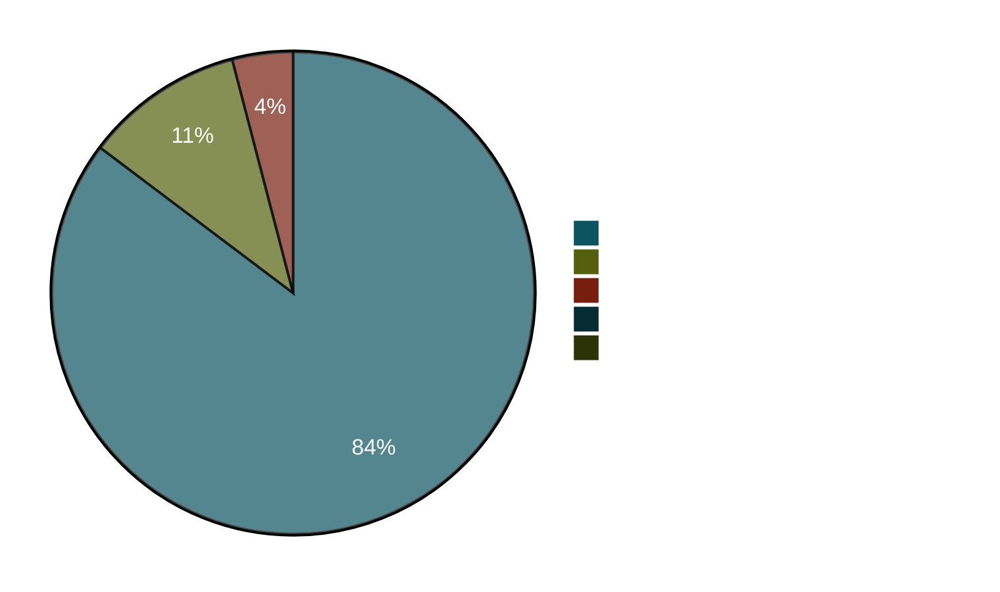

# OFCS conformance status

`go-oidc-provider` is regressed against the [OpenID Foundation Conformance Suite (OFCS)][ofcs]. The harness lives in [`conformance/`][harness] in the source repo and runs four plans end-to-end against a `cmd/op-demo` instance.

[ofcs]: https://gitlab.com/openid/conformance-suite
[harness]: https://github.com/libraz/go-oidc-provider/tree/main/conformance

::: warning Personal project, not certified
This is a personal project maintained by an individual developer. No OpenID Foundation membership fee is paid and **no formal OIDC certification** is held. The numbers on this page are reproducible snapshots — `make conformance-baseline` records exactly what you see. They are not a substitute for a paid OpenID Foundation certification and should not be cited as one.
:::

## What gets exercised

| Plan | What it covers | Profile |
|---|---|---|
| `oidcc-basic-certification-test-plan` | Authorization Code + PKCE, ID Token, UserInfo, refresh, discovery | OIDC Core 1.0 |
| `fapi2-security-profile-id2-test-plan` | + PAR, sender-constrained access tokens (DPoP), strict alg list, `redirect_uri` exact match | FAPI 2.0 Baseline |
| `fapi2-message-signing-id1-test-plan` | + JAR (signed authorization request), JARM (signed authorization response) | FAPI 2.0 Message Signing |
| `fapi-ciba-id1-test-plan` | Client-Initiated Backchannel Authentication (poll mode), mTLS-bound tokens | FAPI-CIBA |

## Latest baseline

Snapshot ID: `2026-05-06T12-13-25Z-v0.9.1-rc20-final-4plan`<br/> Repository SHA: [`592ab48`](https://github.com/libraz/go-oidc-provider/commit/592ab48fa071b39e0f0c8265a49fac5b09940bed)<br/> OFCS image: `release-v5.1.42`

| Plan                                       | PASSED | REVIEW | SKIPPED | WARNING | FAILED | Total |
|--------------------------------------------|-------:|-------:|--------:|--------:|-------:|------:|
| `oidcc-basic-certification-test-plan`      |     30 |      3 |       2 |       0 |  **0** |    35 |
| `fapi2-security-profile-id2-test-plan`     |     48 |      9 |       1 |       0 |  **0** |    58 |
| `fapi2-message-signing-id1-test-plan`      |     59 |      9 |       2 |       0 |  **1** |    71 |
| `fapi-ciba-id1-test-plan`                  |     31 |      0 |       3 |       1 |  **0** |    35 |
| **Total**                                  | **168**| **21** |   **8** |   **1** |  **1** | **199** |



## What each test plan covers

Each OFCS test plan exercises a specific spec profile. The tables below map every plan to the library options that turn on the relevant code paths and to the doc pages where that surface is documented, so embedders can verify their own deployments expose the same configuration the suite asserts against.

### `oidcc-basic-certification-test-plan` — OIDC Core 1.0

| What it tests | Library option to enable | Doc page |
|---|---|---|
| Authorization Code flow + PKCE | enabled by default | [/concepts/authorization-code-pkce](/concepts/authorization-code-pkce) |
| ID Token issuance + claims | enabled by default | [/concepts/tokens](/concepts/tokens) |
| UserInfo endpoint | enabled by default | [/concepts/tokens](/concepts/tokens) |
| Discovery (`/.well-known/openid-configuration`) | enabled by default | [/concepts/discovery](/concepts/discovery) |
| JWKS publication | enabled by default | [/operations/jwks](/operations/jwks) |
| Refresh tokens + rotation | enabled by default; long-lived refresh requires the `offline_access` scope | [/concepts/refresh-tokens](/concepts/refresh-tokens) |
| Standard scopes (`profile`, `email`, `address`, `phone`) | `op.WithScope(...)` once per scope | [/concepts/scopes-and-claims](/concepts/scopes-and-claims) |
| Public / pairwise subjects | `op.WithPairwiseSubject(salt)` for pairwise; per-client `SubjectType` selects which one applies | [/use-cases/pairwise-subject](/use-cases/pairwise-subject) |

### `fapi2-security-profile-id2-test-plan` — FAPI 2.0 Baseline

| What it tests | Library option to enable | Doc page |
|---|---|---|
| PAR (RFC 9126) | `op.WithProfile(profile.FAPI2Baseline)` implies `feature.PAR` | [/concepts/fapi](/concepts/fapi), [/use-cases/fapi2-baseline](/use-cases/fapi2-baseline) |
| JAR (RFC 9101) | profile implies `feature.JAR` | [/concepts/fapi](/concepts/fapi) |
| `S256` PKCE enforcement | profile-enforced | [/concepts/authorization-code-pkce](/concepts/authorization-code-pkce) |
| `iss` in authorization response (RFC 9207) | profile-enforced | [/concepts/issuer](/concepts/issuer) |
| `ES256` / `PS256` for ID Token signing | profile-enforced | [/concepts/jose-basics](/concepts/jose-basics) |
| Refusal of `RS256` (FAPI), `HS*`, `none` | closed alg type at `internal/jose/alg.go` | [/security/design-judgments](/security/design-judgments) |
| `private_key_jwt` or `tls_client_auth` | profile-enforced (intersected with FAPI allow-list) | [/concepts/client-types](/concepts/client-types) |
| DPoP or mTLS sender constraint | `op.WithFeature(feature.DPoP)` or `op.WithFeature(feature.MTLS)` (at least one is mandatory under FAPI 2.0) | [/concepts/sender-constraint](/concepts/sender-constraint), [/concepts/dpop](/concepts/dpop), [/concepts/mtls](/concepts/mtls) |
| `redirect_uri` exact match | profile-enforced | [/concepts/redirect-uri](/concepts/redirect-uri) |
| Refresh token rotation + reuse detection | enabled by default | [/concepts/refresh-tokens](/concepts/refresh-tokens) |

### `fapi2-message-signing-id1-test-plan` — FAPI 2.0 Message Signing

Message Signing layers signed authorization responses on top of Baseline. Everything the Baseline plan asserts also runs here — switch the profile constant and JARM activates automatically.

| What it tests | Library option to enable | Doc page |
|---|---|---|
| Everything from FAPI 2.0 Baseline (above) | `op.WithProfile(profile.FAPI2MessageSigning)` | (as above) |
| Signed authorization response (JARM) | profile implies `feature.JARM` | [/concepts/fapi](/concepts/fapi) (JARM section) |
| Signed ID Token in token response | profile-enforced | [/concepts/tokens](/concepts/tokens) |
| Request object signing (`PS256` / `ES256`) | profile-enforced | [/concepts/fapi](/concepts/fapi) |

### `fapi-ciba-id1-test-plan` — FAPI-CIBA (Client-Initiated Backchannel Authentication)

The CIBA plan exercises the OpenID Connect Client-Initiated Backchannel Authentication grant: an authentication request initiated by the client, completed asynchronously on the user's authentication device (push notification, IVR, etc.), and consumed back via a polling token request. The OP runs in poll mode, FAPI-CIBA inherits FAPI 1.0's hardcoded `tls_client_certificate_bound_access_tokens` requirement so mTLS sender constraint is mandatory.

| What it tests | Library option to enable | Doc page |
|---|---|---|
| `/bc-authorize` endpoint + `auth_req_id` | `op.WithCIBA(op.WithCIBAHintResolver(...))` | [/use-cases/ciba](/use-cases/ciba) |
| Hint resolution (`login_hint` / `id_token_hint` / `login_hint_token`) | embedder-supplied `HintResolver` | [/use-cases/ciba](/use-cases/ciba) |
| Polling discipline (`authorization_pending` / `slow_down`) | enabled by default; `op.WithCIBAPollInterval(...)` overrides advertised interval | [/use-cases/ciba](/use-cases/ciba) |
| Poll-abuse lockout cap | default `5` strikes; `op.WithCIBAMaxPollViolations(n)` raises or lowers the cap | [/use-cases/ciba](/use-cases/ciba) |
| `tls_client_certificate_bound_access_tokens` (FAPI-CIBA mandate) | `op.WithProfile(profile.FAPICIBA)` implies `feature.MTLS` | [/concepts/mtls](/concepts/mtls) |
| Signed `request` object on `/bc-authorize` | `op.WithFeature(feature.JAR)` (auto under FAPI-CIBA) | [/concepts/fapi](/concepts/fapi) |
| Bound `request_object` `iat` and `exp` claims (FAPI-CIBA §5.2.2) | profile-enforced | [/concepts/fapi](/concepts/fapi) |

### How REVIEW, SKIPPED, WARNING, and FAILED categorize

- **REVIEW** — the test ran, but a human reviewer must verify visual or out-of-band behaviour the harness cannot capture honestly (consent UI strings, error page screenshots, certificate chain confirmation). Not a failure.
- **SKIPPED** — the test depends on a feature this OP does not advertise in discovery or per-client metadata. For example, the `RS256` negative tests skip because the FAPI client metadata declares `PS256` as its signing alg, putting `RS256` out of scope for that probe. Not a failure.
- **WARNING** — the test reached a terminal PASS on its main assertions but logged an advisory the operator may want to address. We currently see one (`fapi-ciba-id1-refresh-token`) — see the section below.
- **FAILED** — observed behaviour diverged from the spec. We currently track **1 failure** (`fapi2-message-signing-id1` refresh-token DPoP-nonce-retry path) — see the section below.

### How to reproduce the conformance run yourself

1. Stand up an OP with the relevant profile wired in — `op.WithProfile(profile.FAPI2Baseline)` for the security profile, `op.WithProfile(profile.FAPI2MessageSigning)` for message signing, or no `WithProfile` for the OIDC Core plan.
2. Register the plan against an OFCS deployment. The conformance suite is operated by the OpenID Foundation; the source repo's `conformance/` directory contains plan templates and a pinned Docker image that brings up a local copy.
3. Drive the plan. The harness pokes `/authorize`, `/par`, `/token`, `/userinfo`, `/jwks`, and the rest of the discovered endpoints through every required code path, then writes a JSON snapshot you can diff against the recorded baseline.

The detailed runbook (`make` targets, the JSON snapshot layout, the diff gate) is in [Reproducing the baseline yourself](#reproducing-the-baseline-yourself) below.

## REVIEW vs FAILED — the distinction

OFCS has four terminal states: `PASSED`, `FAILED`, `REVIEW`, `SKIPPED`. **REVIEW does not mean a test failed.** It means the test wants a human operator to confirm something the automation cannot — for example, "did the OP show a login screen here?" The test runs, takes screenshots, then sits in a `WAITING` state until someone in the OFCS UI clicks "reviewed". Our headless runner records `REVIEW` when the test reached that state without erroring.

::: details Why we don't auto-pass REVIEW modules
The conformance suite gates these modules on human judgment by design. A `cmd/op-demo` running headless can't honestly upload a screenshot of "this is what my user saw"; turning the gate off would lie about what was actually checked. The harness records `REVIEW` as-is, on the understanding that paid certification would require sitting in front of the UI to clear them.
:::

## Modules currently in REVIEW

### `oidcc-basic` plan (3)

| Module | What it gates |
|---|---|
| `oidcc-ensure-registered-redirect-uri` | Manual confirmation that the OP refused an unregistered `redirect_uri` |
| `oidcc-max-age-1` | Manual confirmation that `max_age=1` re-prompted the user |
| `oidcc-prompt-login` | Manual confirmation that `prompt=login` re-prompted |

### FAPI 2.0 plans (9 each, same set)

These all gate on a screenshot upload of the OP's error page or a manual "is the user actually re-prompted" judgment. They run cleanly headless but stay `REVIEW` until human sign-off (the same nine names appear on both `fapi2-security-profile-id2` and `fapi2-message-signing-id1`, totalling 18 across the two plans):

- `fapi2-…-ensure-different-nonce-inside-and-outside-request-object`
- `fapi2-…-ensure-different-state-inside-and-outside-request-object`
- `fapi2-…-ensure-request-object-with-long-nonce`
- `fapi2-…-ensure-request-object-with-long-state`
- `fapi2-…-ensure-unsigned-authorization-request-without-using-par-fails`
- `fapi2-…-par-attempt-reuse-request_uri`
- `fapi2-…-par-attempt-to-use-expired-request_uri`
- `fapi2-…-par-attempt-to-use-request_uri-for-different-client`
- `fapi2-…-state-only-outside-request-object-not-used`

The OP returns the right HTTP error in every case (the negative tests pass their internal assertions); OFCS just wants a human to inspect the rendered error UI.

## Modules currently in WARNING

### `fapi-ciba-id1-test-plan` (1)

| Module | What the warning says |
|---|---|
| `fapi-ciba-id1-refresh-token` | The OP issued a refresh token to the CIBA flow but its discovery document does not list `refresh_token` in `grant_types_supported`. The refresh path itself works (the test reaches a terminal PASS on its assertions); the advisory is a doc/discovery-metadata consistency observation. |

## Modules currently FAILED — and why

### `fapi2-message-signing-id1-test-plan` (1)

| Module | What it is |
|---|---|
| `fapi2-security-profile-id2-refresh-token` | OFCS triggers a `use_dpop_nonce` 400 on a refresh-token request, then retries the same request with the supplied nonce attached to a fresh DPoP proof. The OFCS retry reuses the **same** `client_assertion` (with the same `jti`) — and the OP's clientauth path treats that as a JTI replay and returns `invalid_client`. |

The FAPI 2.0 spec is silent on whether a `client_assertion` `jti` should be considered consumed when the token endpoint returns a transient `use_dpop_nonce` challenge. Our current reading is strict: any `jti` we have observed is consumed regardless of the request outcome. OFCS's expectation is the more permissive one: `jti` should only be consumed when the assertion successfully advanced state. We track this as a known follow-up; the safe-by-default fix (admit a `jti` re-use in the narrow window between a `use_dpop_nonce` 400 and the retry) is not yet implemented.

The same module on the `fapi2-security-profile-id2-test-plan` PASSES because that plan's flow does not trigger the DPoP nonce retry path.

## Modules currently SKIPPED — and why

| Module | Reason |
|---|---|
| `fapi2-…-ensure-signed-client-assertion-with-RS256-fails` (×2) | The FAPI client used in the plan registers `token_endpoint_auth_signing_alg=PS256`, so OFCS skips the per-client `RS256` negative test on both fapi2 plans. |
| `fapi2-message-signing-…-ensure-signed-request-object-with-RS256-fails` | Same — the FAPI client's `request_object_signing_alg=PS256` makes the `RS256` negative test inapplicable. |
| `fapi-ciba-id1-ensure-request-object-signature-algorithm-is-RS256-fails` | The FAPI-CIBA client registers `request_object_signing_alg=PS256`. |
| `fapi-ciba-id1-ensure-client-assertion-signature-algorithm-in-backchannel-authorization-request-is-RS256-fails` | Same — `token_endpoint_auth_signing_alg=PS256` on the CIBA client. |
| `fapi-ciba-id1-ensure-client-assertion-signature-algorithm-in-token-endpoint-request-is-RS256-fails` | Same. |
| `oidcc-ensure-request-object-with-redirect-uri` | The `oidcc-basic` plan does not enable JAR; the OP omits `request_object_signing_alg_values_supported` from discovery and OFCS skips. |
| `oidcc-unsigned-request-object-supported-correctly-or-rejected-as-unsupported` | Same — JAR off, no `request` parameter, OFCS skips. |

::: tip "SKIPPED" is intentional, not "didn't run"
OFCS's skip decision is a function of what discovery and per-client metadata advertise. The FAPI clients in the plan declare `PS256` as their token-endpoint-auth and request-object signing alg, so OFCS's "`RS256` should fail" probes are not applicable and the suite marks them skipped rather than running them and recording a pass.
:::

## Reproducing the baseline yourself

```sh
git clone https://github.com/libraz/go-oidc-provider.git
cd go-oidc-provider
make conformance-up
make conformance-baseline LABEL=local-check
ls conformance/baselines/   # JSON snapshot lands here
```

The harness:

1. Generates self-signed RSA-2048 certs (`scripts/conformance.sh certs`).
2. Brings up the OFCS Docker stack at `https://localhost:8443`.
3. Builds and runs `cmd/op-demo` at `https://127.0.0.1:9443`.
4. Seeds the four plans via the OFCS REST API.
5. Records pass/fail per module to a deterministic JSON file.

`make conformance-baseline-diff` exits non-zero on any module that **lost** `PASSED` between two snapshots — that is the regression gate the project uses pre-merge for security-relevant changes.

## What FAPI 2.0 means in this codebase

`op.WithProfile(profile.FAPI2Baseline)` activates the configuration the two `fapi2-*` plans are built around:

- `feature.PAR` (auto-enabled by `FAPI2Baseline`) — `/par` becomes routable; `request_uri` accepted at `/authorize`
- `feature.JAR` (auto-enabled by `FAPI2Baseline`) — `request` / `request_uri` validated as signed JWTs
- `feature.JARM` (additionally auto-enabled by `FAPI2MessageSigning`) — authorization responses signed as JWTs
- Sender-constrained access tokens — the embedder explicitly enables one of `feature.DPoP` (`cnf.jkt`) or `feature.MTLS` (`cnf.x5t#S256`) via `WithFeature`; `op.New` rejects the configuration if neither is enabled. Discovery advertises `dpop_signing_alg_values_supported: ES256, EdDSA, PS256` when DPoP is enabled.
- JOSE alg allow-list locked to `RS256 / PS256 / ES256 / EdDSA` codebase-wide; `HS*` and `none` are **structurally** unreachable (see `internal/jose/alg.go`)
- `token_endpoint_auth_methods_supported` intersected with FAPI's allow-list (`private_key_jwt`, `tls_client_auth`, `self_signed_tls_client_auth`)
- `redirect_uri` exact-string match enforced
- per-client `RequestObjectSigningAlg` / `TokenEndpointAuthSigningAlg` narrowing pins each FAPI client to `PS256` (or `ES256` / `EdDSA`); the discovery doc still advertises the codebase-wide list

If you set conflicting options after `WithProfile`, `op.New(...)` returns a build-time error rather than letting a partial-FAPI configuration escape into production.

## Where the harness lives

| Path | What it is |
|---|---|
| `conformance/README.md` | Operator runbook |
| `conformance/plans/*.json` | Plan templates (server / client / resource blocks) |
| `conformance/docker-compose.yml` | OFCS image pin (`release-v5.1.42`) + JKS truststore wiring |
| `scripts/conformance.sh` | `certs` / `ofcs-up` / `op-up` / `seed-plans` / `drive` / `batch` |
| `tools/conformance/ofcs.py` | REST client + headless drive script |
| `conformance/baselines/*.json` | Captured snapshots (gitignored — environment-specific) |

## Caveats worth naming

- **Plan suite version.** OFCS is pinned to `release-v5.1.42`. Tests added or renamed in newer OFCS releases are not covered until the pin is bumped.
- **Headless drive.** The drive script reverse-engineers the OFCS REST surface; OFCS does not document it. Behaviour confirmed against v5.1.42 only.
- **No real RP cert.** The mTLS plan slots use generated self-signed certs at `conformance/certs/` so the plan can be instantiated. No real CA chain is exercised.
- **Single OP instance.** Cross-instance behaviour (e.g. token introspection across two OPs sharing a store) is exercised by `test/scenarios`, not OFCS.

The conformance harness sits next to an in-process Spec Scenario Suite under `test/scenarios/`. The two suites cover different layers — OFCS runs end-to-end against a live OP via HTTP, the scenario suite drives the same protocol invariants in-process — and both are required green before security-relevant changes merge.
