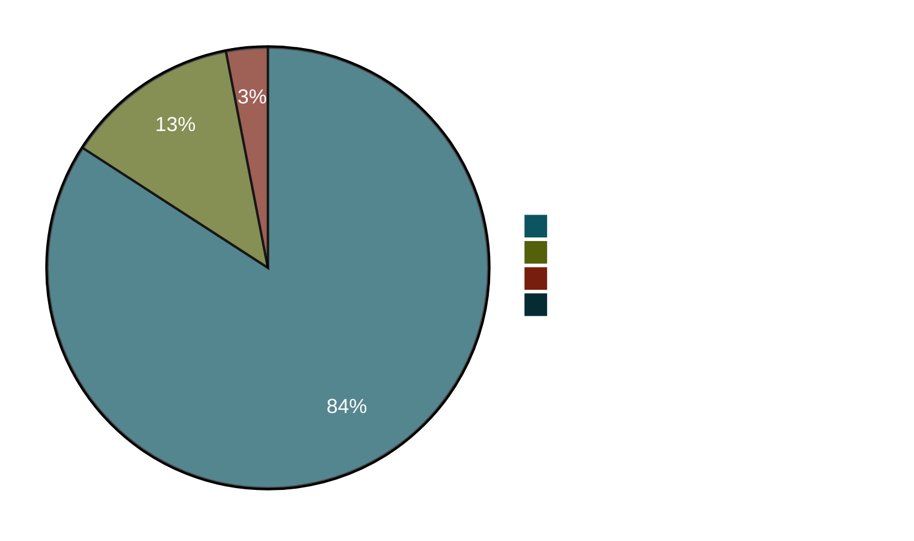

# OFCS conformance status

`go-oidc-provider` is regressed against the [OpenID Foundation Conformance
Suite (OFCS)][ofcs]. The harness lives in
[`conformance/`][harness] in the source repo and runs three plans
end-to-end against a `cmd/op-demo` instance.

[ofcs]: https://gitlab.com/openid/conformance-suite
[harness]: https://github.com/libraz/go-oidc-provider/tree/main/conformance

::: warning Personal project, not certified
This is a personal project maintained by an individual developer. No
OpenID Foundation membership fee is paid and **no formal OIDC
certification** is held. The numbers on this page are reproducible
snapshots — `make conformance-baseline` records exactly what you see.
They are not a substitute for a paid OpenID Foundation certification
and should not be cited as one.
:::

## What gets exercised

| Plan | What it covers | Profile |
|---|---|---|
| `oidcc-basic-certification-test-plan` | Authorization Code + PKCE, ID Token, UserInfo, refresh, discovery | OIDC Core 1.0 |
| `fapi2-security-profile-id2-test-plan` | + PAR, sender-constrained access tokens (DPoP), strict alg list, `redirect_uri` exact match | FAPI 2.0 Baseline |
| `fapi2-message-signing-id1-test-plan` | + JAR (signed authorization request), JARM (signed authorization response) | FAPI 2.0 Message Signing |

## Latest baseline

Snapshot ID: `2026-04-30T11-50-08Z-post-error-html`<br/>
Repository SHA: [`ab23d3c`](https://github.com/libraz/go-oidc-provider/commit/ab23d3c44967d7353b176de1b71362f141a8c2df)

| Plan                                       | PASSED | REVIEW | SKIPPED | FAILED | Total |
|--------------------------------------------|-------:|-------:|--------:|-------:|------:|
| `oidcc-basic-certification-test-plan`      |     30 |      3 |       2 |  **0** |    35 |
| `fapi2-security-profile-id2-test-plan`     |     48 |      9 |       1 |  **0** |    58 |
| `fapi2-message-signing-id1-test-plan`      |     60 |      9 |       2 |  **0** |    71 |
| **Total**                                  | **138**| **21** |   **5** |  **0** | **164** |



## REVIEW vs FAILED — the distinction

OFCS has four terminal states: `PASSED`, `FAILED`, `REVIEW`, `SKIPPED`.
**REVIEW does not mean a test failed.** It means the test wants a human
operator to confirm something the automation cannot — for example, "did
the OP show a login screen here?" The test runs, takes screenshots,
then sits in a `WAITING` state until someone in the OFCS UI clicks
"reviewed". Our headless runner records `REVIEW` when the test reached
that state without erroring.

::: details Why we don't auto-pass REVIEW modules
The conformance suite gates these modules on human judgment by design.
A `cmd/op-demo` running headless can't honestly upload a screenshot of
"this is what my user saw"; turning the gate off would lie about what
was actually checked. The harness records `REVIEW` as-is, on the
understanding that paid certification would require sitting in front
of the UI to clear them.
:::

## Modules currently in REVIEW

### `oidcc-basic` plan (3)

| Module | What it gates |
|---|---|
| `oidcc-ensure-registered-redirect-uri` | Manual confirmation that the OP refused an unregistered `redirect_uri` |
| `oidcc-max-age-1` | Manual confirmation that `max_age=1` re-prompted the user |
| `oidcc-prompt-login` | Manual confirmation that `prompt=login` re-prompted |

### FAPI 2.0 plans (9 each, same set)

These all gate on a screenshot upload of the OP's error page or a manual
"is the user actually re-prompted" judgment. They run cleanly headless
but stay `REVIEW` until human sign-off:

- `fapi2-…-ensure-different-nonce-inside-and-outside-request-object`
- `fapi2-…-ensure-different-state-inside-and-outside-request-object`
- `fapi2-…-ensure-request-object-with-long-nonce`
- `fapi2-…-ensure-request-object-with-long-state`
- `fapi2-…-ensure-unsigned-authorization-request-without-using-par-fails`
- `fapi2-…-par-attempt-reuse-request_uri`
- `fapi2-…-par-attempt-to-use-expired-request_uri`
- `fapi2-…-par-attempt-to-use-request_uri-for-different-client`
- `fapi2-…-state-only-outside-request-object-not-used`

The OP returns the right HTTP error in every case (the negative tests
pass their internal assertions); OFCS just wants a human to inspect
the rendered error UI.

## Modules currently SKIPPED — and why

| Module | Reason |
|---|---|
| `fapi2-…-ensure-signed-client-assertion-with-RS256-fails` | The FAPI client used in the plan registers `token_endpoint_auth_signing_alg=PS256`, so OFCS skips the per-client `RS256` negative test. |
| `fapi2-message-signing-…-ensure-signed-request-object-with-RS256-fails` | Same — the FAPI client's `request_object_signing_alg=PS256` makes the `RS256` negative test inapplicable. |
| `oidcc-ensure-request-object-with-redirect-uri` | The `oidcc-basic` plan does not enable JAR; the OP omits `request_object_signing_alg_values_supported` from discovery and OFCS skips. |
| `oidcc-unsigned-request-object-supported-correctly-or-rejected-as-unsupported` | Same — JAR off, no `request` parameter, OFCS skips. |

::: tip "SKIPPED" is intentional, not "didn't run"
OFCS's skip decision is a function of what discovery and per-client
metadata advertise. The FAPI clients in the plan declare `PS256` as
their token-endpoint-auth and request-object signing alg, so OFCS's
"`RS256` should fail" probes are not applicable and the suite marks
them skipped rather than running them and recording a pass.
:::

## Reproducing the baseline yourself

```sh
git clone https://github.com/libraz/go-oidc-provider.git
cd go-oidc-provider
make conformance-up
make conformance-baseline LABEL=local-check
ls conformance/baselines/   # JSON snapshot lands here
```

The harness:

1. Generates self-signed RSA-2048 certs (`scripts/conformance.sh certs`).
2. Brings up the OFCS Docker stack at `https://localhost:8443`.
3. Builds and runs `cmd/op-demo` at `https://127.0.0.1:9443`.
4. Seeds the three plans via the OFCS REST API.
5. Records pass/fail per module to a deterministic JSON file.

`make conformance-baseline-diff` exits non-zero on any module that
**lost** `PASSED` between two snapshots — that is the regression gate
the project uses pre-merge for security-relevant changes.

## What FAPI 2.0 means in this codebase

`op.WithProfile(profile.FAPI2Baseline)` activates the configuration the
two `fapi2-*` plans are built around:

- `feature.PAR` — `/par` becomes routable; `request_uri` accepted at `/authorize`
- `feature.JAR` (Message Signing only) — `request` / `request_uri` validated as signed JWTs
- `feature.DPoP` — sender-constrained access tokens (`cnf.jkt`); discovery advertises `dpop_signing_alg_values_supported: ES256, EdDSA, PS256`
- JOSE alg allow-list locked to `RS256 / PS256 / ES256 / EdDSA` codebase-wide; `HS*` and `none` are **structurally** unreachable (see `internal/jose/alg.go`)
- `token_endpoint_auth_methods_supported` intersected with FAPI's allow-list (`private_key_jwt`, `tls_client_auth`, `self_signed_tls_client_auth`)
- `redirect_uri` exact-string match enforced
- per-client `RequestObjectSigningAlg` / `TokenEndpointAuthSigningAlg` narrowing pins each FAPI client to `PS256` (or `ES256` / `EdDSA`); the discovery doc still advertises the codebase-wide list

If you set conflicting options after `WithProfile`, `op.New(...)` returns
a build-time error rather than letting a partial-FAPI configuration
escape into production.

## Where the harness lives

| Path | What it is |
|---|---|
| `conformance/README.md` | Operator runbook |
| `conformance/plans/*.json` | Plan templates (server / client / resource blocks) |
| `conformance/docker-compose.yml` | OFCS image pin (`release-v5.1.9`) + JKS truststore wiring |
| `scripts/conformance.sh` | `certs` / `ofcs-up` / `op-up` / `seed-plans` / `drive` / `batch` |
| `tools/conformance/ofcs.py` | REST client + headless drive script |
| `conformance/baselines/*.json` | Captured snapshots (gitignored — environment-specific) |

## Caveats worth naming

- **Plan suite version.** OFCS is pinned to `release-v5.1.9`. Tests
  added or renamed in newer OFCS releases are not covered until the
  pin is bumped.
- **Headless drive.** The drive script reverse-engineers the OFCS REST
  surface; OFCS does not document it. Behaviour confirmed against
  v5.1.9 only.
- **No real RP cert.** The mTLS plan slots use generated self-signed
  certs at `conformance/certs/` so the plan can be instantiated. No
  real CA chain is exercised.
- **Single OP instance.** Cross-instance behaviour (e.g. token
  introspection across two OPs sharing a store) is exercised by
  `test/scenarios`, not OFCS.

The conformance harness sits next to an in-process Spec Scenario Suite
under `test/scenarios/`. The two suites cover different layers — OFCS
runs end-to-end against a live OP via HTTP, the scenario suite drives
the same protocol invariants in-process — and both are required green
before security-relevant changes merge.
