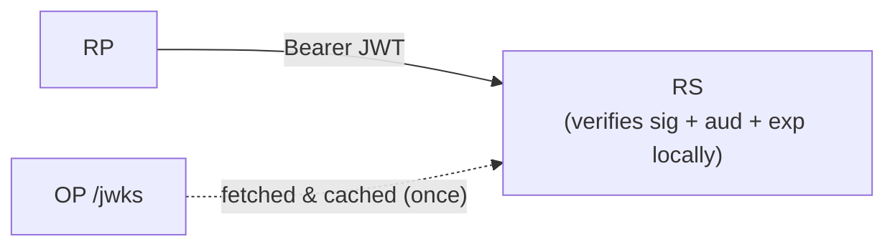
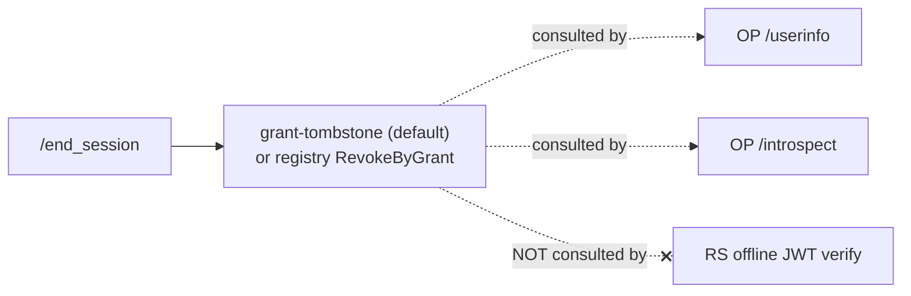
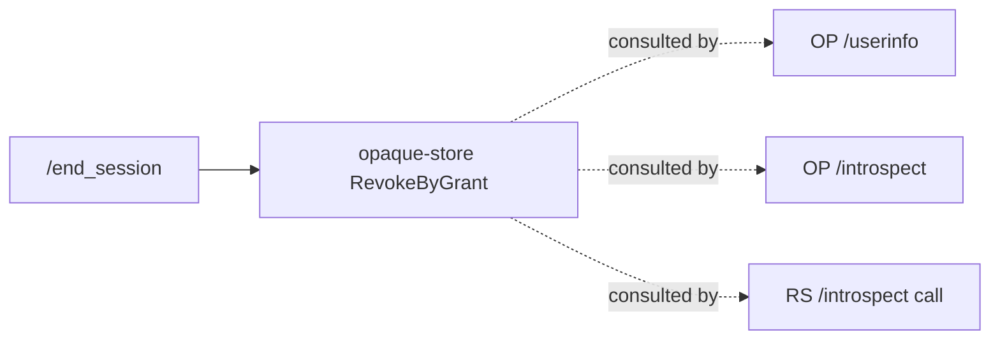
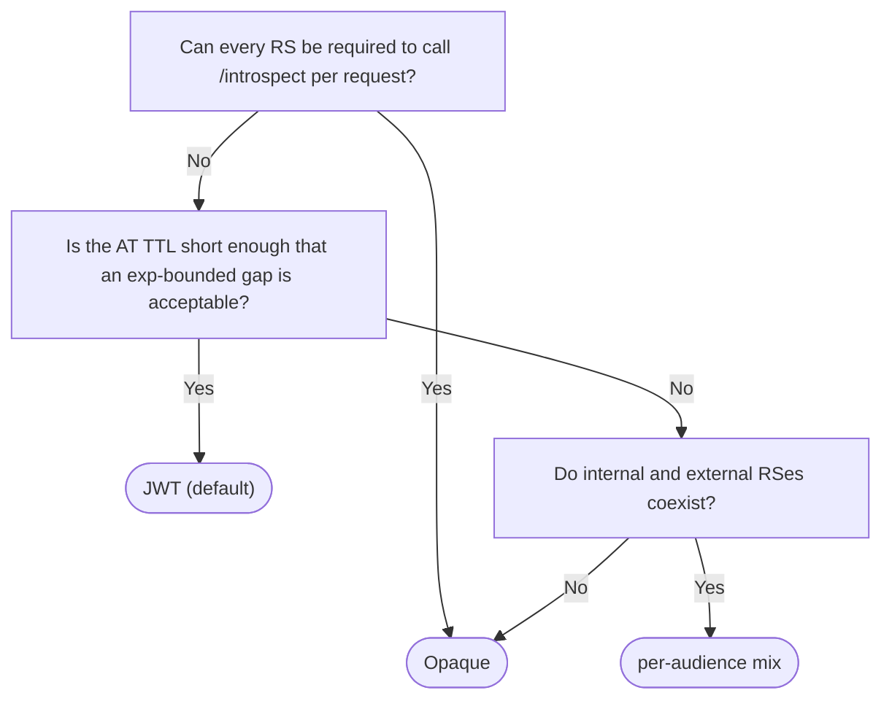

# Access token format — JWT vs opaque

`go-oidc-provider` issues **JWT (RFC 9068) access tokens by default**, with
**opaque access tokens as an opt-in**. Both shapes pass through the same
`Authorization: Bearer …` header on the wire; the difference is **who
validates the token** and **how revocation propagates**.

This is a judgment the library cannot make for you — it is yours to
make as the embedder. The right answer depends on where the resource
server (RS) sits relative to the OP, what your immediate-revocation
requirements look like, and how you want load distributed.

::: tip TL;DR
- **JWT (RFC 9068) is the default.** RS validates offline against
  the JWKS. The `/end_session` cascade reaches OP-served boundaries
  (`/userinfo`, `/introspect`) only — an RS doing offline JWT
  verification keeps honouring the token until its `exp`.
- **Opaque is opt-in** (`op.WithAccessTokenFormat`). Every RS
  request goes through `/introspect` so the cascade reaches every
  RS — at the price of putting the OP on the request hot path.
- **The deciding question:** does "logged out" have to mean the
  user can no longer call any RS for the token's lifetime, or is
  rejection at OP-served boundaries enough? User-side bandwidth vs
  OP capacity is a secondary axis. Mixed deployments are supported
  per RFC 8707 resource indicator
  (`op.WithAccessTokenFormatPerAudience`).
:::

::: details Specs referenced on this page
- [RFC 6749](https://datatracker.ietf.org/doc/html/rfc6749) — OAuth 2.0 Authorization Framework
- [RFC 6750](https://datatracker.ietf.org/doc/html/rfc6750) — Bearer Token Usage
- [RFC 7009](https://datatracker.ietf.org/doc/html/rfc7009) — Token Revocation
- [RFC 7517](https://datatracker.ietf.org/doc/html/rfc7517) — JSON Web Key (JWK)
- [RFC 7519](https://datatracker.ietf.org/doc/html/rfc7519) — JSON Web Token (JWT)
- [RFC 7662](https://datatracker.ietf.org/doc/html/rfc7662) — Token Introspection
- [RFC 8705](https://datatracker.ietf.org/doc/html/rfc8705) — Mutual-TLS Client Authentication and Certificate-Bound Access Tokens
- [RFC 8707](https://datatracker.ietf.org/doc/html/rfc8707) — Resource Indicators for OAuth 2.0
- [RFC 9068](https://datatracker.ietf.org/doc/html/rfc9068) — JWT Profile for OAuth 2.0 Access Tokens
- [RFC 9449](https://datatracker.ietf.org/doc/html/rfc9449) — DPoP
- [OpenID Connect RP-Initiated Logout 1.0](https://openid.net/specs/openid-connect-rpinitiated-1_0.html)
:::

## Two shapes for the same wire slot

The on-the-wire surface is identical. The RS reads
`Authorization: Bearer <token>` and decides whether to honour the call.
What changes is **how the RS reaches that decision**.

### JWT (RFC 9068) — the RS validates locally



The RS holds a cached JWKS, validates the JWT signature offline, checks
`aud` and `exp`, and serves the request. The OP is **not on the request
hot path**. The JWT itself carries the claims (`sub`, `scope`, `aud`,
`auth_time`, `acr`, `cnf`, …) so the RS has everything it needs.

### Opaque — the RS asks the OP every time


The opaque token is a 32-byte random identifier (base64url, 43
characters). It carries no claims. The RS resolves the token by calling
the OP's `/introspect` endpoint (RFC 7662) on every request — or caches
the result for a short, deliberate window. The OP is **on the request
hot path**.

::: tip The wire shape gives the RS no hint
Both formats arrive as `Authorization: Bearer <opaque-string>`. RFC 6750
makes no distinction. The RS knows which format to expect because the
deployment told it — typically by audience, the same way the RS already
knows which JWKS to trust. The library's discovery document does **not**
advertise the format.
:::

## The trade-off

| Axis | JWT (default) | Opaque |
|---|---|---|
| Validation location | RS, offline against JWKS | OP, via `/introspect` |
| OP load profile | Default strategy writes **zero rows** on issuance, one row per revoked grant; opt-in JTI registry writes one row per issuance. See [JWT revocation strategy](#jwt-access-token-revocation-strategy) below. | One row per issuance; one introspection round-trip per RS request |
| Header size | Larger — header / claims / signature | Small — 43 base64url characters |
| RS latency floor | Local crypto only | Adds an OP round-trip (or cache TTL) |
| Cache surface | RS caches JWKS (rarely refreshed) | RS caches introspection responses (per token) |
| Logged-out token reach | Cascade visible at OP-served boundaries only | Cascade visible at every RS request |
| Refresh rotation | Prior access token lives until `exp` | Prior access token revoked on rotation |
| Token-bytes leakage | Reveals `sub`, `scope`, `aud`, `cnf`, `acr`, `gid` | Reveals nothing |
| RS-side debugging | Decode the JWT and read claims directly | Must call `/introspect` |
| Sender constraint (DPoP / mTLS) | `cnf` claim in JWT | `cnf` rebuilt from the OP-side record |

The two columns are not "secure vs insecure" — both shapes are honest
designs with different operational assumptions. The next two sections
explain the load and revocation halves of the trade-off, since those
are the ones implementers most often underweight.

## Where the load lands

JWT distributes verification across resource servers. Each RS holds a
JWKS cache (rotated on a calendar measured in days, not requests),
validates signatures locally, and never blocks on the OP for routine
calls. Adding a tenth RS is free for the OP.

Opaque concentrates verification on the OP. Every RS call ultimately
becomes an `/introspect` call (modulo any RS-side cache the operator
chose to allow). Adding a tenth RS multiplies introspection traffic.
The OP becomes a single point of capacity for the data plane, not just
the control plane.

The classical advice "JWT is stateless, opaque is stateful" is half
true. With this library the OP keeps an OP-side row for **both** shapes
(see the "Storage cost is the same" note below) — what differs is
whether the **RS** also has to talk to the OP per request.

::: info User-side bandwidth and server-to-server RTT are separate axes
"OP load concentration vs RS distribution" is a different axis from
**"bytes carried over the user's connection vs server-to-server RTT"**.
Don't conflate them.

- **JWT path.** Every RP → RS request carries a JWT of a few hundred
  bytes to ~1 KB in the header. That cost lands on the **user's
  connection** — it adds up on mobile, metered, or satellite-linked
  IoT deployments. Server-to-server traffic is quiet: the RS does
  not call back to the OP.
- **Opaque path.** The bearer string on RP → RS is 43 base64url
  characters, **easy on the user's connection**. The cost moves to
  **server-to-server traffic** as each RS calls `/introspect` on the
  OP — usually inside the same trust zone, never paid by the user's
  link.

So "OP capacity planning" and "the user's perceived bytes-on-the-wire"
are not the same problem. For an API with mobile-heavy clients, opaque
can feel lighter to the user even though the OP needs to be sized
larger; for a system where the OP is intentionally low-capacity but
user connections are fat, JWT is the better fit. Evaluate the two
axes independently.
:::

::: info Storage cost is **not** symmetric on the OP side
The default JWT strategy (grant tombstone) writes **zero rows on
issuance** and one row per revoked grant — steady-state row count is
`O(revoked grants)`. The opt-in JTI registry strategy keeps one row
per issued JWT (the `jti`-keyed shadow row). Opaque format always
keeps one row per issued token (hashed bearer ID). The "JWT and opaque
both keep one row per token" framing was true under the legacy JTI
registry default; the current default reduces JWT issuance to a pure
compute path. See [JWT revocation strategy](#jwt-access-token-revocation-strategy)
for the full breakdown. The RS-side difference (JWT stateless for the
RS, opaque not) is unchanged.
:::

## Where revocation lands — and the `/end_session` gap

This is the half of the trade-off most often glossed over.

`/end_session` (and `/revoke`, and the code-replay cascade) flips the
OP-side row to revoked for every access token tied to the subject's
grants. Both formats register that flip; the question is **who notices**.

**JWT format:**



**Opaque format:**



- **JWT path.** The library consults the registry whenever the token
  reaches an OP-served boundary (`/userinfo`, `/introspect`,
  `/revoke`). A revoked JWT presented there is rejected immediately.
  **A resource server that validates the JWT offline against the JWKS
  does not consult the registry** — because that's the whole point of
  self-contained tokens. The revoked JWT remains usable at that RS
  until its `exp` claim elapses.
- **Opaque path.** Every use of the token has to round-trip through
  `/introspect`. The cascade reaches every RS by definition.

::: info Opaque introspection collapses to a uniform inactive shape + same-client gate
For an opaque token presented to `/introspect`, every miss path —
different client, no row, revoked, expired, DPoP/mTLS proof
mismatch — collapses to the same `{"active": false}` response
(RFC 7662 §2.2). Introspection-based enumeration and state probing
are structurally closed. Matching the same property under JWT
requires additional RS-side implementation.
:::

::: danger Pick the form that matches your "what does logged out mean" requirement
- "Logged out means the user can no longer call any RS for the access
  token's lifetime, even RSes outside the OP's control" → opaque, **or**
  JWT with introspection mandated for all RSes.
- "Logged out means the OP-served boundaries (`/userinfo`,
  `/introspect`) reject the token, and the RS will pick up the change
  on the next refresh-token rotation" → JWT is fine.

There is no third option that gives you "stateless RS-side validation"
**and** "instant logout cascade through the RS". You have to pick.
:::

Refresh-token rotation is the related soft handle. The library always
issues a new access token on every refresh-token rotation; the JWT form
**leaves the prior access token alive until its own `exp`** (so the
cascade gap closes within the access-token TTL), while the opaque form
calls `RevokeByGrant` against the opaque substore on every rotation,
retiring the prior access token as well — **the window in which a
leaked refresh token could let an attacker replay the prior access
token shrinks to roughly clock skew**.

The other cascade source is **authorization-code re-use detection
(RFC 6749 §4.1.2)**. The moment a stolen code is presented twice,
every access token under its grant is retired — JWT format writes a
grant tombstone (or flips registry rows under the opt-in JTI
strategy); opaque format flips opaque-store rows. Both propagate with
the same visibility shown in the diagrams above. `/end_session` is not
the only trigger.

## JWT access-token revocation strategy

The JWT path has its own knob — **how the OP persists revocation
state**. Opaque tokens are intrinsically per-token in storage (the
verifier needs the row), so the strategy applies to JWT only.

`go-oidc-provider` ships three strategies, selected via
`op.WithAccessTokenRevocationStrategy`. The default
(`RevocationStrategyGrantTombstone`) has been the baseline since the
strategy abstraction landed; the legacy per-`jti` model is preserved
behind `RevocationStrategyJTIRegistry` for embedders that need it.

| Strategy | Writes per AT issuance | Writes per grant revoke | Steady-state row count | Notes |
|---|---|---|---|---|
| **`RevocationStrategyGrantTombstone`** (default) | **0** | 1 (tombstone row) | `O(revoked grants + revoked JTIs)` | The OP embeds a `gid` private claim (the GrantID) in every JWT and consults a per-grant tombstone table at verification. FAPI 2.0 SP §5.3.2.2 conformant. |
| `RevocationStrategyJTIRegistry` | 1 (shadow row) | N (one UPDATE per AT under the grant) | `O(issuance_rate × AT_TTL)` | Every issued AT is shadowed by a row in `store.AccessTokenRegistry`. Pin this when per-AT audit trails are a regulatory requirement. FAPI 2.0 SP §5.3.2.2 conformant. |
| `RevocationStrategyNone` | 0 | 0 | 0 | `/revocation` returns 200 idempotently (RFC 7009 §2.2) but is a no-op. JWT ATs live until `exp`. **Rejected at `op.New` under any FAPI profile** (FAPI 2.0 SP §5.3.2.2 mandates server-side revocation). |

::: tip The default writes nothing on issuance
The hot path of `/token` does not touch the database under the default
strategy. Instead, when a grant is revoked (logout, code-replay
cascade, refresh chain compromise), the OP writes one tombstone row
keyed on the grant ID. Verification at `/userinfo` and `/introspect`
checks the gid against the tombstone table, so a revoked grant's JWTs
are rejected immediately at OP-served boundaries.

A single-AT `/revocation` (RFC 7009) by `jti` writes one denylist row
under the same substore. It does **not** coalesce into a grant
tombstone — other ATs under the grant stay alive.
:::

::: info The `gid` claim is private
JWT access tokens carry a `gid` private claim (RFC 7519 §4.3,
omitempty) that holds the OP-side GrantID. It is consumed by the OP
only — resource servers MUST ignore it. Existing RFC 9068 verifiers
keep working unchanged; the claim is invisible to anything that
doesn't look for it.
:::

::: details Selecting a strategy
```go
// Default — RevocationStrategyGrantTombstone, no extra option needed.
provider, err := op.New(
    op.WithIssuer("https://op.example.com"),
    op.WithKeyset(keys),
    op.WithStore(storage),
)

// Pin the legacy per-jti registry model.
provider, err := op.New(
    op.WithIssuer("https://op.example.com"),
    op.WithKeyset(keys),
    op.WithStore(storage),
    op.WithAccessTokenRevocationStrategy(op.RevocationStrategyJTIRegistry),
)

// Disable server-side JWT revocation (non-FAPI deployments only).
provider, err := op.New(
    op.WithIssuer("https://op.example.com"),
    op.WithKeyset(keys),
    op.WithStore(storage),
    op.WithAccessTokenRevocationStrategy(op.RevocationStrategyNone),
)
```
:::

::: warning FAPI rejects `RevocationStrategyNone` at construction time
Selecting `RevocationStrategyNone` together with any FAPI profile
fails at `op.New`. FAPI 2.0 Security Profile §5.3.2.2 mandates
server-side revocation; the library refuses to boot a configuration
that disables it.
:::

The grant-tombstone strategy needs `Store.GrantRevocations()` to
return a non-nil substore; the JTI-registry strategy needs
`Store.AccessTokens()`. Misconfigurations surface at `op.New`, not on
the first `/token` request.

## Choosing a format

The decision is mostly about who you trust, what you can ask of the RS,
and how short the access-token TTL is.



Per-audience selection is the realistic answer for many production
shapes: an internal RS that already has cheap network access to the OP
runs opaque (so logout reaches it immediately), while a public-facing
RS that the OP shouldn't gate runs JWT (so the OP never becomes a hot
dependency).

## Configuration

Default — JWT for every audience:

```go
provider, err := op.New(
    op.WithIssuer("https://op.example.com"),
    op.WithKeyset(keys),
    op.WithStore(storage),
    // No format option — defaults to AccessTokenFormatJWT.
)
```

Switch every issued access token to opaque:

```go
provider, err := op.New(
    op.WithIssuer("https://op.example.com"),
    op.WithKeyset(keys),
    op.WithStore(storage),
    op.WithAccessTokenFormat(op.AccessTokenFormatOpaque),
)
```

::: details Mix formats per RFC 8707 resource indicator
The map key is the canonical resource URI; the empty key is reserved —
use `WithAccessTokenFormat` for the default audience.

```go
provider, err := op.New(
    op.WithIssuer("https://op.example.com"),
    op.WithKeyset(keys),
    op.WithStore(storage),
    op.WithAccessTokenFormatPerAudience(map[string]op.AccessTokenFormat{
        "https://api.internal.example.com": op.AccessTokenFormatOpaque,
        "https://reports.example.com":      op.AccessTokenFormatJWT,
    }),
)
```
:::

::: tip Construction-time guard
If any selected format is opaque but the configured `Store` returns
`nil` from `OpaqueAccessTokens()`, `op.New` rejects the configuration
at construction time. A misconfiguration surfaces at startup, not on
the first `/token` request.
:::

::: details How the OP stores opaque tokens (implementation detail)
The opaque substore follows the same hash-on-store posture the
refresh-token store uses:

- The OP mints 32 random bytes from `crypto/rand`, base64url-encodes
  them (no padding, 43 characters), and hands the raw value to the
  client.
- The substore persists a SHA-256 digest of the raw value, never the
  raw bytes. The reference in-memory adapter uses an unkeyed digest
  for transparency in tests; the SQL adapter accepts an HMAC pepper
  for the digest so a database dump alone is not equivalent to the
  bearer credential.
- Lookups (`Find`, `RevokeByID`) hash the presented token and compare
  by digest in constant time.
- Expired rows are dropped by the periodic `GC` sweeper that already
  cleans codes, refresh tokens, and PAR records.

The wire bytes carry no prefix and no checksum — leaking a brand
prefix would help a passive observer fingerprint deployments without
helping the introspection-side dispatch.
:::

## What this means for resource-server code

- **JWT format.** RS code looks like any RFC 9068 verifier: cache the
  JWKS, validate signature + `aud` + `exp`, project the claims. No
  call back to the OP. **Mandate `/introspect` only on the paths
  where you cannot tolerate a session-bounded cascade gap.**
- **Opaque format.** RS code calls `POST /introspect` for every token
  presentation (or every "cache miss" if the operator allows
  short-lived caching). The introspection response carries the same
  `sub` / `scope` / `aud` / `cnf` an RFC 9068 JWT would, so the rest
  of the RS pipeline does not need to change shape — only the
  validation step does.

Both shapes propagate sender constraints (DPoP RFC 9449, mTLS
RFC 8705): the JWT path embeds `cnf` directly, the opaque path
re-emits `cnf` from the OP-side record so the RS sees the same proof
requirement.

## Read next

- [ID Token, access token, userinfo](/concepts/tokens) — what each
  artefact is for, why they're not interchangeable.
- [Sender constraint (DPoP / mTLS)](/concepts/sender-constraint) — how
  `cnf` survives the JWT-vs-opaque choice.
- [Back-channel logout](/use-cases/back-channel-logout) — how the OP
  fans logout out to other RPs and cascades shadow-row revocation.
