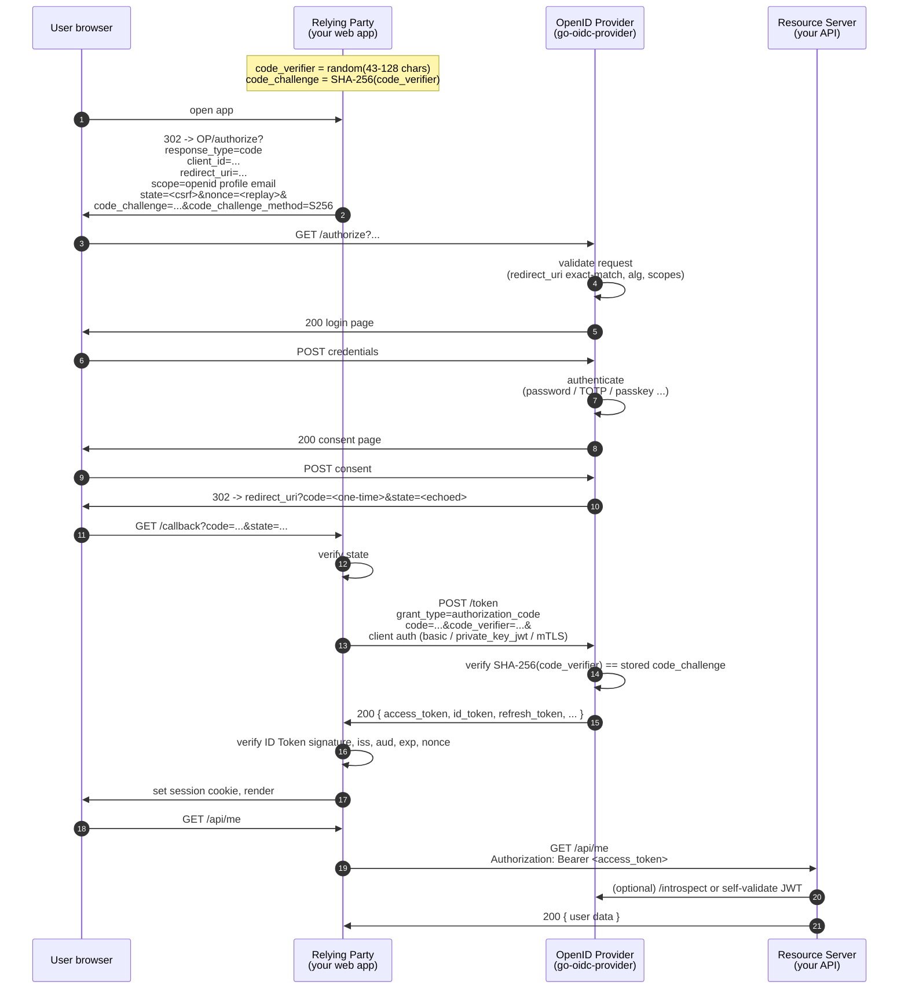

# Authorization Code + PKCE

The most common OIDC flow. Used by every web app, mobile app, SPA, and desktop app that logs a human in. PKCE (Proof Key for Code Exchange, RFC 7636) is mandatory in this library — both because OAuth 2.0 BCP (RFC 9700) and FAPI 2.0 require it, and because there's no plausible deployment in 2026 that benefits from disabling it.

::: details Specs referenced on this page
- [RFC 6749](https://datatracker.ietf.org/doc/html/rfc6749) — OAuth 2.0 Authorization Framework (§5.2 error codes)
- [RFC 7636](https://datatracker.ietf.org/doc/html/rfc7636) — Proof Key for Code Exchange (PKCE)
- [RFC 9700](https://datatracker.ietf.org/doc/html/rfc9700) — OAuth 2.0 Security Best Current Practice
- [RFC 9126](https://datatracker.ietf.org/doc/html/rfc9126) — Pushed Authorization Requests (PAR)
- [OpenID Connect Core 1.0](https://openid.net/specs/openid-connect-core-1_0.html) — §3.1 (Authorization Code Flow)
:::

::: details New to the vocabulary?
- **Authorization code** — a one-time, opaque string the OP hands to the RP via a browser redirect. The RP swaps it at `/token` for the actual tokens.
- **PKCE** ("pixie") — a small extra dance with `code_verifier` / `code_challenge` that proves "the client redeeming this code is the same one that started the flow." Stops a malicious app from stealing a redirected code. Walked through in detail below.
- **`state`** — a random opaque value the RP sends with the authorize request and re-checks on the callback; CSRF defence for the redirect.
- **`nonce`** — a random opaque value bound into the ID Token; replay defence at the RP.
:::

## The full sequence

## Parameter glossary

| Parameter | Sent at | Purpose |
|---|---|---|
| `response_type=code` | `/authorize` | Asks for the authorization-code grant. |
| `client_id` | `/authorize`, `/token` | Identifies the registered RP. |
| `redirect_uri` | `/authorize` (and echoed at `/token`) | Where the OP sends the user back. **Exact match** against the registered list. |
| `scope` | `/authorize` | Permissions requested. Must include `openid` for OIDC. |
| `state` | `/authorize` | Random opaque value the RP echoes on callback. CSRF defense for the redirect. |
| `nonce` | `/authorize` | Random value bound into the ID Token's `nonce` claim. Replay defense. |
| `code_challenge` | `/authorize` | `BASE64URL(SHA256(code_verifier))`. |
| `code_challenge_method` | `/authorize` | `S256` (the only one this library accepts). |
| `code` | `/authorize` response | Single-use; max-age 60 s by spec, this lib defaults to that. |
| `code_verifier` | `/token` | The pre-image of `code_challenge`. The OP recomputes the SHA-256. |
| `grant_type=authorization_code` | `/token` | Selects this grant. |
| Client auth | `/token` | One of `client_secret_basic`, `client_secret_post`, `private_key_jwt`, `tls_client_auth`, `self_signed_tls_client_auth`, or `none` (PKCE-only). |

::: details `state` vs `nonce` — what's the difference?
Both are random opaque values, both defend against replay-style attacks, but they protect different legs of the flow:

- **`state`** travels on the **front channel** (browser query string). The RP stashes it in the user's session before redirecting and re-checks it on the callback. It defends the *redirect* against CSRF — an attacker can't forge a callback to your `/callback` and have your app accept it.
- **`nonce`** travels in the **ID Token claim**. The RP stashes it in the user's session before redirecting and re-checks it after token exchange. It defends the *ID Token* against replay — an attacker can't reuse a stolen ID Token at a different RP, or at the same RP for a different login attempt.

Use both. The OP rejects requests missing `state` for confidential clients in this library, and OIDC requires `nonce` whenever `response_type=code id_token` or `id_token` is involved.
:::

::: details `code_verifier` / `code_challenge` / `S256` — what's that?
**`code_verifier`** is a high-entropy random string the RP generates and *keeps to itself*. RFC 7636 §4.1 mandates 43-128 URL-safe characters.

**`code_challenge`** is what the RP sends to the OP at `/authorize`. With `code_challenge_method=S256`, it's `BASE64URL(SHA-256(code_verifier))` — a one-way hash. The OP can't reverse it; only the RP can prove ownership later by sending the verifier itself.

**`S256`** is the SHA-256-based transform; it's the only `code_challenge_method` this library accepts. The legacy `plain` method (where challenge equals verifier) provides no protection against an attacker who reads the URL, so RFC 9700 forbids it for new deployments.
:::

::: details `redirect_uri` — strict exact-match, and why
The `redirect_uri` on `/authorize` is checked **byte-for-byte** against the client's registered list — no tail-slash normalisation, no path-prefix matches, no wildcards. That strictness is on purpose: open-redirect bugs and "any subpath of `https://app.example.com/`" patterns are a well-trodden way to leak codes to attacker-controlled URLs. RFC 9700 §2.1 requires exact match, and this library enforces it. At `/token`, the RP must repeat the *same* `redirect_uri` it sent on `/authorize`; a mismatch returns `redirect_uri_mismatch`.
:::

::: details `response_type=code` — what's that?
**`response_type=code`** asks for the **authorization code flow** — the OP returns a short-lived `code` on the redirect, and the RP swaps it at `/token` for the actual tokens. The alternatives (`token`, `id_token token`, `code id_token`, etc.) are legacy hybrid / implicit flows that OAuth 2.0 BCP (RFC 9700) discourages. This library implements `code` as the canonical path and treats hybrid forms as opt-in surface for compatibility, not new builds.
:::

::: details PAR — what's that, and when do I need it?
**PAR** (Pushed Authorization Requests, RFC 9126) lets the RP POST the authorize parameters to a server-side `/par` endpoint *first*, get back a short-lived `request_uri`, then redirect the browser with just `?client_id=...&request_uri=...`. The benefits:

- The full request never appears in browser history, server logs, or referrer headers.
- Tampering at the user-agent boundary is moot — only the `request_uri` is exposed there.
- Required by FAPI 2.0 Baseline. Optional (but worth opting in) elsewhere.

Wire it via `op.WithFeature(feature.PAR)` and the discovery document advertises `pushed_authorization_request_endpoint`.
:::

## What PKCE prevents

::: details Walk-through: the attack PKCE blocks
Without PKCE, a malicious app on the same device that controls a URI-handler for `myapp://` can intercept the authorization-code redirect:

1. User logs in on the legit RP. OP issues `code=abc` to `myapp://callback`.
2. Malicious app intercepts the redirect (race condition or universal-link spoof) and reads `code=abc`.
3. Malicious app posts `code=abc` to `/token` and gets tokens.

PKCE binds the code to a **secret only the legitimate RP knows**:

1. The legit RP generates a random `code_verifier` and sends only `SHA256(code_verifier)` (the `code_challenge`) to `/authorize`.
2. The OP stores `code_challenge` alongside the issued code.
3. At `/token`, the OP requires `code_verifier` and recomputes the SHA-256.
4. The malicious app saw the code but never saw the verifier — its `/token` call fails.

This works even when the RP can't store a client secret (SPA / native).
:::

## How this library enforces it

| Behaviour | Where |
|---|---|
| `code_challenge_method=plain` is **rejected** — only `S256` accepted. | `internal/pkce` |
| Authorization request without `code_challenge` is rejected when the client's `RequiresPKCE` is true (default for public clients, forced for FAPI 2.0). | `internal/authorize` |
| `code_verifier` length and char-set are validated against RFC 7636 §4.1. | `internal/pkce` |
| Mismatch returns RFC 6749 §5.2 `invalid_grant` at `/token` (not `/authorize`). | `internal/tokenendpoint/authcode.go` |

## Common errors and what they mean

| Wire error | Cause | Where to look |
|---|---|---|
| `invalid_request` `code_challenge_method` | Client sent `plain` | Send `S256` |
| `invalid_request_uri` | PAR `request_uri` expired or already consumed | New PAR request |
| `invalid_grant` (at `/token`) | `code_verifier` doesn't match, or code already used / expired | Don't reuse codes, regenerate |
| `redirect_uri_mismatch` | The `redirect_uri` at `/token` differs from `/authorize` | They must be byte-identical |

## Run the flow yourself

`examples/03-fapi2` runs a FAPI 2.0 Baseline OP that demands PAR + JAR + DPoP + PKCE in one wiring. The OFCS conformance suite drives this exact sequence through ~129 modules in two FAPI plans; [OFCS status](/compliance/ofcs) shows the breakdown.

## Read next

- [Sender constraint (DPoP / mTLS)](/concepts/sender-constraint) — how PKCE upgrades to "the access token only works for the client that got it."
- [Refresh tokens](/concepts/refresh-tokens) — what to do when the access token expires.
