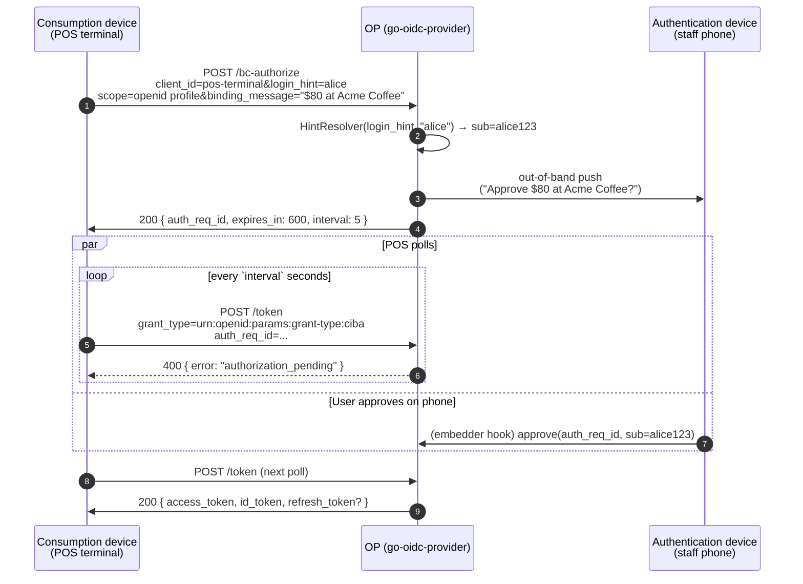

# CIBA — Client-Initiated Backchannel Authentication

CIBA solves a different shape of problem than the [device flow](/concepts/device-code). With device code, two surfaces meet at the OP through a short code shown on the device. With **CIBA**, the device that initiates the request is **not visible to the user at all** — the user is pushed (or rung up, or notified) on a **separate authentication device** they already trust.

The canonical setup:

- **Consumption device** — a POS terminal, a call-center agent screen, an in-store kiosk, a bank's wire-transfer reviewer panel. It knows *who* the user is supposed to be (loyalty card, phone number, account number) but cannot authenticate them.
- **Authentication device** — the user's phone, with a banking app already installed and signed in. It receives a push notification ("Approve $80.00 at Acme Coffee?") and the user taps **Approve** or **Deny**.

The consumption device never asks the user for credentials — it just asks the OP "please ask Alice to approve this on her phone".

::: details Specs referenced on this page
- [OpenID Connect Client-Initiated Backchannel Authentication Flow — Core 1.0](https://openid.net/specs/openid-client-initiated-backchannel-authentication-core-1_0.html) — the CIBA Core spec
- [FAPI-CIBA-ID1](https://openid.net/specs/openid-financial-api-ciba-ID1.html) — the FAPI profile that pins JAR + DPoP/mTLS + 10-minute access TTL
:::

::: details Vocabulary refresher
- **`auth_req_id`** — the opaque identifier returned from `/bc-authorize`. The consumption device polls `/token` with this; the authentication device approves against the same identifier.
- **Hint** — how the consumption device tells the OP **which user** to ask. CIBA Core §7.1 defines three:
  - `login_hint` — opaque value the embedder maps to a subject (`alice@example.com`, account number, …).
  - `id_token_hint` — a previously issued ID token whose `sub` identifies the user.
  - `login_hint_token` — a signed JWT the embedder verifies and maps to a subject (e.g. issued by another upstream system).
- **Delivery mode** — how the OP tells the consumption device that approval landed:
  - **poll** — the device polls `/token` with `auth_req_id`; the only mode v0.9.1 ships.
  - **ping** — the OP calls back to the device's HTTPS endpoint with `auth_req_id`, then the device polls `/token`. (Deferred to v2+.)
  - **push** — the OP delivers the token directly to the device's HTTPS endpoint. (Deferred to v2+.)
:::

## How the flow runs (poll mode)



The consumption device never holds a credential for the user. The user never types into the consumption device. The authentication device — which already authenticated Alice when she signed into her banking app — is the only place where consent is exercised.

## CIBA vs Device Code — when do you pick which?

Both flows have two devices. The difference is **whether the user knows the consumption device is asking**.

| | Device Code | CIBA |
|---|---|---|
| **Who initiates the trust?** | The user types `user_code` on the verification page. | The consumption device pushes a request to the OP; the user only sees a notification. |
| **Does the user have to discover the URL?** | Yes — `verification_uri` is shown on screen. | No — the OP knows where to push. |
| **Trust model on consumption side?** | Anonymous device asking the user to bind it. | Pre-registered device asking the OP to ask the user to confirm. |
| **Typical surface** | Smart TV, console, CLI, IoT pairing. | POS, call center, fraud-confirmation, in-app payments. |
| **Identifier the user types** | `user_code` (e.g. `BDWP-HQPK`). | None — the OP has the user's identifier already (`login_hint`). |
| **Risk of misdirection** | Low — the URL is on the device's screen. | Medium — the user must trust the push notification's text matches the consumption surface. **Use `binding_message`** so the prompt on the phone shows what the POS is requesting. |

If the user is **standing in front of the device** but the device cannot show a screen with a code — choose CIBA. If the user is **across the room from the device** and the device has a screen — choose device code. CIBA's authentication device must already know the user; device code's verification page works for any signed-in browser session.

## Hints — telling the OP "which user"

The consumption device cannot authenticate the user, so it has to tell the OP **which user to push to**. CIBA Core §7.1 lists three hint kinds; the OP supports all three through a single `HintResolver` interface:

```go
op.WithCIBA(
    op.WithCIBAHintResolver(op.HintResolverFunc(
        func(ctx context.Context, kind op.HintKind, value string) (string, error) {
            switch kind {
            case op.HintLoginHint:
                // value = "alice", "alice@example.com", account number, etc.
                return resolveLoginHint(ctx, value)
            case op.HintIDTokenHint:
                // value = a previously issued ID token (already verified by the OP).
                return claimsSubject(value)
            case op.HintLoginHintToken:
                // value = a signed JWT issued by another system you trust.
                return verifyAndMap(ctx, value)
            }
            return "", op.ErrUnknownCIBAUser
        },
    )),
)
```

Returning `op.ErrUnknownCIBAUser` collapses the wire response to `unknown_user_id`. Any other error becomes `login_required`. The handler is required — `op.WithCIBA` without a resolver fails at `op.New`.

## binding_message — the anti-confusion field

CIBA `binding_message` is a short string the consumption device sends with `/bc-authorize`. The OP forwards it to the authentication device so the prompt on the user's phone shows the same text the cashier sees on the POS:

> **Acme POS terminal #14**: Approve $80.00 at Acme Coffee?
>
> [ Approve ] [ Deny ]

Without `binding_message` the user has only the OP's generic prompt to go on, and a phishing flow ("we noticed unusual activity, please approve this push") becomes much more plausible. Treat `binding_message` as mandatory in the embedder's UX even though the spec marks it optional.

## See it run

[`examples/32-ciba-pos`](https://github.com/libraz/go-oidc-provider/tree/main/examples/32-ciba-pos) ships a complete POS-terminal scenario: the POS posts to `/bc-authorize`, the staff phone (simulated by a goroutine that calls `CIBARequestStore.Approve` directly) approves the request, and the POS polls until the OP issues a token. End-to-end runtime is around five seconds.

```sh
go run -tags example ./examples/32-ciba-pos
```

The example is split into role-tagged files (`op.go` for the OP wiring + `HintResolver`, `rp.go` for the POS-side polling, `device.go` for the simulated phone approval).

## Read next

- [Use case: CIBA wiring](/use-cases/ciba) — `op.WithCIBA`, the `HintResolver` contract, FAPI-CIBA profile constraints, and how the embedder's authentication-device callback talks back to `CIBARequestStore.Approve`.
- [Device Code primer](/concepts/device-code) — the conceptual sibling for "user is on a different surface" but with a code-on-screen ceremony.
