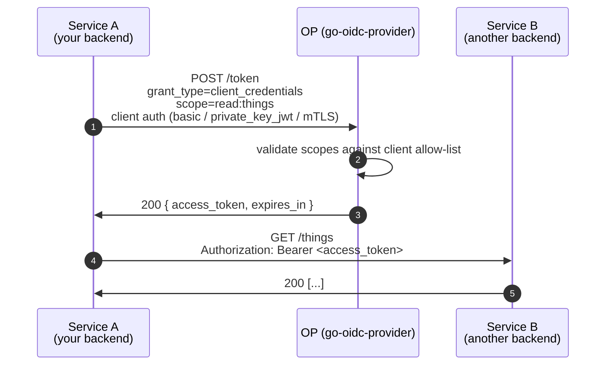

# Client Credentials

`grant_type=client_credentials` is the **service-to-service** grant: no end user, no browser, no consent. A confidential backend authenticates **as itself** and gets an access token to call another backend.

::: details Specs referenced on this page
- [RFC 6749](https://datatracker.ietf.org/doc/html/rfc6749) — OAuth 2.0 Authorization Framework (§4.4 client credentials)
- [RFC 7521](https://datatracker.ietf.org/doc/html/rfc7521) — Assertion Framework for OAuth 2.0
- [RFC 7523](https://datatracker.ietf.org/doc/html/rfc7523) — JWT Profile for OAuth 2.0 Client Authentication (`private_key_jwt`)
- [RFC 7800](https://datatracker.ietf.org/doc/html/rfc7800) — Confirmation (`cnf`) claim
- [RFC 8705](https://datatracker.ietf.org/doc/html/rfc8705) — Mutual-TLS Client Authentication
- [RFC 9068](https://datatracker.ietf.org/doc/html/rfc9068) — JWT Profile for OAuth 2.0 Access Tokens
:::

::: details Vocabulary refresher
- **Confidential client** — a client that can hold a real authentication credential (a long-lived secret, an asymmetric key, or an X.509 certificate). Backends and trusted servers are confidential.
- **Public client** — a client that *cannot* hold a real secret in practice (SPAs in a browser, native mobile apps). They authenticate with `token_endpoint_auth_method=none` and rely on PKCE for code protection.
- **`private_key_jwt`** — client authentication where the client signs a short-lived JWT with its private key; the OP verifies it against the registered public key. Stronger than a shared secret because the secret never leaves the client.
:::



::: warning Confidential clients only
`client_credentials` is structurally restricted to **confidential** clients in this library — clients with a real authentication credential (`client_secret_basic`, `client_secret_post`, `private_key_jwt`, `tls_client_auth`, `self_signed_tls_client_auth`). Public clients (SPAs / native, `token_endpoint_auth_method=none`) cannot use it.

There is no end user, so there is no PKCE, no consent, no `id_token`, and **no refresh token**. The client just re-runs the grant when the access token expires.
:::

## Wiring

Enable the grant explicitly. The library refuses to mint tokens for any grant type not in the enabled set.

```go
import (
  "github.com/libraz/go-oidc-provider/op"
  "github.com/libraz/go-oidc-provider/op/grant"
)

handler, err := op.New(
  op.WithIssuer("https://op.example.com"),
  op.WithStore(inmem.New()),
  op.WithKeyset(myKeyset),
  op.WithCookieKey(cookieKey),
  op.WithGrants(
    grant.AuthorizationCode, // for human users
    grant.RefreshToken,
    grant.ClientCredentials, // for service-to-service
  ),
  op.WithStaticClients(/* a confidential client */),
)
```

A registered client opting in via `GrantTypes`:

```go
op.WithStaticClients(op.ConfidentialClient{
  ID:         "service-a",
  Secret:     "rotate-me",
  AuthMethod: op.AuthClientSecretBasic, // or use op.PrivateKeyJWTClient instead for private_key_jwt
  GrantTypes: []string{"client_credentials"},
  Scopes:     []string{"read:things", "write:things"},
})
```

::: details Why both global and per-client opt-in?
- **Global** (`op.WithGrants`) gates which grants the OP supports at all, surfaced in `grant_types_supported` of the discovery document.
- **Per-client** (`store.Client.GrantTypes`) gates which of those grants *this specific client* may use.

A client only succeeds when both checks pass. This lets you run a single OP that issues `authorization_code` for end-user apps and `client_credentials` for backend services, without giving the SPA client the ability to mint app-level tokens.
:::

## Token shape

`client_credentials` access tokens carry:

- `iss` — the OP issuer
- `aud` — the resource server identifier (the typed seeds carry a `Resources []string` field that lists permitted RFC 8707 resource indicators; with DCR, the equivalent `resources` metadata field)
- `client_id` — the requesting client
- **No `sub`** for purely-machine clients (or `sub = client_id` if you set `act_as_subject`)
- `scope` — the granted subset of the requested scopes

When `op.WithFeature(feature.MTLS)` or DPoP is configured and the client presented a sender constraint, the token additionally carries the `cnf` (Confirmation, RFC 7800) claim binding it to that constraint.

## See it run

[`examples/05-client-credentials`](https://github.com/libraz/go-oidc-provider/tree/main/examples/05-client-credentials) ships a runnable end-to-end version with a `client_secret_basic` client.

```sh
go run -tags example ./examples/05-client-credentials
```

## Read next

- [Sender constraint (DPoP / mTLS)](/concepts/sender-constraint) — bind service tokens to a client-held key so a stolen token is useless.
- [Use case: client_credentials in production](/use-cases/client-credentials).
