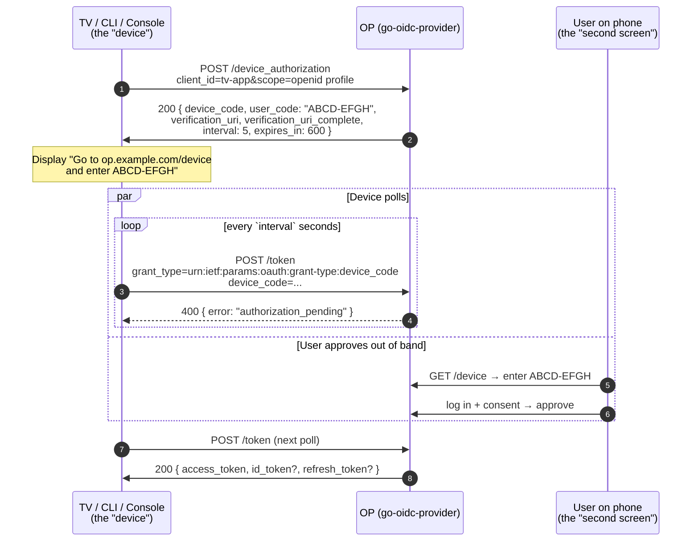

# Device Code (RFC 8628)

The device-authorization grant — also called "device code" or "device flow" — exists for clients that **cannot run a browser** or **have no convenient way to type a password**. Smart TVs, gaming consoles, CLI tools, IoT devices, point-of-sale terminals.

The most familiar example is signing into Netflix on a new TV: the screen displays a short code (`ABCD-EFGH`) and a URL (`netflix.com/tv`); you open that URL on your phone, type the code, and approve. The TV — which never saw your password — then receives an access token.

::: details Specs referenced on this page
- [RFC 8628](https://datatracker.ietf.org/doc/html/rfc8628) — OAuth 2.0 Device Authorization Grant
- [RFC 6749](https://datatracker.ietf.org/doc/html/rfc6749) — OAuth 2.0 Authorization Framework (terminology)
:::

::: details Vocabulary refresher
- **device_code** — the long, opaque identifier the OP issues for the device to poll with. Never shown to the user; sent only to the device.
- **user_code** — the short, human-readable code (e.g. `BDWP-HQPK`) shown on the device's screen and typed into the verification page.
- **verification_uri** — the URL printed on the device's screen (`https://op.example.com/device`); the user opens it on their phone.
- **verification_uri_complete** — the same URL pre-filled with the `user_code`; if the device can render a QR code, the user just scans it and skips the typing step.
- **interval** — how often, in seconds, the device should poll `/token`. The OP raises this value when it returns `slow_down`.
:::

## How the flow runs



The device never holds the user's password. The user never types anything on the device. The two surfaces meet at the OP through the short `user_code`.

## Polling responses

The token endpoint (`/token`) returns one of four shapes per poll:

| Response | Meaning | What the device should do |
|---|---|---|
| `400 authorization_pending` | The user has not approved (or denied) yet. | Wait `interval` seconds and try again. |
| `400 slow_down` | The device polled too fast. | Double the interval (RFC 8628 §3.5: "MUST honor the new value"). The OP persists the new interval atomically with `LastPolledAt` so a multi-replica deployment cannot be tricked into resetting it. |
| `400 access_denied` | The user clicked **deny** on the verification page (or an embedder revocation hook fired). | Stop polling. Show "Sign-in cancelled". |
| `400 expired_token` | The `device_code` outlived `expires_in` (default 600 s). | Stop polling. Restart the flow if the user wants to retry. |
| `200 { access_token, ... }` | The user approved. | Treat as a normal token response. |

::: warning user_code is brute-forceable by design
The `user_code` is short on purpose — long codes are unusable. That makes it brute-forceable in principle: an attacker who can hit `/device` faster than the user can type wins. The library ships [`op/devicecodekit`](https://github.com/libraz/go-oidc-provider/tree/main/op/devicecodekit) with a per-record gate: `VerifyUserCode` constant-time-compares, increments a strike counter on miss, and locks the row out after `MaxUserCodeStrikes` (default 5). Embedders building their own verification page MUST use the helper, or implement an equivalent gate themselves.
:::

## When to use it

Pick the device flow when one of the device-side constraints holds:

- **No browser** — set-top boxes, smart TVs, voice assistants.
- **No keyboard / clumsy keyboard** — TV remotes, game-controller D-pads.
- **CLI tools** that ship without a web server (`gcloud auth login`, `gh auth login`, `kubectl oidc-login`).
- **Headless** automation contexts where pairing happens once at provisioning.

Avoid it for browser-able clients (regular SPAs, native apps with custom URL schemes) — `authorization_code + PKCE` is shorter, safer, and gives a richer UX. RFC 8628 §3 frames device flow as the **fallback** when the canonical flow is impractical.

## See it run

[`examples/30-device-code-cli`](https://github.com/libraz/go-oidc-provider/tree/main/examples/30-device-code-cli) drives the full RFC 8628 round trip from a single binary: it stands up the OP, prints a boxed `user_code` panel + the `verification_uri_complete` shortcut, simulates browser approval after a few seconds, and polls until the OP issues an `access_token` + `id_token`.

```sh
go run -tags example ./examples/30-device-code-cli
```

The example is split into role-tagged files (`op.go` for the OP wiring, `cli.go` for the device-side polling, `device.go` for the simulated browser approval, `probe.go` for self-verification) so each surface is readable in isolation.

## Read next

- [Use case: device-code wiring](/use-cases/device-code) — `op.WithDeviceCodeGrant`, `devicecodekit.VerifyUserCode`, the verification page contract, and how to cascade-revoke issued tokens when a device is unenrolled.
- [CIBA primer](/concepts/ciba) — the conceptual sibling for "user is on a different channel" but without a code-on-screen ceremony.
