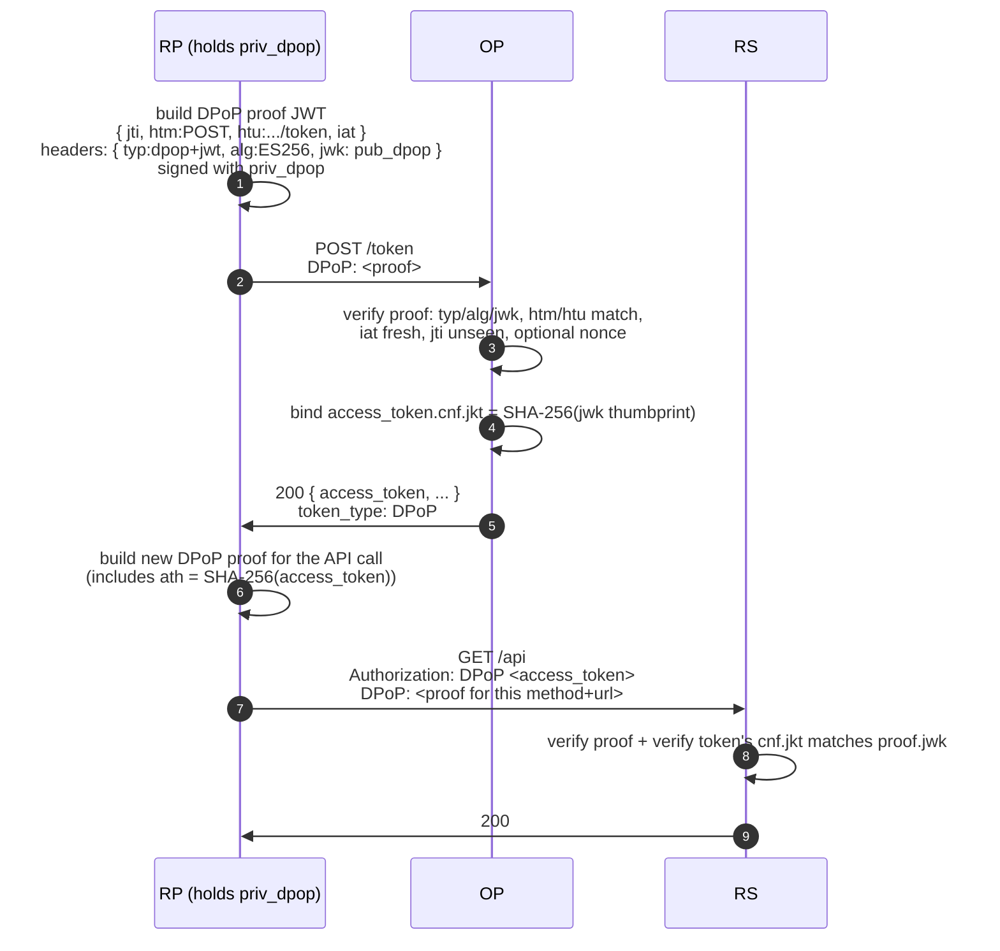

# DPoP — Demonstrating Proof of Possession

**DPoP** (RFC 9449) binds an access token to a key the client holds. Without a fresh proof signed by the same key, a leaked access token is unusable. Every API call carries a small per-request JWT (the *DPoP proof*) that the OP and resource server verify in addition to the token itself.

DPoP is purely an HTTP-layer mechanism. The client does not need TLS client certificates, the OP does not need to know about reverse-proxy header layouts, and the same flow works for SPAs, mobile apps, and backend services. That portability is the reason FAPI 2.0 Baseline lists DPoP as one of the two acceptable sender-constraint mechanisms (the other is [mTLS](/concepts/mtls)).

::: details Specs referenced on this page
- [RFC 9449](https://datatracker.ietf.org/doc/html/rfc9449) — DPoP (Demonstrating Proof of Possession)
- [RFC 7638](https://datatracker.ietf.org/doc/html/rfc7638) — JWK Thumbprint
- [RFC 7800](https://datatracker.ietf.org/doc/html/rfc7800) — Confirmation (`cnf`) claim
- [FAPI 2.0 Baseline](https://openid.net/specs/fapi-2_0-baseline.html)
- [FAPI 2.0 Message Signing](https://openid.net/specs/fapi-2_0-message-signing.html)
:::

## How a DPoP proof works

A DPoP proof is a JWT (RFC 9449 §4) signed with a private key the client controls. The client mints a fresh proof per request.

**JOSE header**

| Field | Value |
|---|---|
| `typ` | `dpop+jwt` (mandatory) |
| `alg` | `ES256`, `EdDSA`, or `PS256` (the library's allow-list, see `internal/dpop/proof.go`) |
| `jwk` | Public part of the signing key, embedded in the header |

**Payload claims**

| Claim | Meaning |
|---|---|
| `htm` | HTTP method of the request (`POST`, `GET`, …). Pinned to this exact request. |
| `htu` | HTTP target URI with query / fragment stripped. Stops a proof for `/orders` from being replayed against `/admin/payouts`. |
| `iat` | Time the proof was signed. Rejected if outside the OP's freshness window (default 60 s, see `dpop.DefaultIatWindow`). |
| `jti` | Unique random value per proof. Cached by the OP for the freshness window so the same proof cannot be replayed. |
| `ath` | Optional. SHA-256 of the access token, required when the proof is presented alongside an access token (RFC 9449 §4.2). |
| `nonce` | Optional. Server-supplied value when the OP runs the §8 / §9 nonce flow. |



The OP and the RS run the same checklist. The RS additionally verifies that the proof's `jwk` thumbprint equals the access token's `cnf.jkt`.

## Confirmation claim — `cnf.jkt`

The first proof at `/token` pins the binding. The OP computes a SHA-256 thumbprint of the proof's `jwk` (RFC 7638 fixes the canonical fields that go into the digest) and writes it into the issued access token as `cnf.jkt`. Every subsequent request that uses this access token must carry a proof signed by **the same key**, so the RS can recompute the thumbprint and compare.

`cnf` is a JSON object; the *member name* tells the RS what kind of binding was used (RFC 7800). For DPoP the member is `jkt`. mTLS uses `x5t#S256` instead — the two never co-exist on the same token.

::: details Why a thumbprint and not the raw key?
The thumbprint is a stable, short identifier that survives JSON re-encoding. RFC 7638 specifies exactly which JWK fields go into the hash and in which order, so a client and a server compute the same digest for the same key without having to agree on whitespace or member ordering. Embedding the raw key would inflate the access token; the thumbprint costs 32 bytes (43 base64url characters).
:::

## Replay defenses

DPoP layers four independent gates so an attacker who captured a single proof gains nothing:

- **`jti` deduplication.** The OP threads every accepted proof's `jti` through `store.ConsumedJTIStore.Mark` (see `internal/dpop/verify.go`). A repeated `jti` inside the freshness window returns `ErrProofReplayed` and the request fails. The store is the same one PAR / JAR replay defenses use, so a single Redis substore covers all three.
- **`iat` window.** Proofs older or further in the future than `DefaultIatWindow` (60 seconds, symmetric) are rejected with `ErrProofIatWindow`. The window is short on purpose: it caps how long a stolen proof remains useful even if the `jti` cache is wiped.
- **`htm` + `htu` match.** A proof for one method or URL cannot be presented against another endpoint. The OP folds both sides through the RFC 9449 §4.3 canonical form (lower-cased scheme / host, default port stripped, query / fragment removed) before comparing.
- **`ath` binding.** When a proof is paired with an access token, the proof must carry `ath = SHA-256(access_token)`. A proof minted for a different access token fails `ErrProofATHMismatch`.

The combined effect: even the legitimate client cannot replay a proof it already used. An attacker who exfiltrates a stash of valid proofs is blocked by the `jti` cache; an attacker who exfiltrates the access token is blocked by the missing key; an attacker who scripts proofs for one endpoint cannot pivot to another.

## Server-supplied nonce (RFC 9449 §8 / §9)

The four claims above all come from the client's clock. A short-lived compromise of the client could yield a stash of pre-signed proofs that are valid for the full `iat` window. RFC 9449 §8 / §9 closes that gap with a server-supplied nonce.

When a `DPoPNonceSource` is configured, the OP issues a fresh nonce in the `DPoP-Nonce` response header. The next proof must include it as the `nonce` claim. Pre-computed proofs immediately become invalid because the attacker cannot predict the next nonce.

The library ships an in-memory reference implementation (`op.NewInMemoryDPoPNonceSource`) suitable for single-process deployments. Multi-replica HA deployments plug a shared store behind a custom `DPoPNonceSource`. FAPI 2.0 Message Signing forces the nonce on; FAPI 2.0 Baseline allows it.

See [DPoP nonce flow](/use-cases/dpop-nonce) for the full wiring, the rotation pipeline, and the multi-instance considerations.

## What this library binds

Access tokens are always DPoP-bound when `feature.DPoP` is enabled and the client presents a proof at `/token` (or pre-commits a key via `dpop_jkt` on the authorize / PAR request).

Refresh tokens follow [Design judgment #15](/security/design-judgments#dj-15) — bind for public clients, leave unbound for confidential:

- **Public clients** (`token_endpoint_auth_method = "none"`, typically SPAs and native apps) get their refresh chain DPoP-bound on first issue, and the binding propagates through every rotation per RFC 9449 §5.4. A leaked refresh token is useless without the matching key — exactly the threat model RFC 9449 §1 cites.
- **Confidential clients** (`private_key_jwt`, `tls_client_auth`) leave the refresh chain unbound. They can rotate DPoP keys per request (the OFCS plans exercise this) without locking the chain to a single key for its lifetime. The access tokens minted on each refresh are still bound to the key presented on that exchange, so the leak surface is limited to the access token.

The trade-off is explicit: confidential clients gain key-rotation flexibility at the cost of leaving the refresh chain as a raw bearer secret. Confidential clients already authenticate to the token endpoint with a long-lived asymmetric credential, so a refresh-token leak alone does not let an attacker mint new tokens.

## `dpop_jkt` request parameter

RFC 9449 §10 lets a public client include `dpop_jkt=<thumbprint>` on the authorize (or PAR) request to pre-commit which DPoP key the issued access token will be bound to. This closes a window where a malicious code-substitution attacker could redeem the code with their own key. FAPI 2.0 Baseline does not require this parameter (mTLS or DPoP at the token endpoint is sufficient); browsers driving public clients with PKCE typically rely on PAR + DPoP at the token endpoint instead.

The library threads `dpop_jkt` through PAR (`internal/parendpoint/par.go`): if the PAR request carries a DPoP proof, the OP stamps the thumbprint into the snapshot and rejects a `/token` exchange that arrives with a different key.

## Wiring

Minimal DPoP-only wiring:

```go
import (
  "github.com/libraz/go-oidc-provider/op"
  "github.com/libraz/go-oidc-provider/op/feature"
)

op.New(
  /* required options */
  op.WithFeature(feature.DPoP),
)
```

With the §8 / §9 nonce flow:

```go
import (
  "context"
  "time"

  "github.com/libraz/go-oidc-provider/op"
  "github.com/libraz/go-oidc-provider/op/feature"
)

src, err := op.NewInMemoryDPoPNonceSource(ctx, 5*time.Minute)
if err != nil { /* ... */ }

op.New(
  /* required options */
  op.WithFeature(feature.DPoP),
  op.WithDPoPNonceSource(src),
)
```

`op.WithProfile(profile.FAPI2Baseline)` auto-enables PAR and JAR, then imposes a `RequiredAnyOf` constraint over `feature.DPoP` and `feature.MTLS`. The embedder must explicitly enable at least one of those sender-constraint features; `op.New` validates the combination at construction time.

## When DPoP shines

- **SPAs and mobile apps** — the client can hold a key in memory or in the platform's secure storage. No CA infrastructure required.
- **First-party APIs** — when you control both the RP and the RS, you can adopt DPoP without coordinating with PKI operations.
- **Heterogeneous estates** — DPoP works over plain HTTPS; you can deploy it without touching the TLS terminator.
- **Defending against log / proxy leaks** — sender constraint plus the `jti` cache and `iat` window combine to make a token leak structurally unusable.

## When DPoP doesn't shine

- **Backend services with established PKI** — if every service already has a client certificate issued by an internal CA, [mTLS](/concepts/mtls) reuses that infrastructure without introducing a new key-management surface.
- **Clients that cannot sign per request** — every API call costs a fresh JWS. Constrained devices that reuse a single channel might prefer mTLS, where the binding lives at the TLS layer.
- **Strict regulatory regimes that have already standardised on mTLS** — some open-banking jurisdictions deploy mTLS as the only acceptable channel. Check the local profile before adding DPoP on top.

## Read next

- [mTLS (RFC 8705)](/concepts/mtls) — the alternative sender-constraint mechanism, bound to a TLS certificate.
- [Sender constraint — selection guide](/concepts/sender-constraint) — comparison table and when to pick which.
- [DPoP nonce flow](/use-cases/dpop-nonce) — full wiring for the §8 / §9 nonce pipeline.
- [Design judgments](/security/design-judgments) — the public / confidential refresh-binding split and other resolved spec tensions.
