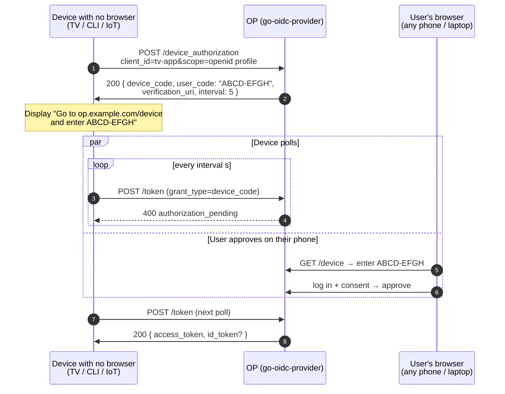
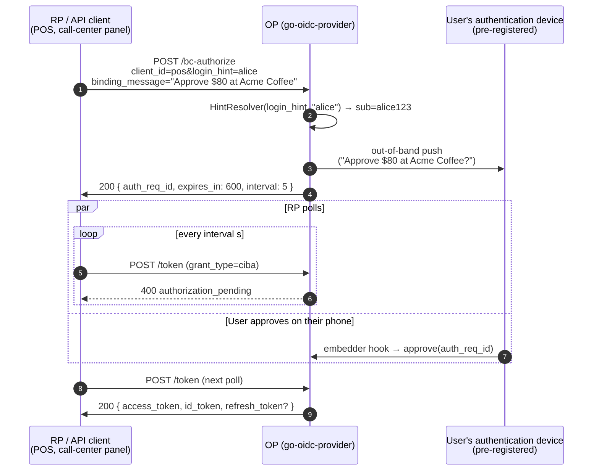

# No-browser flows: CIBA vs Device Code

[Device Code (RFC 8628)](/concepts/device-code) and [CIBA (OpenID Connect Client-Initiated Backchannel Authentication 1.0)](/concepts/ciba) are the two grants the spec ecosystem provides for the same broad situation: the device that wants the access token **cannot host a usable browser**. Smart TVs, gaming consoles, CLI tools, IoT devices, voice assistants, POS terminals, call-center panels, server-side processes that act on behalf of a person.

From a distance the two flows look like the same shape — "two surfaces meet at the OP, the user approves on a phone". They are not. They differ in **who initiates the request** and **how the user is identified to the OP**, and that single distinction drives almost every other difference: the wire endpoints, the polling subject, the anti-phishing primitive, the regulatory profile.

This page is the selection guide. The mechanics live on the dedicated pages for [Device Code](/concepts/device-code) and [CIBA](/concepts/ciba).

## The two flows in one paragraph each

**Device Code (RFC 8628).** The device with no browser asks the OP for a one-time code, displays it on its own screen, and tells the user "open this URL on your phone and enter this code". The user authenticates on whatever browser they happen to have at hand and approves. Meanwhile the device polls `/token` until approval lands. The user's identity is **discovered during the flow** — the OP did not know who would walk up to the TV.

**CIBA (Core 1.0).** The RP already knows who the user is — `login_hint` (`alice@example.com`, an account number), `id_token_hint` (a previously issued ID token), or `login_hint_token` (a signed JWT from an upstream system). The RP asks the OP "please authenticate this user out-of-band". The OP pings the user's pre-registered authentication device (push notification, SMS, app prompt). Meanwhile the RP polls (or, in ping/push mode, waits for a callback) until approval lands. The user's identity is **supplied upfront by the RP** — the OP needs it to know which device to push to.

## Comparison

| Aspect | Device Code (RFC 8628) | CIBA (Core 1.0) |
|---|---|---|
| Trigger origin | The device with no browser (input device → OP) | The RP / API client (RP → OP) |
| User identification | The user types `user_code` on a separate browser | The RP supplies `login_hint` / `id_token_hint` / `login_hint_token` upfront |
| User device | Any browser the user happens to have | A device pre-registered with the OP for backchannel push |
| Anti-phishing primitive | `user_code` displayed by the device + verification URI host visible to the user | `binding_message` shown on the user's authentication device |
| Browser involvement | Yes (on the user's phone) | Optional / none (push notification confirms) |
| Polling subject | The device with no browser | The RP |
| Spec endpoint | `/device_authorization` | `/bc-authorize` |
| Token `grant_type` | `urn:ietf:params:oauth:grant-type:device_code` | `urn:openid:params:grant-type:ciba` |
| Typical use cases | TV apps, CLI tools, kiosks, voice assistants, low-input IoT | Strong customer authentication (PSD2-style), finance / health out-of-band approval, customer-support flows that reset access without sharing a screen |
| Library status | RFC 8628 — full support, gated by `op.WithDeviceCodeGrant()` | OIDC CIBA Core 1.0 — poll mode only in the current release; ping / push deferred |
| Brute-force defense | `op/devicecodekit` constant-time compare + N-strike lockout (`MaxUserCodeStrikes`) | Poll-abuse lockout — rate-limited `/token` retries per `auth_req_id`, `AuditCIBAPollAbuseLockout` on cross |
| FAPI profile | Not in FAPI 2.0 (RFC 8628 itself is sufficient for Baseline-like deployments) | FAPI-CIBA — a separate FAPI profile from FAPI 2.0 Baseline / Message Signing, pinning JAR + DPoP \| mTLS + 10-minute access TTL |

::: tip Two grants, one symptom
Both grants exist because the canonical `authorization_code + PKCE` flow assumes a usable browser on the device that wants the token. That assumption breaks for TVs, CLIs, IoT, voice assistants, and for backend services acting on a user's behalf. RFC 8628 and CIBA solve **two different shapes** of "the browser is somewhere else".
:::

## Picking between them — decision tree

Run through these four questions in order. The first one usually settles it.

**1. Does the RP know who the user is *before* the flow starts?**

- **Yes** → CIBA. The RP already has `login_hint` (or an ID token, or a hint token) and can send it with `/bc-authorize`. The user does not need to type anything to identify themselves.
- **No** → Device Code. The user identifies themselves during the flow by signing in on the verification page; the OP discovers who they are when the user authenticates on their phone.

**2. Is there a screen on the device that wants the token?**

- **Yes** → Device Code can display the `user_code` and `verification_uri` directly. This is the canonical TV / console / CLI case.
- **No (voice assistant, headless IoT)** → Both can work. Device Code can emit the `user_code` via TTS or print it as a QR (`verification_uri_complete`). CIBA pushes to a separate device entirely and needs no display.

**3. Does the user have a registered authentication device?**

- **CIBA assumes yes.** Without a registered device the OP has nowhere to push. Provisioning that device — the banking app, the staff phone, the regulator-issued authenticator — is part of the deployment.
- **Device Code does not assume.** Any browser session the user can sign into works. The user's phone, a colleague's laptop, a kiosk in the store.

**4. Is this a regulated finance / health context with out-of-band approval requirements?**

- **CIBA is designed for it.** The FAPI-CIBA profile pins JAR, sender constraint (DPoP or mTLS), and a 10-minute access TTL on top of CIBA Core. `binding_message` is the audit primitive regulators look for ("the user saw exactly what they were approving").
- **Device Code is general-purpose.** It can be deployed to good effect, but it is not the shape regulators normally point to for SCA.

If you are still unsure after running the questions: default to **Device Code** for consumer-facing "the device has a screen but no browser" cases, and **CIBA** for "the RP knows the user and just needs them to approve out-of-band".

## Sequence diagrams

### Device Code (RFC 8628)

### CIBA (Core 1.0, poll mode)

The shape is similar enough that a reader can map them mentally. The decisive difference is the diagonal arrow: in Device Code the user **walks to the OP** with a code in hand; in CIBA the OP **reaches out to a device the user already trusts**.

## Threat model side-by-side

**Phishing — attacker tricks the user into approving the *attacker's* request.**

- Device Code: the user verifies the URL host they are typing the code into. The `user_code` itself has no per-session secret value (entropy is intentional but moderate). If the user mistypes the host or clicks a link in a phishing email, the same `user_code` works on the attacker's site.
- CIBA: `binding_message` is attached to `/bc-authorize` and shown on the user's authentication device. The user sees "Acme POS terminal #14: Approve $80 at Acme Coffee?" before approving. A pure push prompt without context ("we noticed unusual activity, approve?") is the failure mode.

**Replay / brute-force on `user_code`.**

- Device Code: the `user_code` is short (`BDWP-HQPK`) on purpose so users can type it. That makes it brute-forceable in principle. The library ships [`op/devicecodekit`](https://github.com/libraz/go-oidc-provider/tree/main/op/devicecodekit) — `VerifyUserCode` constant-time-compares and increments a strike counter on miss, locking the row after `MaxUserCodeStrikes` (default 5). Embedder verification pages **MUST** route through the helper.
- CIBA: there is no user-typed code. The `auth_req_id` is opaque and OP-issued.

**Replay / abuse on `/token` polling.**

- Both flows return `authorization_pending` while the user is deciding and `slow_down` if the device polls faster than the negotiated `interval`. RFC 8628 §3.5 makes honoring the new `interval` a MUST; the OP persists the value atomically with `LastPolledAt` so a multi-replica deployment cannot reset it.
- CIBA additionally has a poll-abuse lockout: when the per-`auth_req_id` violation counter crosses the threshold the request is denied with `reason="poll_abuse"` and the audit catalogue records `AuditCIBAPollAbuseLockout`.

## What this library implements today

**Device Code (RFC 8628).** Full support, gated by `op.WithDeviceCodeGrant()`. The verification ceremony page (where the user types the `user_code`) is **embedder-hosted**; the embedder calls `devicecodekit.VerifyUserCode` and `Approve` / `Deny` to drive the OP-side state machine. Audit catalogue:

- `AuditDeviceAuthorizationIssued`, `AuditDeviceAuthorizationRejected`, `AuditDeviceAuthorizationUnboundRejected`
- `AuditDeviceCodeVerificationApproved`, `AuditDeviceCodeVerificationDenied`, `AuditDeviceCodeUserCodeBruteForce`
- `AuditDeviceCodeTokenIssued`, `AuditDeviceCodeTokenRejected`, `AuditDeviceCodeTokenSlowDown`
- `AuditDeviceCodeRevoked` (from the public `Revoke` helper)

**CIBA (Core 1.0).** Poll mode only in the current release; ping and push are deferred. Wired through `op.WithCIBA(op.WithCIBAHintResolver(...))`; the `HintResolver` is the embedder hook that maps the inbound hint (`login_hint`, `id_token_hint`, `login_hint_token`) to a subject. Audit catalogue:

- `AuditCIBAAuthorizationIssued`, `AuditCIBAAuthorizationRejected`, `AuditCIBAAuthorizationUnboundRejected`
- `AuditCIBAAuthDeviceApproved`, `AuditCIBAAuthDeviceDenied`
- `AuditCIBAPollAbuseLockout`
- `AuditCIBATokenIssued`, `AuditCIBATokenRejected`, `AuditCIBATokenSlowDown`
- `AuditCIBAPollObservationFailed` (the token endpoint observed a state transition it could not act on cleanly)

## Read next

- [Device Code primer](/concepts/device-code) — RFC 8628 mechanics, polling responses, `user_code` brute-force gate.
- [CIBA primer](/concepts/ciba) — CIBA Core 1.0 mechanics, hint kinds, `binding_message`, FAPI-CIBA profile.
- [Use case: device-code wiring](/use-cases/device-code) — `op.WithDeviceCodeGrant`, the verification page contract, cascade revocation.
- [Use case: CIBA wiring](/use-cases/ciba) — `op.WithCIBA`, the `HintResolver` contract, FAPI-CIBA constraints.
- [Audit events](/reference/audit-events) — full catalogue with payload shapes.
