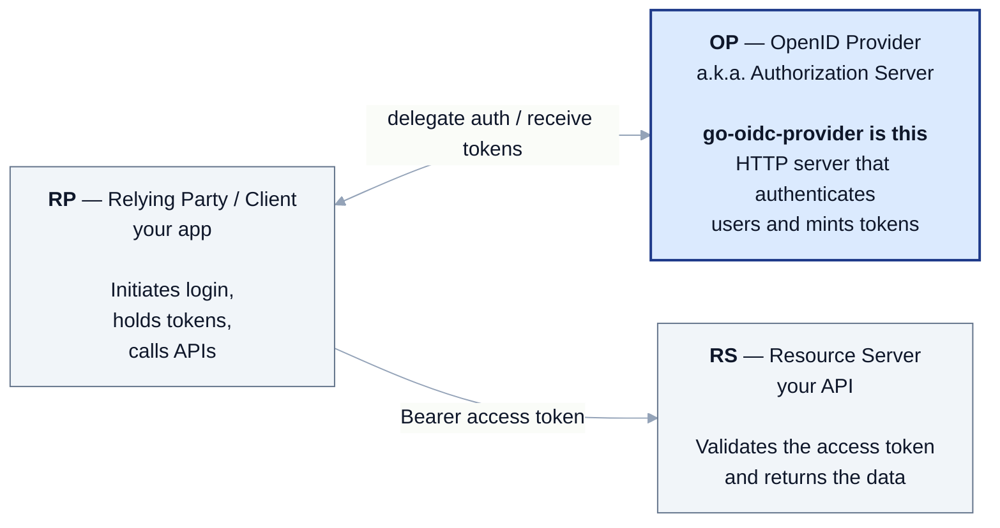
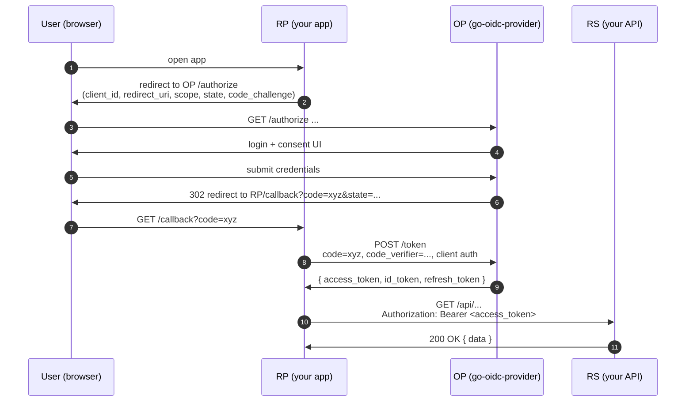

# OAuth 2.0 / OpenID Connect — a from-scratch primer

If you're new to authentication and authorization, the standards stack looks like an alphabet soup: OAuth, OIDC, JWT, OP, RP, RS, PAR, JAR, JARM, DPoP, mTLS, PKCE, FAPI. The good news: there are **only three roles**, and almost every standard is a refinement of the same flow between them.

::: details Acronym cheat sheet (open me first)
**The three roles**
- **OP** (OpenID Provider) — the server that authenticates users and issues tokens. `go-oidc-provider` is this. Also called **AS** (Authorization Server) in pure-OAuth contexts.
- **RP** (Relying Party) — the client app that uses the OP to log users in. Also called **Client**.
- **RS** (Resource Server) — the API that accepts the access token and returns data.

**Tokens and crypto**
- **JWT** (JSON Web Token, RFC 7519) — `header.payload.signature` JSON, base64url-encoded. Self-describing, signature-verifiable.
- **JWS** (JSON Web Signature, RFC 7515) — the signing scheme JWTs use.
- **JWE** (JSON Web Encryption, RFC 7516) — encrypted variant; outer envelope wraps an inner JWS.
- **JWK** / **JWKS** (RFC 7517) — JSON Web Key / Key **Set**. The OP's public keys, fetched from `/jwks`.
- **PKCE** (RFC 7636) — proof of possession on the authorization code; stops code-interception attacks. Pronounced "pixie."

**Profile / hardening acronyms**
- **PAR** (RFC 9126) — Pushed Authorization Request. The RP POSTs the authorize request to the OP first; the browser only carries a `request_uri` reference.
- **JAR** (RFC 9101) — JWT-Secured Authorization Request. The authorize request is itself a signed JWT.
- **JARM** (OpenID FAPI) — JWT-Secured Authorization Response Mode. The authorize **response** is a signed JWT.
- **DPoP** (RFC 9449) — Demonstrating Proof of Possession. Binds a token to a key the client holds, on every request.
- **mTLS** (RFC 8705) — mutual TLS. Same idea as DPoP, but the binding is the client's TLS certificate.
- **FAPI** (Financial-grade API) — the OpenID profile that pins all of the above into one set.
- **CIBA** — Client-Initiated Backchannel Authentication. Push-to-phone flow, no browser on the device.

**Identity claims you'll see early**
- **`sub`** — Subject. The user's opaque identifier on this OP.
- **`aud`** — Audience. Who the token is for.
- **`iss`** — Issuer. The OP that signed the token.
- **`scope`** — space-separated permission list (`openid profile email`).
- **`acr`** (Authentication Context Class Reference) — assurance level the auth method provided. Used by step-up.
- **`amr`** (Authentication Methods References) — RFC 8176 codes for the factors actually used (`pwd`, `otp`, `mfa`, `hwk`, `face`, `fpt`).
- **`cnf`** — confirmation. The key the token is bound to (DPoP `jkt` thumbprint or mTLS `x5t#S256`).
:::

::: details Specs referenced on this page
- [RFC 6749](https://datatracker.ietf.org/doc/html/rfc6749) — OAuth 2.0 Authorization Framework
- [RFC 6750](https://datatracker.ietf.org/doc/html/rfc6750) — Bearer Token Usage
- [RFC 7519](https://datatracker.ietf.org/doc/html/rfc7519) — JSON Web Token (JWT)
- [RFC 7636](https://datatracker.ietf.org/doc/html/rfc7636) — PKCE
- [RFC 7662](https://datatracker.ietf.org/doc/html/rfc7662) — Token Introspection
- [RFC 9068](https://datatracker.ietf.org/doc/html/rfc9068) — JWT Profile for OAuth 2.0 Access Tokens
- [OpenID Connect Core 1.0](https://openid.net/specs/openid-connect-core-1_0.html)
- [OpenID Connect RP-Initiated Logout 1.0](https://openid.net/specs/openid-connect-rpinitiated-1_0.html)
- [FAPI 2.0 Baseline](https://openid.net/specs/fapi-2_0-baseline.html)
:::

## The three roles



The actual login steps (redirect to `/authorize`, code exchange, token retrieval) are spelled out in the [authorization code + PKCE flow](#the-most-common-flow-authorization-code--pkce) below. The diagram above is the static "who's responsible for what" view.

::: tip Same actor, different hat
A single piece of software can wear two hats. Your "backend for frontend" might be both the **RP** (it logs users in) and the **RS** (it has APIs the SPA calls with the access token).
:::

## OAuth 2.0 vs OpenID Connect

OAuth 2.0 is **delegated authorization** — "Alice's app gets permission to read Alice's data on Service X." OAuth 2.0 by itself does not tell the app **who Alice is**; it only hands out an opaque access token.

OpenID Connect (OIDC) is **OAuth 2.0 plus identity** — the OP additionally issues an **ID Token** (a signed JWT) that says "this token was issued for user `sub=alice123`, audience `client_id=myapp`, at this time, and the following claims about her are true." OIDC adds a userinfo endpoint (`/userinfo`), a discovery document, RP-Initiated Logout, and a back-channel logout notification.

::: details JWT — what's that?
A **JWT** (JSON Web Token, RFC 7519) is a string of three base64url chunks joined by dots: `header.payload.signature`. The header and payload are JSON; the signature is what lets a receiver verify the issuer cryptographically using a public key.

In OIDC, **ID Tokens are always JWTs**, and access tokens issued by `go-oidc-provider` are JWTs too. If you can read JSON and check a signature, you can read a JWT — no proprietary binary format involved.
:::

::: details Opaque vs JWT — quick refresher
- **Opaque token** — a random string that means nothing to whoever holds it. To know what it grants, the receiver calls the issuer's introspection endpoint (RFC 7662), which looks up a row.
- **JWT** — self-describing: the contents are encoded inside the token, and a signature lets the receiver verify it offline.

The trade-off is "every request hits the OP" vs "OP loses fine-grained revocation visibility." See [tokens](/concepts/tokens) for how this library splits the difference.
:::

::: details So when do I use which?
- Pure OAuth 2.0: an API that just needs to say "this token is allowed to call `POST /things`." Common for service-to-service.
- OIDC: anything where a human logs in and the app needs to say "hello, Alice." Almost every web/mobile app login is OIDC.

`go-oidc-provider` defaults to OIDC (the `openid` scope is required) but flips to pure OAuth 2.0 with `op.WithOpenIDScopeOptional()`.
:::

## The four token types you'll meet

| Token | Lifetime | What it is | Where it goes |
|---|---|---|---|
| **Authorization code** | Seconds (default 60s) | Single-use opaque string. | Server-to-server: RP → OP `/token`. |
| **Access token** | Minutes (default 5 min) | The thing you put on `Authorization: Bearer …` to call APIs. JWT or opaque. | RP → RS. |
| **Refresh token** | Days–weeks (30d default) | Long-lived; lets the RP get a new access token without re-authenticating. | RP → OP `/token`. |
| **ID Token** | Minutes (matches access) | Signed JWT proving who the user is. *Never* sent to APIs. | OP → RP, consumed inside the RP. |

::: warning Don't put ID Tokens on Bearer
A common beginner mistake: sending the ID Token to your API. Don't — ID Tokens are for the RP to read; access tokens are for the RS. Your API should validate the **access token**, optionally with `Authorization Server`-side **introspection** (RFC 7662) or as a self-contained JWT (RFC 9068).
:::

## The flow you'll see most often: Authorization Code + PKCE



The "+ PKCE" piece (steps highlighted via `code_challenge`/`code_verifier`) is what stops a malicious app from intercepting the authorization code. [Detailed walk-through](/concepts/authorization-code-pkce).

## Concepts you'll see in this site's docs

| Term | Meaning |
|---|---|
| **Scope** | Space-separated list of permissions, e.g. `openid profile email`. The user consents to these. |
| **Claim** | A field inside a token, e.g. `sub`, `email`, `email_verified`. |
| **Consent** | The "this app wants to read your email" screen. The OP records it; subsequent logins skip it for the same scopes. |
| **Audience (`aud`)** | Who the token is for. ID Tokens have `aud = client_id`; access tokens have `aud = resource server`. |
| **Issuer (`iss`)** | The OP that signed the token. RP and RS both check it matches their expectation. |
| **JWKS** | JSON Web Key Set — the OP's public keys, fetched from `/jwks`. RPs use this to verify ID Tokens. |
| **Discovery document** | `/.well-known/openid-configuration` — a JSON catalog of every endpoint, supported scope, supported algorithm, etc. |

::: details `acr` and `amr` in one paragraph
`acr` says **how strong** the authentication was (an assurance-level label like `aal2`); `amr` says **which factors** were used (`["pwd","otp"]`). RPs that need elevated assurance for sensitive operations request a higher `acr` via `acr_values`; the OP runs step-up authentication and re-issues the ID Token. RFC 8176 catalogs the standard `amr` codes; RFC 9470 standardises step-up via `WWW-Authenticate: error="insufficient_user_authentication"`. See [MFA / step-up](/use-cases/mfa-step-up) for wiring.
:::

## What FAPI 2.0 adds

If you're building a banking-grade or healthcare-grade OP, you need **FAPI 2.0** on top of OIDC — sender-constrained tokens (DPoP / mTLS), PAR (the authorize request goes server-to-server first), JAR (the request is a signed JWT), and a tighter algorithm allow-list. The library makes this one option:

```go
op.WithProfile(profile.FAPI2Baseline)
```

A primer with all the acronyms expanded lives at [FAPI 2.0 primer](/concepts/fapi). For mechanics, see [sender constraint](/concepts/sender-constraint); for the full wiring, see [Use case: FAPI 2.0 Baseline](/use-cases/fapi2-baseline).

## Read these next

- [Authorization Code + PKCE flow](/concepts/authorization-code-pkce) — the flow above, with mermaid sequence and a parameter glossary.
- [Client Credentials](/concepts/client-credentials) — service-to-service, no end user.
- [Refresh tokens](/concepts/refresh-tokens) — rotation, reuse detection, grace period.
- [ID Token vs access token vs userinfo](/concepts/tokens) — they look the same, they're not.
- [Sender constraint (DPoP / mTLS)](/concepts/sender-constraint) — what FAPI 2.0 actually adds.
- [FAPI 2.0 primer](/concepts/fapi) — what the FAPI profile is, what each acronym (PAR, JAR, JARM, …) does, and why a profile beats "OIDC + best practices."
