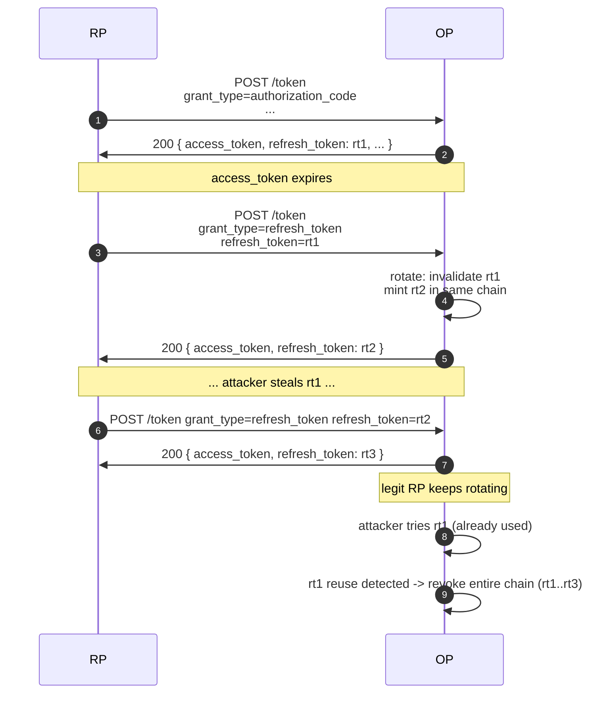

# Refresh tokens

A **refresh token** is a long-lived credential the RP exchanges for a fresh
access token without re-authenticating the user. It's how "stay signed in"
works.

::: details Specs referenced on this page
- [RFC 6749](https://datatracker.ietf.org/doc/html/rfc6749) — OAuth 2.0 Authorization Framework (§6 refresh)
- [RFC 9700](https://datatracker.ietf.org/doc/html/rfc9700) — OAuth 2.0 Security Best Current Practice (rotation, reuse detection)
- [OpenID Connect Core 1.0](https://openid.net/specs/openid-connect-core-1_0.html) — §11 (`offline_access`)
:::

::: details Vocabulary refresher
- **Rotation** — every successful refresh-token exchange invalidates the
  old refresh token and issues a new one. The pair (old, new) form a
  **chain** of refreshes for the same login.
- **Reuse detection** — if a refresh token that's already been rotated
  shows up again, the OP treats it as a stolen-credential signal and
  invalidates the entire chain. See the warning below.
- **Grace period** — a small window after rotation where presenting the
  previous refresh token still returns the *same* new pair (idempotent),
  to absorb retries from racing clients.
- **`offline_access` scope** — OIDC's standard way for the user to
  consent to "the app may keep working when I'm not present." Required
  before this library issues a refresh token.
:::

## How rotation works

Every successful `grant_type=refresh_token` call **rotates** the refresh
token: the old one is invalidated and a new one is returned.



::: warning Reuse detection invalidates the chain
If a previously-rotated refresh token is presented again, the OP treats
it as a stolen-credential signal and **revokes the entire chain** — both
the stolen token and the legitimate token derived from it. Both parties
have to re-authenticate. This is intentional: it's the strongest signal
the OP can give that something has gone wrong.
:::

## Grace period

A racing legitimate client (e.g. a tab that double-fetched the same refresh)
would otherwise hit reuse detection. `op.WithRefreshGracePeriod(d)` widens
the rotation acceptance window:

```go
op.WithRefreshGracePeriod(2 * time.Second)
```

Within `d` seconds of a successful rotation, the previous token still
returns the *same* new token (idempotent). After `d` seconds, replay is
treated as theft.

::: tip Default is 60 seconds
The default grace period is **60 seconds** (`refresh.GraceTTLDefault`) —
covers the typical mobile-network round-trip retry. Pass
`op.WithRefreshGracePeriod(0)` to keep the default, a positive duration
to widen it, or a negative value to disable grace entirely (strict
single-use). The OFCS refresh-token regression test waits ~32 s
between rotation and retry, so any grace below that range will
regress conformance.
:::

## TTL buckets

| Option | Default | Applies to |
|---|---|---|
| `op.WithRefreshTokenTTL(d)` | 30 days | Conventional refresh tokens. |
| `op.WithRefreshTokenOfflineTTL(d)` | inherits `WithRefreshTokenTTL` | Refresh tokens issued under the `offline_access` scope. |

Splitting the buckets lets `offline_access` carry an operationally
observable difference (longer lifetime for stay-signed-in flows) while
conventional refresh keeps a shorter rotation cadence.

## Issuance gate

By default a refresh token is issued only when **both** conditions hold:

1. The client lists `refresh_token` in its `GrantTypes`.
2. The granted scope contains `openid` (refresh tokens are an OIDC
   construct in this library).

Drop either and the token endpoint succeeds with `access_token` +
`id_token` and **no `refresh_token` field** — exactly mirroring the
"client has no refresh_token grant" path. The RP must re-authenticate
the user when the access token expires.

In the default (lax) reading of OIDC Core 1.0 §11, `offline_access` is
**not** an issuance gate: it only governs consent-prompt UX and which
TTL bucket the refresh token falls into (`WithRefreshTokenTTL` vs
`WithRefreshTokenOfflineTTL`). To make `offline_access` a hard gate,
opt in with `op.WithStrictOfflineAccess()` — see the section below.

::: details `op.WithStrictOfflineAccess` — strict OIDC Core §11 reading
`op.WithStrictOfflineAccess()` switches the issuance and refresh
exchange paths to the strict §11 reading: refresh tokens are issued
(and accepted on `grant_type=refresh_token`) only when the granted
scope contains `offline_access`. Pick this when you want consent
prompts and the actual issuance gate to agree byte-for-byte on what
the user authorised — at the cost of every RP that wants stay-signed-in
behaviour explicitly requesting `offline_access`.

The option is mutually exclusive with `op.WithOpenIDScopeOptional`
(strict §11 has no meaning when `openid` itself is optional) — the
constructor refuses the combination.
:::

## Audit trail

The token endpoint emits two slog audit events through `op.WithAuditLogger`:

| Event | Fired on |
|---|---|
| `op.AuditTokenIssued` | Refresh minted on `authorization_code` exchange. |
| `op.AuditTokenRefreshed` | Refresh rotated on `refresh_token` grant. |

Both records carry an `offline_access` boolean and a `ttl_bucket` string
(`"offline"` or `"default"`) in `extras`, so SOC dashboards can split
stay-signed-in chains from conventional rotation without re-reading the
granted scope set.

## Read next

- [ID Token vs access token vs userinfo](/concepts/tokens) — what each
  token actually contains.
- [Sender constraint](/concepts/sender-constraint) — bind the access
  token (and the refresh token) to a key the client holds.
