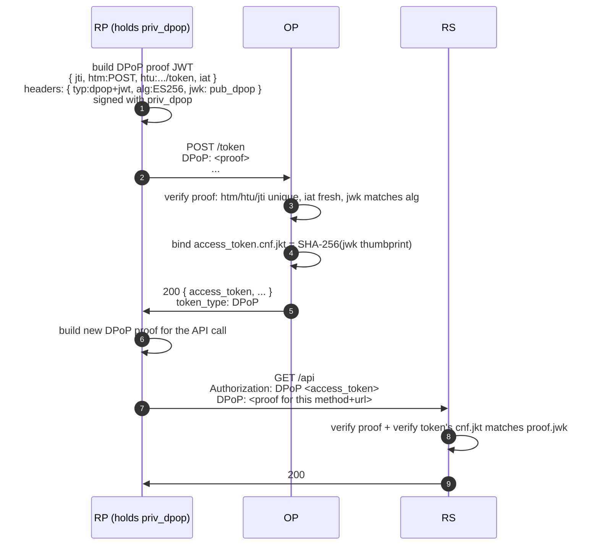
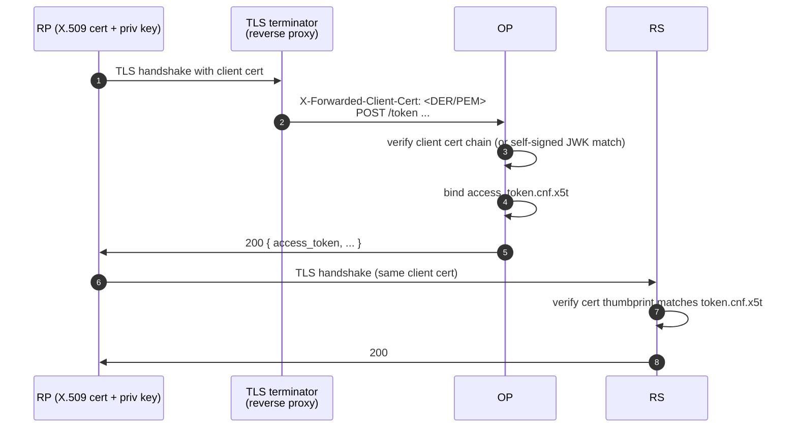

# Sender constraint — DPoP / mTLS

A bare Bearer token is **bearer-authoritative**: whoever has the bytes can call the API. If the token leaks (logs, intermediary, browser extension), the leaker has full access until the token expires.

A **sender-constrained** access token is bound to a key that the legitimate client holds. Even if the token leaks, the leaker cannot use it without also stealing the key.

::: details Specs referenced on this page
- [RFC 9449](https://datatracker.ietf.org/doc/html/rfc9449) — DPoP (Demonstrating Proof of Possession)
- [RFC 8705](https://datatracker.ietf.org/doc/html/rfc8705) — Mutual-TLS Client Authentication and Certificate-Bound Access Tokens
- [RFC 7800](https://datatracker.ietf.org/doc/html/rfc7800) — Confirmation (`cnf`) claim
- [RFC 8725](https://datatracker.ietf.org/doc/html/rfc8725) — JWT Best Current Practices
- [FAPI 2.0 Baseline](https://openid.net/specs/fapi-2_0-baseline.html)
:::

::: details Quick refresher
- **Bearer token** — any token that grants whoever holds it. Sent as `Authorization: Bearer <token>` (RFC 6750). No key required to use it.
- **`cnf` claim** ("confirmation", RFC 7800) — a field inside the access token that records the key the legitimate client holds. The RS consults it to verify the caller is using the matching key.
- **Thumbprint** — a SHA-256 hash of a public key (or X.509 certificate), used as a stable, short identifier inside `cnf`.
:::

There are two mechanisms in this library, both backed by RFCs:

- **DPoP** (Demonstrating Proof of Possession, RFC 9449) — the client signs a small JWT proof per request with a private key. Works over ordinary HTTPS.
- **mTLS** (Mutual TLS, RFC 8705) — the client presents an X.509 certificate during the TLS handshake, and the OP binds the issued token to the certificate's thumbprint.

FAPI 2.0 Baseline requires sender-constrained tokens via **one of** these two; this library accepts both.

## DPoP — how it works



Per request, the client makes a *fresh* DPoP proof (different `jti`, different `htm`/`htu`). The RS rejects:

- A proof signed with a key that doesn't match the token's `cnf.jkt`.
- A reused `jti`.
- A proof for a different method or URL.
- A proof with an `iat` outside the freshness window.

::: details DPoP nonce (RFC 9449 §8)
For high-security deployments, the OP can require a server-supplied nonce inside DPoP proofs. The first request returns `DPoP-Nonce: <nonce>` and `use_dpop_nonce` error; the client retries with the nonce embedded in the next proof. This prevents pre-computed proofs from being staged offline.

`op.WithDPoPNonceSource(source)` plugs in the nonce generator (in-memory or distributed). FAPI 2.0 Message Signing forces nonce on; FAPI 2.0 Baseline allows it. See [`examples/51-dpop-nonce`](https://github.com/libraz/go-oidc-provider/tree/main/examples/51-dpop-nonce).
:::

## mTLS — how it works

The TLS handshake itself authenticates the client.



Two RFC 8705 sub-modes:

- `tls_client_auth` — PKI-issued certificate, OP validates the chain against a trust store.
- `self_signed_tls_client_auth` — the client registers its public JWK, and the OP matches the cert's public key against it.

::: warning mTLS proxy header
The OP almost always runs **behind** a TLS-terminating proxy (nginx / envoy / cloud LB). The proxy passes the verified client cert in a header. `op.WithMTLSProxy(headerName, trustedCIDRs)` configures both:

```go
op.WithMTLSProxy("X-SSL-Cert", []string{"10.0.0.0/8"})
```

The CIDR list pins the trusted proxy ranges so a request from outside those ranges with a forged header is rejected.
:::

## When to use which

| Scenario | DPoP | mTLS |
|---|---|---|
| Public client (SPA / mobile) | ✅ — client holds the key in memory / secure storage. | ❌ — clients can't establish mTLS to a public OP. |
| Confidential client (server-to-server) | ✅ | ✅ |
| Already-deployed PKI for client identity | possibly | ✅ — reuse it. |
| Want to avoid distributing client certs | ✅ | ❌ |
| Per-request request-binding (htm/htu) | ✅ — proof carries method + URL. | ⚠️ — only the channel is bound. |
| FAPI 2.0 Baseline | ✅ | ✅ |
| FAPI 2.0 Message Signing | ✅ | ✅ |

For a mixed estate, enable both — the OP advertises both in discovery and the client picks per request.

## What changes when a token leaks

Bare bearer:
- Leaker can replay the token until `exp`.

DPoP-bound:
- Leaker also needs the private key matching `cnf.jkt`. Without it, every API call fails the proof check.

mTLS-bound:
- Leaker also needs the X.509 certificate **and** its private key to re-establish a TLS session whose thumbprint matches `cnf.x5t#S256`.

## Wiring summary

```go
import (
  "github.com/libraz/go-oidc-provider/op"
  "github.com/libraz/go-oidc-provider/op/profile"
  "github.com/libraz/go-oidc-provider/op/feature"
)

op.New(
  /* required options */
  op.WithProfile(profile.FAPI2Baseline),     // mandates sender constraint
  op.WithFeature(feature.DPoP),               // enable DPoP — pick at least one
  op.WithFeature(feature.MTLS),               // (and / or) enable mTLS
  op.WithMTLSProxy("X-SSL-Cert", trustedCIDRs),
  op.WithDPoPNonceSource(myNonceSource),     // optional, RFC 9449 §8
)
```

::: tip Profile mandates the requirement; the embedder picks the binding
`op.WithProfile(profile.FAPI2Baseline)` auto-enables PAR and JAR, and imposes a `RequiredAnyOf` constraint that forces the embedder to enable **at least one** of `feature.DPoP` or `feature.MTLS` explicitly via `op.WithFeature`. `op.New` rejects the configuration at construction time if neither is enabled. Enable both to make both binding mechanisms available; the discovery document then lists both.
:::
