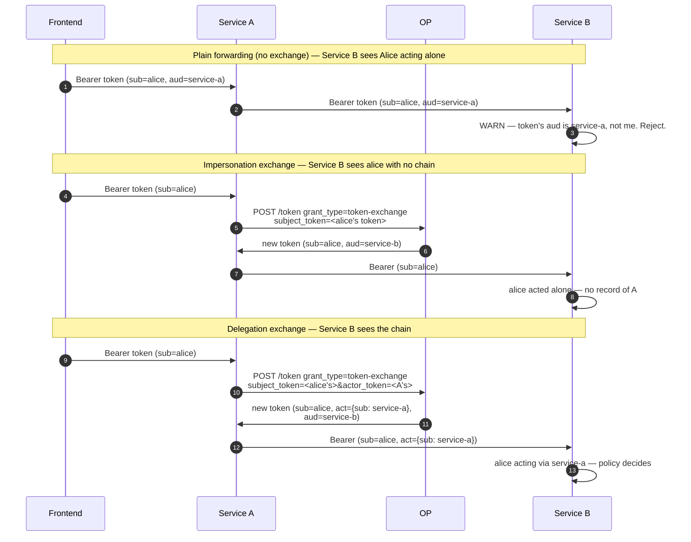

# Token Exchange (RFC 8693)

A modern microservice graph almost always needs to **call other services on behalf of the user**. The frontend gets a token. Service A receives that token, then needs to call Service B. Should Service A reuse the user's token? Mint a new one? Combine the two? RFC 8693 defines the wire shape for that exchange.

The design fundamentally distinguishes two intents:

- **Impersonation** — Service A presents the user's token to Service B, **as if it were the user**. Service B sees `sub=alice`. Audit trails downstream see Alice acting alone.
- **Delegation** — Service A asks the OP for a new token whose `sub` is still Alice but whose **`act` claim** carries `{sub: service-a}`, recording that Alice's authority is being exercised through Service A. Service B sees `sub=alice, act={sub: service-a}` and can apply policy that depends on the chain ("Service A may withdraw Alice's funds, but only if the request originated from Alice").

Modern threat models prefer delegation — the audit chain is intact, revocation can target the intermediary, and least-privilege tightens around the actor rather than spreading from the subject.

::: details Specs referenced on this page
- [RFC 8693](https://datatracker.ietf.org/doc/html/rfc8693) — OAuth 2.0 Token Exchange
- [RFC 8707](https://datatracker.ietf.org/doc/html/rfc8707) — Resource Indicators (used for `audience` / `resource`)
- [RFC 7800](https://datatracker.ietf.org/doc/html/rfc7800) — Confirmation (`cnf`) claim — re-binds the issued token to the calling actor's DPoP / mTLS key
:::

::: details Vocabulary refresher
- **subject_token** — the token whose holder's identity should populate `sub` on the new token. Usually the user's access token forwarded from upstream.
- **actor_token** — the token identifying the caller (the service performing the exchange). When present, the new token gains an `act` claim wrapping the actor's `sub` / `client_id`.
- **`act` claim** (RFC 8693 §4.1) — a nested object recording who is acting on behalf of `sub`. It can chain (`act.act.act…`) so a four-hop call records all four intermediaries.
- **`cnf` rebinding** — the issued token's `cnf` (RFC 7800 confirmation) is set to the *calling* actor's verified DPoP / mTLS proof, **not** the subject's. The token is sender-bound to the service performing the exchange.
:::

## Impersonation vs Delegation, side by side



The difference shows up in audit trails (Service B knows who actually originated the call) and in policy (Service B can require an actor when the operation is sensitive).

## What the OP enforces

The library's RFC 8693 handler is opinionated about a few things the spec leaves to deployment policy:

- **`act` chain is built on the OP side**, not handed in by the caller. Whenever `actor_token` differs from `subject_token`, the OP populates `act` from the actor's verified credentials. A caller cannot fabricate an `act` claim.
- **Audience must be explicit and allow-listed.** RFC 8707 audiences (the `audience` / `resource` parameters) are normalised, and the policy decides which audiences this client may target.
- **Scope is intersected**, not unioned. The issued token's scope is the intersection of (requested scope, `subject_token`'s scope, calling client's allow-list). RFC 8693 §3.1 permits scope reduction; the OP forbids inflation.
- **TTL is capped** by the minimum of (handler request, `subject_token` remaining lifetime, OP global ceiling). A long-lived token cannot be laundered into a longer one.
- **`cnf` is rebound to the calling actor.** If Service A presents a DPoP proof on the exchange request, the issued token's `cnf.jkt` matches Service A's DPoP key — not the user's, not the subject_token's. Service B verifies the DPoP proof against the new token's `cnf`.

These rules are enforced **before** the embedder-supplied [`TokenExchangePolicy`](https://github.com/libraz/go-oidc-provider/blob/main/op/tokenexchange.go) is consulted. The policy can narrow further (deny audiences, deny actor combos) but cannot widen — the OP-computed defaults are a floor.

## When you actually need it

You probably **do not** need token exchange when:

- Both services are owned by the same team and trust each other implicitly. Use the user's token directly with a multi-`aud` audience set.
- The downstream service does not need to know about the upstream actor. Pass the user's token through (with the right `aud`).

You probably **do** need it when:

- The downstream service applies policy that depends on **who is in the call chain** — "the wire-transfer service trusts the mobile app, but not the SMS bot, even when both invoke it as Alice".
- A third-party service is in the chain and your audit obligation requires recording the cross-org actor.
- Sender-binding (DPoP / mTLS) needs to follow the **calling service**, not the user.

## See it run

[`examples/33-token-exchange-delegation`](https://github.com/libraz/go-oidc-provider/tree/main/examples/33-token-exchange-delegation) ships a frontend → service-a → service-b chain. The frontend obtains a user token, service-a exchanges it for a delegated token (with `act={sub: service-a}`), service-b's RS-side verifier walks `act.sub` and accepts only delegated tokens.

```sh
go run -tags example ./examples/33-token-exchange-delegation
```

The example is split into role-tagged files (`op.go` for the OP wiring + `TokenExchangePolicy`, `service_a.go` for the intermediary, `service_b.go` for the resource server, `probe.go` for self-verification).

## Read next

- [Use case: token-exchange wiring](/use-cases/token-exchange) — `op.RegisterTokenExchange`, the `TokenExchangePolicy` contract, configuring audiences, refresh-issuance opt-in via `op.PtrBool(true)`.
- [Custom Grant wiring](/use-cases/custom-grant) — token exchange is the in-tree example of a "custom grant_type" the OP routes; embedders writing their own URN follow the same shape via `op.WithCustomGrant`.
