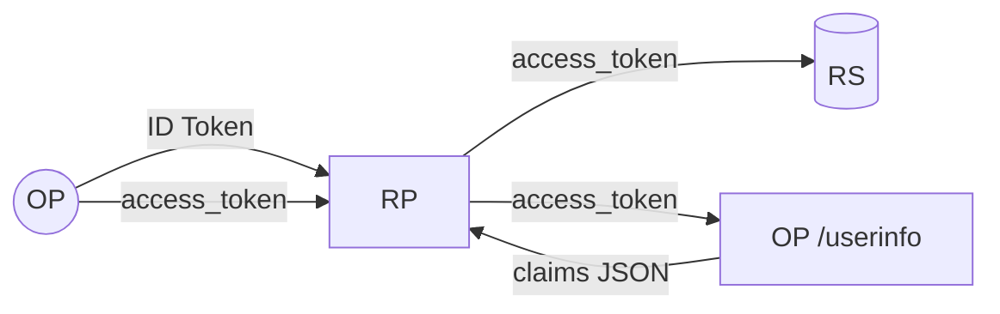

# ID Token, access token, and userinfo

OIDC produces three identity artefacts. They look interchangeable at a glance — all of them carry user info, all of them are produced by the OP. They are not interchangeable. Mixing them up is a classic source of bugs.

::: tip Mental model in 30 seconds
- **ID Token** — a signed receipt for the RP that says "this user logged in here." Audience: the RP. Don't send it to APIs.
- **Access token** — the bearer credential the RP hands to the API. Audience: the resource server. **Default format is JWT (RFC 9068); opaque is opt-in.**
- **UserInfo** — `GET /userinfo` with the access token to fetch fresh claims. Not a token at all — a JSON response.
:::

::: details Specs referenced on this page
- [RFC 6749](https://datatracker.ietf.org/doc/html/rfc6749) — OAuth 2.0 Authorization Framework
- [RFC 6750](https://datatracker.ietf.org/doc/html/rfc6750) — Bearer Token Usage
- [RFC 7009](https://datatracker.ietf.org/doc/html/rfc7009) — Token Revocation
- [RFC 7517](https://datatracker.ietf.org/doc/html/rfc7517) — JSON Web Key (JWK)
- [RFC 7519](https://datatracker.ietf.org/doc/html/rfc7519) — JSON Web Token (JWT)
- [RFC 7662](https://datatracker.ietf.org/doc/html/rfc7662) — Token Introspection
- [RFC 8176](https://datatracker.ietf.org/doc/html/rfc8176) — Authentication Method Reference Values
- [RFC 8705](https://datatracker.ietf.org/doc/html/rfc8705) — Mutual-TLS Client Authentication and Certificate-Bound Access Tokens
- [RFC 8707](https://datatracker.ietf.org/doc/html/rfc8707) — Resource Indicators for OAuth 2.0
- [RFC 9068](https://datatracker.ietf.org/doc/html/rfc9068) — JWT Profile for OAuth 2.0 Access Tokens
- [RFC 9449](https://datatracker.ietf.org/doc/html/rfc9449) — DPoP
- [RFC 9470](https://datatracker.ietf.org/doc/html/rfc9470) — Step-up Authentication
- [OpenID Connect Core 1.0](https://openid.net/specs/openid-connect-core-1_0.html) — §2 (ID Token), §5.3 (UserInfo), §3.1.2.1 (nonce), §5.5 (claims request)
- [OpenID Connect RP-Initiated Logout 1.0](https://openid.net/specs/openid-connect-rpinitiated-1_0.html)
:::

::: details JWT — what's that?
A **JWT** (JSON Web Token, RFC 7519) is a string of three base64url chunks joined by dots: `header.payload.signature`. The header and payload are JSON; the signature is a cryptographic check that the token came from the holder of the matching private key.

In OIDC, **ID Tokens are always JWTs**. Access tokens issued by `go-oidc-provider` are also JWTs (RFC 9068). UserInfo is not a JWT — it's a plain JSON HTTP response.
:::

## At a glance

| Artefact | Format | Audience (`aud`) | Where it goes | Lifetime | Who reads it |
|---|---|---|---|---|---|
| **ID Token** | Signed JWT (always) | The RP's `client_id` | OP → RP only | Minutes (default 5) | The RP, to know who logged in. |
| **Access token** | JWT (RFC 9068) on the wire — see below | The RS identifier | RP → RS via `Authorization: Bearer` | Minutes | The RS, to authorize an API call. |
| **UserInfo response** | JSON | n/a (RP's `client_id` implied) | RP → OP `/userinfo` (with access token) → RP | Per-request | The RP, to get fresh claims. |



## ID Token — "who logged in"

A signed JWT defined by **OIDC Core 1.0 §2**. The RP verifies its signature against the OP's JWKS (RFC 7517) and checks `iss`, `aud`, `exp`, and (if present) `nonce`. Standard claims:

| Claim | Meaning | Spec |
|---|---|---|
| `iss` | Issuer (the OP). Must match the RP's expectation. | OIDC Core §2 |
| `sub` | Subject identifier — opaque per-OP user ID. | OIDC Core §2 |
| `aud` | Audience — must contain the RP's `client_id`. | OIDC Core §2 |
| `azp` | Authorized party — the `client_id` requesting the token (when `aud` has multiple values). | OIDC Core §2 |
| `exp`, `iat` | Expiry / issued-at. | RFC 7519 |
| `nonce` | Echoes the `nonce` from the authorize request. Replay defence. | OIDC Core §3.1.2.1 |
| `auth_time` | When the user authenticated (vs. when the token was issued). | OIDC Core §2 |
| `acr` | Authentication Context Class Reference — assurance level the auth method provided. | OIDC Core §2 / RFC 9470 |
| `amr` | Authentication Methods References — `pwd`, `otp`, `mfa`, `hwk`, etc. | RFC 8176 |

::: details `acr` — what's that?
**`acr`** (Authentication Context Class Reference) is a single string that names *how strong* the login was. Your OP decides the vocabulary; common values are `urn:mace:incommon:iap:silver`, NIST SP 800-63 levels, or the FAPI-style `urn:openbanking:psd2:sca`. The RP requests a minimum with `acr_values=...` on `/authorize`; if the user's session can't satisfy it, the OP either re-prompts (step-up, RFC 9470) or rejects the request. Don't confuse it with `amr` — `acr` is the *level*, `amr` is the *methods used to reach that level*.
:::

::: details `amr` — what's that?
**`amr`** (Authentication Methods References, RFC 8176) is a JSON array of short strings describing *which factors* the user actually presented this session: `pwd` for password, `otp` for one-time code, `mfa` when more than one factor was used, `hwk` for hardware key, `face` for facial recognition, and so on. RPs typically read it for audit and policy ("require `mfa` for the admin console") rather than for trust decisions — that's what `acr` is for.
:::

::: details `auth_time` — what's that?
**`auth_time`** is the Unix timestamp of when the user *authenticated to the OP*, which is **not** the same as `iat` (when *this* token was issued). A user who logged in an hour ago and just refreshed gets a fresh `iat` but the old `auth_time`. RPs use it to enforce a `max_age` policy ("force re-auth if it's been more than 30 minutes") and the OP enforces it server-side when the RP passes `max_age` on `/authorize`.
:::

::: details `azp` — what's that?
**`azp`** (Authorized Party) is the `client_id` that *requested* the ID Token. It only matters when `aud` carries multiple values — in that case, `azp` disambiguates which of those audiences actually drove the authorize request. For the common single-RP case, `aud` is just `[client_id]` and `azp` is omitted. RPs should reject ID Tokens where `aud` has many entries and `azp` is missing or doesn't match their `client_id`.
:::

::: details JWKS — what's that?
**JWKS** (JSON Web Key Set, RFC 7517) is a JSON document the OP serves at `/jwks` (advertised via the discovery document). It lists the OP's **public** keys; RPs fetch it once, cache it, and use it to verify ID Token signatures offline. The OP rotates keys by adding the new key ahead of time and publishing it before signing with it, so RPs that re-fetch the JWKS find it.
:::

::: warning Don't put the ID Token on `Authorization: Bearer`
The ID Token's audience is the RP, not the RS. Sending it as a Bearer token to your API works *technically* (it's a JWT) but it's semantically wrong and exposes the RP's secret-equivalent claims (email, etc.) to every API the user touches. **Use the access token for APIs.**
:::

## Access token — "this client may call this API"

The Bearer token your resource server validates (RFC 6750). Two classical formats are described in the OAuth literature:

| Format | Validation | State on the OP |
|---|---|---|
| **Opaque** | RS calls `/introspect` (RFC 7662) every request. | OP keeps a row keyed on the token. |
| **JWT (RFC 9068)** | RS validates signature + `aud` + `exp` self-contained. | Stateless — no row needed to verify. |

### Why this matters: session_end, userinfo, and revocation depend on history

::: warning A pure stateless JWT has no "still alive" beyond `exp`
The trade-off looks tidy on a slide and breaks several OIDC flows in production. Anyone running an OP with **stateless** JWT access tokens either ships without revocation or layers an external denylist on top.
:::

| Flow | What it should answer | What breaks under stateless JWT |
|---|---|---|
| **`/userinfo`** (OIDC Core §5.3) | "Is this token still valid for the user it represents?" | OP has nothing to look up. Logged-out users still get claims back. |
| **`/end_session`** (RP-Initiated Logout) | Ends the session | The JWT keeps working until `exp`. A leaked token calls APIs for ten more minutes after the user "logged out." |
| **`/revoke`** (RFC 7009) | Invalidates a specific token | No-op. RFC 7009 §2.2 explicitly allows revocation to be unsupported for self-contained tokens. |
| **`/introspect`** (RFC 7662) | Returns `active: false` for revoked tokens | Can only reflect signature / `exp` — never session state. |

Pages comparing "JWT vs opaque" sometimes gloss over this. In production the trade-off is real.

### What `go-oidc-provider` does

The library defaults to JWT (RFC 9068) and offers opaque as opt-in. Both shapes are **revocable on the OP**. The two axes that matter are: **(1) does the RS consult the OP per request?** and **(2) how far does the logout cascade reach?**

| | **Default — JWT (RFC 9068)** | **Opt-in — Opaque** |
|---|---|---|
| Wire format | base64url JWT (`header.payload.signature`) | random bearer string |
| RS validation | offline against the JWKS | calls `/introspect` per request |
| OP-side state on issuance | none — only a `gid` private claim in the JWT | hashed row in `store.OpaqueAccessTokenStore` |
| Revocation reach | OP-served boundaries (`/userinfo`, `/introspect`) | every RS request |
| Audit trail of issuance | none by default; opt in via `RevocationStrategyJTIRegistry` for one shadow row per issuance | one row per issuance, automatically |
| Configured via | (default) | `op.WithAccessTokenFormat(...)` or `op.WithAccessTokenFormatPerAudience(...)` (RFC 8707) |

::: warning Cascade scope depends on the format
`/userinfo`, `/introspect`, `/revoke`, `/end_session`, and the code-replay cascade all consult OP-side state. A revoked or logout-cascaded token is rejected at `/userinfo` with `WWW-Authenticate: Bearer error="invalid_token"` even when its JWT signature still verifies — **but only as long as the verification path goes through the OP**. An RS that validates a JWT offline against the JWKS will not see the cascade until the next refresh-token rotation. Opaque format closes that gap because every use is OP-resolved.
:::

::: details `jti`? `gid`? Tombstones?
Each access token JWT includes a `jti` (RFC 7519 §4.1.7, unique per-token) and a `gid` private claim (the OP-side GrantID, omitempty, consumed by the OP only — RSes ignore it).

**Default — grant-tombstone strategy.** The OP keeps a small per-grant tombstone table; verification matches the JWT's `gid` against it. A single-AT `/revocation` writes one denylist row keyed on `jti`. Steady state is `O(revoked grants + revoked JTIs)`, not `O(issued)`.

**Opt-in — JTI registry strategy** (`RevocationStrategyJTIRegistry`). The OP writes one shadow row per issuance keyed on `jti`, and revocation flips the row's `Revoked` column. Useful when audit policy requires a per-issuance trail.

**Opaque format.** Uses a separate substore: the row is indexed by the SHA-256 digest of the bearer ID, and the RS reaches it through `/introspect` instead of decoding a JWT.
:::

::: tip Choosing JWT or opaque is a deliberate decision
The trade-off, the load shape, and the configuration knobs live on the dedicated page: [Access token format — JWT vs opaque](/concepts/access-token-format). Read it before you flip `WithAccessTokenFormat` — the decision is load-bearing on RS code, on operational latency, and on what "logged out" means to your deployment.
:::

::: info Note on `aud`
The access token's `aud` is **not** the `client_id`; it's the resource server's identifier (set via the client seed's `Resources []string` field, or via the RFC 8707 `resource` request parameter at runtime).
:::

## Caching `/introspect` responses on the resource server

The OP's response to `/introspect` (RFC 7662) is authoritative *at the moment it is issued*. Caching that response on the resource server is supported by the spec and is sometimes necessary for latency, but it changes the **revocation reach** of the token — the time between "this token was revoked at the OP" and "this RS will refuse it" widens to the cache TTL.

| Caching strategy | Latency / OP load | Revocation gap |
|---|---|---|
| **No cache** — RS calls `/introspect` on every API call. | Highest latency on the RS hot path; OP `/introspect` becomes a per-call dependency. | Zero — every API call observes the OP's current state. |
| **Long cache** (e.g. 5 minutes) | Lowest OP load; revocation does not propagate until the cache entry expires. | Up to the TTL — a logged-out user's token keeps working for the rest of the cache window. |
| **Short cache** (≤ 60 seconds) | Bounded OP load; latency hit only on the first call per window. | Up to the TTL — short enough to make most operator security regimes happy, long enough to absorb a burst. |

::: tip Recommended defaults
- **Cache key is the access-token hash** (SHA-256 of the bearer string), never `client_id` alone — different sessions for the same client must not share a cache row.
- **TTL ≤ 60 s** for security-sensitive APIs (account changes, financial actions, admin endpoints). 30 s is a reasonable default that bounds the gap to "less than the user notices."
- **Invalidate on `op.AuditTokenRevoked`** if the RS subscribes to the OP's audit stream — that turns the bounded gap into "as fast as your audit pipeline propagates," which is usually sub-second.
- **Don't cache for destructive actions.** Account deletion, fund transfers, role grants, irreversible writes — always revalidate against the OP. The latency cost is real but the alternative is "the user clicked logout, the attacker still drained the account during the cache window."
:::

This trade-off applies symmetrically to JWT access tokens with revocation enabled. JWT verification is offline against the JWKS — the RS does not have to call the OP at all — but **offline verification cannot see revocation**. The OP-served boundaries (`/introspect`, `/userinfo`) and the grant-tombstone consultation that lives behind them are the revocation source of truth (see [#19 in design judgments](/security/design-judgments#dj-19) for the tombstone strategy). An RS that wants the same revocation reach as `/userinfo` either:

1. Calls `/introspect` (with one of the cache strategies above), or
2. Subscribes to the OP audit stream and treats `op.AuditTokenRevoked` as a denylist source for offline JWT verification.

Doing neither — pure offline JWT validation, no introspection, no audit subscription — means revocation propagates only at the next refresh-token rotation. That can be acceptable for low-risk APIs but it is a deliberate trade, not a default that the spec entitles you to.

## UserInfo — "give me fresh claims for this access token"

A simple `GET /userinfo` (OIDC Core §5.3) with the access token. Returns a JSON document of the user's claims, scoped to whatever the access token's scopes allow.

```sh
curl -H "Authorization: Bearer <access_token>" https://op.example.com/oidc/userinfo
# {
#   "sub": "alice123",
#   "email": "alice@example.com",
#   "email_verified": true,
#   ...
# }
```

::: tip When to use UserInfo
- **ID Token claims** are a snapshot at login time.
- **UserInfo** is the live source — call it when you need a value (e.g. display name) that the user might have changed.

For most apps, ID Token claims are enough. UserInfo is for the cases where you need freshness. Behind the scenes, the library checks the access-token shadow row first, so a token revoked between login and the UserInfo call is rejected even though its JWT signature is still valid.
:::

## Configuration knobs

| Option | What it controls | Default |
|---|---|---|
| `op.WithAccessTokenTTL(d)` | Lifetime of access tokens. | 5 min |
| `op.WithRefreshTokenTTL(d)` | Lifetime of refresh tokens. | 30 days |
| `op.WithRefreshTokenOfflineTTL(d)` | Lifetime of `offline_access` refresh tokens. | inherits `WithRefreshTokenTTL` |
| `op.WithClaimsSupported(...)` | Claims the OP can return. Surfaced in the discovery document. | — |
| `op.WithClaimsParameterSupported(false)` | Stop advertising and honoring the OIDC §5.5 `claims` request parameter after malformed JSON has been rejected. | on |
| `op.WithStrictOfflineAccess()` | Switch issuance and refresh exchange to the strict OIDC Core §11 reading: refresh tokens are issued only when the granted scope contains `offline_access`. See callout below. | off (lax — `openid` + client `refresh_token` grant suffices) |

::: details `offline_access` — what's that?
**`offline_access`** is a standard OIDC scope (Core §11) that means "I want to keep working on the user's behalf when they're not present." In practice, it's the user-facing consent gate for issuing a refresh token. The OP typically shows a stronger consent prompt ("this app may act for you while you're away") and, in this library, routes the resulting refresh token to a separate TTL bucket (`WithRefreshTokenOfflineTTL`) so stay-signed-in flows can outlive everyday short-session refreshes.
:::

::: details Why `WithStrictOfflineAccess`?
The default (lax) reading of OIDC Core §11 lets the OP issue refresh tokens whenever the granted scope contains `openid` and the client's `GrantTypes` includes `refresh_token`; `offline_access` only governs consent-prompt UX and which TTL bucket applies. Pick the strict reading when you want consent prompts and the actual issuance gate to agree byte-for-byte on what the user authorised — at the cost of every RP that wants stay-signed-in behaviour explicitly requesting `offline_access`.
:::

## Read next

- [Access token format — JWT vs opaque](/concepts/access-token-format) — the design judgment between the default JWT path and the opt-in opaque path: load shape, header size, revocation reach, and the per-audience option for mixed deployments.
- [Sender constraint](/concepts/sender-constraint) — DPoP (RFC 9449) / mTLS (RFC 8705) bind the access token to a key the client holds.
- [Use case: client_credentials](/use-cases/client-credentials) — access tokens with no end-user attached.
- [Back-Channel Logout](/use-cases/back-channel-logout) — how the OP fans out logout to other RPs and cascades shadow-row revocation.
