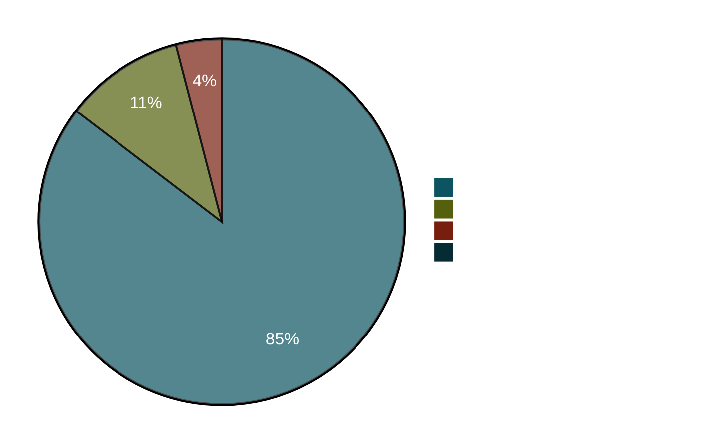

# OFCS 適合状況

`go-oidc-provider` は [OpenID Foundation Conformance Suite (OFCS)][ofcs] に対して回帰検査されています。ハーネスはソースリポジトリの [`conformance/`][harness] に置かれており、`cmd/op-demo` インスタンスに対して 4 つの plan を end-to-end で実行します。

[ofcs]: https://gitlab.com/openid/conformance-suite
[harness]: https://github.com/libraz/go-oidc-provider/tree/main/conformance

::: warning 個人開発、認証取得は無し
これは個人開発者が維持するプロジェクトです。OpenID Foundation 会員費は支払っておらず、**形式的な OIDC 認証は取得していません**。本ページの数値は再現可能なスナップショット — `make conformance-baseline` で見たままが記録されます。これは有償の OpenID Foundation 認証の代替ではなく、そのように引用しないでください。
:::

## 何が検査されるか

| Plan | カバー範囲 | プロファイル |
|---|---|---|
| `oidcc-basic-certification-test-plan` | 認可コード + PKCE、ID トークン、UserInfo、refresh、discovery | OIDC Core 1.0 |
| `fapi2-security-profile-id2-test-plan` | + PAR、送信者制約付きアクセストークン (DPoP)、厳格 alg list、`redirect_uri` 完全一致 | FAPI 2.0 Baseline |
| `fapi2-message-signing-id1-test-plan` | + JAR（署名 authorization request）、JARM（署名 authorization response） | FAPI 2.0 Message Signing |
| `fapi-ciba-id1-test-plan` | Client-Initiated Backchannel Authentication（poll mode）、mTLS バインドトークン | FAPI-CIBA |

## 最新 baseline

スナップショット ID: `2026-05-06T17-25-15Z-rc21-pkjwt-jti-fix`<br/>
リポジトリ SHA: [`9f34e2f`](https://github.com/libraz/go-oidc-provider/commit/9f34e2fb92fb7ebc3f04d3e6e543c34f3e9a5f93)<br/>
OFCS イメージ: `release-v5.1.42`

| Plan                                       | PASSED | REVIEW | SKIPPED | WARNING | FAILED | 合計 |
|--------------------------------------------|-------:|-------:|--------:|--------:|-------:|------:|
| `oidcc-basic-certification-test-plan`      |     30 |      3 |       2 |       0 |  **0** |    35 |
| `fapi2-security-profile-id2-test-plan`     |     48 |      9 |       1 |       0 |  **0** |    58 |
| `fapi2-message-signing-id1-test-plan`      |     60 |      9 |       2 |       0 |  **0** |    71 |
| `fapi-ciba-id1-test-plan`                  |     31 |      0 |       3 |       1 |  **0** |    35 |
| **合計**                                  | **169**| **21** |   **8** |   **1** |  **0** | **199** |



## 各テストプランが検証する範囲

OFCS の各テストプランは、それぞれ特定の仕様プロファイルを検証します。以下の表は、プランごとに「該当コードパスを有効化するライブラリオプション」と「その挙動を解説しているページ」を対応づけたものです。組み込み側は、自分の deployment が同じ構成を露出しているかをこの表で確認できます。

### `oidcc-basic-certification-test-plan` — OIDC Core 1.0

| 検証範囲 | 有効化に必要なオプション | 解説ページ |
|---|---|---|
| 認可コードフロー + PKCE | 既定で有効 | [/ja/concepts/authorization-code-pkce](/ja/concepts/authorization-code-pkce) |
| ID トークンの発行と claim | 既定で有効 | [/ja/concepts/tokens](/ja/concepts/tokens) |
| UserInfo エンドポイント | 既定で有効 | [/ja/concepts/tokens](/ja/concepts/tokens) |
| Discovery (`/.well-known/openid-configuration`) | 既定で有効 | [/ja/concepts/discovery](/ja/concepts/discovery) |
| JWKS の公開 | 既定で有効 | [/ja/operations/jwks](/ja/operations/jwks) |
| リフレッシュトークン + ローテーション | 既定で有効、長期 refresh は `offline_access` スコープが必要 | [/ja/concepts/refresh-tokens](/ja/concepts/refresh-tokens) |
| 標準スコープ (`profile`、`email`、`address`、`phone`) | スコープごとに `op.WithScope(...)` を 1 回ずつ | [/ja/concepts/scopes-and-claims](/ja/concepts/scopes-and-claims) |
| public / pairwise サブジェクト | pairwise は `op.WithPairwiseSubject(salt)`、適用判定はクライアントの `SubjectType` | [/ja/use-cases/pairwise-subject](/ja/use-cases/pairwise-subject) |

### `fapi2-security-profile-id2-test-plan` — FAPI 2.0 Baseline

| 検証範囲 | 有効化に必要なオプション | 解説ページ |
|---|---|---|
| PAR (RFC 9126) | `op.WithProfile(profile.FAPI2Baseline)` がプロファイルとして `feature.PAR` を有効化 | [/ja/concepts/fapi](/ja/concepts/fapi)、[/ja/use-cases/fapi2-baseline](/ja/use-cases/fapi2-baseline) |
| JAR (RFC 9101) | プロファイルが `feature.JAR` を有効化 | [/ja/concepts/fapi](/ja/concepts/fapi) |
| `S256` PKCE の強制 | プロファイルが強制 | [/ja/concepts/authorization-code-pkce](/ja/concepts/authorization-code-pkce) |
| 認可レスポンスの `iss` (RFC 9207) | プロファイルが強制 | [/ja/concepts/issuer](/ja/concepts/issuer) |
| ID トークン署名アルゴリズム `ES256` / `PS256` | プロファイルが強制 | [/ja/concepts/jose-basics](/ja/concepts/jose-basics) |
| `RS256`(FAPI 文脈)・`HS*`・`none` の拒否 | `internal/jose/alg.go` の closed enum で禁止 | [/ja/security/design-judgments](/ja/security/design-judgments) |
| `private_key_jwt` または `tls_client_auth` | プロファイルが強制（FAPI allow-list と交差） | [/ja/concepts/client-types](/ja/concepts/client-types) |
| DPoP または mTLS による送信者制約 | `op.WithFeature(feature.DPoP)` か `op.WithFeature(feature.MTLS)` のいずれか（FAPI 2.0 では少なくとも一方が必須） | [/ja/concepts/sender-constraint](/ja/concepts/sender-constraint)、[/ja/concepts/dpop](/ja/concepts/dpop)、[/ja/concepts/mtls](/ja/concepts/mtls) |
| `redirect_uri` 完全一致 | プロファイルが強制 | [/ja/concepts/redirect-uri](/ja/concepts/redirect-uri) |
| リフレッシュトークンのローテーションと再利用検知 | 既定で有効 | [/ja/concepts/refresh-tokens](/ja/concepts/refresh-tokens) |

### `fapi2-message-signing-id1-test-plan` — FAPI 2.0 Message Signing

Message Signing は Baseline に署名認可レスポンスを上乗せします。Baseline プランが検証する内容はこのプランでも全て実行され、プロファイル定数を切り替えるだけで JARM が自動有効化されます。

| 検証範囲 | 有効化に必要なオプション | 解説ページ |
|---|---|---|
| FAPI 2.0 Baseline の全項目（上記） | `op.WithProfile(profile.FAPI2MessageSigning)` | （上記と同じ） |
| 署名された認可レスポンス（JARM） | プロファイルが `feature.JARM` を有効化 | [/ja/concepts/fapi](/ja/concepts/fapi)（JARM セクション） |
| token レスポンスの ID トークン署名 | プロファイルが強制 | [/ja/concepts/tokens](/ja/concepts/tokens) |
| request object 署名 (`PS256` / `ES256`) | プロファイルが強制 | [/ja/concepts/fapi](/ja/concepts/fapi) |

### `fapi-ciba-id1-test-plan` — FAPI-CIBA（Client-Initiated Backchannel Authentication）

CIBA プランは OpenID Connect Client-Initiated Backchannel Authentication grant を検証します。クライアントから開始された認証要求が、ユーザの認証デバイス（プッシュ通知、IVR 等）で非同期に完了し、ポーリング型の token 要求で消費される — という流れです。OP は poll mode で動作し、FAPI-CIBA は FAPI 1.0 のハードコード要件を引き継ぎ `tls_client_certificate_bound_access_tokens` を必須にするため、mTLS 送信者制約が必須です。

| 検証範囲 | 有効化に必要なオプション | 解説ページ |
|---|---|---|
| `/bc-authorize` エンドポイント + `auth_req_id` | `op.WithCIBA(op.WithCIBAHintResolver(...))` | [/ja/use-cases/ciba](/ja/use-cases/ciba) |
| ヒント解決（`login_hint` / `id_token_hint` / `login_hint_token`） | 組み込み側が `HintResolver` を提供 | [/ja/use-cases/ciba](/ja/use-cases/ciba) |
| ポーリング規律（`authorization_pending` / `slow_down`） | 既定で有効、`op.WithCIBAPollInterval(...)` で advertised interval を上書き可 | [/ja/use-cases/ciba](/ja/use-cases/ciba) |
| ポーリング濫用ロックアウトの上限 | 既定 `5` strikes、`op.WithCIBAMaxPollViolations(n)` で上下に調整可 | [/ja/use-cases/ciba](/ja/use-cases/ciba) |
| `tls_client_certificate_bound_access_tokens`（FAPI-CIBA 必須） | `op.WithProfile(profile.FAPICIBA)` が `feature.MTLS` を有効化 | [/ja/concepts/mtls](/ja/concepts/mtls) |
| `/bc-authorize` への署名 `request` object | `op.WithFeature(feature.JAR)`（FAPI-CIBA で自動） | [/ja/concepts/fapi](/ja/concepts/fapi) |
| `request_object` の `iat` / `exp` クレーム必須化（FAPI-CIBA §5.2.2） | プロファイルが強制 | [/ja/concepts/fapi](/ja/concepts/fapi) |

### REVIEW / SKIPPED / WARNING / FAILED の意味

- **REVIEW** — テストは実行されたが、ハーネスでは正直に検証できない視覚的 / out-of-band の挙動（同意 UI の文言、エラー画面のスクリーンショット、証明書チェーンの確認）を人間のレビュアーが裏取りする必要がある状態。失敗ではない。
- **SKIPPED** — テストが依存する機能を、この OP が discovery やクライアントメタデータで宣言していないために OFCS が実行を見送った状態。例えば `RS256` 負例テストは、FAPI クライアントが `PS256` を署名 alg として宣言しているため適用外になる。失敗ではない。
- **WARNING** — 主たる assertion は終端 PASS まで到達したが、運用者が対処すべき advisory がログに残った状態。現在 1 件（`fapi-ciba-id1-refresh-token`）— 後述の節を参照。
- **FAILED** — 仕様から挙動が逸脱した状態。現スナップショットでは 4 plan 全体で **0 failure**。

### 自分で conformance を回すには

1. 該当プロファイルを組み込んだ OP を立ち上げます — security プロファイルなら `op.WithProfile(profile.FAPI2Baseline)`、message signing なら `op.WithProfile(profile.FAPI2MessageSigning)`、OIDC Core プランなら `WithProfile` 無し。
2. プランを OFCS deployment に登録します。conformance suite は OpenID Foundation が運用しています。ソースリポジトリの `conformance/` 配下にプランテンプレートとローカル起動用の固定 Docker イメージが入っています。
3. プランを drive します。ハーネスは `/authorize`、`/par`、`/token`、`/userinfo`、`/jwks` ほか discovery で公開された各エンドポイントを必須経路で全て叩き、JSON スナップショットを書き出します。記録済 baseline との差分が取れます。

詳細な runbook（`make` ターゲット、JSON スナップショットの構造、差分ゲート）は下の[自分でベースラインを再現する](#自分でベースラインを再現する)を参照してください。

## REVIEW と FAILED の違い

OFCS には 4 つの終端状態があります: `PASSED`、`FAILED`、`REVIEW`、`SKIPPED`。**REVIEW はテスト失敗を意味しません。** 自動化では確認できない箇所を人間の運用者に確認してほしい、という意味です — 例「OP はここでログイン画面を表示したか？」。テストは実行され、スクリーンショットを撮り、誰かが OFCS UI で「review 済み」をクリックするまで `WAITING` に留まります。本ハーネスはそこに到達してエラーが出なければ `REVIEW` を記録します。

::: details なぜ REVIEW を auto-pass しないか
conformance suite は意図的にこれらの module を人間の判断にゲートしています。ヘッドレスで動く `cmd/op-demo` は「これがユーザに見えた画面です」というスクリーンショットを誠実にアップロードできません。ゲートを外して通してしまうのは、実際にチェックされた内容を偽ることになります。ハーネスは `REVIEW` のまま記録し、有償認証取得時は UI を見ながら通すことを前提にしています。
:::

## 現在 REVIEW の module

### `oidcc-basic` plan (3)

| Module | ゲート対象 |
|---|---|
| `oidcc-ensure-registered-redirect-uri` | OP が未登録 `redirect_uri` を拒否したことの手動確認 |
| `oidcc-max-age-1` | `max_age=1` でユーザを再プロンプトしたことの手動確認 |
| `oidcc-prompt-login` | `prompt=login` で再プロンプトしたことの手動確認 |

### FAPI 2.0 plans (各 9、同集合)

これらは全て、OP のエラーページのスクリーンショット upload か「ユーザが実際に再プロンプトされたか」の手動判断にゲートされます。ヘッドレスでも問題なく実行できますが、人間のサインオフが入るまでは `REVIEW` に留まります（`fapi2-security-profile-id2` と `fapi2-message-signing-id1` の両プランで同じ 9 件が REVIEW になり、合計 18 件です）:

- `fapi2-…-ensure-different-nonce-inside-and-outside-request-object`
- `fapi2-…-ensure-different-state-inside-and-outside-request-object`
- `fapi2-…-ensure-request-object-with-long-nonce`
- `fapi2-…-ensure-request-object-with-long-state`
- `fapi2-…-ensure-unsigned-authorization-request-without-using-par-fails`
- `fapi2-…-par-attempt-reuse-request_uri`
- `fapi2-…-par-attempt-to-use-expired-request_uri`
- `fapi2-…-par-attempt-to-use-request_uri-for-different-client`
- `fapi2-…-state-only-outside-request-object-not-used`

OP は各ケースで正しい HTTP エラーを返します（負例テストの内部 assertion は通過）— OFCS が描画されたエラー UI を人間に inspect してもらいたいだけです。

## 現在 WARNING の module

### `fapi-ciba-id1-test-plan` (1)

| Module | warning の内容 |
|---|---|
| `fapi-ciba-id1-refresh-token` | OP は CIBA フローでリフレッシュトークンを発行したが、discovery 文書の `grant_types_supported` には `refresh_token` が列挙されていない。リフレッシュ自体は機能している（テストは主 assertion で終端 PASS）— advisory は doc / discovery メタデータの一貫性に関する観察。 |

## 現在 FAILED の module — 理由

現スナップショットでは FAILED の module はありません。直前のスナップショット（rc20、SHA `592ab48`）では `fapi2-message-signing-id1` の `fapi2-security-profile-id2-refresh-token` が 1 件 FAIL していました — OFCS は `use_dpop_nonce` 400 の後に同じ `client_assertion` でリトライしますが、旧来の検証順序では DPoP nonce ゲートより前に assertion の `jti` を消費していたため、リトライが `invalid_client` / `ErrAssertionReplayed` として表面化していました。修正は SHA [`9f34e2f`](https://github.com/libraz/go-oidc-provider/commit/9f34e2fb92fb7ebc3f04d3e6e543c34f3e9a5f93) で着地: 全 grant 経路で DPoP proof（と nonce）の検証をクライアント認証より先に実行し、`jti` は要求が nonce challenge を抜けて先に進んだときに限って記録するようにしました。RFC 9449 §8 が「クライアントは要求ボディをそのまま再送する」シナリオを前提にしているため、こちらが正しい読みです。

## 現在 SKIPPED の module — 理由

| Module | 理由 |
|---|---|
| `fapi2-…-ensure-signed-client-assertion-with-RS256-fails`（×2） | プランで使う FAPI クライアントが `token_endpoint_auth_signing_alg=PS256` を登録しているため、OFCS はクライアント別 `RS256` 負例を fapi2 系両プランでスキップ。 |
| `fapi2-message-signing-…-ensure-signed-request-object-with-RS256-fails` | 同様 — FAPI クライアントの `request_object_signing_alg=PS256` が `RS256` 負例を該当外にする。 |
| `fapi-ciba-id1-ensure-request-object-signature-algorithm-is-RS256-fails` | FAPI-CIBA クライアントが `request_object_signing_alg=PS256` を登録しているためスキップ。 |
| `fapi-ciba-id1-ensure-client-assertion-signature-algorithm-in-backchannel-authorization-request-is-RS256-fails` | 同様 — CIBA クライアントの `token_endpoint_auth_signing_alg=PS256`。 |
| `fapi-ciba-id1-ensure-client-assertion-signature-algorithm-in-token-endpoint-request-is-RS256-fails` | 同様。 |
| `oidcc-ensure-request-object-with-redirect-uri` | `oidcc-basic` プランは JAR を有効化しないため、OP は discovery から `request_object_signing_alg_values_supported` を省略し OFCS はスキップ。 |
| `oidcc-unsigned-request-object-supported-correctly-or-rejected-as-unsupported` | 同様 — JAR off、`request` パラメータ無し、OFCS スキップ。 |

::: tip "SKIPPED" は意図的、「走らなかった」ではない
OFCS のスキップ判定は、discovery とクライアント別メタデータが宣伝する内容に基づきます。プラン内の FAPI クライアントは `PS256` をトークンエンドポイント認証 / request object 署名 alg として宣言しているため、OFCS の「`RS256` は失敗すべき」プローブは適用外と判定され、「実際に実行して pass を記録する」のではなく skipped になります。
:::

## 自分でベースラインを再現する

```sh
git clone https://github.com/libraz/go-oidc-provider.git
cd go-oidc-provider
make conformance-up
make conformance-baseline LABEL=local-check
ls conformance/baselines/   # JSON スナップショットがここに着地
```

ハーネスは:

1. 自己署名 RSA-2048 証明書を生成（`scripts/conformance.sh certs`）。
2. `https://localhost:8443` で OFCS Docker スタックを立ち上げ。
3. `https://127.0.0.1:9443` で `cmd/op-demo` をビルド・起動。
4. OFCS REST API 経由で 4 plan を seed。
5. module 毎の pass/fail を決定論的 JSON に記録。

`make conformance-baseline-diff` は 2 スナップショット間で `PASSED` を **失った** module があれば非ゼロ終了 — セキュリティ関連変更に対するプロジェクトのプリマージゲートです。

## このコードベースでの FAPI 2.0 の意味

`op.WithProfile(profile.FAPI2Baseline)` は 2 つの `fapi2-*` plan が想定する設定を有効化します:

- `feature.PAR`（`FAPI2Baseline` で自動有効化） — `/par` がルート可能、`/authorize` で `request_uri` を受理
- `feature.JAR`（`FAPI2Baseline` で自動有効化） — `request` / `request_uri` を署名 JWT として検証
- `feature.JARM`（`FAPI2MessageSigning` で追加で自動有効化） — 認可レスポンスを JWT として署名
- 送信者制約付きアクセストークン — 組み込み側が `WithFeature` で `feature.DPoP`（`cnf.jkt`）か `feature.MTLS`（`cnf.x5t#S256`）の **少なくとも 1 つ** を明示的に有効化する必要がある。どちらも有効化されていなければ `op.New` が構成を拒否。DPoP が有効なら discovery は `dpop_signing_alg_values_supported: ES256, EdDSA, PS256` を宣伝
- JOSE alg allow-list はコードベース全体で `RS256 / PS256 / ES256 / EdDSA` にロック、`HS*` と `none` は **構造的** に到達不能（`internal/jose/alg.go` 参照）
- `token_endpoint_auth_methods_supported` を FAPI allow-list（`private_key_jwt`、`tls_client_auth`、`self_signed_tls_client_auth`）と交差
- `redirect_uri` 完全一致を強制
- クライアント別 `RequestObjectSigningAlg` / `TokenEndpointAuthSigningAlg` で各 FAPI クライアントを `PS256`（または `ES256` / `EdDSA`）に絞り込みつつ、discovery doc にはコードベース全体のリストを掲載

`WithProfile` 後にプロファイルと衝突するオプションを設定すると、`op.New(...)` は本番に partial-FAPI を出さず構築時エラーを返します。

## ハーネスの構成ファイル

| Path | 内容 |
|---|---|
| `conformance/README.md` | 運用 runbook |
| `conformance/plans/*.json` | プランテンプレート（server / client / resource ブロック） |
| `conformance/docker-compose.yml` | OFCS イメージのタグ固定(`release-v5.1.42`)+ JKS truststore 実装 |
| `scripts/conformance.sh` | `certs` / `ofcs-up` / `op-up` / `seed-plans` / `drive` / `batch` |
| `tools/conformance/ofcs.py` | REST クライアント + ヘッドレス drive スクリプト |
| `conformance/baselines/*.json` | 取得済スナップショット（gitignored — 環境依存） |

## 明示しておく制限事項

- **プランスイートのバージョン。** OFCS は `release-v5.1.42` で固定しています。新しい OFCS リリースで追加・改名されたテストは、固定バージョンを引き上げるまで対象外です。
- **ヘッドレス実行。** 実行スクリプトは OFCS の REST API をリバースエンジニアリングしているもので、OFCS 側にドキュメントはありません。挙動確認は v5.1.42 でしか取れていません。
- **本物の RP 証明書なし。** mTLS プラン枠は `conformance/certs/` の生成済み自己署名証明書を使っており、プランをインスタンス化できる程度に整えてあるだけです。本物の CA チェーン検証はしていません。
- **OP インスタンス 1 個。** インスタンス間挙動（例: ストア共有の OP 2 個でのトークン introspection）は OFCS ではなく `test/scenarios` で検査します。

conformance ハーネスは `test/scenarios/` 配下の in-process Spec Scenario Suite と並走します。前者はライブ OP に対して HTTP 経由で end-to-end に実行し、後者は同じプロトコル不変条件を in-process で実行します — 両方が緑であることをセキュリティ関連変更の前提にしています。
