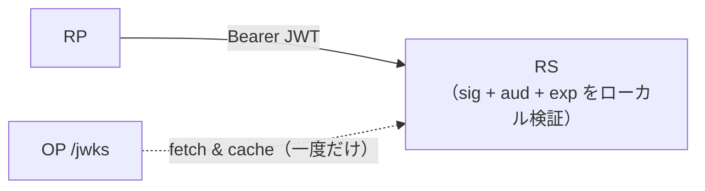
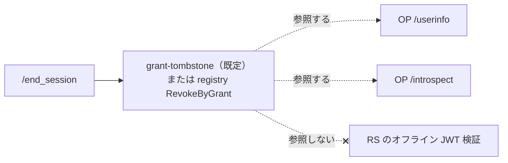
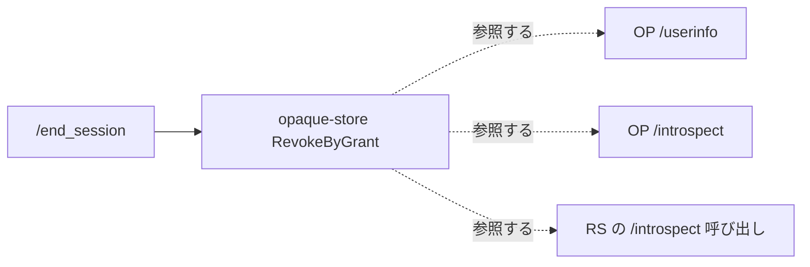
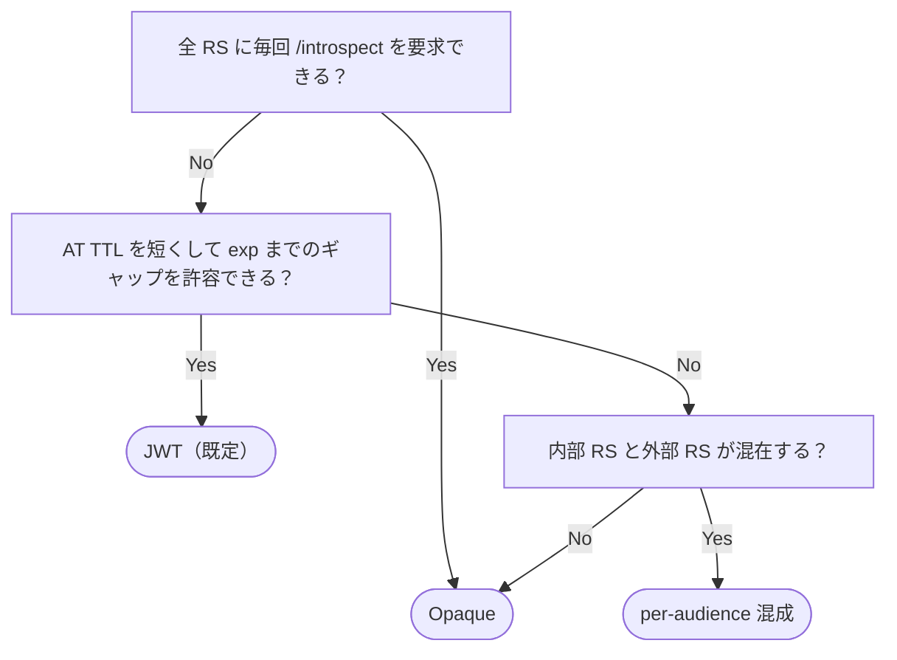

# Access token の形式 — JWT と opaque

`go-oidc-provider` は **JWT（RFC 9068）形式の access token を既定で発行** し、**opaque 形式はオプトイン** で選べます。通信路上はどちらも `Authorization: Bearer …` という同じ形で運ばれますが、違うのは **誰がトークンを検証するか**、そして **revocation がどこまで届くか** です。

これはライブラリ側で決められない設計判断で、組み込み側であるあなたが選ぶことになります。RS（リソースサーバ）が OP に対してどの位置にいるか、即時失効をどこまで要求するか、負荷をどう分散したいかで答えが変わります。

::: tip 結論を先に
- **既定は JWT（RFC 9068）。** RS は JWKS でオフライン検証します。`/end_session` のカスケードは OP のエンドポイント（`/userinfo` / `/introspect`）までしか届かず、オフライン検証している RS では `exp` までトークンが通り続けます。
- **Opaque はオプトイン** (`op.WithAccessTokenFormat`)。全 RS リクエストが `/introspect` を経由するためカスケードはあらゆる RS に届きますが、OP がリクエストのホットパスに乗ります。
- **判断の核**: 「ログアウトされた」がユーザの通信不可までを意味するのか、それとも OP のエンドポイントでの拒否で十分なのか。ユーザ側帯域と OP の処理容量の配分は副次的な検討事項です。RFC 8707 の resource indicator ごとに混在させることも可能です（`op.WithAccessTokenFormatPerAudience`）。
:::

::: details このページで触れる仕様
- [RFC 6749](https://datatracker.ietf.org/doc/html/rfc6749) — OAuth 2.0 Authorization Framework
- [RFC 6750](https://datatracker.ietf.org/doc/html/rfc6750) — Bearer Token Usage
- [RFC 7009](https://datatracker.ietf.org/doc/html/rfc7009) — Token Revocation
- [RFC 7517](https://datatracker.ietf.org/doc/html/rfc7517) — JSON Web Key (JWK)
- [RFC 7519](https://datatracker.ietf.org/doc/html/rfc7519) — JSON Web Token (JWT)
- [RFC 7662](https://datatracker.ietf.org/doc/html/rfc7662) — Token Introspection
- [RFC 8705](https://datatracker.ietf.org/doc/html/rfc8705) — Mutual-TLS Client Authentication and Certificate-Bound Access Tokens
- [RFC 8707](https://datatracker.ietf.org/doc/html/rfc8707) — Resource Indicators for OAuth 2.0
- [RFC 9068](https://datatracker.ietf.org/doc/html/rfc9068) — JWT Profile for OAuth 2.0 Access Tokens
- [RFC 9449](https://datatracker.ietf.org/doc/html/rfc9449) — DPoP
- [OpenID Connect RP-Initiated Logout 1.0](https://openid.net/specs/openid-connect-rpinitiated-1_0.html)
:::

## 同じ通信路上の枠に 2 つの形式

通信路上の見た目は同一です。RS は `Authorization: Bearer <token>` を読み、リクエストを通すか判断します。違いは **RS がその判断にどう辿り着くか** です。

### JWT（RFC 9068） — RS がローカルで検証



RS は JWKS をキャッシュし、JWT 署名をオフライン検証して `aud` / `exp` をチェックし、リクエストに応えます。OP は **リクエストのホットパスに乗りません**。JWT 自体が claim（`sub`、`scope`、`aud`、`auth_time`、`acr`、`cnf` …）を運ぶので、RS に必要な情報は全て揃っています。

### Opaque — RS は毎回 OP に問い合わせる


opaque token は `crypto/rand` から取った 32 バイトを base64url で 43 文字にしたランダム識別子です。claim を一切運びません。RS は毎リクエストごとに OP の `/introspect`（RFC 7662）でトークンを解決します（あるいは結果を意図的に短い時間幅だけキャッシュします）。OP は **リクエストのホットパスに乗ります**。

::: details `jti` — それは何か
`jti` は JWT 標準 claim（RFC 7519 §4.1.7）の "JWT ID" です。トークンごとに付ける一意の識別子で、特定のトークンを参照・失効・重複排除するときに使います。JWT access token には `jti` が含まれ、OP は旧来の JTI registry 戦略でこれをキーにし、deny-list テーブルでも重複排除キーとして使います。opaque トークンには `jti` がありません — bearer 文字列自体がすでに一意の識別子になるからです。
:::

::: details `gid` — それは何か
ライブラリ独自の JWT private claim で、**GrantID**（トークンが発行された認可 grant の OP 側識別子）を運びます。1 つの grant は典型的には「このユーザがこのクライアントに、この時刻に、このスコープで同意してログインした」に対応します。OP は `gid` があるおかげで、`jti` を 1 件ずつ追わなくても、grant 配下の access token を **tombstone 1 件の書き込みで一斉に失効** させられます。リソースサーバはこの claim を無視しなければなりません — OP 内部の関心事です。

- **いつ気にすべきか:** introspection 連動の RS コードを書くときや JWT のバイト列を監査するときだけです。標準的な RFC 9068 検証器は `gid` を見ません。
- **混同しがち:** `sid`（OIDC Core の session ID）。`sid` は **ユーザセッション** を、`gid` は **grant** を指します（1 セッションが複数 grant を持ちえます）。
:::

::: tip 通信路上の見た目だけでは RS は形式を判別できない
両形式とも `Authorization: Bearer <opaque-string>` として届きます。RFC 6750 は形式を区別しません。RS は audience やデプロイ側の取り決めで「この audience は opaque」「この audience は JWT」を知っている前提です — JWKS をどれと信じるかと同じ仕組みです。本ライブラリの discovery document は形式を **広告しません**。
:::

## トレードオフ

| 観点 | JWT（既定） | Opaque |
|---|---|---|
| 検証場所 | RS。JWKS でオフライン | OP。`/introspect` 経由 |
| OP 負荷 | 既定戦略では発行時に書き込み **0 件**、失効した grant ごとに 1 行のみ。オプトインの JTI registry では発行ごとに 1 行。詳細は下記の [JWT 失効戦略](#jwt-access-token-失効戦略) を参照。 | 発行ごとに 1 行 + RS リクエストごとに introspect 往復 |
| ヘッダサイズ | 大きい — header / claims / signature | 小さい — base64url 43 文字 |
| RS レイテンシ下限 | ローカル暗号処理のみ | OP との往復（またはキャッシュ TTL）が乗る |
| キャッシュ面 | RS が JWKS をキャッシュ（更新は稀） | RS が introspect 応答をトークンごとにキャッシュ |
| ログアウト後の到達範囲 | OP のエンドポイント（userinfo / introspect）にだけ届く | 全 RS リクエストに届く |
| Refresh ローテーション時の旧 access token | `exp` まで生き残る | ローテーションと同時に失効 |
| トークン byte 列からの情報漏洩 | `sub`、`scope`、`aud`、`cnf`、`acr`、`gid` が露出 | 何も漏れない |
| RS 側のデバッグ性 | JWT をデコードすれば claim を直読できる | `/introspect` を呼び出す必要がある |
| 送信者制約（DPoP / mTLS） | JWT の `cnf` claim | OP 側のレコードから `cnf` を再構成 |

この 2 つの列は「安全 vs 不安全」を並べたものではありません。どちらも誠実な設計であって、運用上の前提が違うだけです。次の 2 節では、実装者が見落としがちな「負荷」と「失効」の側面を掘り下げます。

## 負荷はどこに乗るか

JWT は検証を RS 群に分散させます。各 RS は JWKS キャッシュを抱え（更新は日単位、リクエスト単位ではありません）、署名検証をローカルで処理し、通常呼び出しでは OP に問い合わせません。RS を 10 台に増やしても OP には何も増えません。

opaque は検証を OP に集中させます。RS の呼び出しは（運用者が許した RS 側キャッシュを除けば）必ず `/introspect` 呼び出しに変換されます。RS が 10 台になれば introspect トラフィックも 10 倍になります。OP はコントロールプレーンだけでなく **データプレーンの単一容量点** になります。

「JWT はステートレス、opaque はステートフル」という古典的な説明は半分正解です。本ライブラリでは **どちらの形式でも OP 側に 1 行ずつ記録します**（後述）— 違うのは **RS が毎リクエスト OP に問い合わせる必要があるか** です。

::: info ユーザ側帯域とサーバ間 RTT は別軸
「OP 負荷集中 vs RS 分散」とは別に **「ユーザ側回線が運ぶ byte 数」 vs 「サーバ間 RTT」** の軸があります。両者を混ぜて評価しないでください。

- **JWT 経路。** RP → RS の毎リクエストに数百 byte 〜 1 KB 級の JWT が乗ります。これは **ユーザ側回線の帯域** を消費する側 — モバイル / 従量課金 / 衛星リンクのような IoT デプロイで効いてきます。サーバ間は静か（RS は OP を呼びません）。
- **Opaque 経路。** RP → RS の Bearer は base64url で 43 byte、**ユーザ側帯域には優しい**。代わりに各 RS が OP に `/introspect` を呼び出す分の **サーバ間トラフィック** が増えます — 多くは内部 trust zone 内の往復で、ユーザ体感帯域には乗りません。

つまり「OP の容量計画」と「ユーザ体感の通信量」は同じ問題ではありません。モバイルクライアントが多い API では opaque のほうがユーザ体感が軽くなる一方、OP は強くする必要がある、と分けて評価する価値があります。
:::

::: info OP 側のストレージコストは **対称ではありません**
既定の JWT 戦略（grant tombstone）は **発行時にデータベースへ書き込みを行わず**、失効した grant ごとに 1 行だけ書き込みます — 定常状態の行数は `O(失効した grant 数)` です。オプトインの JTI registry 戦略は発行ごとに 1 行（`jti` をキーにした shadow 行）を保持します。opaque 形式は常に発行ごとに 1 行（ハッシュ化した bearer ID をキーにした行）を保持します。

「JWT も opaque もトークン 1 本ごとに 1 行」という説明は旧 JTI registry 既定の前提でした — 現在の既定では、JWT の発行経路は純粋な計算処理だけで完結します。詳細は下記の [JWT 失効戦略](#jwt-access-token-失効戦略) を参照。RS 側の差（JWT は RS にとってステートレス、opaque はそうではない）は変わりません。
:::

## 失効はどこに届くか — そして `/end_session` のギャップ

ここはトレードオフのうち最も見落とされがちな側面です。

`/end_session`（および `/revoke`、code 再利用検出のカスケード）は subject の grant に紐付くすべての access token に対し、OP 側のレコードを revoked 状態へ切り替えます。両形式ともこの切り替えは記録されますが、問題は **どの経路がそれに気付くか** です。

**JWT 形式:**



**Opaque 形式:**



- **JWT 経路。** トークンが OP のエンドポイント（`/userinfo`、`/introspect`、`/revoke`）に到達したときに registry を参照します。そこに来た revoked JWT は即座に拒否されます。**JWKS でオフライン JWT 検証している RS は registry を参照しません** — それが自己完結トークンの存在意義だからです。その RS では revoked JWT が `exp` まで通り続けます。
- **Opaque 経路。** トークンを使うすべての経路が `/introspect` を通るので、カスケードは定義上どの RS にも届きます。

::: info opaque は introspection 側で「inactive 形を統一」+ 同一クライアント限定ゲート
opaque AT を `/introspect` に問い合わせるとき、(a) 別クライアントが問い合わせた / (b) 該当行が無い / (c) 失効済み / (d) 期限切れ / (e) DPoP・mTLS proof 不一致 はすべて同じ `{"active": false}` に集約されます（RFC 7662 §2.2 準拠）。introspection を経由した列挙や状態推測が構造的に閉じられるので、同等の性質を JWT 形式で得るには RS 側に追加実装が必要です。
:::

::: danger 「ログアウトされた」の要件に合う形式を選んでください
- 「ログアウトしたら、その access token の寿命中、OP の管理外の RS でさえ呼び出せなくなる」 → opaque、または **全 RS に introspect を必須化した JWT**。
- 「ログアウトしたら OP のエンドポイント（`/userinfo`、`/introspect`）でトークンが拒否され、RS は次の refresh ローテーションで状態を取り込み直す」 → JWT で十分です。

「RS 側ステートレス検証」と「RS にも届く即時ログアウトカスケード」の両立は構造的に不可能です。どちらかを選ぶ必要があります。
:::

Refresh token のローテーションも関連する調整ポイントです。本ライブラリはどのローテーションでも新しい access token を発行しますが、JWT 形式では **旧 access token は `exp` まで生き残ります**（カスケードのギャップは access token TTL の範囲で閉じる設計）。

一方 opaque 形式は、ローテーションのたびに opaque サブストアに対して `RevokeByGrant` を呼び、旧 access token も同時に失効させます — **漏洩した refresh token で旧 access token を再利用される窓は、事実上 clock skew まで縮みます**。

もうひとつのカスケードのきっかけは **RFC 6749 §4.1.2 の認可コード再利用検出** です。盗まれた code が二度目に提示された瞬間、その grant 配下の access token がすべて失効します。

JWT 形式では grant tombstone を書き込み（オプトインの JTI registry 戦略下では registry 行を反転）、opaque 形式では opaque サブストアの行が revoked に切り替わり、上の経路図と同じ可視範囲で伝播します。`/end_session` だけがカスケードの起点ではない、ということです。

::: details カスケード失効とは
ここで言う「カスケード」は「1 回の失効イベントが、同じ grant から派生したすべての成果物に届く」という意味です。`/end_session` が 1 回鳴れば、OP は grant を revoked 状態にし、その瞬間からその grant 配下の access token / refresh token / shadow 行はすべて、OP に問い合わせるどの経路でも無効として扱われます。対比となる「リーフ失効」は「この特定のトークンだけ失効させ、同じ grant 配下のほかは有効に保つ」というやり方で、RFC 7009 の `/revocation` を 1 件の `jti` に対して使ったときの挙動がこれにあたります。
:::

## JWT access-token 失効戦略

JWT 経路にはもうひとつの調整ポイントがあります — **OP が失効状態をどう永続化するか** です。opaque トークンは検証側がレコード参照を必要とするため、ストレージは本質的にトークンごとです。したがってこの戦略は JWT のみに適用されます。

::: details tombstone / shadow 行 / JTI registry とは
失効戦略を語るときに出てくる、ストレージ層の語彙です。

- **tombstone** — 「このキーで識別される対象は失効済み」を記録する 1 行。トークン本体は保存せず、grant ID と「失効した」事実だけを持ちます。検証はキー検索で tombstone テーブルを引きます。
- **shadow 行** — 発行された各トークンを「影のように」追いかける行で、`jti` ごとに 1 行、`revoked_at` や監査用フィールドを持ちます。tombstone より重く（失効時ではなく発行時に書き込む）、その分すべてのトークンの完全な監査ログが残ります。
- **JTI registry** — その shadow 行を保持するテーブルで、`jti` をキーにします。既定戦略では使いません — オプトインの `RevocationStrategyJTIRegistry` で使われます。
- **いつ気にすべきか:** データベースのサイジングを行うときです。tombstone は `O(失効した grant 数)`、shadow 行は `O(発行レート × TTL)` で増えます。高負荷の OP では、千行単位と百万行単位の差になります。
:::

`go-oidc-provider` は 3 つの戦略を同梱しており、`op.WithAccessTokenRevocationStrategy` で選択します。既定は `RevocationStrategyGrantTombstone` です。旧来の `jti` ごとの方式は `RevocationStrategyJTIRegistry` として残してあり、必要な組み込み側は明示的に切り替えられます。

| 戦略 | 発行時の書き込み | 失効時の書き込み | 定常状態の行数 | 備考 |
|---|---|---|---|---|
| **`RevocationStrategyGrantTombstone`**（既定） | **0 件** | 1（tombstone 行） | `O(失効した grant 数 + 失効した jti 数)` | OP は各 JWT に `gid` という private claim（GrantID）を含め、検証時に grant ごとの tombstone テーブルを参照します。FAPI 2.0 SP §5.3.2.2 適合。 |
| `RevocationStrategyJTIRegistry` | 1（shadow 行） | N（grant 配下の AT ごとに 1 件 UPDATE） | `O(発行レート × AT_TTL)` | 発行された AT 1 本ごとに `store.AccessTokenRegistry` の shadow 行が 1 件作られます。AT 単位の監査ログが規制要件のときに固定推奨。FAPI 2.0 SP §5.3.2.2 適合。 |
| `RevocationStrategyNone` | 0 | 0 | 0 | `/revocation` は RFC 7009 §2.2 のとおり 200 を冪等に返しますが、実体としては no-op。JWT AT は `exp` まで有効なままです。**FAPI プロファイル下では `op.New` が拒否します**（FAPI 2.0 SP §5.3.2.2 がサーバ側 revocation を必須としているため）。 |

::: tip 既定は発行時に何も書きません
既定戦略では `/token` のホットパスがデータベースに触れません。代わりに、grant が失効するとき（ログアウト、コード再利用カスケード、refresh chain 侵害）に grant ID をキーにした tombstone 行を 1 件だけ書き込みます。`/userinfo` と `/introspect` は JWT の `gid` を tombstone と突き合わせるので、失効した grant の JWT は OP のエンドポイントで即座に拒否されます。

`jti` 単位の `/revocation`（RFC 7009）は同じサブストアに deny-list 行を 1 件書き込みます。**grant tombstone へはまとめられません** — 同じ grant 配下のほかの AT はそのまま有効です。
:::

::: info `gid` claim は private
JWT access token は `gid` という private claim（RFC 7519 §4.3、omitempty）に OP 側の GrantID を持たせます。OP だけが解釈する claim であり、リソースサーバは無視しなければなりません。既存の RFC 9068 検証器はそのまま動作します（この claim を参照しない実装には影響しません）。
:::

::: details 戦略の選択方法
```go
// 既定 — RevocationStrategyGrantTombstone なのでオプション追加不要
provider, err := op.New(
    op.WithIssuer("https://op.example.com"),
    op.WithKeyset(keys),
    op.WithStore(storage),
)

// 旧来の jti 単位 registry 方式に固定する
provider, err := op.New(
    op.WithIssuer("https://op.example.com"),
    op.WithKeyset(keys),
    op.WithStore(storage),
    op.WithAccessTokenRevocationStrategy(op.RevocationStrategyJTIRegistry),
)

// サーバ側 JWT 失効を無効化する（非 FAPI デプロイ専用）
provider, err := op.New(
    op.WithIssuer("https://op.example.com"),
    op.WithKeyset(keys),
    op.WithStore(storage),
    op.WithAccessTokenRevocationStrategy(op.RevocationStrategyNone),
)
```
:::

::: warning FAPI は構築時に `RevocationStrategyNone` を拒否します
いずれかの FAPI プロファイルと併用して `RevocationStrategyNone` を選ぶと `op.New` が失敗します。FAPI 2.0 Security Profile §5.3.2.2 はサーバ側の revocation を必須としており、本ライブラリは失効処理を無効化した構成での起動を拒否します。
:::

::: warning サブストアの存在は `op.New` で強制されます（BREAKING）
既定の `RevocationStrategyGrantTombstone` は `Store.GrantRevocations()` が non-nil なサブストアを返すことを必須とし、`RevocationStrategyJTIRegistry` は `Store.AccessTokens()` を必須とします。どちらの判定も構築時に走るため、サブストアが欠けている構成は最初の `/revoke` / refresh 再利用検出で半端にカスケードが走るのではなく、`op.New` が構成エラーを返して停止します。同梱の `inmem` / `sql` / composite アダプタはどちらのサブストアも返すので、`Store` を自作する組み込み側は両方を実装してください（失効処理を必要としない非 FAPI デプロイは `RevocationStrategyNone` に固定する選択肢があります）。
:::

## 形式の選び方

判断は概ね「誰を信頼するか」「RS にどこまで要求できるか」「access token TTL がどれだけ短いか」で決まります。



audience ごとの選択は実運用の現実解として有効です。OP に近い内部 RS は opaque で運用してログアウトを即時反映させ、公開向けの RS は JWT で運用して OP をホットパス依存にしない、といった切り分けができます。

## 設定例

既定（全 audience に対して JWT）:

```go
provider, err := op.New(
    op.WithIssuer("https://op.example.com"),
    op.WithKeyset(keys),
    op.WithStore(storage),
    // 形式オプション無し — AccessTokenFormatJWT が選ばれる
)
```

全 access token を opaque に切り替え:

```go
provider, err := op.New(
    op.WithIssuer("https://op.example.com"),
    op.WithKeyset(keys),
    op.WithStore(storage),
    op.WithAccessTokenFormat(op.AccessTokenFormatOpaque),
)
```

::: details RFC 8707 resource indicator ごとに混成させる例
マップキーは正規化された resource URI。空キーは予約済 — 既定 audience 用には `WithAccessTokenFormat` を使います。

```go
provider, err := op.New(
    op.WithIssuer("https://op.example.com"),
    op.WithKeyset(keys),
    op.WithStore(storage),
    op.WithAccessTokenFormatPerAudience(map[string]op.AccessTokenFormat{
        "https://api.internal.example.com": op.AccessTokenFormatOpaque,
        "https://reports.example.com":      op.AccessTokenFormatJWT,
    }),
)
```
:::

::: tip 構築時ガード
opaque を選択しているのに、設定された `Store` の `OpaqueAccessTokens()` が `nil` を返す場合、`op.New` は構築時点で構成を拒否します。誤設定は最初の `/token` リクエストではなく、起動時に表面化します。
:::

::: details OP 側の opaque token 保存方針（実装詳細）
opaque サブストアは refresh token store と同じ「保存時にハッシュ化」方針に従います:

- OP は `crypto/rand` から 32 バイト乱数を取り、base64url（パディング無し、43 文字）にエンコードして、生の値をクライアントに渡します。
- サブストアは **生の値ではなく SHA-256 digest を永続化します**。インメモリの参照実装はテストの見通しを優先して pepper 無しのハッシュを使いますが、SQL adapter は HMAC pepper を受け付けるので、DB ダンプ単独では bearer 資格として成立しないようにできます。
- `Find` / `RevokeByID` は提示されたトークンをハッシュ化し、digest の定数時間比較で行を引きます。
- 期限切れ行は、code / refresh token / PAR レコードを掃除する周期的な `GC` sweeper が同じループで落とします。

通信路に流す byte 列には prefix もチェックサムも付けません — ブランド prefix は受動的な観測者にデプロイ判別の手がかりを与えるだけで、introspection 側のディスパッチには何も寄与しないからです。
:::

## RS 側のコードへの影響

- **JWT 形式。** RS のコードは普通の RFC 9068 検証器のままで動きます。JWKS をキャッシュし、署名 + `aud` + `exp` を検証し、claim を取り出すだけ。OP 呼び出しはありません。**セッション境界の即時カスケードが必須なパスにだけ `/introspect` を強制してください。**
- **Opaque 形式。** RS のコードは毎リクエスト（あるいはキャッシュミスのたび）に `POST /introspect` を呼び出します。introspect 応答は RFC 9068 JWT が運ぶのと同じ `sub` / `scope` / `aud` / `cnf` を持つので、RS のパイプライン全体は変える必要はありません — 検証ステップだけが変わります。

送信者制約（DPoP RFC 9449、mTLS RFC 8705）はどちらの形式でも伝播します: JWT 経路は `cnf` claim を直接埋め込み、opaque 経路は OP 側のレコードから `cnf` を再構成するので、RS が見る proof の要件は変わりません。

## 次に読む

- [ID Token / access token / userinfo](/ja/concepts/tokens) — 各アーティファクトの役割と、なぜ交換不可なのか。
- [送信者制約（DPoP / mTLS）](/ja/concepts/sender-constraint) — `cnf` が JWT vs opaque の選択をどう跨いで残るか。
- [Back-Channel Logout](/ja/use-cases/back-channel-logout) — OP がどのように他 RP にログアウトを伝播し、shadow 行の失効をカスケードさせるか。
