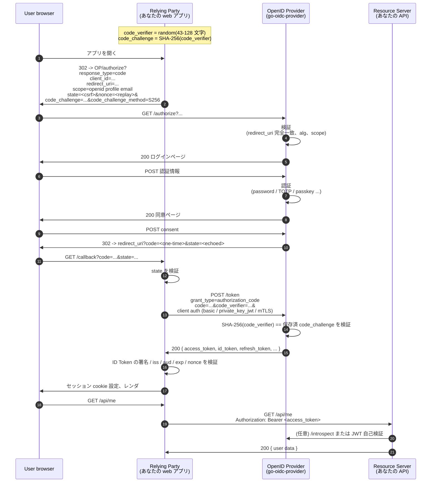

# 認可コード + PKCE

最も一般的な OIDC フローです。Web アプリ、モバイルアプリ、SPA、デスクトップアプリで人がログインするとき、ほぼすべてがこれです。本ライブラリでは PKCE (Proof Key for Code Exchange、RFC 7636) は必須です — OAuth 2.0 BCP (RFC 9700) と FAPI 2.0 が要求するため、また 2026 年現在 PKCE を無効にする合理的な構成は存在しないためです。

::: details このページで触れる仕様
- [RFC 6749](https://datatracker.ietf.org/doc/html/rfc6749) — OAuth 2.0 Authorization Framework（§5.2 エラーコード）
- [RFC 7636](https://datatracker.ietf.org/doc/html/rfc7636) — Proof Key for Code Exchange (PKCE)
- [RFC 9700](https://datatracker.ietf.org/doc/html/rfc9700) — OAuth 2.0 Security Best Current Practice
- [RFC 9126](https://datatracker.ietf.org/doc/html/rfc9126) — Pushed Authorization Requests (PAR)
- [OpenID Connect Core 1.0](https://openid.net/specs/openid-connect-core-1_0.html) — §3.1（Authorization Code Flow）
:::

::: details 用語の補足
- **認可コード（authorization code）** — OP がブラウザリダイレクト経由で RP に渡す 1 回限りの opaque 文字列。RP はこれを `/token` でトークンに交換します。
- **PKCE**（「ピクシー」と読む） — `code_verifier` と `code_challenge` を使った小さな手続きで、「このコードを引き換えに来たクライアントは、フローを始めたクライアントと同一」と OP に証明させる仕組み。リダイレクトされたコードを悪意あるアプリに横取りされるのを防ぎます。詳しい解説は後述。
- **`state`** — RP が authorize 要求に乗せ、コールバックで検査するランダム opaque 値。リダイレクトの CSRF 防御。
- **`nonce`** — ID Token に紐づくランダム opaque 値。RP 側でのリプレイ防御。
:::

## 完全なシーケンス

## パラメータ用語集

| パラメータ | 送信タイミング | 目的 |
|---|---|---|
| `response_type=code` | `/authorize` | 認可コード grant を要求。 |
| `client_id` | `/authorize`、`/token` | 登録済み RP を識別。 |
| `redirect_uri` | `/authorize`（`/token` でも echo） | OP がユーザを戻す先。登録リストとの **完全一致**。 |
| `scope` | `/authorize` | 要求権限。OIDC では `openid` を含むこと。 |
| `state` | `/authorize` | RP がコールバックで echo する不透明値。redirect の CSRF 防御。 |
| `nonce` | `/authorize` | ID Token の `nonce` claim にバインドされるランダム値。replay 防御。 |
| `code_challenge` | `/authorize` | `BASE64URL(SHA256(code_verifier))`。 |
| `code_challenge_method` | `/authorize` | `S256`（本ライブラリが受理する唯一の値）。 |
| `code` | `/authorize` レスポンス | 単発。spec 上 max-age 60 秒、本ライブラリも同値。 |
| `code_verifier` | `/token` | `code_challenge` の原像。OP が SHA-256 を再計算。 |
| `grant_type=authorization_code` | `/token` | この grant を選択。 |
| Client auth | `/token` | `client_secret_basic` / `client_secret_post` / `private_key_jwt` / `tls_client_auth` / `self_signed_tls_client_auth` / `none`（PKCE のみ）のいずれか。 |

## PKCE が防ぐもの

::: details 解説: PKCE が防ぐ攻撃
PKCE が無いと、同一デバイスで `myapp://` の URI ハンドラを乗っ取った悪意あるアプリが認可コードのリダイレクトを傍受できます:

1. ユーザが正規 RP でログイン。OP が `myapp://callback` に `code=abc` を発行。
2. 悪意アプリがリダイレクトを傍受し（race condition または universal-link なりすまし）、`code=abc` を読む。
3. 悪意アプリが `code=abc` を `/token` に投げ、トークンを得る。

PKCE はコードを **正規 RP のみが知る秘密** にバインドします:

1. 正規 RP がランダム `code_verifier` を生成し、`/authorize` には `SHA256(code_verifier)`（`code_challenge`）のみを送る。
2. OP は発行コードと一緒に `code_challenge` を保存。
3. `/token` で OP は `code_verifier` を要求し、SHA-256 を再計算。
4. 悪意アプリは code を見ても verifier を見ていない — `/token` 呼び出しは失敗。

これは RP がクライアントシークレットを保管できないケース（SPA / ネイティブ）でも機能します。
:::

## 本ライブラリでの強制方法

| 挙動 | 場所 |
|---|---|
| `code_challenge_method=plain` は **拒否**（`S256` のみ受理）。 | `internal/pkce` |
| クライアントの `RequiresPKCE` が true（public client のデフォルト、FAPI 2.0 では強制）の場合、`code_challenge` 無しは拒否。 | `internal/authorize` |
| `code_verifier` の長さ / 文字集合は RFC 7636 §4.1 に対して検証。 | `internal/pkce` |
| ミスマッチは `/token` で RFC 6749 §5.2 の `invalid_grant` を返す（`/authorize` ではなく）。 | `internal/tokenendpoint/authcode.go` |

## よくあるエラーと意味

| エラー | 原因 | 対処 |
|---|---|---|
| `invalid_request` `code_challenge_method` | クライアントが `plain` を送った | `S256` を送る |
| `invalid_request_uri` | PAR `request_uri` の期限切れ / 消費済み | 新しい PAR を発行 |
| `invalid_grant`（`/token`） | `code_verifier` 不一致、または code が使用済 / 期限切れ | code を再利用しない、再生成 |
| `redirect_uri_mismatch` | `/token` の `redirect_uri` が `/authorize` と異なる | バイト単位で同一にする |

## 自分でフローを動かす

`examples/03-fapi2` は PAR + JAR + DPoP + PKCE をひとつの構成にまとめた FAPI 2.0 Baseline OP を起動します。OFCS conformance suite は同じシーケンスを 2 つの FAPI plan にわたって約 129 module 実行します。[OFCS 適合状況](/ja/compliance/ofcs) に内訳があります。

## 次に読むもの

- [送信者制約 (DPoP / mTLS)](/ja/concepts/sender-constraint) — PKCE を「access token はそれを得たクライアントだけが使える」に格上げする方法。
- [Refresh tokens](/ja/concepts/refresh-tokens) — access token が期限切れになったら何をするか。
