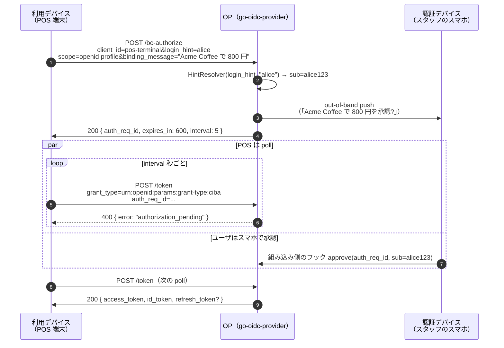

# CIBA — Client-Initiated Backchannel Authentication

CIBA は [device flow](/ja/concepts/device-code) とは別の形の問題を解きます。device code は 2 つの面が「画面に表示された短いコード」を介して OP で合流します。**CIBA** ではリクエストを開始する装置がそもそも **ユーザに見えていない** — ユーザは、すでに信頼している **別の認証デバイス** へ push（あるいは電話、通知）を受け取る形になります。

代表的な構成:

- **利用デバイス（consumption device）** — POS 端末、コールセンタの操作画面、店内 kiosk、銀行の振込承認パネル等。**誰** であるべきかは知っている（ロイヤリティカード、電話番号、口座番号）が、認証する手段はない。
- **認証デバイス（authentication device）** — ユーザのスマホで、銀行アプリがすでにインストール・サインイン済み。push 通知（「Acme Coffee で 800 円を承認しますか？」）を受け取り、ユーザは **承認 / 拒否** をタップする。

利用デバイスはユーザに credential を一切聞きません — OP に「Alice にスマホで承認してもらってください」と頼むだけです。

::: details このページで触れる仕様
- [OpenID Connect Client-Initiated Backchannel Authentication Flow — Core 1.0](https://openid.net/specs/openid-client-initiated-backchannel-authentication-core-1_0.html) — CIBA Core 仕様
- [FAPI-CIBA-ID1](https://openid.net/specs/openid-financial-api-ciba-ID1.html) — JAR + DPoP/mTLS + access TTL 10 分上限を必須化する FAPI プロファイル
:::

::: details 用語の補足
- **`auth_req_id`** — `/bc-authorize` の応答として返る不透明な識別子。利用デバイスはこれを使って `/token` を poll し、認証デバイスはこれに対して承認する。
- **Hint** — 利用デバイスが OP に **どのユーザ** を聞くかを伝える方法。CIBA Core §7.1 で 3 種類が定義されている:
  - `login_hint` — 組み込み側が subject にマップする不透明値（`alice@example.com`、口座番号 など）。
  - `id_token_hint` — 過去に発行された ID トークン。`sub` claim でユーザを識別する。
  - `login_hint_token` — 組み込み側が署名検証してから subject にマップする署名付き JWT（別の上流システムが発行したもの 等）。
- **配信モード** — OP が承認を利用デバイスに伝える方法:
  - **poll** — デバイスが `auth_req_id` で `/token` を poll する。v0.9.1 ではこのモードのみ。
  - **ping** — OP がデバイスの HTTPS endpoint に `auth_req_id` をコールバック、その後デバイスが `/token` を poll する。（v2+ で対応）
  - **push** — OP がデバイスの HTTPS endpoint にトークンを直接配信する。（v2+ で対応）
:::

## フローの動き方（poll mode）



利用デバイスはユーザの credential を持ちません。ユーザは利用デバイスに何も打ちません。認証デバイス — ユーザが銀行アプリにサインイン済みなのですでに認証されている — だけが consent を行使する場所になります。

## CIBA と Device Code — どちらを選ぶか

両方とも 2 デバイスです。違いは **「利用デバイスが聞いていることをユーザが知っているか」** です。

| | Device Code | CIBA |
|---|---|---|
| **誰が信頼を起こす?** | ユーザが認証ページに `user_code` を打ち込む | 利用デバイスが OP に push、ユーザは通知だけを見る |
| **ユーザは URL を発見する必要がある?** | はい — `verification_uri` が画面に出る | いいえ — OP は push 先を知っている |
| **利用デバイス側の信頼モデル** | 匿名のデバイスがユーザに「結びつけて」とお願いする | 事前登録されたデバイスが、OP 経由でユーザに「確認して」とお願いする |
| **代表的な利用面** | スマート TV、ゲーム機、CLI、IoT 機器のペアリング | POS、コールセンタ、不正検知の確認、アプリ内決済 |
| **ユーザが打つ識別子** | `user_code`（`BDWP-HQPK` 等） | なし — OP はすでにユーザ識別子を持っている（`login_hint`） |
| **誤誘導のリスク** | 低 — URL がデバイス画面に出ている | 中 — push 通知の文言が利用面と一致しているとユーザが信頼する必要がある。**`binding_message`** を使ってスマホ側プロンプトに POS の要求内容を表示すること |

ユーザが **デバイスの目の前にいて** デバイスがコード表示できないなら CIBA。ユーザが **デバイスから離れていて** デバイスが画面を持っているなら device code。CIBA の認証デバイスは事前にユーザを知っている必要があり、device code の verification ページは任意のサインイン済みブラウザセッションで動きます。

## Hint — 「どのユーザか」を OP に伝える

利用デバイスはユーザを認証できないので、OP に **どのユーザに push するか** を伝える必要があります。CIBA Core §7.1 は 3 種類の hint を定義しており、OP は単一の `HintResolver` interface でそれら全てを受け付けます:

```go
op.WithCIBA(
    op.WithCIBAHintResolver(op.HintResolverFunc(
        func(ctx context.Context, kind op.HintKind, value string) (string, error) {
            switch kind {
            case op.HintLoginHint:
                // value = "alice"、"alice@example.com"、口座番号 等。
                return resolveLoginHint(ctx, value)
            case op.HintIDTokenHint:
                // value = 過去に発行された ID token（OP が署名・有効期限を検証済み）。
                return claimsSubject(value)
            case op.HintLoginHintToken:
                // value = 信頼している別システムが発行した署名付き JWT。
                return verifyAndMap(ctx, value)
            }
            return "", op.ErrUnknownCIBAUser
        },
    )),
)
```

`op.ErrUnknownCIBAUser` を返すと、通信路上の応答は `unknown_user_id` に丸められます。それ以外のエラーは `login_required` になります。`op.WithCIBA` をリゾルバ未指定で呼ぶと `op.New` は構築に失敗します — リゾルバは必須です。

## binding_message — 誤誘導を防ぐ項目

CIBA の `binding_message` は利用デバイスが `/bc-authorize` 時に送れる短い文字列です。OP はこれを認証デバイスに転送し、ユーザのスマホ側プロンプトにレジ係が POS で見ているのと同じ文言を表示できます:

> **Acme POS 端末 #14**: Acme Coffee で 800 円を承認しますか?
>
> [ 承認 ] [ 拒否 ]

`binding_message` がないと、ユーザは OP の汎用プロンプトしか頼りになりません。「異常なアクティビティを検知しました。この push を承認してください」のような phishing がはるかに通りやすくなります。仕様上は optional ですが、組み込み側の UX では **必須** として扱ってください。

## 動かしてみる

[`examples/31-ciba-pos`](https://github.com/libraz/go-oidc-provider/tree/main/examples/31-ciba-pos) は完全な POS シナリオを実演します。POS が `/bc-authorize` に POST、スタッフのスマホ（`CIBARequestStore.Approve` を直接呼ぶ goroutine でシミュレート）が承認、POS が token 発行まで poll します。end-to-end で 5 秒程度です。

```sh
go run -tags example ./examples/31-ciba-pos
```

example はロール別ファイルに分割されています（`op.go` で OP の組み立て + `HintResolver`、`rp.go` で POS 側の polling、`device.go` でスマホ承認のシミュレーション）。

## 続きはこちら

- [ユースケース: CIBA の組み込み](/ja/use-cases/ciba) — `op.WithCIBA`、`HintResolver` の契約、FAPI-CIBA プロファイル制約、組み込み側の認証デバイスコールバックが `CIBARequestStore.Approve` に応答する手順。
- [Device Code 入門](/ja/concepts/device-code) — 「ユーザが別の利用面にいる」という同系統の概念。コード表示を使う方式。
