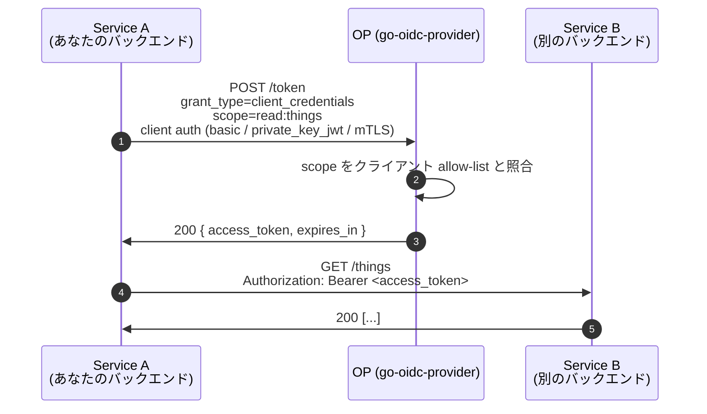

# Client Credentials

`grant_type=client_credentials` は **サービス間** grant です — エンドユーザ、ブラウザ、同意はありません。confidential なバックエンドが **自分自身として** 認証し、別のバックエンドを呼ぶための access token を得ます。

::: details このページで触れる仕様
- [RFC 6749](https://datatracker.ietf.org/doc/html/rfc6749) — OAuth 2.0 Authorization Framework（§4.4 client credentials）
- [RFC 7521](https://datatracker.ietf.org/doc/html/rfc7521) — Assertion Framework for OAuth 2.0
- [RFC 7523](https://datatracker.ietf.org/doc/html/rfc7523) — JWT Profile for OAuth 2.0 Client Authentication（`private_key_jwt`）
- [RFC 7800](https://datatracker.ietf.org/doc/html/rfc7800) — Confirmation (`cnf`) claim
- [RFC 8705](https://datatracker.ietf.org/doc/html/rfc8705) — Mutual-TLS Client Authentication
- [RFC 9068](https://datatracker.ietf.org/doc/html/rfc9068) — JWT Profile for OAuth 2.0 Access Tokens
:::

::: details 用語の補足
- **Confidential クライアント** — 実認証情報（長寿命の秘密、非対称鍵、X.509 証明書など）を保持できるクライアント。バックエンドや信頼境界内のサーバが該当します。
- **Public クライアント** — 実秘密を保持できないクライアント（ブラウザの SPA、ネイティブモバイルアプリなど）。`token_endpoint_auth_method=none` で動作し、コード保護は PKCE に頼ります。
- **`private_key_jwt`** — クライアント認証方式のひとつ。クライアントが秘密鍵で短寿命の JWT に署名し、OP は登録済みの公開鍵で検証します。共有秘密と違い、秘密がクライアントの外に出ないので強度が高い。
:::



::: warning Confidential クライアントのみ
`client_credentials` は本ライブラリでは構造的に **confidential クライアント**（実認証情報を持つもの: `client_secret_basic`、`client_secret_post`、`private_key_jwt`、`tls_client_auth`、`self_signed_tls_client_auth`）に制限されます。public クライアント（SPA / ネイティブ、`token_endpoint_auth_method=none`）は使えません。

エンドユーザがいないため、PKCE / 同意 / `id_token` / **refresh token** はありません。クライアントは access token が期限切れになったら grant を再実行します。
:::

## 実装

grant を明示的に有効化。ライブラリは有効な集合に無い grant では発行を拒否します。

```go
import (
  "github.com/libraz/go-oidc-provider/op"
  "github.com/libraz/go-oidc-provider/op/grant"
)

handler, err := op.New(
  op.WithIssuer("https://op.example.com"),
  op.WithStore(inmem.New()),
  op.WithKeyset(myKeyset),
  op.WithCookieKeys(cookieKey),
  op.WithGrants(
    grant.AuthorizationCode, // 人間ユーザ向け
    grant.RefreshToken,
    grant.ClientCredentials, // サービス間
  ),
  op.WithStaticClients(/* confidential クライアント */),
)
```

登録クライアントは `GrantTypes` でオプトインします。

```go
op.WithStaticClients(op.ConfidentialClient{
  ID:         "service-a",
  Secret:     "rotate-me",
  AuthMethod: op.AuthClientSecretBasic, // private_key_jwt の場合は op.PrivateKeyJWTClient を使う
  GrantTypes: []string{"client_credentials"},
  Scopes:     []string{"read:things", "write:things"},
})
```

::: details グローバル許可とクライアント別許可の両方が必要な理由
- **グローバル** (`op.WithGrants`) は OP として受け付ける grant の集合を定義し、discovery の `grant_types_supported` に出ます。
- **クライアント別** (`store.Client.GrantTypes`) はそのうち **個々のクライアント** が実際に使える grant を絞り込みます。

両方の判定を通ったときだけ発行が成功します。この二段構えにより、たとえばユーザ向けアプリには `authorization_code` を、バックエンドサービスには `client_credentials` を、同じ OP から発行しつつ、SPA クライアントにバックエンド用トークンを取らせない構成が自然に書けます。
:::

## トークンの形

`client_credentials` access token は次を持ちます:

- `iss` — OP issuer
- `aud` — resource server 識別子（typed seed の `Resources []string` フィールドで RFC 8707 のリソース識別子を許可する。DCR の場合は同等の `resources` メタデータ）
- `client_id` — 要求元クライアント
- `sub = client_id` — RFC 9068 §2.2 / FAPI 2.0 の慣習。クライアント自身が subject(自分自身として動く)
- `scope` — 要求 scope のうち付与された部分集合

`op.WithFeature(feature.MTLS)` または DPoP が設定されクライアントが送信者制約を提示した場合、トークンには加えて RFC 7800 の `cnf` (Confirmation) claim が乗りバインドされます。

::: details なぜ `sub = client_id` なのか
ユーザを伴うフローでは `sub` はエンドユーザの安定識別子です。`client_credentials` にはエンドユーザがいないので、RFC 9068 §2.2 が `sub` を `client_id` に等しくすることを要求しています — *クライアント自身* が subject として動いている、という建付けです。`sub` を見て「誰がやったか」を記録する RS は依然として安定識別子を得られますが、サービストークンの場合の識別子は人ではなく登録済みサービスを指す、という前提を持つ必要があります。よくあるバグは「`sub` は必ず user テーブルの行を指す」と思い込むこと — サービストークンでは *client* テーブルの行を指します。
:::

::: details `client_credentials` の `aud` — 意味と設定方法
**`aud`** はリソースサーバの識別子です — `client_id` でも、OP の issuer でもありません。「このトークンは私が消費するために発行された」を RS に伝える値です。本ライブラリでは次から `aud` が決まります。

- クライアント登録時の `Resources []string`（クライアントが要求してよい RFC 8707 リソース識別子の許可リスト）。または
- ランタイムの `resource=...` リクエストパラメータ（RFC 8707）— 許可リストの範囲内であること。

`Resources` が未設定でランタイムの `resource` パラメータも無い場合、OP はデプロイ定義のデフォルトにフォールバックします。RS は自分の識別子と一致しない `aud` を持つトークンを拒否するべきです — RS から盗まれたトークンを別の RS に再生される攻撃に対する audience-restriction 防御です。
:::

::: details bearer と送信者制約の違い
デフォルトでは、`client_credentials` access token は **bearer** トークン（RFC 6750）です — 「持っている者が使える」。漏洩した bearer トークンは、有効期限まで攻撃者にも機能します。

**送信者制約付き** access token（RFC 8705 mTLS、または RFC 9449 DPoP）は、`cnf` claim でトークンを正規クライアントが保持する鍵にバインドします。RS は API 呼び出しごとに、呼び出し元がその鍵を保有していることを証明させます。漏洩しても、対応する秘密鍵が無いと使えません — そして秘密鍵はクライアントの外に出ません。

規制対応のサービス間通信（FAPI 2.0、PSD2、OBL）では送信者制約が標準的な既定値です。mesh 層で mTLS が強制されている内部サービス間通信では、素の bearer でも実用上問題ない場合があります。
:::

## 動作確認

[`examples/05-client-credentials`](https://github.com/libraz/go-oidc-provider/tree/main/examples/05-client-credentials) は `client_secret_basic` クライアントでの end-to-end 実行版です。

```sh
go run -tags example ./examples/05-client-credentials
```

## 次に読むもの

- [送信者制約 (DPoP / mTLS)](/ja/concepts/sender-constraint) — サービストークンをクライアント保有鍵にバインドし、盗難トークンを無効化する。
- [ユースケース: 本番の client_credentials](/ja/use-cases/client-credentials)。
