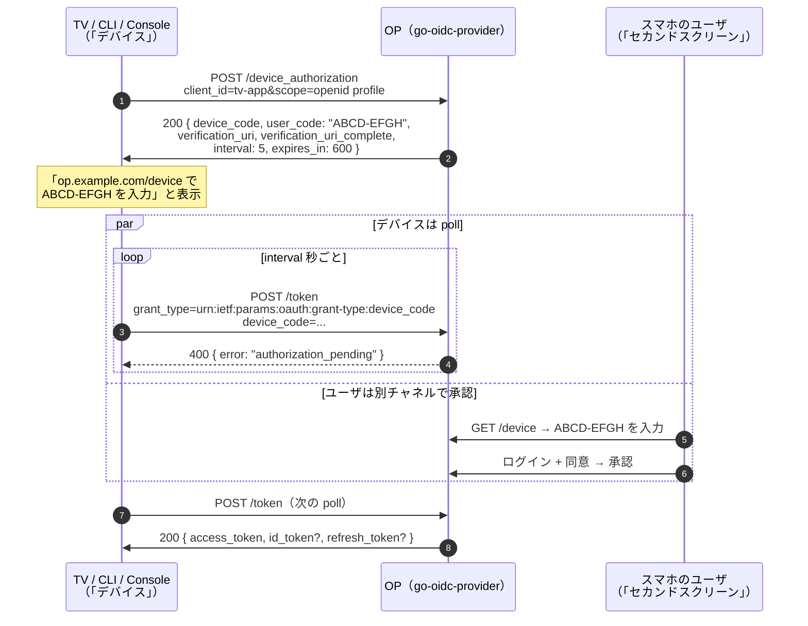

# Device Code（RFC 8628）

device-authorization grant — 通称「device code」「device flow」 — は、**ブラウザを動かせない**、または **パスワードを打つのが現実的でない** クライアントのための grant です。スマート TV、ゲーム機、CLI ツール、IoT 機器、POS 端末などが該当します。

一番身近な例は、新しい TV で Netflix にサインインするときの手順です。TV 画面に短いコード（`ABCD-EFGH`）と URL（`netflix.com/tv`）が表示され、ユーザはスマホでその URL を開いてコードを入力し、承認します。TV はパスワードを一度も見ないまま access token を受け取ります。

::: details このページで触れる仕様
- [RFC 8628](https://datatracker.ietf.org/doc/html/rfc8628) — OAuth 2.0 Device Authorization Grant
- [RFC 6749](https://datatracker.ietf.org/doc/html/rfc6749) — OAuth 2.0 Authorization Framework（用語）
:::

::: details 用語の補足
- **device_code** — OP が発行する、デバイスが poll に使う長い不透明な識別子。ユーザには見せない。
- **user_code** — デバイス画面に表示し、ユーザが verification ページに打ち込む短い人間可読コード（`BDWP-HQPK` 等）。
- **verification_uri** — デバイス画面に表示する URL（`https://op.example.com/device`）。ユーザはスマホで開く。
- **verification_uri_complete** — `user_code` を埋め込み済みの URL。デバイスが QR コードを描画できれば、ユーザはスキャンするだけで打鍵が要らなくなる。
- **interval** — デバイスが `/token` を poll する間隔（秒）。OP が `slow_down` を返すとこの値が引き上げられる。
:::

## フローの動き方



デバイス側はパスワードを一切持ちません。ユーザもデバイスには何も打ちません。2 つの面が短い `user_code` を介して OP で合流します。

## Polling 応答

token endpoint は poll ごとに以下のいずれかを返します:

| 応答 | 意味 | デバイスのふるまい |
|---|---|---|
| `400 authorization_pending` | ユーザがまだ承認（または拒否）していない | `interval` 秒待って再 poll |
| `400 slow_down` | poll が速すぎた | interval を倍にする（RFC 8628 §3.5: "MUST honor the new value"）。OP は新しい interval を `LastPolledAt` と原子的に永続化するので、マルチレプリカ展開でも reset されない |
| `400 access_denied` | ユーザが verification ページで **拒否** をクリック（または組み込み側の revocation hook が発火） | poll を停止し「サインインがキャンセルされました」と表示 |
| `400 expired_token` | `device_code` が `expires_in`（既定 600 秒）を超えた | poll を停止。再試行はフローからやり直す |
| `200 { access_token, ... }` | ユーザが承認 | 通常の token 応答として処理 |

::: warning user_code は構造的に brute-force 可能
`user_code` は短いから使い物になります — 長くしたら誰も入力しません。これは原理的に brute-force され得るということでもあり、ユーザが打つより速く `/device` を呼び出せる攻撃者が勝ってしまいます。本ライブラリは [`op/devicecodekit`](https://github.com/libraz/go-oidc-provider/tree/main/op/devicecodekit) でレコード単位のゲートを同梱しており、`VerifyUserCode` が constant-time 比較し、外したらストライクカウンタを加算、`MaxUserCodeStrikes`（既定 5）でレコードをロックアウトします。自前で verification ページを作る組み込み側は、このヘルパを使うか同等のゲートを実装する必要があります。
:::

## 使うべきとき

device flow を選ぶのは、デバイス側に以下のいずれかの制約があるとき:

- **ブラウザがない** — set-top box、スマート TV、音声アシスタント
- **キーボードがない / 入力が困難** — TV リモコン、ゲームコントローラの D-pad
- **CLI ツール** で web server を立てない種類のもの（`gcloud auth login`、`gh auth login`、`kubectl oidc-login` など）
- **Headless** な自動化文脈で、provisioning 時に一度だけペアリングする運用

ブラウザが使えるクライアント（通常の SPA、custom URL scheme を持つネイティブアプリなど）には不要です — `authorization_code + PKCE` のほうが短く、安全で、UX も豊かです。RFC 8628 §3 自身が、device flow を canonical flow が現実的でないときの **fallback** として位置づけています。

## 動かしてみる

[`examples/30-device-code-cli`](https://github.com/libraz/go-oidc-provider/tree/main/examples/30-device-code-cli) は単一バイナリで RFC 8628 のラウンドトリップを実演します。OP を立ち上げ、boxed `user_code` パネル + `verification_uri_complete` のショートカットを表示し、数秒後にブラウザ承認をシミュレートして、OP が `access_token` + `id_token` を発行するまで poll します。

```sh
go run -tags example ./examples/30-device-code-cli
```

example はロール別ファイルに分割されています（`op.go` で OP の組み立て、`cli.go` でデバイス側の polling、`device.go` でブラウザ承認のシミュレーション、`probe.go` で self-verification）。各面を独立に読めます。

## 続きはこちら

- [ユースケース: device code の組み込み](/ja/use-cases/device-code) — `op.WithDeviceCodeGrant`、`devicecodekit.VerifyUserCode`、検証ページの契約、デバイス登録解除(unenroll)時に発行済みトークンを連鎖失効させる手順。
- [CIBA 入門](/ja/concepts/ciba) — 「ユーザが別チャネルにいる」の概念的な兄弟。コード表示を使わない方式。
