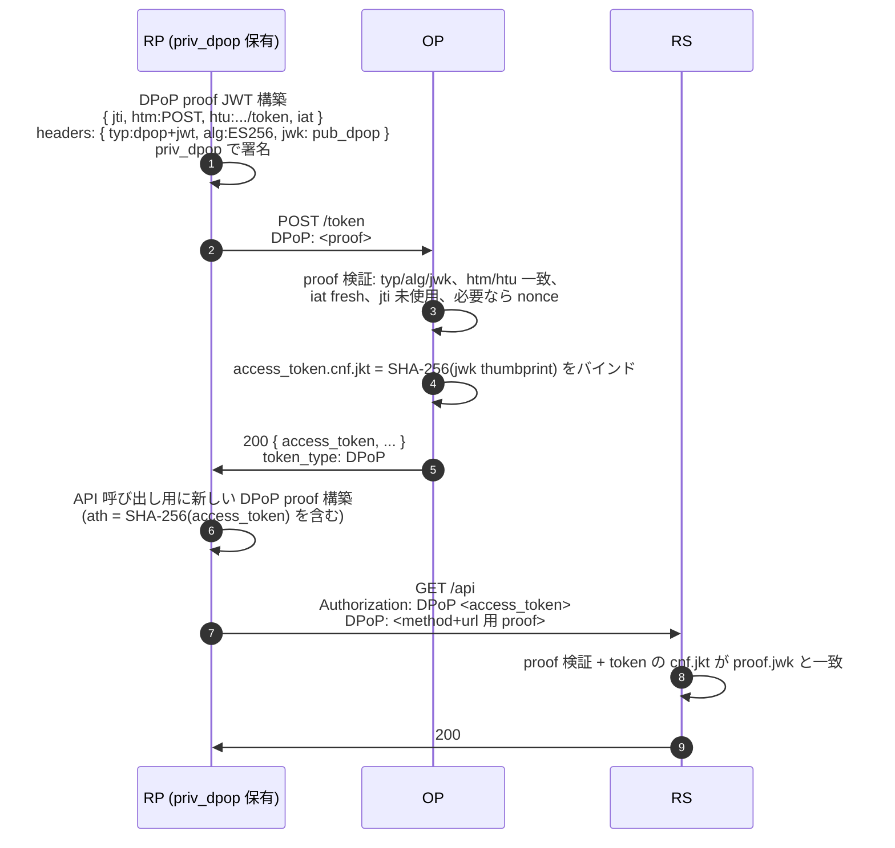

# DPoP — Demonstrating Proof of Possession

**DPoP**(RFC 9449)は、クライアントが保有する鍵にアクセストークンをバインドする仕組みです。同じ鍵で署名された fresh な proof が無ければ、漏洩したアクセストークンは使い物になりません。API 呼び出しごとに小さな JWT(*DPoP proof*)が同行し、OP とリソースサーバはトークンと合わせてこの proof も検証します。

DPoP は HTTP 層だけで完結する方式です。クライアントは TLS クライアント証明書を持つ必要がなく、OP もリバースプロキシのヘッダ仕様を意識する必要がありません。SPA・モバイル・バックエンドのいずれでも同じ流れが使えます。この移植性の高さが、FAPI 2.0 Baseline が DPoP を送信者制約付きトークンの 2 つの選択肢の片方として認める理由です(もう片方は[mTLS](/concepts/mtls))。

::: details このページで触れる仕様
- [RFC 9449](https://datatracker.ietf.org/doc/html/rfc9449) — DPoP (Demonstrating Proof of Possession)
- [RFC 7638](https://datatracker.ietf.org/doc/html/rfc7638) — JWK Thumbprint
- [RFC 7800](https://datatracker.ietf.org/doc/html/rfc7800) — Confirmation (`cnf`) claim
- [FAPI 2.0 Baseline](https://openid.net/specs/fapi-2_0-baseline.html)
- [FAPI 2.0 Message Signing](https://openid.net/specs/fapi-2_0-message-signing.html)
:::

## DPoP proof の仕組み

DPoP proof はクライアントが保有する秘密鍵で署名した JWT(RFC 9449 §4)です。リクエスト毎に新しい proof を生成します。

**JOSE ヘッダ**

| フィールド | 値 |
|---|---|
| `typ` | `dpop+jwt`(必須) |
| `alg` | `ES256` / `EdDSA` / `PS256`(本ライブラリの allow-list、`internal/dpop/proof.go` 参照) |
| `jwk` | 署名鍵の公開鍵部分。ヘッダに同梱 |

**ペイロード claim**

| Claim | 意味 |
|---|---|
| `htm` | リクエストの HTTP メソッド(`POST`、`GET` など)。この 1 リクエストに固定。 |
| `htu` | クエリと fragment を取り除いたリクエスト URL。`/orders` 用 proof を `/admin/payouts` で再利用することを防ぎます。 |
| `iat` | proof 署名時刻。OP の freshness 窓(既定 60 秒、`dpop.DefaultIatWindow` 参照)外は拒否。 |
| `jti` | proof ごとの一意な乱数値。OP は freshness 窓の間 `jti` をキャッシュし、同じ proof の再利用を防ぎます。 |
| `ath` | 任意。アクセストークンの SHA-256。proof がアクセストークンと組で提示される場合は必須(RFC 9449 §4.2)。 |
| `nonce` | 任意。OP が §8 / §9 の nonce フローを運用しているときにサーバから供給される値。 |



OP と RS は同じチェックリストを通します。RS は加えて、proof の `jwk` の thumbprint がアクセストークンの `cnf.jkt` と一致することも確認します。

## Confirmation claim — `cnf.jkt`

`/token` で最初に提示された proof がバインドを確定させます。OP は proof の `jwk` の SHA-256 thumbprint(RFC 7638 がハッシュ対象とする JWK フィールドを正準化しています)を計算し、アクセストークンに `cnf.jkt` として書き込みます。以後、このアクセストークンを使うリクエストはすべて **同じ鍵** で署名された proof を提示する必要があり、RS は thumbprint を再計算して照合します。

`cnf` 自体は単なる JSON object で、その内側の **メンバ名** が「どの種類のバインドか」を示します(RFC 7800)。DPoP では `jkt` を使い、mTLS は `x5t#S256` を使います — 同じ token 上に両方が同居することはありません。

::: details なぜ鍵そのものではなく thumbprint なのか
thumbprint は JSON 再エンコードを跨いでも安定する、短い識別子です。RFC 7638 が「JWK のどのフィールドを、どの順でハッシュするか」を厳密に規定しているので、クライアントとサーバは同じ鍵に対して同じ digest を計算できます。鍵そのものを埋め込めばアクセストークンが膨らみますが、thumbprint なら 32 byte(base64url で 43 文字)で済みます。
:::

## Replay 防御

DPoP は独立した 4 つのゲートを重ね、proof 1 通を盗み出した攻撃者に何の利益もないようにします:

- **`jti` 重複排除。** OP は受理した proof の `jti` を `store.ConsumedJTIStore.Mark` に通します(`internal/dpop/verify.go`)。freshness 窓の中で同じ `jti` が再提示されると `ErrProofReplayed` を返してリクエストは失敗します。この store は PAR / JAR の replay 防御で使う store と共通なので、Redis サブストア 1 つで全部をカバーできます。
- **`iat` 窓。** `DefaultIatWindow`(60 秒、対称)より古いか未来すぎる proof は `ErrProofIatWindow` で拒否されます。短く取ることに意味があり、`jti` キャッシュが消えても盗まれた proof が使える時間を限定します。
- **`htm` + `htu` 一致。** あるメソッド・URL 用の proof は別エンドポイントで提示できません。OP は両側を RFC 9449 §4.3 の正準形(scheme / host を小文字化、デフォルトポートを除去、クエリ・fragment を除去)に揃えてから比較します。
- **`ath` バインド。** proof がアクセストークンと組で提示される場合、proof は `ath = SHA-256(access_token)` を持つ必要があります。別のアクセストークン用の proof は `ErrProofATHMismatch` で失敗します。

これら全体で、正規クライアントですら一度使った proof を再利用できなくなります。proof のストックを盗み出した攻撃者は `jti` キャッシュに弾かれ、アクセストークンを盗み出した攻撃者は鍵が無いので proof を作れず、あるエンドポイント用にスクリプト化した proof を別エンドポイントに転用することもできません。

## サーバ供給 nonce (RFC 9449 §8 / §9)

ここまで述べた 4 つの claim はいずれもクライアントの時計に依存します。クライアントが一時的に侵害された場合、`iat` 窓いっぱいの間有効な proof を事前生成して持ち出される可能性があります。RFC 9449 §8 / §9 はサーバ供給 nonce でこの穴を塞ぎます。

`DPoPNonceSource` を構成すると、OP は応答ヘッダ `DPoP-Nonce` で fresh な nonce を発行します。次の proof はこれを `nonce` claim に含めなければなりません。攻撃者は次回の nonce を予測できないため、事前計算した proof は即座に無効化されます。

本ライブラリには単一プロセス用の in-memory 参照実装(`op.NewInMemoryDPoPNonceSource`)が同梱されています。マルチレプリカの HA 構成では、共有 store を持つ自前の `DPoPNonceSource` を差し込みます。FAPI 2.0 Message Signing は nonce を必須化し、Baseline は許可します。

組み込み手順、ローテーションのパイプライン、複数インスタンス運用の注意点は[DPoP nonce フロー](/use-cases/dpop-nonce)に詳しく書いています。

## 本ライブラリが何をバインドするか

アクセストークンは、`feature.DPoP` が有効でクライアントが `/token` で proof を提示した場合(あるいは authorize / PAR 要求で `dpop_jkt` により鍵を事前確約した場合)、常に DPoP バインドされます。

リフレッシュトークンは[設計判断 #15](/security/design-judgments#dj-15)に従います — public クライアントには bind、confidential クライアントには bind しない:

- **Public クライアント**(`token_endpoint_auth_method = "none"`、典型的には SPA とネイティブアプリ)では、refresh chain は最初の発行で DPoP バインドされ、RFC 9449 §5.4 の規則に従って以降のローテーションでもバインドが継承されます。鍵が無ければリフレッシュトークン単体は無価値で、これはまさに RFC 9449 §1 が想定する脅威モデルです。
- **Confidential クライアント**(`private_key_jwt`、`tls_client_auth`)では、refresh chain は bind しません。リクエストごとに DPoP 鍵をローテーションでき(OFCS の plan がこの動作を検証しています)、chain の生涯を 1 鍵に縛りません。各 refresh で発行されるアクセストークンは、その交換時に提示された鍵にバインドされ続けるので、漏洩面はアクセストークンに限定されます。

トレードオフは明示的です — confidential クライアントは鍵ローテーションの自由度を得る代わりに、refresh chain を保護のない bearer のまま残します。confidential クライアントはそもそも長寿命の非対称credential で token endpoint に認証しているため、リフレッシュトークン単体の漏洩で攻撃者が新しい token を発行させることはできません。

## `dpop_jkt` リクエストパラメータ

RFC 9449 §10 では、public クライアントが authorize 要求(または PAR 要求)に `dpop_jkt=<thumbprint>` を含めることで、発行されるアクセストークンのバインド先 DPoP 鍵を **事前確約** できます。攻撃者が自分の鍵で code を交換するタイプの code-substitution 攻撃の窓を塞ぎます。FAPI 2.0 Baseline では必須ではなく(token endpoint での mTLS / DPoP で十分)、PKCE で動かす public クライアントは PAR + token endpoint での DPoP に頼るのが一般的です。

本ライブラリは `dpop_jkt` を PAR(`internal/parendpoint/par.go`)で取り扱います。PAR 要求が DPoP proof を伴っていれば、OP はその thumbprint をスナップショットに刻み、別の鍵で来る `/token` 交換を拒否します。

## 実装例

DPoP のみの最小構成:

```go
import (
  "github.com/libraz/go-oidc-provider/op"
  "github.com/libraz/go-oidc-provider/op/feature"
)

op.New(
  /* 必須オプション */
  op.WithFeature(feature.DPoP),
)
```

§8 / §9 nonce フローを併用する場合:

```go
import (
  "context"
  "time"

  "github.com/libraz/go-oidc-provider/op"
  "github.com/libraz/go-oidc-provider/op/feature"
)

src, err := op.NewInMemoryDPoPNonceSource(ctx, 5*time.Minute)
if err != nil { /* ... */ }

op.New(
  /* 必須オプション */
  op.WithFeature(feature.DPoP),
  op.WithDPoPNonceSource(src),
)
```

`op.WithProfile(profile.FAPI2Baseline)` は PAR と JAR を自動有効化したうえで、`feature.DPoP` と `feature.MTLS` に対する `RequiredAnyOf` 制約を課します。組み込み側は送信者制約として少なくとも一方を明示的に有効化する必要があり、`op.New` が構築時に組み合わせを検証します。

## DPoP が向いているケース

- **SPA とモバイルアプリ** — クライアントはメモリやプラットフォームのセキュアストレージに鍵を保持できます。CA インフラは不要。
- **ファーストパーティ API** — RP と RS の両方を自分で制御する場面では、PKI 運用と調整しなくても DPoP を導入できます。
- **多様なクライアントが同居する環境** — DPoP はプレーン HTTPS で動作するため、TLS 終端を触らずに展開できます。
- **ログ・proxy 経由の漏洩対策** — 送信者制約と `jti` キャッシュ・`iat` 窓が組み合わさり、トークン漏洩そのものを構造的に無価値にします。

## DPoP が向かないケース

- **既存 PKI を持つバックエンドサービス** — すべてのサービスが内部 CA 発行のクライアント証明書を既に持っている場合、[mTLS](/concepts/mtls)で同じ基盤を再利用するほうが、新しい鍵管理面を増やさずに済みます。
- **リクエストごとの署名コストを許容できないクライアント** — API 呼び出しごとに JWS 1 通の署名コストが発生します。1 本のチャネルを使い回す制約デバイスは、TLS 層で binding する mTLS のほうが向くことがあります。
- **既に mTLS 一択で標準化された規制環境** — 一部のオープンバンキング地域では、ネットワーク層で mTLS のみを許容しています。DPoP を上から重ねる前にローカルプロファイルを確認してください。

## 次に読む

- [mTLS (RFC 8705)](/concepts/mtls) — もう一方の送信者制約方式。TLS 証明書にバインドします。
- [送信者制約 — 選定ガイド](/concepts/sender-constraint) — 比較表と使い分けの指針。
- [DPoP nonce フロー](/use-cases/dpop-nonce) — §8 / §9 nonce パイプラインの詳細な組み込み手順。
- [設計判断](/security/design-judgments) — public / confidential での refresh バインド差を含む、解決済みの仕様間トレードオフ。
