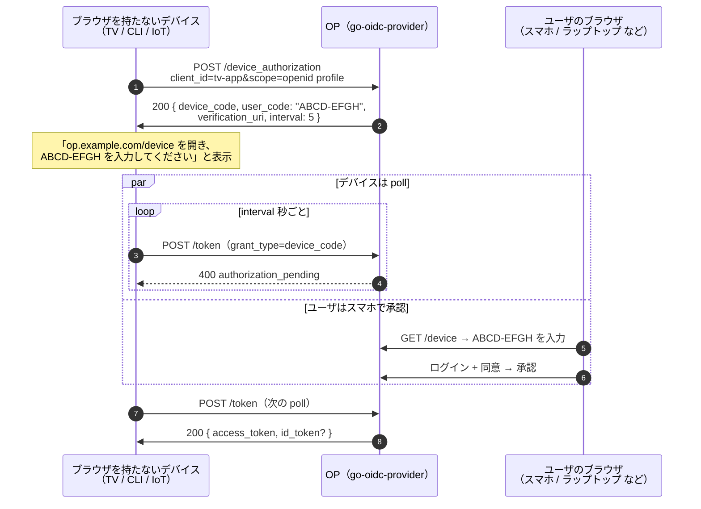
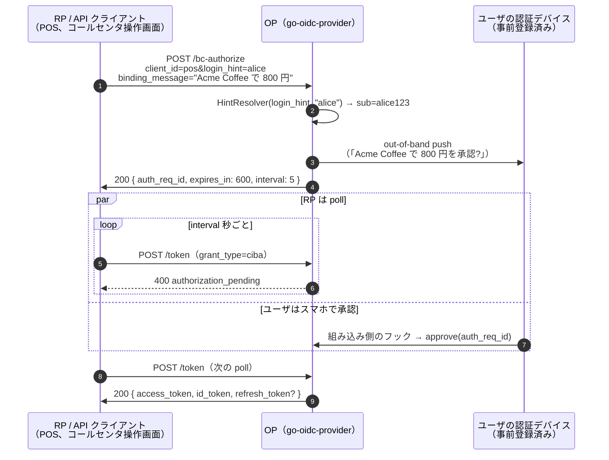

# ブラウザを使わないフロー: CIBA と Device Code

[Device Code（RFC 8628）](/ja/concepts/device-code)と[CIBA（OpenID Connect Client-Initiated Backchannel Authentication 1.0）](/ja/concepts/ciba)は、仕様エコシステムが同じ大きな状況に対して用意している 2 つの grant です。状況とは「アクセストークンを欲しがるデバイスがまともなブラウザを持てない」こと。スマート TV、ゲーム機、CLI ツール、IoT、音声アシスタント、POS 端末、コールセンタの操作画面、ユーザの代わりに動くサーバ側プロセス、などです。

遠目に見ると 2 つのフローは同じ形に見えます — 「2 つの面が OP で合流して、ユーザはスマホで承認する」。実際には違います。両者は **誰がリクエストを起こすか** と **ユーザがどう OP に識別されるか** で分かれており、その 1 点が他のほぼ全ての違い（通信路上のエンドポイント、polling の主体、anti-phishing の主軸、適用される規制プロファイル）を決めています。

本ページは選択ガイドです。仕様としての動き方は[Device Code](/ja/concepts/device-code)と[CIBA](/ja/concepts/ciba)の各ページに置いてあります。

## 1 段落ずつでまとめる

**Device Code（RFC 8628）.** ブラウザを持たないデバイスが OP に「使い切りのコードをくれ」と頼み、自分の画面に表示し、ユーザに「この URL をスマホで開いて、このコードを入力して」と告げます。ユーザは手元のブラウザで認証して承認します。その間デバイスは `/token` を poll し続け、承認が降りるのを待ちます。ユーザの識別は **フローの途中で発覚** します — TV の前に誰がやって来るかは OP もデバイスも事前には知りません。

**CIBA（Core 1.0）.** RP はすでにユーザが誰かを知っています — `login_hint`（`alice@example.com`、口座番号 等）、`id_token_hint`（過去に発行された ID トークン）、`login_hint_token`（上流のシステムが発行した署名付き JWT）のいずれかで。RP は OP に「このユーザを out-of-band で認証してくれ」と頼みます。OP は事前登録された認証デバイス（push 通知、SMS、アプリの確認プロンプト）に通知を飛ばします。その間 RP は poll する（ping / push モードならコールバックを待つ）。ユーザの識別は **RP が事前に与えるもの** です — どのデバイスへ push するか、OP はそれがないと決められません。

## 比較

| 観点 | Device Code（RFC 8628） | CIBA（Core 1.0） |
|---|---|---|
| 発端 | ブラウザを持たないデバイス（入力デバイス → OP） | RP / API クライアント（RP → OP） |
| ユーザの識別 | ユーザが別のブラウザに `user_code` を入力 | RP が `login_hint` / `id_token_hint` / `login_hint_token` を事前に渡す |
| ユーザ側の端末 | ユーザが手元に持っている任意のブラウザ | OP に事前登録された backchannel push 用のデバイス |
| anti-phishing の主軸 | デバイスが表示する `user_code` + ユーザが verification URI のホストを目視 | ユーザの認証デバイスに表示する `binding_message` |
| ブラウザの関与 | あり（ユーザのスマホ側） | 任意 / 不要（push 通知で確認が完結する） |
| ポーリング主体 | ブラウザを持たないデバイス | RP |
| 仕様上のエンドポイント | `/device_authorization` | `/bc-authorize` |
| token grant_type | `urn:ietf:params:oauth:grant-type:device_code` | `urn:openid:params:grant-type:ciba` |
| 主な用途 | TV アプリ、CLI ツール、kiosk、音声アシスタント、入力手段が乏しい IoT | 強力な顧客認証（PSD2 風）、金融 / ヘルスケアでの out-of-band 承認、画面共有なしでアクセスをリセットするカスタマーサポートのフロー |
| 本ライブラリでの対応 | RFC 8628 — フル対応、`op.WithDeviceCodeGrant()` で有効化 | OIDC CIBA Core 1.0 — 現リリースでは poll モードのみ。ping / push は将来対応 |
| ブルートフォース対策 | `op/devicecodekit` の constant-time 比較 + N-strike ロックアウト（`MaxUserCodeStrikes`） | poll-abuse ロックアウト — `auth_req_id` 単位で `/token` 再試行を rate-limit、閾値超過で `AuditCIBAPollAbuseLockout` |
| FAPI プロファイルとの関係 | FAPI 2.0 には組み込まれていない（RFC 8628 自体で Baseline 相当の構成は十分） | FAPI-CIBA — FAPI 2.0 Baseline / Message Signing とは別プロファイル。JAR + DPoP \| mTLS + access TTL 10 分上限を必須化 |

::: tip 2 つの grant、同じ症状
両方の grant が存在するのは、正攻法の `authorization_code + PKCE` フローがそもそも「token を欲しがるデバイスにまともなブラウザがある」前提で組まれているからです。その前提は TV、CLI、IoT、音声アシスタント、ユーザの代わりに動くバックエンドサービス、では成り立ちません。RFC 8628 と CIBA は「ブラウザがどこか別の場所にある」という状況の、**異なる 2 つの形** を解いています。
:::

## どちらを選ぶか — 判定木

順番に 4 つの問いを通ってください。最初の問いでだいたい片付きます。

**1. RP はフロー開始 *前* にユーザが誰かを知っているか?**

- **はい** → CIBA。RP はすでに `login_hint`（または ID トークン、hint token）を持っており、`/bc-authorize` に乗せて送れます。ユーザは自分を識別するための入力をしません。
- **いいえ** → Device Code。ユーザは verification ページでサインインすることでフローの中で自分を識別し、OP はそこでユーザが誰かを知ります。

**2. token を欲しがるデバイスに画面はあるか?**

- **ある** → Device Code がそのまま `user_code` と `verification_uri` を表示できます。TV / ゲーム機 / CLI の典型ケース。
- **ない（音声アシスタント、ヘッドレス IoT 等）** → どちらでも動きます。Device Code は TTS で `user_code` を読み上げる、`verification_uri_complete` を QR で出す等の方法が取れます。CIBA は別のデバイスに push するので、そもそも表示は不要です。

**3. ユーザは認証デバイスを事前登録しているか?**

- **CIBA は前提とします。** 事前登録された送信先がないと OP は push の宛先を持ちません。そのデバイスをプロビジョニングする工程（銀行アプリ、スタッフのスマホ、規制当局が発行する authenticator、等）はデプロイの一部です。
- **Device Code は前提としません。** ユーザがサインインできる任意のブラウザセッションで動きます。本人のスマホ、同僚のラップトップ、店舗の kiosk、いずれでも。

**4. これは規制下の金融 / ヘルスケアで、out-of-band 承認が要件になっているか?**

- **CIBA は元々その目的で設計されています。** FAPI-CIBA プロファイルは CIBA Core の上に JAR、送信者制約付きトークン（DPoP または mTLS）、access TTL 10 分上限を上乗せします。`binding_message` は規制当局が見る audit の根拠（「ユーザは何を承認したのかを正確に見ていた」）です。
- **Device Code は汎用的な仕組みです。** 適切に組めば十分機能しますが、規制当局が SCA で名指ししてくる形にはなっていません。

判定木を抜けてもまだ迷うなら、デフォルトとしては「画面はあるがブラウザがない」一般消費者向けには **Device Code**、「RP がユーザを把握済みで、out-of-band で承認だけしてほしい」業務向けには **CIBA** を選んでください。

## シーケンス図

### Device Code（RFC 8628）

### CIBA（Core 1.0、poll モード）

形は読者が頭の中でマッピングできる程度には似ています。決定的な違いは斜めに伸びる矢印です。Device Code ではユーザが **コードを手に OP まで歩いてくる** のに対し、CIBA では OP が **ユーザがすでに信頼しているデバイスに手を伸ばす**。

## 脅威モデルの並列比較

**Phishing — 攻撃者がユーザを騙して *攻撃者の* リクエストを承認させる.**

- Device Code: ユーザは入力する URL のホストを目視で確認します。`user_code` 自体に session 単位の秘密値はありません（エントロピは意図的に控えめ）。ユーザがホストを打ち間違えたり phishing メールのリンクを踏んだりすれば、同じ `user_code` が攻撃者のサイトでも通ってしまいます。
- CIBA: `binding_message` が `/bc-authorize` に同梱され、ユーザの認証デバイスに表示されます。ユーザは「Acme POS 端末 #14: Acme Coffee で 800 円を承認?」を見てから承認します。文脈のない裸の push プロンプト（「異常なアクティビティを検知しました、承認しますか?」）が失敗モードです。

**`user_code` への replay / brute-force.**

- Device Code: `user_code` はユーザが手で入力できるよう短く（`BDWP-HQPK` 等）作られています。原理的には brute-force 可能です。本ライブラリは [`op/devicecodekit`](https://github.com/libraz/go-oidc-provider/tree/main/op/devicecodekit) を同梱しており、`VerifyUserCode` が constant-time 比較を行い、ミスごとに strike カウンタを増やし、`MaxUserCodeStrikes`（デフォルト 5）でレコードをロックアウトします。組み込み側が用意する verification ページは **必ず** このヘルパを経由する必要があります。
- CIBA: ユーザが手で打つコードはありません。`auth_req_id` は不透明値で OP が発行します。

**`/token` ポーリングへの replay / abuse.**

- 両フローとも、ユーザが判断中は `authorization_pending` を、`interval` より速く poll してきたら `slow_down` を返します。RFC 8628 §3.5 は新しい `interval` の遵守を必須としており、OP は `LastPolledAt` と原子的に値を永続化するため、複数レプリカ構成で値をリセットされる経路はありません。
- CIBA はさらに poll-abuse ロックアウトを持ちます。`auth_req_id` 単位の違反カウンタが閾値を超えると、リクエストは `reason="poll_abuse"` で拒否され、audit catalogue に `AuditCIBAPollAbuseLockout` が記録されます。

## 本ライブラリの現状の対応

**Device Code（RFC 8628）.** フル対応、`op.WithDeviceCodeGrant()` で有効化します。verification ページ（ユーザが `user_code` を入力する画面）は **組み込み側がホスト** します。組み込み側は `devicecodekit.VerifyUserCode` と `Approve` / `Deny` を呼んで OP 側の状態機械を進めます。Audit catalogue:

- `AuditDeviceAuthorizationIssued`、`AuditDeviceAuthorizationRejected`、`AuditDeviceAuthorizationUnboundRejected`
- `AuditDeviceCodeVerificationApproved`、`AuditDeviceCodeVerificationDenied`、`AuditDeviceCodeUserCodeBruteForce`
- `AuditDeviceCodeTokenIssued`、`AuditDeviceCodeTokenRejected`、`AuditDeviceCodeTokenSlowDown`
- `AuditDeviceCodeRevoked`（公開 `Revoke` ヘルパから発火）

**CIBA（Core 1.0）.** 現リリースでは poll モードのみ。ping / push は今後対応。`op.WithCIBA(op.WithCIBAHintResolver(...))` で組み込みます。`HintResolver` は組み込み側のフックで、受信した hint（`login_hint`、`id_token_hint`、`login_hint_token`）を subject に解決します。Audit catalogue:

- `AuditCIBAAuthorizationIssued`、`AuditCIBAAuthorizationRejected`、`AuditCIBAAuthorizationUnboundRejected`
- `AuditCIBAAuthDeviceApproved`、`AuditCIBAAuthDeviceDenied`
- `AuditCIBAPollAbuseLockout`
- `AuditCIBATokenIssued`、`AuditCIBATokenRejected`、`AuditCIBATokenSlowDown`
- `AuditCIBAPollObservationFailed`（token endpoint がきれいに反映できない状態遷移を観測したとき）

## 続きはこちら

- [Device Code 入門](/ja/concepts/device-code) — RFC 8628 の動き方、polling 応答、`user_code` brute-force の防御。
- [CIBA 入門](/ja/concepts/ciba) — CIBA Core 1.0 の動き方、hint の種類、`binding_message`、FAPI-CIBA プロファイル。
- [ユースケース: device-code の組み込み](/ja/use-cases/device-code) — `op.WithDeviceCodeGrant`、verification ページの契約、cascade revocation。
- [ユースケース: CIBA の組み込み](/ja/use-cases/ciba) — `op.WithCIBA`、`HintResolver` の契約、FAPI-CIBA の制約。
- [Audit イベント](/ja/reference/audit-events) — payload 形式付きの全カタログ。
