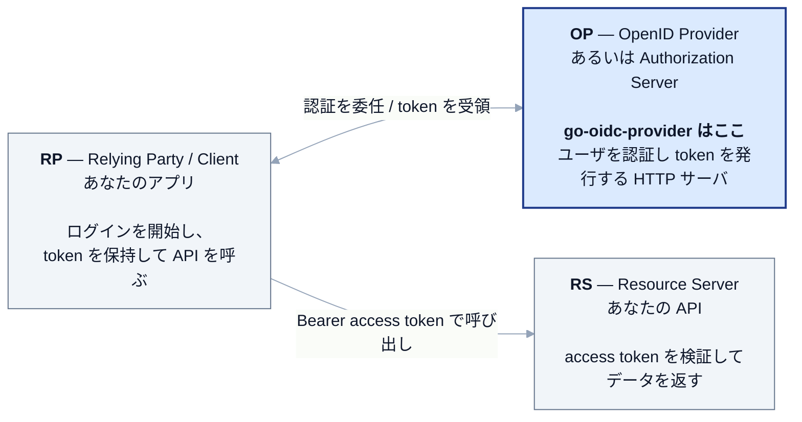
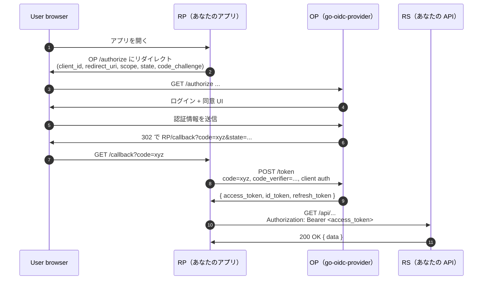

# OAuth 2.0 / OpenID Connect 入門

認証・認可がはじめての方には、関連する規格は略語の羅列に見えるかもしれません: OAuth、OIDC、JWT、OP、RP、RS、PAR、JAR、JARM、DPoP、mTLS、PKCE、FAPI… ですが安心してください。**ロールは 3 つだけ** で、ほとんどの規格はこの 3 ロール間のフローを少しずつ強化したものです。

::: details 略号の早見表(まずここを開いてください)
**3 つのロール**
- **OP**(OpenID Provider) — ユーザを認証してトークンを発行するサーバ。`go-oidc-provider` はここに該当します。純粋 OAuth 文脈では **AS**(Authorization Server)とも呼ばれます。
- **RP**(Relying Party) — OP を使ってユーザをログインさせるクライアントアプリ。**Client** とも呼ばれます。
- **RS**(Resource Server) — アクセストークンを受け取ってデータを返す API。

**トークンと暗号**
- **JWT**(JSON Web Token、RFC 7519) — `header.payload.signature` を `.` で繋いだ base64url 文字列。自己記述的で署名検証可能。
- **JWS**(JSON Web Signature、RFC 7515) — JWT が使う署名方式。
- **JWE**(JSON Web Encryption、RFC 7516) — 暗号化版。外側のエンベロープが内側の JWS を包みます。
- **JWK** / **JWKS**(RFC 7517) — JSON Web Key / Key **Set**。OP の公開鍵集合で `/jwks` から取得します。
- **PKCE**(RFC 7636) — 認可コードに対する所持証明。code 横取り攻撃を防ぎます。発音は「ピクシー」。

**プロファイル / ハードニング略号**
- **PAR**(RFC 9126) — Pushed Authorization Request。RP がまず authorize 要求を OP に POST し、ブラウザは `request_uri` 参照だけを運びます。
- **JAR**(RFC 9101) — JWT-Secured Authorization Request。authorize 要求自体を署名 JWT にします。
- **JARM**(OpenID FAPI) — JWT-Secured Authorization Response Mode。authorize **応答** を署名 JWT にします。
- **DPoP**(RFC 9449) — Demonstrating Proof of Possession。クライアントが保持する鍵にトークンをリクエストごとにバインドします。
- **mTLS**(RFC 8705) — mutual TLS。考え方は DPoP と同じで、バインドの主体がクライアントの TLS 証明書になります。
- **FAPI**(Financial-grade API) — 上記をまとめて固定する OpenID プロファイル。
- **CIBA** — Client-Initiated Backchannel Authentication。ブラウザを持たないデバイスからスマホへ push する別チャネル認証。

**早期に登場する identity claim**
- **`sub`** — Subject。当該 OP におけるユーザの不透明な識別子。
- **`aud`** — Audience。トークンの宛先。
- **`iss`** — Issuer。トークンに署名した OP。
- **`scope`** — 半角スペース区切りの権限リスト(`openid profile email` など)。
- **`acr`**(Authentication Context Class Reference) — 認証手段が提供した保証水準。step-up で使われます。
- **`amr`**(Authentication Methods References) — 実際に使った factor を表す RFC 8176 の値(`pwd`、`otp`、`mfa`、`hwk`、`face`、`fpt`)。
- **`cnf`** — confirmation。トークンが結びついている鍵(DPoP の `jkt` thumbprint または mTLS の `x5t#S256`)。
:::

::: details このページで触れる仕様
- [RFC 6749](https://datatracker.ietf.org/doc/html/rfc6749) — OAuth 2.0 Authorization Framework
- [RFC 6750](https://datatracker.ietf.org/doc/html/rfc6750) — Bearer Token Usage
- [RFC 7519](https://datatracker.ietf.org/doc/html/rfc7519) — JSON Web Token (JWT)
- [RFC 7636](https://datatracker.ietf.org/doc/html/rfc7636) — PKCE
- [RFC 7662](https://datatracker.ietf.org/doc/html/rfc7662) — Token Introspection
- [RFC 9068](https://datatracker.ietf.org/doc/html/rfc9068) — JWT Profile for OAuth 2.0 Access Tokens
- [OpenID Connect Core 1.0](https://openid.net/specs/openid-connect-core-1_0.html)
- [OpenID Connect RP-Initiated Logout 1.0](https://openid.net/specs/openid-connect-rpinitiated-1_0.html)
- [FAPI 2.0 Baseline](https://openid.net/specs/fapi-2_0-baseline.html)
:::

## 3 つのロール



ログインの実際のステップ（`/authorize` への redirect、code 交換、トークン取得）は後段の [認可コード + PKCE フロー](#最もよく見かけるフロー-認可コード-pkce) で詳述します。まずは「誰が何を担当しているか」を押さえてください。

::: tip 同じソフトが複数のロールを兼ねることもある
たとえば「Backend for Frontend」は、ユーザをログインさせる **RP** であると同時に、SPA からアクセストークン付きで呼ばれる **RS** でもあります。
:::

## OAuth 2.0 と OpenID Connect の違い

OAuth 2.0 は **認可の委任** を担う規格です — 「Alice のアプリが、サービス X 上の Alice のデータを読む許可をもらう」。OAuth 2.0 単独では、アプリ側に **Alice が誰なのか** は伝わりません。あくまで不透明なアクセストークンを渡すだけです。

OpenID Connect（OIDC）は **OAuth 2.0 + 身元** を扱う規格です。OP は加えて **ID トークン**（署名付き JWT）を発行し、「このトークンはユーザ `sub=alice123`、audience `client_id=myapp` 向けに、この時刻に発行された。Alice について次の claim が真である」と表明します。

OIDC はさらに `userinfo` エンドポイント、discovery、RP-Initiated Logout、Back-Channel Logout 通知も追加します。

::: details JWT とは
**JWT**（JSON Web Token、RFC 7519）は `header.payload.signature` の 3 つを `.` で繋いだ base64url 文字列です。header と payload は JSON で、signature は受け手が公開鍵で発行者を暗号学的に検証するための部分です。

OIDC では **ID トークンは常に JWT**、本ライブラリのアクセストークンも JWT で発行されます。JSON が読めて署名が検証できるなら JWT は読めます — 独自バイナリ形式は登場しません。
:::

::: details Opaque と JWT の違い
- **Opaque token** — 受け手にとっては意味のないランダム文字列。中身を知るには発行元の introspection エンドポイント（RFC 7662）に問い合わせ、対応する行を引きに行く必要があります。
- **JWT** — 自己記述的。中身がトークンにエンコードされていて、署名の検証だけで（オフラインで）受け手が中身を信用できます。

トレードオフは「リクエストごとに OP に問い合わせるか」対「OP からきめ細かい失効を制御しづらくなるか」のどちらを取るかです。本ライブラリの折衷案は [tokens](/ja/concepts/tokens) を参照してください。
:::

::: details どちらを使えばいい？
- 純粋な OAuth 2.0: 「このトークンは `POST /things` を呼べる」だけが言えれば良い API。サービス間通信でよく使われます。
- OIDC: 人間がログインして、アプリが「こんにちは Alice」と言いたいケース。Web・モバイルのログインはほぼすべて OIDC です。

`go-oidc-provider` はデフォルトで OIDC（`openid` scope 必須）として動作し、`op.WithOpenIDScopeOptional()` で純粋 OAuth 2.0 にも切り替えられます。
:::

## 出てくる 4 種類のトークン

| トークン | 寿命 | 何のためのもの | 行き先 |
|---|---|---|---|
| **認可コード** | 数十秒（既定 60 秒） | 1 回限りの不透明な文字列。 | server-to-server: RP → OP `/token`。 |
| **アクセストークン** | 数分（既定 5 分） | API を呼ぶときの `Authorization: Bearer …` に乗せる。JWT または opaque。 | RP → RS。 |
| **リフレッシュトークン** | 数日〜数週間（既定 30 日） | 長寿命。再認証なしに新しいアクセストークンを取得するために使う。 | RP → OP `/token`。 |
| **ID トークン** | 数分（アクセスに追従） | ユーザが誰かを証明する署名付き JWT。**API には送らない**。 | OP → RP、RP 内で消費。 |

::: warning ID トークンを Bearer に乗せない
よくある落とし穴です。ID トークンの audience は RP であって RS ではありません。API に `Authorization: Bearer` で送ると技術的には通ってしまいますが、意味的には誤り — RP の機微情報（email など）をユーザが触る全 API に晒すことになります。

**API にはアクセストークンを使ってください。** RFC 7662 の introspection、もしくは RFC 9068 の self-contained JWT として検証します。
:::

## 最もよく見かけるフロー: 認可コード + PKCE



「+ PKCE」（`code_challenge` / `code_verifier` で示される部分）は、悪意あるアプリが認可コードを横取りすることを防ぐ仕組みです。詳しくは [認可コードフロー + PKCE](/ja/concepts/authorization-code-pkce) で扱います。

## このサイトでよく出てくる用語

| 用語 | 意味 |
|---|---|
| **Scope** | 半角スペース区切りの権限リスト（例: `openid profile email`）。ユーザがこれに同意します。 |
| **Claim** | トークン内のフィールド（`sub`、`email`、`email_verified` など）。 |
| **Consent**（同意） | 「このアプリはあなたのメールを読みたいと言っています」画面のこと。OP が記録し、同じ scope の次回ログインはスキップします。 |
| **Audience（`aud`）** | トークンの宛先。ID トークンは `aud = client_id`、アクセストークンは `aud = resource server` です。 |
| **Issuer（`iss`）** | トークンに署名した OP。RP も RS も自分の期待値と一致するか確認します。 |
| **JWKS** | JSON Web Key Set。OP の公開鍵集合で、`/jwks` から取得します。RP は ID トークンの検証に使います。 |
| **Discovery document** | `/.well-known/openid-configuration`。エンドポイント、対応 scope、対応 alg などをまとめた JSON カタログ。 |

::: details `acr` と `amr` を 1 段落で
`acr` は認証が **どれだけ強かったか**(`aal2` のような保証水準ラベル)を表し、`amr` は **どの factor を使ったか**(`["pwd","otp"]` のような配列)を表します。RP が機微な操作のために高い保証を要求するときは `acr_values` で高い `acr` を要求し、OP は step-up 認証を実行して ID トークンを再発行します。RFC 8176(Authentication Method Reference Values)が標準 `amr` 値を規定し、RFC 9470(OAuth 2.0 Step Up Authentication Challenge Protocol)が `WWW-Authenticate: error="insufficient_user_authentication"` 経由の step-up を標準化しています。組み込み手順は [MFA / step-up](/ja/use-cases/mfa-step-up) を参照してください。
:::

## FAPI 2.0 が追加するもの

金融グレード・医療グレードの OP を作るなら、OIDC の上に **FAPI 2.0** を乗せる必要があります。送信者制約付きトークン（DPoP / mTLS）、PAR（authorize 要求を先に server-to-server で送る）、JAR（要求自体を署名 JWT にする）、より絞られた alg allow-list が要求されます。本ライブラリではプロファイル指定 1 行で有効化できます。

```go
op.WithProfile(profile.FAPI2Baseline)
```

略号を一通り解説した入門は [FAPI 2.0 入門](/ja/concepts/fapi) にあります。DPoP / mTLS の仕組みは [送信者制約](/ja/concepts/sender-constraint) を、フル構成は [ユースケース: FAPI 2.0 Baseline](/ja/use-cases/fapi2-baseline) を参照してください。

## 続きはこちら

- [認可コードフロー + PKCE](/ja/concepts/authorization-code-pkce) — 上記フローを sequence 図とパラメータ用語集で詳説。
- [Client Credentials](/ja/concepts/client-credentials) — サービス間通信、エンドユーザなし。
- [リフレッシュトークン](/ja/concepts/refresh-tokens) — ローテーション、再利用検知、grace 期間。
- [ID トークン / アクセストークン / userinfo](/ja/concepts/tokens) — 似て非なる 3 つのアーティファクト。
- [送信者制約（DPoP / mTLS）](/ja/concepts/sender-constraint) — FAPI 2.0 が実際に追加する仕組み。
- [FAPI 2.0 入門](/ja/concepts/fapi) — FAPI プロファイルとは何か、PAR / JAR / JARM などの各略号が何をしているか、なぜプロファイルが「OIDC + ベストプラクティス」より勝るのか。
