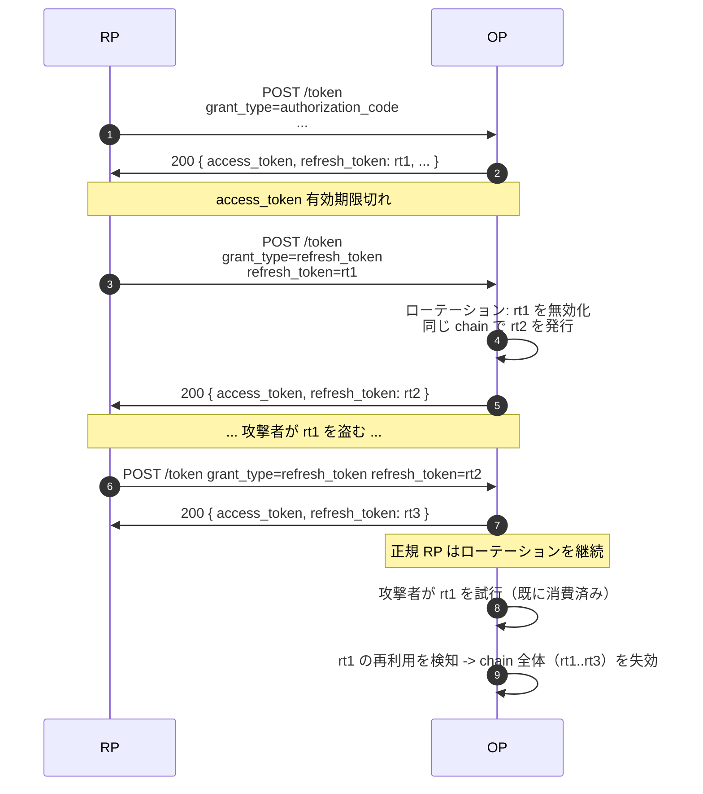

# リフレッシュトークン

**リフレッシュトークン** は、RP が再認証なしに新しいアクセストークンを得るために交換する長寿命のクレデンシャルです。「ログイン状態の維持」はこの仕組みで実現されます。

::: details このページで触れる仕様
- [RFC 6749](https://datatracker.ietf.org/doc/html/rfc6749) — OAuth 2.0 Authorization Framework（§6 refresh）
- [RFC 9700](https://datatracker.ietf.org/doc/html/rfc9700) — OAuth 2.0 Security Best Current Practice（ローテーション・再利用検知）
- [OpenID Connect Core 1.0](https://openid.net/specs/openid-connect-core-1_0.html) — §11（`offline_access`）
:::

::: details 用語の補足
- **ローテーション（rotation）** — リフレッシュトークン交換が成功するたび、古いトークンを無効化して新しいトークンを発行します。古→新のペアは、同じログインに連なる **chain** を形成します。
- **再利用検知（reuse detection）** — 既にローテーション済みのリフレッシュトークンが再提示されたら、OP は盗難シグナルとして扱い、chain 全体を無効化します。下の警告セクションを参照。
- **Grace 期間** — ローテーション直後の小さな猶予窓。前のリフレッシュトークンを再提示しても *同じ* 新ペアが返る（idempotent）ので、クライアント側のリトライ競合を吸収できます。
- **`offline_access` scope** — OIDC が定める「ユーザがその場にいなくてもアプリに動き続けてほしい」を表明する scope。本ライブラリでは、これが付いていない限りリフレッシュトークンを発行しません。
:::

## ローテーションのしくみ

`grant_type=refresh_token` が成功するたびに、リフレッシュトークンは **ローテーション** します — 古いトークンは無効化され、新しいトークンが返されます。



::: warning 再利用検知は chain 全体を無効化
すでにローテーション済みのリフレッシュトークンが再提示されると、OP は「クレデンシャルが盗まれた」シグナルとして扱い、**chain 全体を失効させます** — 盗まれたトークンも、それを起点に発行された正規のトークンも、両方とも無効になります。両者とも再認証が必要です。

これは意図的な挙動です — OP が出せる「何かがおかしい」という最強のシグナルだからです。
:::

::: details ローテーション / 再利用検知 / chain 失効とは
ブログ記事ではしばしば同じ意味で使われる 3 つの用語ですが、本ライブラリでは別物です。

- **ローテーション** — *正常系* の成功経路。`grant_type=refresh_token` が成功するたびに新しいリフレッシュトークンを返し、前のトークンを無効化します。デフォルトは single-use。
- **再利用検知** — すでにローテーション済みのリフレッシュトークンが再度送られてきた状態。漏洩、マルウェア、混乱したクライアントによる複製のいずれかでしか起こり得ません。本ライブラリは盗難として扱います。
- **Chain 失効**（family revocation とも） — 再利用検知への応答。問題のトークンと同じ系統に属するリフレッシュトークン全部が無効化されます — 正規クライアントが今使っている子孫トークンも含めて。次の正規リフレッシュは失敗し、ユーザは再認証することになり、攻撃者の盗難トークンも死にます。

RFC 9700 §2.2.2 が public client に対して要求する挙動で、本ライブラリではクライアント種別を問わずすべての refresh chain で同じ扱いになります。
:::

## Grace 期間

正規クライアントが競合状態（同じリフレッシュトークンを 2 回フェッチしてしまった、など）に陥ったとき、本来なら再利用検知に引っかかってしまいます。`op.WithRefreshGracePeriod(d)` でローテーション後の猶予期間を調整できます。

```go
op.WithRefreshGracePeriod(2 * time.Second)
```

ローテーション成功から `d` 秒以内であれば、前のトークンを再提示しても *同じ* 新トークンが返されます（idempotent）。`d` 秒経過後の再利用は盗難として扱われます。

::: details 受理窓（acceptance window）とは — なぜセキュリティホールにならないか
grace 期間は **受理窓** とも呼ばれます。OP は前のリフレッシュトークンを *まだ現役のように* 受理しますが、返すのは正規クライアントに既に渡したのと *同じ* 冪等な応答だけです。single-use の緩和ではありません — 窓の中で OP が *新しい* トークンを発行することはなく、ネットワーク不調由来のリトライを吸収するために *同じ* 新ペアを再生するだけです。窓が閉じると、前のトークンは「ローテーション済み → 再利用 → chain 失効」の通常経路に戻ります。負の値で完全無効化（厳密な single-use）にできます。代償は、モバイル回線で稀に偽陽性の chain 失効が起きることです。
:::

::: tip デフォルトは 60 秒
デフォルトの grace 期間は **60 秒**（`refresh.GraceTTLDefault`）です — モバイル回線のリトライをカバーする値として選ばれています。`op.WithRefreshGracePeriod(0)` でデフォルトのまま、正の値で延長、負の値で完全無効化（厳密な single-use）。

OFCS のリフレッシュトークン回帰テストはローテーションとリトライの間に約 32 秒待つため、それ以下の grace 期間に縮めると適合性が後退します。
:::

## TTL バケット

| Option | デフォルト | 適用範囲 |
|---|---|---|
| `op.WithRefreshTokenTTL(d)` | 30 日 | 通常のリフレッシュトークン。 |
| `op.WithRefreshTokenOfflineTTL(d)` | `WithRefreshTokenTTL` を継承 | `offline_access` scope で発行されたリフレッシュトークン。 |

バケットを分けることで、`offline_access`（ログイン状態の維持）には長寿命を持たせつつ、通常のリフレッシュトークンは短いローテーション間隔を維持できます。

## 発行の判定

デフォルトでは、リフレッシュトークンが発行されるのは次の **2 つ** が成り立つときだけです。

1. クライアントの `GrantTypes` に `refresh_token` が含まれている。
2. 付与された scope に `openid` が含まれている（本ライブラリでリフレッシュトークンは OIDC の構成要素として扱う）。

どちらか一方でも欠けると、トークンエンドポイントは `access_token` + `id_token` を返して成功扱いとなり、**`refresh_token` フィールドは付きません** —「クライアントが `refresh_token` grant を持っていない」場合と同じ振る舞いです。アクセストークンが切れたら、RP は再度ユーザに認証を求めることになります。

OIDC Core 1.0 §11 のデフォルト(緩やかな)解釈では、`offline_access` は **発行の判定** ではありません。同意プロンプトの UX とリフレッシュトークンの寿命バケット(`WithRefreshTokenTTL` か `WithRefreshTokenOfflineTTL`)を切り替えるだけです。`offline_access` を発行ゲートにしたい場合は `op.WithStrictOfflineAccess()` をオプトインしてください — 次のセクションを参照。

::: details `op.WithStrictOfflineAccess` — OIDC Core §11 の厳格解釈
`op.WithStrictOfflineAccess()` を渡すと、発行とリフレッシュ交換の両方が §11 の厳格解釈に切り替わります — リフレッシュトークンは、付与された scope に `offline_access` が含まれているときに限り発行 / 受理されます。同意プロンプトの内容と発行判定をビット単位で揃えたいときに選んでください。代償として、ログイン状態を維持したい RP はすべて明示的に `offline_access` を要求する必要があります。

このオプションは `op.WithOpenIDScopeOptional` と排他です（`openid` 自体が任意な構成では §11 に意味がないため、両方を同時指定すると `op.New` が拒否します）。
:::

## 監査ログ

token endpoint は `op.WithAuditLogger` 経由で 2 種類の slog 監査イベントを発行します。

| イベント | 発火タイミング |
|---|---|
| `op.AuditTokenIssued` | `authorization_code` 交換時にリフレッシュトークンを発行したとき。 |
| `op.AuditTokenRefreshed` | `refresh_token` grant でリフレッシュトークンをローテーションしたとき。 |

両方とも `extras` に `offline_access`（boolean）と `ttl_bucket`（`"offline"` または `"default"`）を持つので、SOC ダッシュボードは scope を再読することなく「ログイン状態の維持」chain と通常のローテーションを区別できます。

## 続きはこちら

- [ID トークン / アクセストークン / userinfo](/ja/concepts/tokens) — それぞれのトークンが実際に持つ中身。
- [送信者制約](/ja/concepts/sender-constraint) — アクセストークン（とリフレッシュトークン）をクライアント保有の鍵にバインドする。
