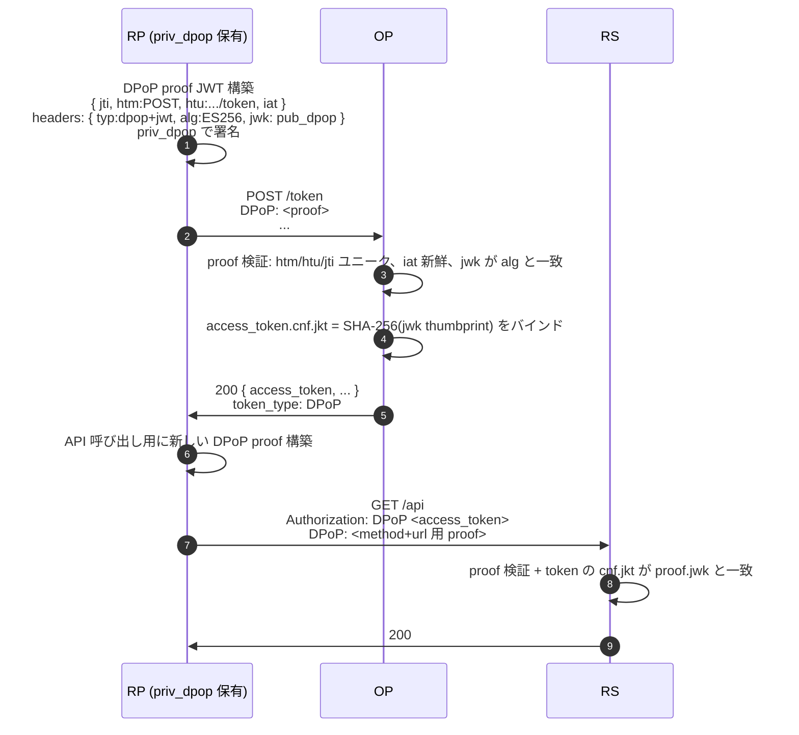
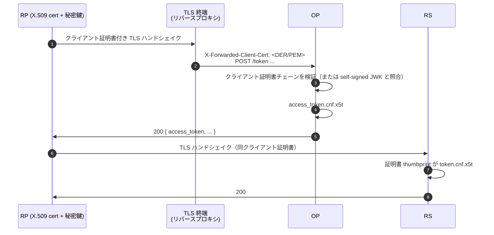

# 送信者制約 — DPoP / mTLS

保護のない Bearer トークンは **bearer-authoritative** です — バイト列を持つ者が API を呼べてしまいます。トークンが漏れる（ログ、中継、ブラウザ拡張）と、漏らした側はトークン期限まで全アクセス権を持ちます。

**送信者制約付き** access token は、正規クライアントが保有する鍵にバインドされます。トークンが漏れても、鍵を一緒に盗まないと使えません。

::: details このページで触れる仕様
- [RFC 9449](https://datatracker.ietf.org/doc/html/rfc9449) — DPoP (Demonstrating Proof of Possession)
- [RFC 8705](https://datatracker.ietf.org/doc/html/rfc8705) — Mutual-TLS Client Authentication and Certificate-Bound Access Tokens
- [RFC 7800](https://datatracker.ietf.org/doc/html/rfc7800) — Confirmation (`cnf`) claim
- [RFC 8725](https://datatracker.ietf.org/doc/html/rfc8725) — JWT Best Current Practices
- [FAPI 2.0 Baseline](https://openid.net/specs/fapi-2_0-baseline.html)
:::

::: details 用語の補足
- **Bearer トークン** — 持っている人に権限を与えるトークン（RFC 6750）。`Authorization: Bearer <token>` で送る。鍵は必要ない。
- **`cnf` claim**（"confirmation"、RFC 7800） — access token の中に入るフィールドで、正規クライアントが保有する鍵を記録します。RS は呼び出し側が一致する鍵を使っているかを `cnf` で確認します。
- **thumbprint** — 公開鍵（または X.509 証明書）の SHA-256 ハッシュ。`cnf` の中で安定した短い識別子として使われます。
:::

本ライブラリには 2 つの方式があり、いずれも RFC に裏打ちされています:

- **DPoP**（Demonstrating Proof of Possession、RFC 9449） — クライアントがリクエストごとに小さな proof JWT を秘密鍵で署名。通常の HTTPS で動作。
- **mTLS**（Mutual TLS、RFC 8705） — クライアントが TLS ハンドシェイクで X.509 証明書を提示し、OP が発行トークンを証明書 thumbprint にバインド。

FAPI 2.0 Baseline は **どちらか一方** での送信者制約付きトークンを要求し、本ライブラリは両方を受理します。

## DPoP — 動作



リクエスト毎にクライアントは *新しい* DPoP proof を作ります（異なる `jti`、異なる `htm`/`htu`）。RS は次のものを拒否します:

- token の `cnf.jkt` と一致しない鍵で署名された proof。
- 再利用された `jti`。
- 異なる method または URL の proof。
- freshness 窓外の `iat` を持つ proof。

::: details DPoP nonce (RFC 9449 §8)
高セキュリティ deployment では、OP が DPoP proof 内のサーバ供給 nonce を要求できます。最初のリクエストは `DPoP-Nonce: <nonce>` と `use_dpop_nonce` エラーを返し、クライアントは次の proof に nonce を埋めて再試行します。これによりオフライン事前計算 proof が無効化されます。

`op.WithDPoPNonceSource(source)` で nonce 生成器を差し込みます（in-memory または分散）。FAPI 2.0 Message Signing は nonce を強制し、Baseline は許可。詳細は [`examples/51-dpop-nonce`](https://github.com/libraz/go-oidc-provider/tree/main/examples/51-dpop-nonce)。
:::

## mTLS — 動作

TLS ハンドシェイク自体がクライアントを認証します。



RFC 8705 のサブモード 2 つ:

- `tls_client_auth` — PKI 発行証明書、OP がトラストストアに対してチェーン検証。
- `self_signed_tls_client_auth` — クライアントが公開 JWK を登録、OP が証明書の公開鍵と照合。

::: warning mTLS Proxy ヘッダ
OP はほぼ常に TLS 終端 proxy（nginx / envoy / クラウド LB）の **背後** で動きます。proxy が検証済みクライアント証明書をヘッダで渡します。`op.WithMTLSProxy(headerName, trustedCIDRs)` で両方を設定:

```go
op.WithMTLSProxy("X-SSL-Cert", []string{"10.0.0.0/8"})
```

CIDR リストで信頼 proxy 範囲を pin し、その範囲外からの偽造ヘッダ付きリクエストを拒否します。
:::

## どちらを使うか

| シナリオ | DPoP | mTLS |
|---|---|---|
| Public クライアント（SPA / モバイル） | ✅ — クライアントが鍵をメモリ / セキュアストレージに保持。 | ❌ — public OP に対してクライアントが mTLS を確立できない。 |
| Confidential クライアント（サービス間） | ✅ | ✅ |
| クライアント身元用 PKI が既にデプロイ済 | 可 | ✅ — それを再利用。 |
| クライアント証明書を配布したくない | ✅ | ❌ |
| リクエスト単位のリクエストバインド（htm/htu） | ✅ — proof が method + URL を含む。 | ⚠️ — チャネルのみがバインドされる。 |
| FAPI 2.0 Baseline | ✅ | ✅ |
| FAPI 2.0 Message Signing | ✅ | ✅ |

混在環境では両方を有効化 — OP が discovery 両方を出し、クライアントがリクエスト毎に選びます。

## トークンが漏れたとき何が変わるか

保護のない Bearer:
- 漏らした側がトークンを `exp` まで replay できてしまいます。

DPoP バインド:
- 漏らした側は `cnf.jkt` に対応する秘密鍵も必要です。それが無ければ proof チェックで全 API 呼び出しが失敗します。

mTLS バインド:
- 漏らした側は X.509 証明書 **と** その秘密鍵も必要です — `cnf.x5t#S256` と一致する thumbprint の TLS セッションを再確立できなければ通りません。

## 実装サマリ

```go
import (
  "github.com/libraz/go-oidc-provider/op"
  "github.com/libraz/go-oidc-provider/op/profile"
  "github.com/libraz/go-oidc-provider/op/feature"
)

op.New(
  /* 必須オプション */
  op.WithProfile(profile.FAPI2Baseline),     // 送信者制約を必須化
  op.WithFeature(feature.DPoP),               // DPoP 有効化 — 少なくとも 1 つ選ぶ
  op.WithFeature(feature.MTLS),               // (および / または) mTLS 有効化
  op.WithMTLSProxy("X-SSL-Cert", trustedCIDRs),
  op.WithDPoPNonceSource(myNonceSource),     // 任意、RFC 9449 §8
)
```

::: tip プロファイルは要件を課す、binding は組み込み側が選ぶ
`op.WithProfile(profile.FAPI2Baseline)` は PAR と JAR を自動有効化し、加えて `RequiredAnyOf` 制約を課します。組み込み側は `op.WithFeature` で `feature.DPoP` か `feature.MTLS` の **少なくとも 1 つ** を明示的に有効化する必要があります。どちらも有効化されていなければ、`op.New` が構築時に構成を拒否します。両方を有効化すれば両 binding が使えるようになり、discovery document にも両方が出ます。
:::
