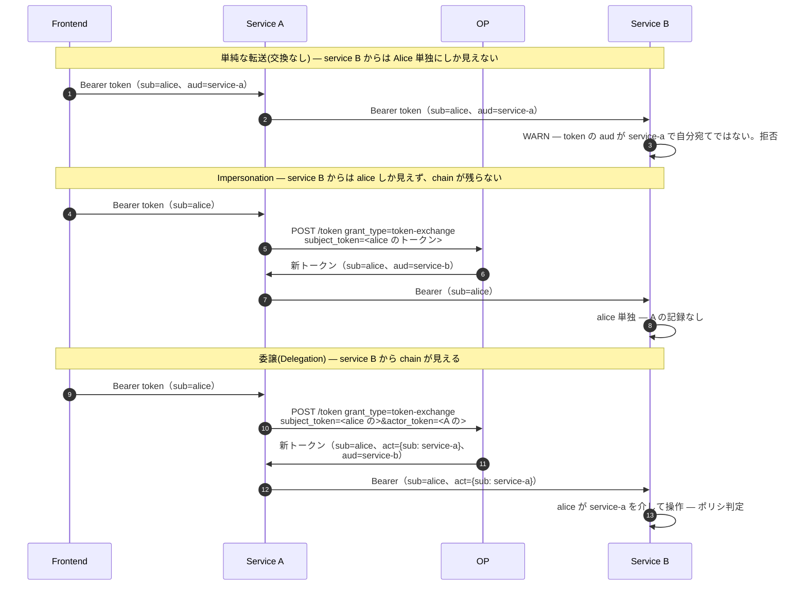

# Token Exchange（RFC 8693）

現代のマイクロサービス構成では、**ユーザの代理として他のサービスを呼ぶ** 場面がほぼ必ずあります。frontend がトークンを取り、service A がそれを受け取り、service A が service B を呼ぶ。service A はユーザのトークンをそのまま使うべきか、新しく取り直すべきか、両方を組み合わせるべきか? RFC 8693 はこのトークン交換の通信路上の形式を定義します。

設計上、2 つの意図を本質的に区別します:

- **Impersonation(なりすまし)** — service A はユーザのトークンをそのまま service B に提示する。**ユーザ本人として** ふるまう。service B からは `sub=alice` に見え、下流の監査ログには Alice 単独の操作として記録される。
- **Delegation(委譲)** — service A は OP に対し新しいトークンの発行を依頼する。`sub` はやはり Alice だが、**`act` claim** に `{sub: service-a}` が入り、Alice の権限が service A 経由で行使されていることを記録する。service B からは `sub=alice, act={sub: service-a}` に見えて、chain に依存するポリシー判定(「service A は Alice の振込を実行してよいが、リクエスト元が Alice 自身からの場合に限る」)が可能になる。

近年の脅威モデルでは委譲(delegation)のほうが望ましいとされています。監査の連鎖が途切れず、失効を中継 service 単位で当てられ、最小権限の境界が subject 全体に広がるのではなく actor 単位で絞り込めるためです。

::: details このページで触れる仕様
- [RFC 8693](https://datatracker.ietf.org/doc/html/rfc8693) — OAuth 2.0 Token Exchange
- [RFC 8707](https://datatracker.ietf.org/doc/html/rfc8707) — Resource Indicators（`audience` / `resource` で使用）
- [RFC 7800](https://datatracker.ietf.org/doc/html/rfc7800) — Confirmation(`cnf`)claim — 発行トークンを呼び出し actor の DPoP / mTLS 鍵に再バインド
:::

::: details 用語の補足
- **subject_token** — 新トークンの `sub` を構成する identity の保持者となるトークン。通常は上流から転送されてきたユーザのアクセストークン。
- **actor_token** — 交換を実行する呼び出し元(service)を識別するトークン。存在すると新トークンには `act` claim が付与され、actor の `sub` / `client_id` がそこに包まれる。
- **`act` claim**(RFC 8693 §4.1) — `sub` の代わりに行動している主体を記録する入れ子オブジェクト。連鎖でき(`act.act.act…`)、4 ホップの呼び出しなら 4 つの中継 service をすべて記録できる。
- **`cnf` の再バインド** — 発行トークンの `cnf`(RFC 7800 confirmation)は、subject ではなく **呼び出し actor** の DPoP / mTLS proof に設定される。トークンは交換を実行する service に対して送信者制約が掛かる(sender-bound)。
:::

## なりすまし(Impersonation)と委譲(Delegation)を並べて見る



差は監査ログ(service B が呼び出しの起点を知れる)と認可ポリシー(センシティブな操作で actor を要求できる)に現れます。

## OP が強制すること

仕様がデプロイ側のポリシーに委ねている項目のうち、本ライブラリの RFC 8693 ハンドラはいくつかについて独自の方針を採っています:

- **`act` chain は OP 側で構築する**。呼び出し側が手で渡すのではない。`actor_token` が `subject_token` と異なる場合、OP は actor の検証済み credential から `act` を構成する。呼び出し側に `act` を捏造させない。
- **audience は明示 + 許可リスト必須**。RFC 8707 audience(`audience` / `resource` パラメータ)は正規化され、このクライアントがターゲットにできる audience はポリシーで決める。
- **scope は積集合(intersection)**。和集合(union)ではない。発行トークンの scope は(要求 scope、`subject_token` の scope、呼び出し client の許可リスト)の積集合。RFC 8693 §3.1 は scope の縮小は許すが、OP は scope の膨張(inflation)を禁止する。
- **TTL は上限で頭打ちにする**。(handler 希望、`subject_token` の残り寿命、OP のグローバル上限)の最小値まで切り詰められる。長寿命トークンをさらに長いトークンへ伸ばすロンダリングはできない。
- **`cnf` は呼び出し actor に再バインドする**。service A が交換リクエストに DPoP proof を提示すれば、発行トークンの `cnf.jkt` は service A の DPoP 鍵に一致する — ユーザのものでも `subject_token` のものでもない。service B は新トークンの `cnf` に対して DPoP proof を検証する。

これらは組み込み側が提供する [`TokenExchangePolicy`](https://github.com/libraz/go-oidc-provider/blob/main/op/tokenexchange.go) が呼ばれる **前** に強制されます。ポリシー側はさらに絞り込むこと(特定 audience を拒否、特定の actor 組み合わせを拒否など)はできますが、広げることはできません — OP が計算したデフォルトが下限です。

## 実際に必要になるとき

Token exchange が **不要** な場合:

- 両 service を同じチームが所有し暗黙に信頼している。ユーザのトークンをそのまま multi-`aud` で使う。
- 下流 service が上流 actor を知る必要がない。ユーザのトークンを適切な `aud` で受け渡す。

Token exchange が **必要** な場合:

- 下流 service が **chain に誰がいるか** に応じてポリシーを適用する — 「振込 service はモバイルアプリを信頼するが SMS bot は信頼しない、Alice として呼ばれていても」。
- chain にサードパーティ service が含まれていて、cross-org actor の記録が audit 義務として必要。
- Sender-binding（DPoP / mTLS）を、ユーザではなく **呼び出し service** に追従させたい。

## 動かしてみる

[`examples/32-token-exchange-delegation`](https://github.com/libraz/go-oidc-provider/tree/main/examples/32-token-exchange-delegation) は frontend → service-a → service-b の chain を実演します。frontend がユーザトークンを取得、service-a がそれを委譲付きトークン(`act={sub: service-a}` を伴う)に交換、service-b の RS 側 verifier が `act.sub` をたどって委譲付きトークンのみを受理します。

```sh
go run -tags example ./examples/32-token-exchange-delegation
```

example はロール別ファイルに分割されています（`op.go` で OP の組み立て + `TokenExchangePolicy`、`service_a.go` で中継、`service_b.go` で resource server、`probe.go` で self-verification）。

## 続きはこちら

- [ユースケース: token-exchange の組み込み](/ja/use-cases/token-exchange) — `op.RegisterTokenExchange`、`TokenExchangePolicy` の契約、audience の構成、`op.PtrBool(true)` による refresh 発行のオプトイン。
- [Custom Grant の組み込み](/ja/use-cases/custom-grant) — token exchange は OP がルーティングする「カスタム grant_type」の同梱例。独自 URN を書く組み込み側は `op.WithCustomGrant` 経由で同じ形をたどる。
