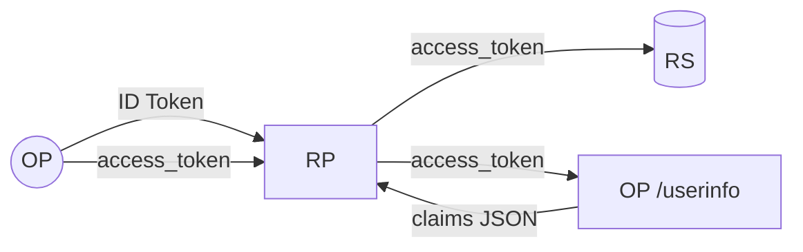

# ID Token / access token / userinfo

OIDC は 3 種の identity アーティファクトを発行します。一見どれもユーザ情報を持ち、どれも OP が発行するので交換可能に見えますが、別物です。これを混同するのはバグの典型例です。

::: tip 30 秒で頭に入れる相関図
- **ID Token** — 「このユーザがここでログインした」という署名付きの領収書。audience は RP。API には送らない。
- **Access token** — RP が API に渡す Bearer 資格情報。audience はリソースサーバ。**既定形式は JWT（RFC 9068）、opaque はオプトイン。**
- **UserInfo** — `GET /userinfo` に access token を載せて最新 claim を取りに行くエンドポイント。トークンではなく JSON レスポンス。
:::

::: details このページで触れる仕様
- [RFC 6749](https://datatracker.ietf.org/doc/html/rfc6749) — OAuth 2.0 Authorization Framework
- [RFC 6750](https://datatracker.ietf.org/doc/html/rfc6750) — Bearer Token Usage
- [RFC 7009](https://datatracker.ietf.org/doc/html/rfc7009) — Token Revocation
- [RFC 7517](https://datatracker.ietf.org/doc/html/rfc7517) — JSON Web Key (JWK)
- [RFC 7519](https://datatracker.ietf.org/doc/html/rfc7519) — JSON Web Token (JWT)
- [RFC 7662](https://datatracker.ietf.org/doc/html/rfc7662) — Token Introspection
- [RFC 8176](https://datatracker.ietf.org/doc/html/rfc8176) — Authentication Method Reference Values
- [RFC 8705](https://datatracker.ietf.org/doc/html/rfc8705) — Mutual-TLS Client Authentication and Certificate-Bound Access Tokens
- [RFC 8707](https://datatracker.ietf.org/doc/html/rfc8707) — Resource Indicators for OAuth 2.0
- [RFC 9068](https://datatracker.ietf.org/doc/html/rfc9068) — JWT Profile for OAuth 2.0 Access Tokens
- [RFC 9449](https://datatracker.ietf.org/doc/html/rfc9449) — DPoP
- [RFC 9470](https://datatracker.ietf.org/doc/html/rfc9470) — Step-up Authentication
- [OpenID Connect Core 1.0](https://openid.net/specs/openid-connect-core-1_0.html) — §2（ID Token）、§5.3（UserInfo）、§3.1.2.1（nonce）、§5.5（claims request）
- [OpenID Connect RP-Initiated Logout 1.0](https://openid.net/specs/openid-connect-rpinitiated-1_0.html)
:::

::: details JWT とは
**JWT**（JSON Web Token、RFC 7519）は `header.payload.signature` の 3 つを `.` で繋いだ base64url 文字列です。header と payload は JSON、signature は対応する秘密鍵の保有者から来たものであることを暗号学的に検証する部分です。

OIDC では **ID Token は常に JWT** です。本ライブラリの access token も JWT（RFC 9068）で発行されます。UserInfo は JWT ではなく、ただの JSON HTTP レスポンスです。
:::

## 一覧

| アーティファクト | 形式 | Audience (`aud`) | 行き先 | 寿命 | 読む人 |
|---|---|---|---|---|---|
| **ID Token** | 署名 JWT（常に） | RP の `client_id` | OP → RP のみ | 数分（既定 5 分） | RP（誰がログインしたか確認） |
| **Access token** | JWT（RFC 9068）— 詳細は後述 | RS 識別子 | RP → RS（`Authorization: Bearer`） | 数分 | RS（API 呼び出しの認可） |
| **UserInfo response** | JSON | n/a（RP の `client_id` 暗黙） | RP → OP `/userinfo`（access token 付き） → RP | リクエスト毎 | RP（最新 claim 取得） |



## ID Token —「誰がログインしたか」

**OIDC Core 1.0 §2** で定義される署名付き JWT。RP は OP の JWKS（RFC 7517）で署名を検証し、`iss`、`aud`、`exp`、（あれば）`nonce` を確認します。標準 claim:

| Claim | 意味 | 仕様 |
|---|---|---|
| `iss` | Issuer（OP）。RP の期待値と一致すること。 | OIDC Core §2 |
| `sub` | Subject 識別子 — OP 内で安定なユーザ ID。 | OIDC Core §2 |
| `aud` | Audience — RP の `client_id` を含むこと。 | OIDC Core §2 |
| `azp` | Authorized party — トークンを要求した `client_id`（`aud` に複数値があるとき）。 | OIDC Core §2 |
| `exp` / `iat` | 有効期限 / 発行時刻。 | RFC 7519 |
| `nonce` | authorize 要求の `nonce` をエコー。リプレイ防御。 | OIDC Core §3.1.2.1 |
| `auth_time` | ユーザが認証した時刻（発行時刻ではなく）。 | OIDC Core §2 |
| `acr` | Authentication Context Class Reference — 認証手段の保証水準。 | OIDC Core §2 / RFC 9470 |
| `amr` | Authentication Methods References — `pwd`、`otp`、`mfa`、`hwk` 等。 | RFC 8176 |

::: details `acr` とは
**`acr`**（Authentication Context Class Reference）は「ログインの強度」を表す 1 本の文字列です。語彙は OP 側で決めて構わず、`urn:mace:incommon:iap:silver`、NIST SP 800-63 のレベル、FAPI 系の `urn:openbanking:psd2:sca` などが代表例です。RP は `/authorize` の `acr_values=...` で最低水準を要求し、ユーザのセッションがそれを満たせない場合、OP は再認証を促す（step-up、RFC 9470）か要求を拒否します。`amr` と混同しないでください — `acr` は *水準*、`amr` は *その水準に到達するために使った手段* です。
:::

::: details `amr` とは
**`amr`**（Authentication Methods References、RFC 8176）は、今回のセッションでユーザが実際に提示した *要素* を表す短い文字列の配列です。`pwd`（パスワード）、`otp`（ワンタイムコード）、`mfa`（複数要素を使った）、`hwk`（ハードウェアキー）、`face`（顔認証）など。RP は信頼判断ではなく監査やポリシー（「管理コンソールには `mfa` を必須」など）の文脈で読みます — 信頼判断は `acr` の役目です。
:::

::: details `auth_time` とは
**`auth_time`** は、ユーザが *OP に対して認証した* 時刻の Unix timestamp です。`iat`（*このトークン* が発行された時刻）とは別物です。1 時間前にログインしたユーザがリフレッシュ直後だと、`iat` は新しくても `auth_time` は古いままになります。RP は `max_age` ポリシー（「30 分以上経っていたら再認証」）の判定に使い、OP は RP が `/authorize` に `max_age` を載せて来たときにサーバ側でも強制します。
:::

::: details `azp` とは
**`azp`**（Authorized Party）は、ID Token を *要求した* `client_id` です。意味があるのは `aud` に複数値が入っているときだけ — そのケースで「複数 audience のうちどれが実際に authorize 要求を駆動したか」を曖昧でなく示します。単一 RP の通常ケースでは `aud` が `[client_id]` 1 件で済むので `azp` は省略されます。RP は「`aud` が複数あるのに `azp` が欠けている / 自分の `client_id` と一致しない」ID Token を拒否すべきです。
:::

::: details JWKS とは
**JWKS**（JSON Web Key Set、RFC 7517）は OP が `/jwks`（discovery document に記載）で配信する JSON 文書です。OP の **公開鍵** の一覧が入っており、RP は一度取得してキャッシュし、ID Token の署名をオフラインで検証するのに使います。OP は鍵をローテーションするとき、署名に使う前に新鍵を JWKS に載せて先行公開するので、RP は再取得すればそのまま追従できます。
:::

::: warning ID Token を `Authorization: Bearer` に乗せない
ID Token の audience は RP であって RS ではありません。Bearer として API に送ると *技術的には* 通ってしまいます（JWT なので）が、意味的には誤りで、RP のシークレット相当 claim（email など）をユーザが触る全 API に晒すことになります。**API には access token を使ってください。**
:::

## Access token —「このクライアントはこの API を呼べる」

リソースサーバ（RS）が検証する Bearer トークン（RFC 6750）。OAuth の文献では古典的に 2 つの形式が並べられます:

| 形式 | 検証方法 | OP 側の状態 |
|---|---|---|
| **Opaque** | RS が毎回 `/introspect`（RFC 7662）を呼ぶ。 | OP がトークンに対応する行を保持。 |
| **JWT (RFC 9068)** | RS が署名 + `aud` + `exp` を self-contained に検証。 | ステートレス — 検証に行は不要。 |

### ここが本題: session_end / userinfo / revocation はトークン履歴に依存する

::: warning 純粋ステートレス JWT には「まだ有効か」を表す手段が `exp` 以外にない
スライド上はきれいに見えますが、本番では複数の OIDC フローを壊します。ステートレス JWT access token を運用する OP は「失効処理そのものを諦める」か「外部 deny-list を別途用意する」かの二択になります。
:::

| フロー | 本来の判定 | 純粋ステートレス JWT で壊れる箇所 |
|---|---|---|
| **`/userinfo`**（OIDC Core §5.3） | このトークンは今もユーザを正しく代表しているか | OP が参照する材料を持たない。ログアウト済みユーザに対しても claim が返る。 |
| **`/end_session`**（RP-Initiated Logout） | セッションを終了させる | JWT は `exp` まで動き続ける。「ログアウト」した直後でも、漏洩したトークンがあと 10 分 API を叩ける。 |
| **`/revoke`**（RFC 7009） | 特定トークンを無効化 | no-op。RFC 7009 §2.2 自身、self-contained トークンには revocation を未対応にしてよいと明記。 |
| **`/introspect`**（RFC 7662） | revoke 済みトークンに `active: false` を返す | 反映できるのは署名 / `exp` だけ。セッション状態には到達しない。 |

「JWT vs opaque」記事ではしばしば軽く流される論点ですが、本番運用では重く効いてきます。

### 本ライブラリの設計

本ライブラリは JWT（RFC 9068）を既定とし、opaque をオプトインとして用意します。どちらの形式も **OP 側で revoke 可能** です。意味があるのは次の 2 軸: **(1) RS は毎リクエスト OP に問い合わせる必要があるか?** と **(2) ログアウトカスケードはどこまで届くか?** です。

| | **既定 — JWT（RFC 9068）** | **オプトイン — Opaque** |
|---|---|---|
| 通信路上の形式 | base64url JWT（`header.payload.signature`） | ランダムな bearer 文字列 |
| RS 側の検証 | JWKS でオフライン検証 | リクエスト毎に `/introspect` を呼ぶ |
| 発行時の OP 側状態 | なし — JWT の `gid` private claim だけ | `store.OpaqueAccessTokenStore` にハッシュ化した行 |
| カスケードの到達範囲 | OP が経由する境界（`/userinfo`、`/introspect`） | RS の全リクエスト |
| 発行時の監査証跡 | 既定では無し。`RevocationStrategyJTIRegistry` をオプトインすると発行ごとに 1 行 | 発行ごとに 1 行(自動) |
| 設定方法 | （既定） | `op.WithAccessTokenFormat(...)` あるいは RFC 8707 の resource 毎に `op.WithAccessTokenFormatPerAudience(...)` |

::: warning カスケードの及ぶ範囲は形式に依存する
`/userinfo`・`/introspect`・`/revoke`・`/end_session`・認可コード再利用検出のカスケードはすべて OP 側の状態を参照します。revoke 済み / ログアウトでカスケード失効したトークンは `/userinfo` で `WWW-Authenticate: Bearer error="invalid_token"` を返して拒否されます — JWT の署名がまだ通っていてもです。

**ただし、検証経路が OP を経由する場合に限ります。** JWKS でオフライン検証している RS は次の refresh ローテーションまでカスケードを察知しません。

opaque 形式はこのギャップを閉じます — すべての使用が OP 解決になるためです。
:::

::: details `jti` / `gid` / tombstone とは
各 access token JWT は `jti`（RFC 7519 §4.1.7、トークンごとの一意 ID）と `gid` という private claim（OP 側の GrantID、omitempty）を含みます。`gid` は OP だけが解釈する claim で、RS は無視します。

**既定 — grant-tombstone 戦略。** OP は grant ごとの小さな tombstone テーブルを保持し、検証時に JWT の `gid` を tombstone と突き合わせます。単一 AT の `/revocation` は `jti` をキーにした deny-list 行を 1 件書き込みます。定常状態の行数は `O(失効した grant 数 + 失効した jti 数)` であり、`O(発行数)` ではありません。

**オプトイン — JTI registry 戦略**（`RevocationStrategyJTIRegistry`）。OP は発行ごとに `jti` をキーにした shadow 行を 1 件書き込み、失効時には行の `Revoked` 列を反転させます。発行ごとの監査証跡が必要なときに有効。

**Opaque 形式。** 別サブストアを使います: 行は bearer ID の SHA-256 digest をキーにし、RS は JWT を解読するのではなく `/introspect` を呼んで行に到達します。
:::

::: tip JWT と opaque の選択は意図的な設計判断
トレードオフ・負荷の形・設定オプションは専用ページにまとめてあります: [Access token の形式 — JWT と opaque](/ja/concepts/access-token-format)。`WithAccessTokenFormat` を切り替える前に必ず読んでください — この選択は RS のコード、運用上のレイテンシ、そして自分のデプロイにとって「ログアウトされた」が何を意味するか、に直接効いてきます。
:::

::: info `aud` についての注意
access token の `aud` は **`client_id` ではなく**、リソースサーバの識別子です（クライアント seed の `Resources []string` フィールド、またはランタイムの RFC 8707 `resource` リクエストパラメータで決定）。
:::

## RS 側での `/introspect` のキャッシュ戦略

`/introspect`（RFC 7662）への OP の応答は、*その応答を発行した瞬間* についての権威ある回答です。RS 側でこの応答をキャッシュすること自体は仕様上認められており、レイテンシ要件によっては必須ですが、トークンの **失効到達距離** が変わります — 「OP でこのトークンが revoke された」から「この RS が拒否し始める」までの時間が、キャッシュ TTL の分だけ広がります。

| キャッシュ戦略 | レイテンシ / OP 負荷 | 失効ギャップ |
|---|---|---|
| **キャッシュなし** — RS は API 呼び出しごとに `/introspect` を呼ぶ。 | RS のホットパスでレイテンシが最大、OP の `/introspect` が呼び出しごとの依存になる。 | ゼロ — API 呼び出しは毎回 OP の現在状態を観測。 |
| **長いキャッシュ**（例: 5 分） | OP 負荷は最小、ただしキャッシュエントリが期限切れになるまで失効が伝播しない。 | TTL の分まで — ログアウトしたユーザのトークンがキャッシュ窓の残り時間だけ動き続ける。 |
| **短いキャッシュ**（60 秒以下） | OP 負荷は有界、レイテンシペナルティは窓の最初の呼び出しのみ。 | TTL の分まで — 多くの運用セキュリティ要件を満たすほど短く、バーストを吸収するには十分長い。 |

::: tip 推奨デフォルト
- **キャッシュキーは access token のハッシュ**（bearer 文字列の SHA-256）にする。`client_id` 単独はダメ — 同じクライアントの異なるセッションがキャッシュ行を共有してしまう。
- **セキュリティ重視 API は TTL 60 秒以下** — アカウント変更、決済、管理用エンドポイントなど。30 秒は無難なデフォルトで、ギャップを「ユーザが気付かない程度」に抑えられます。
- **`op.AuditTokenRevoked` を購読しているなら、それで invalidate する。** RS が OP の監査ストリームに繋がっていれば、有界ギャップは「監査パイプラインの伝播速度」相当 — 通常は 1 秒以下になります。
- **破壊的アクションではキャッシュしない。** アカウント削除、送金、ロール付与、巻き戻しできない書き込みは、毎回 OP に再確認を取ってください。レイテンシコストは確かに発生しますが、代替は「ユーザがログアウトボタンを押したのにキャッシュ窓の間に攻撃者が口座を空にした」です。
:::

このトレードオフは revocation 有効の JWT access token にも対称に当てはまります。JWT の検証は JWKS に対するオフライン検証 — RS は OP を呼ぶ必要すらありません — が、**オフライン検証では失効が見えません**。OP が経由する境界（`/introspect`・`/userinfo`）と、その背後の grant-tombstone 参照こそが失効の正本です（tombstone 戦略については[設計判断 #19](/ja/security/design-judgments#dj-19) を参照）。`/userinfo` と同じ失効到達距離を RS で得たい場合は、次のいずれかになります:

1. `/introspect` を呼ぶ（上記いずれかのキャッシュ戦略と組み合わせて）
2. OP の監査ストリームを購読して、`op.AuditTokenRevoked` をオフライン JWT 検証用の deny-list ソースとして扱う

どちらもしない — 純粋オフライン JWT 検証、introspection なし、監査購読なし — を選ぶと、失効はリフレッシュトークンの次回ローテーション時にしか伝播しません。低リスク API では受容可能な選択ですが、これは意図的なトレードオフであって、仕様が暗黙に保証してくれる既定値ではありません。

## UserInfo —「この access token に対する最新 claim をくれ」

`GET /userinfo`（OIDC Core §5.3）に access token を載せて呼ぶだけ。access token の scope の範囲でユーザ claim の JSON を返します。

```sh
curl -H "Authorization: Bearer <access_token>" https://op.example.com/oidc/userinfo
# {
#   "sub": "alice123",
#   "email": "alice@example.com",
#   "email_verified": true,
#   ...
# }
```

::: tip UserInfo を使うべきとき
- **ID Token claim** はログイン時点のスナップショットです。
- **UserInfo** は最新値の参照経路 — ユーザが変えうる値（表示名など）が必要なら呼びます。

ほとんどのアプリは ID Token claim で足ります。UserInfo は最新性が必要なときに使ってください。実装上は、ライブラリが access token の shadow 行を先に確認するので、ログインから UserInfo 呼び出しまでの間に revoke されたトークンは、JWT の署名が通っていても拒否されます。
:::

## 設定オプション

| オプション | 制御対象 | 既定 |
|---|---|---|
| `op.WithAccessTokenTTL(d)` | access token 寿命 | 5 分 |
| `op.WithRefreshTokenTTL(d)` | refresh token 寿命 | 30 日 |
| `op.WithRefreshTokenOfflineTTL(d)` | `offline_access` refresh token 寿命 | `WithRefreshTokenTTL` 継承 |
| `op.WithClaimsSupported(...)` | OP が返せる claim の列挙。discovery document に出る | — |
| `op.WithClaimsParameterSupported(true)` | OIDC §5.5 の `claims` 要求パラメータを解釈してトークンに反映 | off |
| `op.WithStrictOfflineAccess()` | 発行とリフレッシュ交換を OIDC Core §11 の厳格解釈に切り替え、`offline_access` が granted scope に含まれているときに限り refresh token を発行・受理する（下の callout 参照） | off（緩い設定。`openid` + クライアントの `refresh_token` grant で発行）|

::: details `offline_access` とは
**`offline_access`** は OIDC 標準 scope（Core §11）で、「ユーザがその場にいなくてもアプリに動き続けてほしい」を表明する scope です。実運用上は、リフレッシュトークン発行に対するユーザ向け同意ゲートとして働きます。OP は通常より強い同意プロンプト（「あなたが居ないときも、このアプリはあなたの代わりに動けます」）を出し、本ライブラリではここで発行されたリフレッシュトークンを別 TTL バケット（`WithRefreshTokenOfflineTTL`）に振り分けるので、ログイン状態の維持フローを通常の短寿命リフレッシュより長く生かせます。
:::

::: details `WithStrictOfflineAccess` を入れる理由
OIDC Core §11 の既定（緩やかな）解釈では、granted scope に `openid` が含まれ、かつクライアントの `GrantTypes` に `refresh_token` がある場合に refresh token が発行されます。このとき `offline_access` は同意プロンプトの UX とどの TTL バケットを使うかを切り替えるだけです。同意プロンプトと実際の発行ゲートをビット単位で揃えたいときに厳格解釈を選んでください。代償として、ログイン状態を維持したい RP はすべて明示的に `offline_access` を要求する必要があります。
:::

## 次に読む

- [Access token の形式 — JWT と opaque](/ja/concepts/access-token-format) — 既定の JWT とオプトインの opaque、その設計判断。負荷の形、ヘッダサイズ、失効の到達範囲、混在デプロイ向けの per-audience 選択。
- [送信者制約](/ja/concepts/sender-constraint) — DPoP（RFC 9449）/ mTLS（RFC 8705）で access token をクライアント保有鍵にバインド。
- [ユースケース: client_credentials](/ja/use-cases/client-credentials) — エンドユーザの無い access token。
- [Back-Channel Logout](/ja/use-cases/back-channel-logout) — OP がどのように他 RP にログアウトを伝播し、shadow 行の失効をカスケードさせるか。
