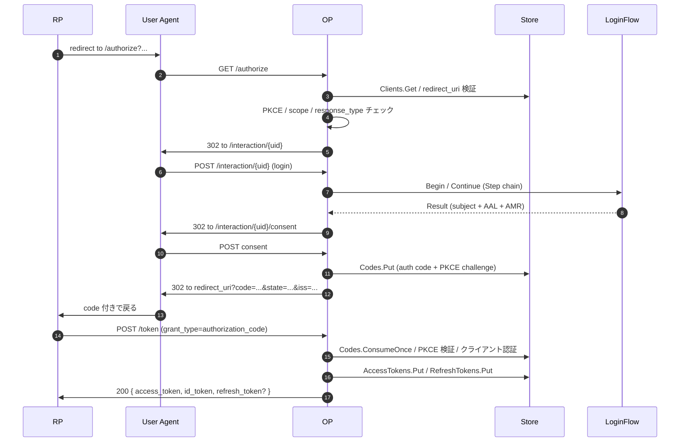

# アーキテクチャ概観

`op.New(...)` は `http.ServeMux` を内部に持つ `http.Handler` を返します。本ページではリクエスト到着からレスポンスまでの間に何が走るか — 関わるパッケージ、検証の順序、組み込み側が制御するストレージの差し込み口 — を整理します。

## パッケージ構成

```
op/                         ← 公開 API 表面(組み込み側はここを import)
op/profile/                 ← FAPI 2.0 / 将来のプロファイル
op/feature/                 ← PAR / DPoP / mTLS / introspect / revoke / DCR / JAR
op/grant/                   ← authorization_code、refresh_token、client_credentials
op/store/                   ← Store interface(サブストアの集合)+ contract test suite
op/storeadapter/{inmem,sql,redis,composite}
op/interaction/             ← ログイン UI 用 HTML / JSON ドライバの差し込み口

internal/                   ← 外部からは import 不可(Go の可視性)
  authn/                    ← LoginFlow オーケストレータ、Authenticator runtime
  authorize、parendpoint、tokenendpoint、userinfo、
  introspectendpoint、revokeendpoint、registrationendpoint、
  endsession、backchannel
  jose、jwks、keys          ← 署名 / 検証 / 鍵セット
  jar、dpop、mtls、pkce、sessions
  cookie、csrf、cors、httpx、redact、log、metrics
  discovery、scoperegistry、timex、i18n
```

境界は構造的に強制されています。外部コードは `internal/` に届きません。組み込み側が制御する差し込み口(オプション、store interface、authenticator、audit subscriber)はすべて `op/` 配下にあります。

## ハンドラグラフ

`op.New` は `*http.ServeMux` を構築し、設定されたパスにハンドラをマウントします(下図はデフォルト):

```mermaid
%%{init: {"theme":"base","themeVariables":{"primaryColor":"#374151","primaryTextColor":"#fff","lineColor":"#888"}}}%%
flowchart TB
  H[op.New が返す http.Handler]
  H --> Disc[/.well-known/openid-configuration<br/>discovery]
  H --> JWKS[/jwks<br/>internal/jwks]
  H --> AZ[/authorize<br/>internal/authorize]
  H --> PAR[/par<br/>internal/parendpoint]
  H --> TK[/token<br/>internal/tokenendpoint]
  H --> UI[/userinfo<br/>internal/userinfo]
  H --> RV[/revoke<br/>internal/revokeendpoint]
  H --> IN[/introspect<br/>internal/introspectendpoint]
  H --> ES[/end_session<br/>internal/endsession]
  H --> RG[/register<br/>internal/registrationendpoint]
  H --> IX[/interaction/...<br/>HTML or React UI driver]
  style H fill:#0c5460,color:#fff
  style Disc fill:#1f2937,color:#fff
  style JWKS fill:#1f2937,color:#fff
  style AZ fill:#1f2937,color:#fff
  style PAR fill:#1f2937,color:#fff
  style TK fill:#1f2937,color:#fff
  style UI fill:#1f2937,color:#fff
  style RV fill:#1f2937,color:#fff
  style IN fill:#1f2937,color:#fff
  style ES fill:#1f2937,color:#fff
  style RG fill:#1f2937,color:#fff
  style IX fill:#1f2937,color:#fff
```

`feature.*`(`PAR`、`Introspect`、`Revoke`、`DynamicRegistration`、`BackChannelLogout`)で制御されるエンドポイントは、対応する feature が有効になっているか、対応するオプション(`WithDynamicRegistration` など)が渡されたときだけマウントされます。discovery document も、実際にマウントされたエンドポイントだけを公開します。

## クロスカットなミドルウェア

すべてのハンドラは以下にラップされます:

| Layer | ソース | 役割 |
|---|---|---|
| **CORS** | `internal/cors` | `/token`、`/userinfo`、`/revoke`、`/introspect` には厳格な許可リスト。`/jwks` と discovery は public CORS |
| **信頼プロキシ** | `internal/httpx` | `WithTrustedProxies` を元に、`X-Forwarded-*` / `Forwarded` から実クライアント IP を解決 |
| **Cookie** | `internal/cookie` | `__Host-` プリフィックス、AES-256-GCM、session は `SameSite=Lax`、互換可能なところは `Strict` |
| **CSRF** | `internal/csrf` | consent / logout の POST に対して double-submit + Origin / Referer チェック |

これらはオプションではありません。組み込み側のオプション設定に関係なく構造的に適用されます。

## Authorize → token のライフサイクル

最も流量の多いパスです。概略は次のとおりです:



`/par` と `/end_session` も大筋は同じ形です。上記が標準的な happy path です。

## LoginFlow の内部

`WithLoginFlow(LoginFlow{...})` は構築時に内部のパイプラインへコンパイルされます:

```
LoginFlow {Primary, Rules[], Decider, Risk}
    │
    ▼ (compile)
internal/authn/CompiledLoginFlow
    ├── Primary  → Authenticator(Step descriptor → runtime 実装の解決)
    ├── Rules[]  → 順序付き (When, Then) ペア
    ├── Decider  → 任意の short-circuit
    └── Risk     → 評価パスごとに 1 回呼ばれる
```

各 authorize リクエストでは:

1. `Primary.Begin` が `interaction.Step`(Prompt または Result)を返します。
2. UI ドライバ(HTML または React)がプロンプトを描画し、ユーザが送信します。
3. `Primary.Continue` が `Result`(`Identity` がバインドされている) まで進めます。
4. オーケストレータが `LoginContext` を組み立てます(subject、scope、完了したステップ、リスクスコア、ACR values)。
5. `Decider` が走ります(non-nil の場合)。`Pass` 以外の判定は short-circuit します。
6. それ以外は `Rules` を順に評価します。最初にマッチしたルールの `Step.Kind()` が `CompletedSteps` にまだ含まれていなければ発火します。
7. 発火するルールが無くなるまで繰り返し、その後にセッションを発行します。

`ExternalStep` 経由で自前の factor を差し込む手順は、[ユースケース: カスタム authenticator](/ja/use-cases/custom-authenticator) を参照してください。

## ストレージの差し込み口

ライブラリは、組み込み側の `users` テーブルを直接読み書きしません。`op.Store` interface(小さなサブストアの和集合)越しに会話します:

| サブストア | 何が入るか | 配置の目安 |
|---|---|---|
| `Clients` | OAuth クライアントレジストリ | 通常は永続 |
| `Users` | subject + claim | 組み込み側の実装。既存の users テーブルにマッピングすることが多い |
| `AuthorizationCodes` | one-shot な code(PKCE challenge、scope) | 永続 |
| `RefreshTokens` | refresh chain、ローテーション履歴 | 永続 |
| `AccessTokens` | JWT id 側 / opaque token | 永続 |
| `OpaqueAccessTokens` | opaque AT lookup | 永続 |
| `Grants` | (user, client) ごとの consent scope | 永続 |
| `GrantRevocations` | 失効した grant の tombstone | 永続 |
| `Sessions` | ブラウザセッションのレコード | 揮発に置いてもよい |
| `Interactions` | 試行ごとの interaction 状態 | 揮発に置いてもよい |
| `ConsumedJTIs` | JAR / DPoP `jti` の replay set | 揮発に置いてもよい |
| `PARs` | pushed authorization request | 揮発に置いてもよい |
| `IATs` / `RATs` | DCR の Initial / Registration Access Token | 永続 |
| `EmailOTPs`、`TOTPs`、`Passkeys`、`Recovery` | ユーザごとの MFA factor レコード | 永続 |

「揮発に置いてもよい」サブストアは [`composite`](/ja/use-cases/hot-cold-redis) アダプタ越しに Redis 層へ配置できます。composite は構築時に「永続バックエンドは 1 つ」を強制するので、トランザクショナルクラスタが 2 つのストアにまたがって分裂することはありません。

詳細は [hot/cold ストレージ](/ja/use-cases/hot-cold-redis) を参照してください。

## Discovery document の組み立て

`/.well-known/openid-configuration` は OP の実効設定から discovery document を組み立てます。アドバタイズされるフィールドはそのまま OP の実挙動を表します。discovery と挙動の間に乖離はありません。理由は以下のとおりです:

- **`response_types_supported`** は `WithGrants` + FAPI プロファイルから計算されます。
- **`token_endpoint_auth_methods_supported`** は、`WithProfile(profile.FAPI2Baseline)` または `FAPI2MessageSigning` が有効なときに FAPI の許可リストと交差します。
- **`scopes_supported`** は組み込みの scope と `WithScope` で登録された scope の和集合です。
- **`code_challenge_methods_supported`** は常に `["S256"]` です。`plain` は構造的に存在しません。
- **`request_object_signing_alg_values_supported`** は JOSE の許可リスト(`RS256`、`PS256`、`ES256`、`EdDSA`)です。
- **`dpop_signing_alg_values_supported`** はそれより狭い集合 (`ES256`、`EdDSA`、`PS256`)です。理由は [FAQ § DPoP discovery](/ja/faq#dpop-sender-constraint) を参照。

## 次に読む

- **[Options 索引](/ja/reference/options)** — すべての `op.With*` を 1 ページに。上のハンドラグラフへのクロスリンク付き。
- **[Audit イベントカタログ](/ja/reference/audit-events)** — 各ハンドラ、各段階で何が発火するか。
- **[カスタム authenticator](/ja/use-cases/custom-authenticator)** — オーケストレータのパイプラインがどこで自前コードを呼ぶか。
- **[hot / cold ストレージ](/ja/use-cases/hot-cold-redis)** — サブストアの tier 分けと、揮発 / 永続の境界の関係。
