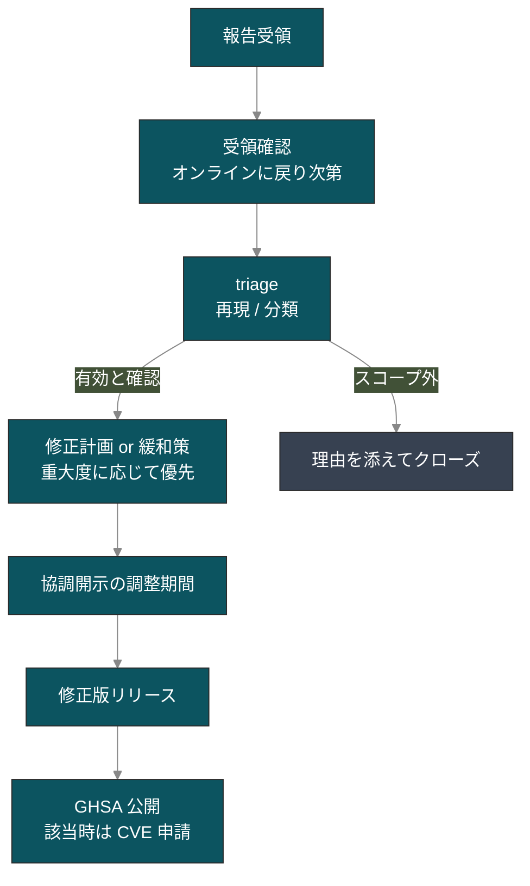

# 脆弱性報告 / CVE

::: warning 個人開発のセキュリティ運用について
go-oidc-provider は本業の合間に個人で維持しているプロジェクトです。脆弱性対応は **best-effort** で行います。報告は必ず人が読みますが、対応までの時間はメンテナの可処分時間に左右され、数日から数週間まで幅があります(SLA はありません)。契約上の応答時間が要件となる用途には向かないため、採用検討の前に必要要件と本プロジェクトの体制を突き合わせてください。
:::

## 脆弱性の報告方法

セキュリティに関わると思われるバグについて、**公開 GitHub issue を立てないでください**。

次のいずれかの経路で報告してください。

1. **GitHub Security Advisories** — [private report を作成](https://github.com/libraz/go-oidc-provider/security/advisories/new)（推奨。triage が早いです）
2. **メール** でメンテナ宛に: <SvgEmail />

報告に含めてほしい内容（分かる範囲で構いません）:

- 問題の概要と影響範囲。
- 再現手順または最小限の PoC。
- 影響を受けるバージョン（分かる範囲で）。
- 重大度の評価（CVSS は歓迎ですが必須ではありません）。

不足している項目があっても問題ありません。部分的な報告でも十分役に立ちますし、足りない情報はこちらから追って伺います。

ポリシーの正式版はソースリポジトリの [`SECURITY.md`](https://github.com/libraz/go-oidc-provider/blob/main/SECURITY.md) にあります。本ページは同じ内容を読みやすい散文として書き直したものです。

## 報告後の流れ

報告を受領してからのおおまかな流れです。



現実的な目安として、受領確認には通常数日かかります。重大な問題はすぐに着手しますが、軽微なものは余暇が確保できる週末まで持ち越すこともあります。1 週間返信がない場合は遠慮なく再度連絡してください。無視しているわけではなく、通知の取りこぼしか単に手が回らない時期である可能性が高いです。

`SECURITY.md` には「3 営業日以内に受領確認、14 日以内に修正計画」と記載していますが、これは目指している目標値であって契約上の保証ではありません。

## サポート対象バージョン

| バージョン | サポート |
|---|---|
| `v0.x`（pre-v1.0） | 最新 minor のみ |
| `v1.x` | 最新 minor + 1 つ前の minor（v1.0 以降の予定） |

::: tip pre-v1.0 のリリースサイクル
v1.0 までの間、公開 Go API は minor リリースのたびに変わる可能性があります。`go.mod` ではバージョンタグを固定し、更新のたびに [CHANGELOG](https://github.com/libraz/go-oidc-provider/blob/main/CHANGELOG.md) を確認してください。セキュリティ修正は最新 minor にのみ反映します。古い minor に留まっている場合、修正を取り込むには更新が必要です。pre-v1.0 期間中はメンテナが一人のため、バックポートは予定していません。
:::

## 開示フロー

本プロジェクトは **coordinated disclosure（協調開示）** を採用しています。これは敵対的な手続きではありません。

1. 報告者とメンテナ双方の都合に合わせて、パッチの目標日を合意します。
2. プライベートブランチまたは GitHub Security Advisory のドラフトで修正を開発します。
3. 修正を `main` にマージし、リリースタグを切ります。
4. Advisory を公開します。GitHub の CNA が CVE を発番する条件に該当する場合は CVE を申請します。実体が exploit 経路を持たない defense-in-depth ハードニングに留まる場合は、CVE 無しの GHSA として公開することが多いです。
5. リポジトリを Watch（Releases / Security advisories）している方には自動で通知が届きます。

## 現在の Advisory 状況

::: details 本ページ更新時点
**現時点で公開済みの CVE は 0 件です。** pre-v1.0 期間において、CVE 発番の条件を満たすセキュリティ報告はまだ届いていません。これは「公開すべきものが現状ない」という事実をそのまま示しているだけで、「監査済みで安全」を主張しているわけではありません。本プロジェクトが構造的に防いでいる範囲とその限界については [セキュリティ方針](/ja/security/posture) を参照してください。

正規の情報源は GitHub Security Advisories です。提出された advisory は [advisories ページ](https://github.com/libraz/go-oidc-provider/security/advisories) に直ちに反映されます。
:::

## 周辺のサプライチェーン衛生

OP 自体が健全でも、依存パッケージが既知の問題を抱えていることはあります。採用時、および依存を更新するたびに次を実行してください。

```sh
# 利用側のモジュールで
go install golang.org/x/vuln/cmd/govulncheck@latest
govulncheck ./...
```

本リポジトリ自体でも、同じツールを [`scripts/govulncheck.sh`](https://github.com/libraz/go-oidc-provider/blob/main/scripts/govulncheck.sh) 経由で CI で実行しています。依存マニフェストは意図的に絞っており、全リストは [`THIRD_PARTY.md`](https://github.com/libraz/go-oidc-provider/blob/main/THIRD_PARTY.md) を参照してください。AGPL / GPL / SSPL / BUSL / Elastic ライセンスの依存はリポジトリポリシーで禁止しているため、ライセンス互換性の検討範囲は小さく保たれています。

## 報告してほしい範囲

スコープ内（積極的に報告してほしい内容）:

- `op.WithProfile(profile.FAPI2*)` が課すセキュリティゲート（PAR、JAR、DPoP、JARM、alg リスト、redirect_uri 完全一致）のバイパス。
- アルゴリズム混同（`none`、`HS*`、またはコードベースの allow-list 外の alg を verifier に受理させる経路）。
- トークン偽造、ID トークンの署名バイパス、`iss` ミックスアップ経路。
- 関連 RFC が許容する範囲を超える PKCE / nonce / state replay 経路。
- chain revocation を伴わないリフレッシュトークンの再利用。
- 同意 / ログアウト / interaction POST に対する CSRF。
- Cookie 周りのリグレッション（`__Host-`、`Secure`、AES-256-GCM AEAD のいずれかが失われるもの）。
- Back-Channel Logout 経由の SSRF（RFC 1918 の deny-list をすり抜けてプライベートネットワーク宛に送信できてしまうもの）。
- エラーカタログ（`internal/redact`）の範囲を超える情報の漏洩。
- `op/storeadapter/` 配下のストレージアダプタに対するインジェクション。

スコープ外（既知の挙動。詳細は <a class="doc-ref" href="/ja/security/design-judgments">設計判断</a>）:

- Front-Channel Logout / Session Management を提供していないこと。
- 運用者がオプトインしたうえでのループバック redirect-URI の緩和。
- `offline_access` を要求しない経路でのリフレッシュトークン発行。
- `cmd/op-demo` バイナリの設定が弱いこと — これは適合検査用のハーネスであり、本番 OP として使うものではありません。

## Hall of Fame

最初の有効なセキュリティ報告が届いたら、許諾を得たうえで報告者をここに掲載します。現時点では空欄ですが、これは「網羅的に安全である」という主張ではなく、単にまだ報告が届いていないことを示しているだけです。実際の防御範囲は [セキュリティ方針](/ja/security/posture) を参照してください。

## 続きはこちら

- **[セキュリティ方針](/ja/security/posture)** — 構造的に何を防いでいるか、どんなツールが裏にあるか、何を意図的にスコープ外にしているか。
- **[設計判断](/ja/security/design-judgments)** — RFC 同士の衝突をどう解釈したか。
- **[OFCS 適合状況](/ja/compliance/ofcs)** — 適合性が証明できること / できないこと。
