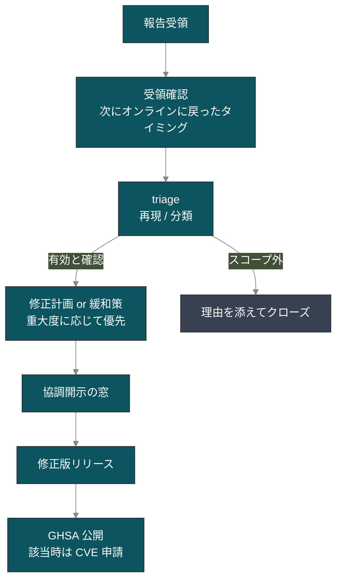

# 脆弱性報告 / CVE

::: warning 個人開発のセキュリティ運用について
go-oidc-provider は本業の合間に個人で維持しているプロジェクトです。脆弱性対応は **best-effort** で行います。報告は必ず人が読みますが、対応の早さは余暇次第で、数日から数週間ぶれることがあります。保証された応答時間が必要な用途には不向きですので、採用前に必要要件をご確認ください。
:::

## 脆弱性の報告方法

セキュリティに関する疑いがあるバグは **公開 GitHub issue にしないでください**。

次のいずれかから報告してください。

1. **GitHub Security Advisories** — [private report を開く](https://github.com/libraz/go-oidc-provider/security/advisories/new)（推奨。triage が早いです）
2. **メール**: <SvgEmail />

報告に含めてほしいもの（分かる範囲で構いません）:

- 問題の概要と影響範囲。
- 再現手順または最小 PoC。
- 影響を受けるバージョン（分かる範囲で）。
- 重大度の評価（CVSS は歓迎ですが必須ではありません）。

足りない情報があっても問題ありません。部分的な報告でも有用ですし、こちらから追加で質問するのが普通です。

正式なポリシー文書は [`SECURITY.md`](https://github.com/libraz/go-oidc-provider/blob/main/SECURITY.md)（authoritative）。本ページは同じ内容を読みやすい散文で言い換えたものです。

## 期待してよい対応の流れ

報告が届いたあとのおおまかな流れです。



実際の所要時間としては、受領確認に通常数日かかります。重大な問題は即着手しますが、軽微なものは余暇が取れる週末まで持ち越すこともあります。1 週間返事が来ない場合は遠慮なく再送してください — 無視ではなく、通知を取りこぼしたか手が回らない時期だと思ってください。

`SECURITY.md` には「3 営業日以内に受領確認、14 日以内に修正計画」と書いてありますが、これは目標値であって契約上の保証ではありません。

## サポート対象バージョン

| バージョン | サポート |
|---|---|
| `v0.x`（pre-v1.0） | 最新 minor のみ |
| `v1.x` | 最新 minor + 1 つ前の minor（v1.0 以降の予定） |

::: tip pre-v1.0 のリリースサイクル
v1.0 までは公開 Go API が任意の minor リリースで変わる可能性があります。`go.mod` でタグを pin し、バージョン更新のたびに [CHANGELOG](https://github.com/libraz/go-oidc-provider/blob/main/CHANGELOG.md) を確認してください。セキュリティ修正は最新 minor のみに届きます。古い minor に留まっている場合は更新してから取り込む必要があります。pre-v1.0 期間中は人手の都合でバックポートは行いません。
:::

## 開示フロー

協調開示（coordinated disclosure）方式です。敵対的なものではありません。

1. 報告者と Maintainer の都合に合わせてパッチ予定日を合意。
2. プライベートブランチ / GitHub Security Advisory ドラフトで修正を開発。
3. 修正を `main` にマージし、リリースタグを切ります。
4. Advisory を公開します。GitHub の CNA から CVE が発番される条件を満たすケースは申請します。修正の実体が「exploit 経路がない defense-in-depth」のときは CVE 無しの GHSA として公開します。
5. リポジトリの Watch（Releases / Security advisories）登録者に通知が届きます。

## 現在の Advisory 状況

::: details 本ページ更新時点
**公開済み CVE: 0 件。** pre-v1.0 期間中、CVE 発番の条件を満たすセキュリティ報告はまだ届いていません。これは「公開すべきものがない」という事実そのものであり、「監査済みで安全」という主張ではありません。本プロジェクトの防御範囲とその限界は [セキュリティ方針](/ja/security/posture) を参照してください。

GitHub Security Advisories が正規の情報源で、提出されたものは [advisories ページ](https://github.com/libraz/go-oidc-provider/security/advisories) にすぐ反映されます。
:::

## 隣接するサプライチェーン衛生

OP 自体が健全でも、依存パッケージが既知の問題を抱えていることはあります。採用時と依存の bump のたびに次を実行してください。

```sh
# 利用側のモジュールで
go install golang.org/x/vuln/cmd/govulncheck@latest
govulncheck ./...
```

本リポジトリ内では同ツールが [`scripts/govulncheck.sh`](https://github.com/libraz/go-oidc-provider/blob/main/scripts/govulncheck.sh) を介して CI で実行されます。依存マニフェストは意図的に絞っています — 全リストは [`THIRD_PARTY.md`](https://github.com/libraz/go-oidc-provider/blob/main/THIRD_PARTY.md) を参照してください。AGPL / GPL / SSPL / BUSL / Elastic ライセンスの依存はリポジトリポリシーで禁止しているので、ライセンス互換性の検討範囲は小さく保たれています。

## 報告してほしい範囲

スコープ内（報告してください）:

- `op.WithProfile(profile.FAPI2*)` のセキュリティゲート（PAR、JAR、DPoP、JARM、alg リスト、redirect_uri 完全一致）のバイパス。
- アルゴリズム混同（`none`、`HS*`、コードベース allow-list 外の alg を verifier に受理させる経路）。
- トークン偽造、ID Token 署名バイパス、`iss` ミックスアップ。
- 該当 RFC 範囲を超える PKCE / nonce / state replay。
- chain revocation を伴わないリフレッシュトークン再利用。
- 同意 / ログアウト / interaction POST の CSRF。
- Cookie 関連の後退（`__Host-`、`Secure`、AES-256-GCM AEAD のいずれかが失われる）。
- Back-Channel Logout の SSRF（RFC 1918 の拒否リストをすり抜けてプライベートネットワーク宛てに送れてしまう）。
- エラーカタログ（`internal/redact`）の範囲を超える情報漏洩。
- `op/storeadapter/` 配下のストレージアダプタへのインジェクション。

スコープ外（既知の挙動。詳細は <a class="doc-ref" href="/ja/security/design-judgments">設計判断</a>）:

- Front-Channel Logout / Session Management が無いこと。
- 運用者がオプトインしたループバック redirect-URI の緩和。
- `offline_access` なしでのリフレッシュトークン発行。
- `cmd/op-demo` バイナリの設定が弱いこと — これは適合検査用ハーネスで、本番 OP ではありません。

## Hall of Fame

最初の有効なセキュリティ報告が届いたら、ここに（許諾を得たうえで）報告者を掲載します。現時点では空欄ですが、「網羅的に安全」という意味ではなく、単にまだ報告が届いていないというだけです。実際の防御範囲はセキュリティ方針を参照してください。

## 続きはこちら

- **[セキュリティ方針](/ja/security/posture)** — 構造的に何を防いでいるか、どんなツールが裏にあるか、何を意図的にスコープ外にしているか。
- **[設計判断](/ja/security/design-judgments)** — RFC 同士の衝突をどう解釈したか。
- **[OFCS 適合状況](/ja/compliance/ofcs)** — 適合性が証明できること / できないこと。
