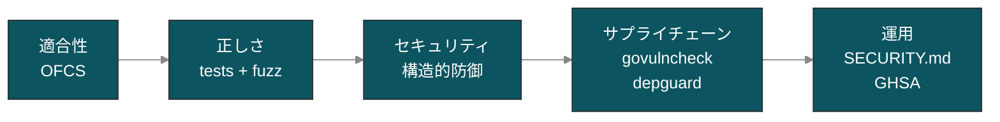

# セキュリティ方針

このページでは、本ライブラリが **どうやって** 安全性を保とうとしているかと、同じくらい大事な **どんな保証は与えていないか** を整理します。

::: warning 期待値の合わせ方
go-oidc-provider は個人開発者が空き時間で維持している OSS ライブラリです。第三者による独立監査、有償ペネトレーションテスト、OpenID Foundation の公式認証 — いずれも受けていません。下記の性質はコードベースが能動的に防いでいるものを書き出したものであって、第三者監査レポートと同等のものではありません。
:::

## 5 つの独立した性質

「これは安全か？」と問われたとき、誠実に答えるには次の 5 つに分けて回答する必要があります。

| # | 性質 | このプロジェクトで示せる根拠 |
|---|---|---|
| 1 | **適合性** — 仕様を実装している | OFCS 緑（[適合状況: OFCS](/ja/compliance/ofcs)） |
| 2 | **正しさ** — どんな入力でも壊れない | `test/` 配下のユニット / シナリオ / fuzz テスト |
| 3 | **セキュリティ** — 能動的な攻撃に耐える | 後述の構造的防御 + 設計判断 |
| 4 | **サプライチェーン** — 依存が安全である | CI で `govulncheck`、depguard、サードパーティ目録 |
| 5 | **運用** — 時間が経っても安全である | SECURITY.md による報告経路、GitHub Security Advisories |

> 適合性 ≠ セキュリティ です。OFCS が緑でも、攻撃が可能なケース（alg 混同、PKCE ダウングレード、redirect_uri 部分一致、シークレット比較のタイミング攻撃など）は存在し得ます。次のセクションでは、それぞれのクラスを if 文ではなく構造的に閉じている理由を説明します。

## 構造的防御（コードの形そのもので強制している箇所）

「実装ミスがないか毎回検査する」のではなく、不安全な経路がそもそも存在しないように型 / パッケージ境界で設計しています。

### 1. コンストラクタはゼロ値起動を拒否する

`op.New(...)` は `error` を返します — 必須オプションが欠けるとエラーで弾かれます。`WithIssuer` と `WithStore` は無条件で必須、`WithKeyset` はトークン署名・検証を伴うフローを有効にした時点で必須、`WithCookieKeys` は `authorization_code` grant を有効にした時点で必須です。利用可能なゼロ値の `Provider` は存在しません。

::: details なぜ重要か
多くの「デフォルト ON」型のフレームワークは設定不足でも気付かれずに起動します。本ライブラリの設計では「OP が立ち上がったが署名鍵がない / 推測可能な cookie 鍵 / 誤った issuer」といったクラスのバグを、最初の 1 リクエストが届く前に閉じます。詳細は `op.WithIssuer` / `op.WithKeyset` / `op.WithCookieKeys` / `op.WithStore` の不在時に出るビルド時エラーを参照してください。
:::

### 2. JOSE の alg リストは閉じた型

`internal/jose.Algorithm` は `RS256`、`PS256`、`ES256`、`EdDSA` の 4 値のみを列挙しています。`none`、`HS256/384/512`、その他の文字列は `IsAllowed()` で false を返します。`ParseAlgorithm` は不明値に対してフォールバックせず、`ok=false` を返します。生 go-jose ハンドルを保持する `internal/jar`、`internal/dpop`、`internal/mtls`、`internal/backchannel` などの経路も含めて、すべての入力 JWS 検証パスは入力された `alg` をこの閉じた型でゲートします。OP 発行 JWT の署名はさらに狭く、`WithKeyset` は ECDSA P-256 鍵だけを受理し、discovery は `ES256` を広告します。**alg 混同攻撃（RFC 7519 §6 / RFC 8725 §2.1）は構造的に到達できません**。

| 想定リスク | 緩和策 |
|---|---|
| JWT ライブラリが `alg=none` を受理 | `Algorithm(s)` は不明値・空文字を拒否 |
| 公開鍵経路で `HS256` を受理 | `HS*` は型に存在しない |
| 配置ごとの alg「フィーチャーフラグ」 | depguard の `jose-isolation` ルールで `go-jose/v4` を直接 import できるパッケージを allow-list で固定。新規呼び出し元は意図的に追加する必要がある |

### 3. `crypto/rand` のみ — `math/rand` 禁止

リポジトリ全体ルールで `math/rand` を禁止しています。lint も同様に強制。すべての nonce、コード、リフレッシュトークン、認可コード、DPoP server-nonce は `crypto/rand` を使います。

### 4. `time.Now()` は `internal/timex/` 経由のみ

`time.Now()` の直接呼び出しは禁止です。`Clock` 抽象により、時刻注入を境界で明示し、テスト時に時刻がずれて replay 検証窓のテストが偶然通ってしまう事故を防いでいます。

### 5. エラーは型付きカタログ経由のみ

`fmt.Errorf` で API 可視のエラーを作ることはできません。通信路に出るエラーはすべて `op.Error` / カタログ値から組み立てます。これにより error code、status code、`WWW-Authenticate` の形が一貫し、情報漏えいもカタログ範囲に収まります。

### 6. `internal/` 境界は不可侵

外部から `internal/` を import することはできません。公開すべきものは `op/`、`op/profile/`、`op/feature/`、`op/grant/`、`op/store/`、`op/storeadapter/` の安定した公開面に出ています。「JAR verifier だけ差し替えたい」といった抜け道は Go のパッケージ可視性ルールで閉じられています。

### 7. ORM を持ち込まない設計

ライブラリは ORM（GORM、ent、xo など）を埋め込みません。ストレージは小さな `store.*Store` interface を介します。呼び出し側は使い慣れたものを実装するだけです。副作用として「気付かぬうちに DB がマイグレーションされる」事態が起きません。

## デフォルトで有効な防御機能

| 防御 | ソース | 仕様 |
|---|---|---|
| `__Host-` cookie、AES-256-GCM、double-submit CSRF、Origin/Referer チェック | `internal/cookie`、`internal/csrf` | OWASP ASVS L1 / RFC 6265bis |
| `authorization_code` grant に PKCE 必須、`plain` は拒否 | `internal/pkce` | RFC 7636 |
| リフレッシュトークンのローテーション + 再利用検知(chain revoke) | `internal/grants/refresh` | RFC 9700 §4.14 |
| 送信者制約付きトークン(DPoP `cnf.jkt`、mTLS `cnf.x5t#S256`) | `internal/dpop`、`internal/mtls`、`internal/tokens` | RFC 9449、RFC 8705 |
| 認可応答に `iss` を付与 | `internal/authorize` | RFC 9207 |
| `redirect_uri` 完全一致(既定で完全一致) | `internal/authorize` | OAuth 2.1、RFC 8252 |
| ループバック redirect の制約強化 | `internal/registrationendpoint`、`internal/authorize` | RFC 8252 |
| outbound HTTP envelope(許可 scheme、body 上限、Accept、timeout、redirect、cache)を JAR JWKS / client-encryption JWKS / `sector_identifier_uri` / back-channel logout 配送に適用。dial 段階で loopback / link-local / RFC 1918 / IPv6 ULA を拒否し、`BaseTransport` が `*http.Transport` 以外なら URL ゲートでフォールバック | `internal/securefetch`、`internal/netsec` | OWASP SSRF、OIDC Back-Channel Logout 1.0 |
| OP 側の request_object replay 対策(`jti`) | `internal/jar` | RFC 9101 §10.8 |
| 各検証経路でのアルゴリズム allow-list | `internal/jose` | RFC 8725 |
| Issuer 正規化(末尾スラッシュなどの揺れを防ぐ) | `op/options_validate.go` | RFC 9207 |
| Resource indicator の正規化(scheme と host を小文字化、default port 除去、末尾スラッシュ揃え、fragment / userinfo 拒否)を `/authorize`、`/token`、`/device_authorization`、`/bc-authorize`、`WithAccessTokenFormatPerAudience` の allow-list に適用 | `internal/resourceindicator` | RFC 8707 §2 |
| `/token`、`/bc-authorize`、`/end_session` で単一値パラメータの重複を拒否(RFC 8707 の `resource=` のみ例外)。credentials を 2 か所以上に提示したリクエストは `clientauth.Parse` で拒否 | `internal/httpx`、`internal/clientauth`、`internal/tokenendpoint`、`internal/cibaendpoint`、`internal/endsession` | RFC 6749 §3.2.1、OIDC RP-Initiated Logout 1.0 §3 |
| Argon2id パラメータを OWASP 2024 ベースライン(memory ≥ 19 MiB、time ≥ 2)で強制(`client_secret`、エンドユーザパスワード、リカバリコード)。リカバリコード一括検証は 16 件で打ち切り。エンコード済み hash の重複パラメータセグメントは拒否 | `internal/argon2id`、`internal/authn/password`、`internal/authn/recovery`、`internal/clientauth/secret` | OWASP Password Storage Cheat Sheet (2024) |
| DCR メタデータデコーダと interaction JSON ドライバが末尾の余分な JSON ドキュメントを拒否 | `internal/registrationendpoint`、`op/interaction` | RFC 7591 §2 |
| 有効化した grant / feature が要求するサブストアを、設定済み store が公開しない構成を `op.New` が拒否 | `op/options_validate.go`、`op/storeadapter/redis` | — (defence in depth) |

## ツールチェーン

| 階層 | ツール | 場所 |
|---|---|---|
| Lint | `golangci-lint v2`（errcheck、govet、staticcheck、unused、**gosec**、errorlint、revive、depguard など） | `.golangci.yml` |
| 脆弱性スキャン | `govulncheck` | `scripts/govulncheck.sh` |
| Fuzz | Go 標準 `Fuzz*`（`make fuzz` / `scripts/fuzz.sh 30s`） | `internal/jose`、`internal/jar`、`internal/dpop`、`internal/pkce`、`internal/jwks` などにターゲット |
| ライセンス | `go-licenses` | `scripts/licenses.sh` |
| 適合性 | `make conformance-baseline` | `tools/conformance/`、`conformance/` |
| シナリオ | カタログに基づく Spec Scenario Suite | `test/scenarios/` |

## ここに **無い** もの

このプロジェクトの限界をはっきり書きます。採用前に必ず目を通してください。

::: danger 採用前に必ず確認
- ❌ **第三者によるセキュリティ監査は受けていません。**
- ❌ **有償ペネトレーションテストも未実施です。**
- ❌ **OpenID Foundation の公式認証は取得していません。**（<a class="doc-ref" href="/ja/compliance/ofcs">OFCS 適合状況</a> 参照）
- ❌ **パッチ適用 SLA は提供していません。** SECURITY.md には *目安* として「3 営業日以内に受領、確認済み問題は 14 日以内に緩和方針」を書いていますが、契約上の保証ではありません。
- ❌ **24/7 のインシデント対応窓口はありません。** 報告経路は GitHub Security Advisories または Maintainer プロフィールです。
- ❌ **CVE データベース上のエントリは現時点でゼロです**（<a class="doc-ref" href="/ja/security/disclosure">脆弱性報告ガイド</a>）。pre-v1.0 期間中、適格な脆弱性報告がまだ届いていないので公開すべきものがない、というのが文字通りの状況です。「真面目にやっていない」わけではありません。
:::

これらのいずれかが採用要件に含まれているなら、本ライブラリは選ばないでください — 少なくとも v1.0 と公式監査が出るまでは。誠実なお断りは何も損ないませんし、誤用を防げます。

## 採用判断のヒント

| 状況 | 判断 |
|---|---|
| 自社プロダクトの内部 OP を作る | 適合します。`go.mod` でバージョンタグを固定し、自社 CI で `govulncheck` を回し、GHSA を購読してください |
| 公衆向け、価値の高いフロー（銀行グレード FAPI） | このライブラリは出発点として使い、第三者監査を入れて findings を還元する形を推奨 |
| コンプライアンス上の都合で認証取得済み IdP を置換する | 推奨しません — v1.0 と引用可能な監査結果が揃うまでは控えてください |
| 実 OP のコードベースで OIDC の仕組みを学ぶ | 最適。構造的防御自体が学習コンテンツになります |

## 続きはこちら

- **[設計判断](/ja/security/design-judgments)** — RFC 同士の衝突をどう解釈したか（PAR vs `request_uri` 再利用、リフレッシュローテーション vs RFC 9700 grace、alg リスト vs OIDC Core …）。
- **[脆弱性報告](/ja/security/disclosure)** — 脆弱性報告、サポート対象バージョン、CVE 取り扱い。
- **[OFCS 適合状況](/ja/compliance/ofcs)** — 適合性が証明できること / できないこと。
