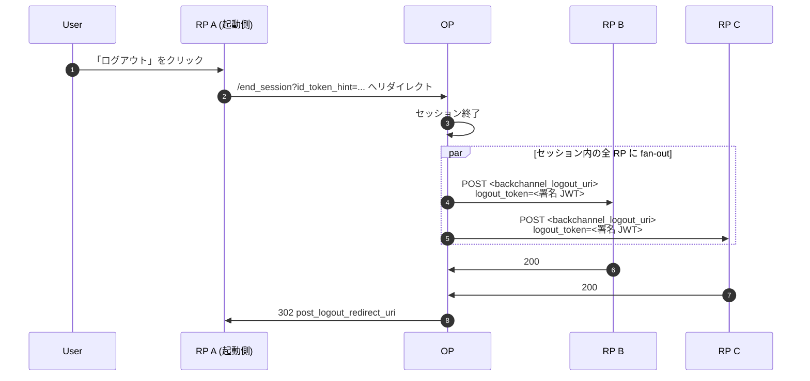

# ユースケース — バックチャネルログアウト

## そもそも「バックチャネルログアウト」とは？

ユーザは「Acme でサインイン」ボタンを介して、同じ OP に紐づく複数の RP にサインインしているのが普通です。あるアプリ（RP A）で **ログアウト** をクリックしても、他の RP B / RP C はそれぞれローカル cookie を保持したままなので、「アプリ A ではログアウトしたのにアプリ B ではログイン状態のまま」というズレが残ります。

**バックチャネルログアウト** は、このズレを OP 側から閉じる fan-out 機構です。各 RP は OP に対してサーバサイドのコールバック URL を事前登録しておきます。セッション終了時、OP は **署名済み `logout_token` を各 RP の URL に直接 POST** します（ブラウザを経由しない＝バックチャネル）。RP はトークンを検証してローカル cookie を破棄します。

対になる仕組みとして *フロントチャネルログアウト* もありますが、こちらは `<iframe>` とサードパーティ cookie に依存しており、現代のブラウザでは段階的に動かなくなりつつあります。バックチャネル方式が現実的な選択肢です。

::: details このページで触れる仕様
- [OpenID Connect Back-Channel Logout 1.0](https://openid.net/specs/openid-connect-backchannel-1_0.html)
- [RFC 7519](https://datatracker.ietf.org/doc/html/rfc7519) — JWT（logout token の形式）
- [RFC 8417](https://datatracker.ietf.org/doc/html/rfc8417) — Security Event Token (SET)（`events` claim の形式）
- [RFC 1918](https://datatracker.ietf.org/doc/html/rfc1918) — プライベート IPv4 範囲（後述の SSRF 防御で使用）
:::

::: details 用語の補足
- **`logout_token`** — OP が署名して各 RP に POST する短寿命の JWT です。終了したセッションの subject (`sub`) または session id (`sid`) を運びます。アクセストークンとは別物で、RP は検証後に自身のローカルセッションを破棄するだけです。
- **SET（Security Event Token、RFC 8417）** — セキュリティイベント配送向けの JWT 形式です。`events` claim にイベント種別キー（ここでは `http://schemas.openid.net/event/backchannel-logout`）を入れることで、汎用 SET 受信側が適切なハンドラに振り分けられるよう設計されています。
:::

> **ソース:** [`examples/42-back-channel-logout`](https://github.com/libraz/go-oidc-provider/tree/main/examples/42-back-channel-logout)

## アーキテクチャ



OP は RP 毎に `logout_token` に署名して RP の `backchannel_logout_uri` に POST します。トークンの中身は次のとおりです。

| Claim | 意味 |
|---|---|
| `iss` | OP issuer |
| `aud` | RP の `client_id` |
| `iat`、`jti` | 発行時刻 + replay nonce |
| `sub` または `sid` | 終了したセッション |
| `events` | `{"http://schemas.openid.net/event/backchannel-logout": {}}` |

RP は署名と `aud` を検証し、ローカルセッションを破棄したうえで 200 を返します。

## 実装

クライアント別の `BackchannelLogoutURI` で RP をオプトインさせます。

```go
op.WithStaticClients(op.ClientSeed{
  ID:                   "rp-a",
  /* ... */
  BackchannelLogoutURI: "https://rp-a.example.com/oidc/backchannel-logout",
})
```

ライブラリ全体のオプション:

```go
op.New(
  /* ... */
  op.WithBackchannelLogoutHTTPClient(myHTTPClient), // mTLS / カスタム timeout
  op.WithBackchannelLogoutTimeout(5 * time.Second),
)
```

## SSRF 防御

::: warning デフォルトでプライベートネットワーク宛先を拒否
配送処理は、host が loopback / link-local / RFC 1918 / IPv6 ULA に解決される `backchannel_logout_uri` への POST を **拒否** します。これがないと、任意 URL を登録できる RP が OP の内部ネットワークへの SSRF オラクルになります。

RP を private DNS で前段するときはオプトインを明示します。

```go
op.WithBackchannelAllowPrivateNetwork(true)
```

この緩和は意図的に選び取る必要があります — オプションを明示的に存在させることで、セキュリティ上のトレードオフが設定箇所に可視化されます。
:::

## 揮発ストアのギャップ（とそれを示す監査イベント）

Back-channel fan-out は OP の `SessionStore` を辿り、終了セッションに紐づく全 RP を見つけます。**揮発** session ストア（永続化無しの Redis、Memcached、maxmemory eviction 下の in-memory）配下では、セッション確立から `/end_session` までの間に追い出された行は気付かれずに失われ、対応する RP には何も通知されません。

ライブラリはこのギャップを監査イベントとして可視化します。

| イベント | 意味 |
|---|---|
| `op.AuditBCLNoSessionsForSubject` | 呼出側がセッションを指定（`id_token_hint` 付き `/end_session` または `Provider.Logout`）したが、fan-out で解決した RP が 0 件だった。 |

揮発配置では、これは OIDC Back-Channel Logout 1.0 §2.7 の "best effort" の下限です。永続配置では予期せぬギャップを意味します。イベント extras に設定済みの `op.SessionDurabilityPosture`（`SessionDurabilityVolatile` または `SessionDurabilityDurable`）を載せておくことで、SOC ダッシュボードはストアアダプタの型に依存せず両者を区別できます。

## フロントチャネルログアウト（別の機構）

OIDC Front-Channel Logout 1.0（ブラウザ側 iframe fan-out）は別仕様で、ライブラリは現在実装していません。Back-channel の方がデプロイしやすい選択です — 第三者 cookie に依存せず、origin を跨いで動作し、fan-out 時にユーザのブラウザが開いている必要もありません。
