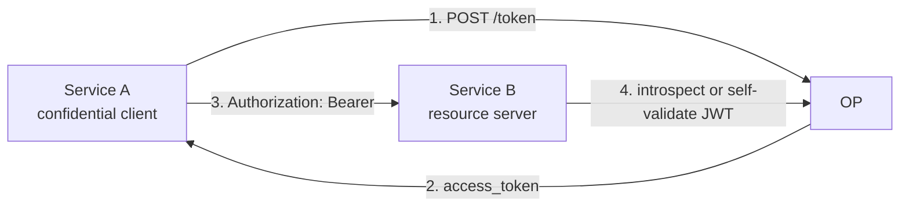

# ユースケース — サービス間 (`client_credentials`)

## `client_credentials` グラントとは

OAuth 2.0 にはクライアントが access token を取得するための「grant type」が 4 種類あります。3 つは人間を介し（`authorization_code` / `device_code` / 非推奨の `password`）、1 つは介しません。

**`client_credentials`**（RFC 6749 §4.4）は人を介さないケース用です。Service A が登録済みの `client_id` + 認証情報を持ち、`/token` でそれを直接 access token に交換します。トークンは **サービス自身** を表現するため、`id_token` も `refresh_token` も同意プロンプトもありません（再発行は安いので refresh は不要）。

cron ジョブ、webhook、マイクロサービス間呼び出しなど、ブラウザもエンドユーザもいない場面で正解の grant です。

::: details このページで触れる仕様
- [RFC 6749](https://datatracker.ietf.org/doc/html/rfc6749) — OAuth 2.0 Authorization Framework, §4.4（`client_credentials`）
- [RFC 7523](https://datatracker.ietf.org/doc/html/rfc7523) — JWT Profile for OAuth 2.0 Client Authentication（`private_key_jwt`）
- [RFC 8705](https://datatracker.ietf.org/doc/html/rfc8705) — OAuth 2.0 Mutual-TLS Client Authentication
- [RFC 8707](https://datatracker.ietf.org/doc/html/rfc8707) — Resource Indicators for OAuth 2.0（トークンを特定の RS にピン）
- [RFC 9068](https://datatracker.ietf.org/doc/html/rfc9068) — JWT Profile for OAuth 2.0 Access Tokens
- [RFC 7662](https://datatracker.ietf.org/doc/html/rfc7662) — OAuth 2.0 Token Introspection
:::

::: details 用語の補足
- **Confidential クライアントと public クライアント** — *confidential* クライアント（バックエンドサービス）は実認証情報（secret、秘密鍵、mTLS 証明書）を保持できます。*public* クライアント（ブラウザ SPA、モバイルアプリ）は秘密を保持できず、`client_id` のみで識別されます。`client_credentials` は confidential クライアント専用 — 認証情報を持たない「クライアント自身」には認証された identity が成立しません。
- **`private_key_jwt`** — リクエストに共有秘密を載せる代わりに、クライアントが秘密鍵で短寿命 JWT を署名し `client_assertion` として post します。OP は事前登録された公開 JWKS で検証。秘密が通信路に乗ることはありません。
- **Bearer トークン** — そのトークンを提示するだけで認可が成立する access token（RFC 6750）。所持者は誰でも使えます。より高い保証が必要なら [送信者制約](/ja/concepts/sender-constraint) を参照（DPoP / mTLS でトークンを鍵にバインドできます）。
:::

> **ソース:** [`examples/05-client-credentials`](https://github.com/libraz/go-oidc-provider/tree/main/examples/05-client-credentials)

## アーキテクチャ



`/authorize` 無し、同意無し、`id_token` 無し、refresh token 無し。

## コード

```go
import (
  "github.com/libraz/go-oidc-provider/op"
  "github.com/libraz/go-oidc-provider/op/grant"
  "github.com/libraz/go-oidc-provider/op/storeadapter/inmem"
)

provider, err := op.New(
  op.WithIssuer("https://op.example.com"),
  op.WithStore(inmem.New()),
  op.WithKeyset(myKeyset),
  op.WithCookieKey(myCookieKey),

  op.WithGrants(
    grant.AuthorizationCode, // 人間ユーザ向け
    grant.RefreshToken,
    grant.ClientCredentials, // <-- サービス間を有効化
  ),

  op.WithStaticClients(op.ConfidentialClient{
    ID:         "service-a",
    Secret:     serviceASecret,            // 平文。seed が op.HashClientSecret でハッシュ化する
    AuthMethod: op.AuthClientSecretBasic,
    GrantTypes: []string{"client_credentials"},
    Scopes:     []string{"read:things", "write:things"},
    Resources:  []string{"https://api.b.example.com"}, // RFC 8707 で audience を固定
  }),
)
```

## token endpoint の呼び出し

```sh
curl -s -u service-a:<secret> \
  -d 'grant_type=client_credentials&scope=read:things' \
  https://op.example.com/oidc/token
# {
#   "access_token": "...",
#   "token_type": "Bearer",
#   "expires_in": 300,
#   "scope": "read:things"
# }
```

::: tip Confidential クライアントのみ
`client_credentials` は実認証情報を持つクライアント（`client_secret_basic`、`client_secret_post`、`private_key_jwt`、`tls_client_auth`、`self_signed_tls_client_auth`）に制限されます。public クライアント（`token_endpoint_auth_method=none`）は使えません。
:::

## 本番グレード: basic ではなく `private_key_jwt`

高保証の deployment では `private_key_jwt`（RFC 7523）を使ってください:

```go
op.WithStaticClients(op.PrivateKeyJWTClient{
  ID:         "service-a",
  JWKS:       serviceAPublicJWKs, // 公開 JWK Set を JSON バイト列で
  GrantTypes: []string{"client_credentials"},
})
```

`PrivateKeyJWTClient` seed は `token_endpoint_auth_method=private_key_jwt` を自動でセットします。この typed seed には `AuthMethod` フィールドはありません。

これで Service A はトークン要求毎に自分の秘密鍵で JWT assertion に署名:

```sh
curl -s -d 'grant_type=client_credentials' \
  -d 'client_assertion_type=urn:ietf:params:oauth:client-assertion-type:jwt-bearer' \
  -d "client_assertion=$JWT_ASSERTION" \
  -d 'scope=read:things' \
  https://op.example.com/oidc/token
```

::: details FAPI 2.0 の client_credentials
`op.WithProfile(profile.FAPI2Baseline)` 配下では `client_secret_basic` が除外されます。`private_key_jwt` または mTLS のみが受理。`feature.DPoP` を上乗せすれば発行 access token をクライアント保有鍵に追加バインドできます。
:::

## resource server 側の検証

2 経路:

1. **JWT 自己検証**（RFC 9068）— JWT access token を構成済みの場合。Service B は `/jwks` を一度取得しキャッシュ、ローカルで署名検証。
2. **Introspect**（RFC 7662）— access token が opaque な場合。Service B が `/introspect` にトークンを post し、JSON レスポンスから `active`、`scope`、`client_id` 等を読みます。

```sh
curl -s -u service-b:<secret> \
  -d "token=$ACCESS_TOKEN" \
  https://op.example.com/oidc/introspect
```

::: warning Introspect は呼び出し側自身のクライアント認証が必要
introspection エンドポイントは **呼び出し元**（Service B、resource server）を認証します。Service B も confidential クライアントとして登録し、`/introspect` を呼べるようにしてください。フル実装は [`examples/05-client-credentials`](https://github.com/libraz/go-oidc-provider/tree/main/examples/05-client-credentials)。
:::
