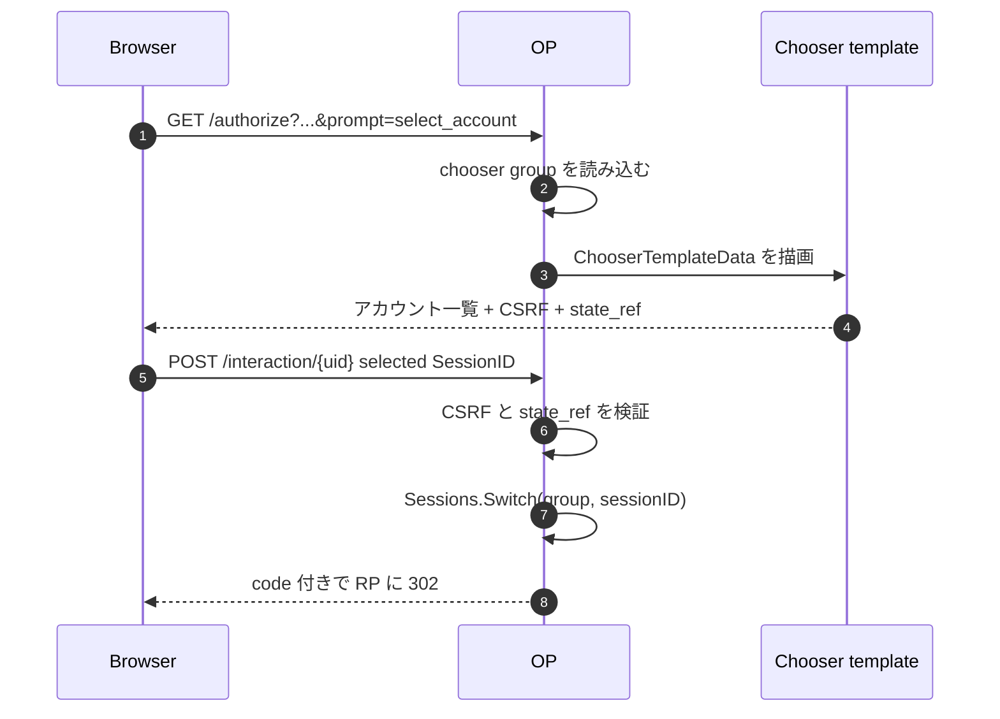

# ユースケース — カスタムアカウントチューザ UI

`prompt=select_account` には 2 つの関心事があります。

- **セッションの意味論**: ブラウザが複数の有効アカウントを含む chooser group を持ち、選択されたセッションが次の `sub` を決める
- **描画面**: アカウント一覧を表示し、選択された `SessionID` を POST するページ

[マルチアカウントチューザ](/ja/use-cases/multi-account) は前者を扱います。このページは後者、つまりブランド付きのサーバー描画のアカウント選択画面を持ちつつ、state、CSRF、最後の `Sessions.Switch` は OP に任せるための `op.WithChooserUI` を扱います。

> **ソース:** [`examples/12-custom-chooser-ui`](https://github.com/libraz/go-oidc-provider/tree/main/examples/12-custom-chooser-ui) は、デフォルトの HTML interaction ドライバで `op.WithChooserUI` を使う例です。JSON ドライバ / SPA 経路は [`examples/13-multi-account`](https://github.com/libraz/go-oidc-provider/tree/main/examples/13-multi-account) と対比してください。

## 使いどころ

| 目的 | 使うもの |
|---|---|
| 同梱 chooser をそのまま使う | オプション不要。デフォルト HTML ドライバが描画 |
| chooser の HTML / 文言 / レイアウトだけ変え、サーバー描画に留める | `op.WithChooserUI(op.ChooserUI{Template: tmpl})` |
| chooser を SPA の中で描画する | `op.WithSPAUI` または `interaction.JSONDriver` |
| アカウントのグループ化や切替のロジックを変える | テンプレートではなく session store / authenticator 側 |

`WithChooserUI` は意図的に狭い差し込み口です。差し替えるのはテンプレートだけで、テンプレートが任意の subject を選んだり、セッションを発行したり、OP の state machine を迂回したりする経路ではありません。

## テンプレートの契約

テンプレートには `interaction.ChooserTemplateData` が渡されます。主なフィールドは次の通りです。

| フィールド | 用途 |
|---|---|
| `Accounts` | chooser group 内の有効セッション。`SessionID`、subject、表示ラベル、auth time などを含む |
| `StateRef` | そのまま返す不透明な interaction state 参照 |
| `CSRFToken` | POST 時に OP が検証するトークン |
| `SessionIDField` | 選択アカウント用に OP が期待するフォームフィールド名 |
| `SubmitMethod` | 通常は `POST` |
| `SubmitAction` | interaction endpoint URL |
| `AddAccountURL` | 別アカウント追加のために `prompt=login` 経路を開始する URL |

最小形は次のようになります。

```go
tmpl := template.Must(template.New("chooser").Parse(`
{{range .Accounts}}
  <form method="{{$.SubmitMethod}}" action="{{$.SubmitAction}}">
    <input type="hidden" name="state_ref" value="{{$.StateRef}}">
    <input type="hidden" name="csrf_token" value="{{$.CSRFToken}}">
    <input type="hidden" name="{{$.SessionIDField}}" value="{{.SessionID}}">
    <button type="submit">Continue as {{.DisplayName}}</button>
  </form>
{{end}}
<a href="{{.AddAccountURL}}">Sign in to another account</a>
`))

provider, err := op.New(
  /* 必須オプション */
  op.WithInteractionDriver(interaction.HTMLDriver{}),
  op.WithChooserUI(op.ChooserUI{Template: tmpl}),
)
```

フィールド名は OP との契約です。`state_ref`、`csrf_token`、動的な `SessionIDField` は送信フォームに残してください。

## Flow



テンプレートは切替そのものを実行しません。選択されたセッション識別子を OP に返すだけです。

## SPA interaction との優先関係

`op.WithSPAUI` を使う場合、chooser の描画は JSON の状態取得を通じて SPA が受け持ちます。`WithSPAUI` と `WithChooserUI` が同時に設定されている場合、SPA 経路が優先され、chooser テンプレートは起動時の警告付きで無視されます。デプロイごとに UI の所有者を 1 つに絞ってください。

| UI の所有者 | オプション |
|---|---|
| OP によるサーバー描画 HTML | `op.WithChooserUI` |
| OP がマウントする SPA の入口 | `op.WithSPAUI` |
| 自前ルータが SPA を配信 | `op.WithInteractionDriver(interaction.JSONDriver{})` |

## 本番運用メモ

- テンプレートは起動時に一度だけ parse し、リクエストごとに parse しない。
- CSP は厳しく保つ。テンプレートデータには RP 由来の client 表示名などが入り得るため、`html/template` のエスケープに乗せ、インラインスクリプトを避ける。
- `SessionID` は不透明な値として扱う。OP はそれが有効な chooser group に属するかを検証する。
- 「アカウント追加」リンクは提供された `AddAccountURL` を使う。そうすれば次のログインが既存 chooser group に加わる。

## 続きはこちら

- [マルチアカウントチューザ](/ja/use-cases/multi-account) — chooser group の意味論と `Sessions.Switch`。
- [SPA / カスタム interaction](/ja/use-cases/spa-custom-interaction) — 同じ prompt を JSON ドライバで扱う経路。
- [カスタム同意 UI](/ja/use-cases/custom-consent-ui) — consent 向けの同等のサーバー描画テンプレート差し込み口。
