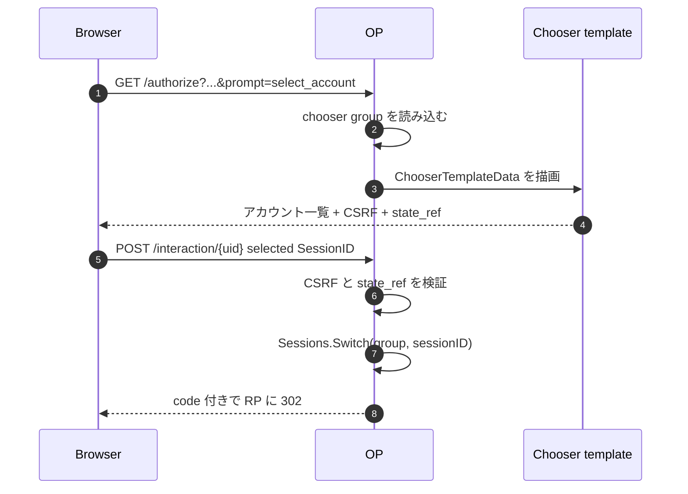

# ユースケース — カスタムアカウントチューザ UI

`prompt=select_account` には 2 つの関心事があります。

- **セッションの意味論**: ブラウザが複数の有効アカウントを含む chooser group を持ち、選択されたセッションが次の `sub` を決める
- **描画面**: アカウント一覧を表示し、選択された `SessionID` を POST するページ

[マルチアカウントチューザ](/ja/use-cases/multi-account) は前者を扱います。このページは後者、つまり branded なサーバー描画のアカウント選択画面を持ちつつ、state、CSRF、最後の `Sessions.Switch` は OP に任せるための `op.WithChooserUI` を扱います。

> **ソース:** [`examples/12-custom-chooser-ui`](https://github.com/libraz/go-oidc-provider/tree/main/examples/12-custom-chooser-ui) は、デフォルトの HTML interaction driver で `op.WithChooserUI` を使う例です。JSON driver / SPA 経路は [`examples/13-multi-account`](https://github.com/libraz/go-oidc-provider/tree/main/examples/13-multi-account) と対比してください。

## 使いどころ

| 目的 | 使うもの |
|---|---|
| 同梱 chooser をそのまま使う | option 不要。デフォルト HTML driver が描画 |
| chooser の HTML / 文言 / layout だけ変え、サーバー描画に留める | `op.WithChooserUI(op.ChooserUI{Template: tmpl})` |
| chooser を SPA の中で描画する | `op.WithSPAUI` または `interaction.JSONDriver` |
| アカウントの group 化や切替のロジックを変える | template ではなく session store / authenticator 側 |

`WithChooserUI` は意図的に狭い差し込み口です。差し替えるのは template だけで、template が任意 subject を選んだり、セッションを発行したり、OP の state machine を迂回したりする経路ではありません。

## Template contract

template には `interaction.ChooserTemplateData` が渡されます。主なフィールドは次の通りです。

| フィールド | 用途 |
|---|---|
| `Accounts` | chooser group 内の有効セッション。`SessionID`、subject、表示ラベル、auth time などを含む |
| `StateRef` | そのまま返す opaque な interaction state 参照 |
| `CSRFToken` | POST 時に OP が検証する token |
| `SessionIDField` | 選択アカウント用に OP が期待する form field 名 |
| `SubmitMethod` | 通常は `POST` |
| `SubmitAction` | interaction endpoint URL |
| `AddAccountURL` | 別アカウント追加のために `prompt=login` 経路を開始する URL |

最小形は次のようになります。

```go
tmpl := template.Must(template.New("chooser").Parse(`
{{range .Accounts}}
  <form method="{{$.SubmitMethod}}" action="{{$.SubmitAction}}">
    <input type="hidden" name="state_ref" value="{{$.StateRef}}">
    <input type="hidden" name="csrf_token" value="{{$.CSRFToken}}">
    <input type="hidden" name="{{$.SessionIDField}}" value="{{.SessionID}}">
    <button type="submit">Continue as {{.DisplayName}}</button>
  </form>
{{end}}
<a href="{{.AddAccountURL}}">Sign in to another account</a>
`))

provider, err := op.New(
  /* 必須オプション */
  op.WithInteractionDriver(interaction.HTMLDriver{}),
  op.WithChooserUI(op.ChooserUI{Template: tmpl}),
)
```

field 名は OP との contract です。`state_ref`、`csrf_token`、動的な `SessionIDField` は送信 form に残してください。

## Flow



template は切替そのものを実行しません。選択されたセッション識別子を OP に返すだけです。

## SPA interaction との優先関係

`op.WithSPAUI` を使う場合、chooser surface は JSON state envelope 経由で SPA が所有します。`WithSPAUI` と `WithChooserUI` が同時に設定されている場合、SPA 経路が優先され、chooser template は startup warning 付きで無視されます。deployment ごとに UI の所有者を 1 つに絞ってください。

| UI owner | option |
|---|---|
| OP によるサーバー描画 HTML | `op.WithChooserUI` |
| OP が mount する SPA shell | `op.WithSPAUI` |
| 自前 router が SPA を配信 | `op.WithInteractionDriver(interaction.JSONDriver{})` |

## Production notes

- template は startup 時に一度だけ parse し、request ごとに parse しない。
- CSP は厳しく保つ。template data には RP 由来の client 表示名などが入り得るため、`html/template` の escape に乗せ、inline script を避ける。
- `SessionID` は opaque 値として扱う。OP はそれが active chooser group に属するかを検証する。
- 「アカウント追加」リンクは提供された `AddAccountURL` を使う。そうすれば次のログインが既存 chooser group に join する。

## 続きはこちら

- [マルチアカウントチューザ](/ja/use-cases/multi-account) — chooser group の意味論と `Sessions.Switch`。
- [SPA / カスタム interaction](/ja/use-cases/spa-custom-interaction) — 同じ prompt を JSON driver で所有する経路。
- [カスタム同意 UI](/ja/use-cases/custom-consent-ui) — consent 向けの同等のサーバー描画 template 差し込み口。
