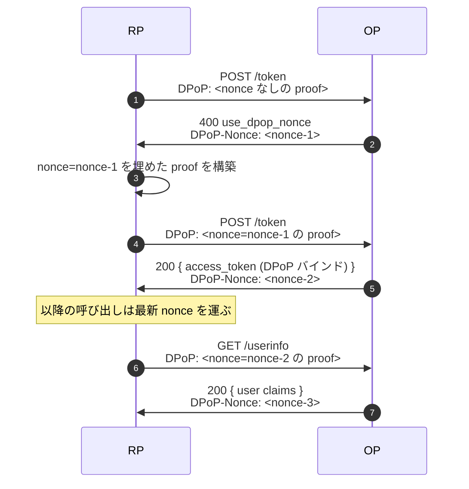

# ユースケース — DPoP nonce フロー

## DPoP とは何か、nonce とは何か

**DPoP**（"Demonstrating Proof of Possession", RFC 9449）は、アクセストークンをクライアントが保持する鍵に紐づける仕組みです。クライアントは API 呼び出しのたびに、その鍵で署名した新しい JWT を `DPoP:` ヘッダで提示し、「私はこのトークンを発行されたクライアントと同一です」と証明します。漏洩した DPoP-bound トークンは、鍵を持たない攻撃者にとって無価値です。

**nonce** は RFC 9449 §8 / §9 が追加する補強策です。これがないと、クライアントは事前に DPoP proof をいくつも作って手元に置けてしまい、クライアントを一時的に侵害した攻撃者がそれをまとめて持ち出して後から再利用できる、という穴が残ります。nonce はその穴を塞ぎます: OP がサーバ側で生成した最新 nonce を発行し、次の DPoP proof には **必ずその nonce を含める** ことを要求します。事前計算した proof は即座に無効化されます。

::: details このページで触れる仕様
- [RFC 9449](https://datatracker.ietf.org/doc/html/rfc9449) — DPoP, §8（OP が供給する nonce）, §9（リソースサーバが供給する nonce）
- [FAPI 2.0 Baseline](https://openid.net/specs/fapi-2_0-baseline.html) — nonce 許容
- [FAPI 2.0 Message Signing](https://openid.net/specs/fapi-2_0-message-signing.html) — nonce 必須
:::

::: details 用語の補足
- **DPoP proof** — クライアントがリクエスト毎に署名する小さな JWT。「アクセストークンがバインドされた秘密鍵を、いまも自分が保持している」ことを示します。基本は [送信者制約](/ja/concepts/sender-constraint) を参照。
- **事前計算 proof 攻撃** — クライアントの端末を一時的に侵害した攻撃者が、有効な proof をまとめて持ち出して後から再利用するシナリオ。nonce が無いと、proof は `iat` 窓が許す限り有効なままです。
:::

短くまとめると、nonce フローは次の 2 種の攻撃を遮ります:

- **事前計算 proof** — proof を傍受しても、次の nonce を知らない攻撃者は再利用できません。
- **stage-and-fire** — オフラインで仕込んだ長寿命 proof は、OP が nonce をローテーションすると無効化されます。

> **ソース:** [`examples/51-dpop-nonce`](https://github.com/libraz/go-oidc-provider/tree/main/examples/51-dpop-nonce)

## フロー



## 実装

ライブラリは in-memory リファレンス実装を同梱しています。シングルプロセス用、HA セーフではありませんが、開発と小規模 deploy には十分:

```go
import "github.com/libraz/go-oidc-provider/op"

src, err := op.NewInMemoryDPoPNonceSource(ctx, 5*time.Minute)
if err != nil { /* ... */ }

op.New(
  /* 必須オプション */
  op.WithFeature(feature.DPoP),
  op.WithDPoPNonceSource(src),
)
```

ローテーション間隔（上の `5*time.Minute`）は「現行」nonce が切り替わる頻度です。current と previous の両方が受理されるので、ローテーション境界でリクエストが競合してもハード失敗にはなりません。

::: warning 複数インスタンス構成
プロセスローカルな nonce ソースはレプリカを跨げません — インスタンス B はインスタンス A が出した nonce を知りません。本番 HA 構成では、独自 `DPoPNonceSource` の裏に共有ストア（Redis）を置きます。Redis nonce ソースをライブラリに同梱しないのは意図的です。オプション群（TTL、ローテーション周期、ローテーション境界の取りこぼし許容度）が運用ごとに異なりすぎるためです。
:::

## OP が nonce を要求するエンドポイント

| Endpoint | nonce 必須？ | 設定箇所 |
|---|---|---|
| `/token` | `DPoPNonceSource` 設定時は常に必須 | `op.WithDPoPNonceSource` |
| `/userinfo` | `DPoPNonceSource` 設定時は常に必須 | 同上 |
| `/par` | 受理するが必須ではない | 該当なし |

FAPI 2.0 Message Signing は nonce を強制、Baseline は許可。ライブラリは仕様に追従するので、プロファイルを切り替えればデフォルトも切り替わります。

## 動作確認

```sh
# nonce なしの最初の呼び出し
curl -i -X POST -H "DPoP: <nonce なしの proof>" \
  -d 'grant_type=authorization_code&code=...' \
  http://localhost:8080/oidc/token | head -20
# HTTP/1.1 400 Bad Request
# DPoP-Nonce: <fresh-nonce>
# {"error":"use_dpop_nonce", ...}
```

`DPoP-Nonce` の値を次の proof の `nonce` claim に入れて再試行します。

## 続きはこちら

- [送信者制約](/ja/concepts/sender-constraint) — DPoP がそもそも何のためにあるか。
- [FAPI 2.0 Baseline](/ja/use-cases/fapi2-baseline) — nonce をデフォルトで強制するプロファイル。
