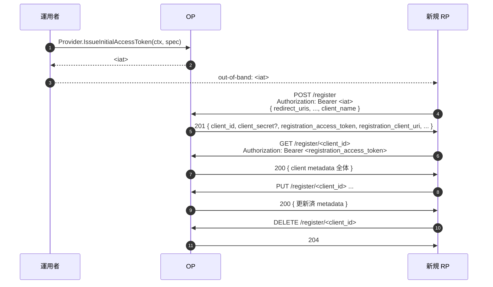

# ユースケース — 動的クライアント登録

## 動的クライアント登録とは

最も素朴な構成では、RP を 1 つ統合するたびに、OP 運用者が `client_id` / `client_secret` / redirect URI / scope などを config に手で書き足します。社内アプリ数個なら問題ありませんが、毎週新しい連携が増えるパブリックなエコシステムにはスケールしません。

**動的クライアント登録 (DCR)** は、RP が実行時に自分自身を登録できる JSON API です。RP がメタデータを POST すると、OP は新しい `client_id` と認証情報を返します。乱用を防ぐため、登録は **Initial Access Token (IAT)** で受け付け範囲を制限します。IAT は運用者が事前に発行するトークンで、許可するメタデータ・有効期限・single-use などの制約をかけられます。

::: details このページで触れる仕様
- [RFC 7591](https://datatracker.ietf.org/doc/html/rfc7591) — Dynamic Client Registration Protocol
- [RFC 7592](https://datatracker.ietf.org/doc/html/rfc7592) — Dynamic Client Registration Management（読取 / 更新 / 削除）
- [RFC 8414](https://datatracker.ietf.org/doc/html/rfc8414) — Authorization Server Metadata（discovery）
- [RFC 8252](https://datatracker.ietf.org/doc/html/rfc8252) — OAuth 2.0 for Native Apps（後述のループバックリダイレクト規定）
- [OpenID Connect Core 1.0](https://openid.net/specs/openid-connect-core-1_0.html) — §2（`auth_time` / `acr` / `default_max_age`）
:::

::: details 用語の補足
- **Initial Access Token (IAT)** — 運用者が out-of-band（仕様外の経路）で発行する短寿命の bearer トークン。OP は IAT 無しの `POST /register` を拒否します — 任意の匿名呼び出しからクライアント生成を防ぐゲートです。
- **Registration Access Token (RAT)** — 登録成功時の 201 応答に新しい `client_id` と一緒に含まれます。RP は `registration_client_uri` に対して RAT を使って RFC 7592 の読み取り / 更新 / 削除を実行します。
:::

> **ソース:** [`examples/41-dynamic-registration`](https://github.com/libraz/go-oidc-provider/tree/main/examples/41-dynamic-registration)

## アーキテクチャ



## 実装

```go
import (
  "github.com/libraz/go-oidc-provider/op"
)

provider, err := op.New(
  /* 必須オプション */
  op.WithDynamicRegistration(op.RegistrationOption{
    AllowedGrantTypes:    []string{"authorization_code", "refresh_token"},
    AllowedResponseTypes: []string{"code"},
  }),
)

// IAT を運用で発行 — RP には out-of-band で渡す。
iat, err := provider.IssueInitialAccessToken(ctx, op.InitialAccessTokenSpec{
  TTL:     24 * time.Hour,
  MaxUses: 1,
})
```

`op.WithDynamicRegistration` は暗黙のうちに `feature.DynamicRegistration` を有効化し、`/register` をマウントして、discovery document に `registration_endpoint` を出力します。

## 認証コンテキスト系のクライアントメタデータ

`/authorize` の既定値と発行 `id_token` の `auth_time` を制御するメタデータが 3 つあります。DCR 登録（RFC 7591）でも `op.ClientSeed` の静的シードでも受理され、リクエスト時に OP 側で強制されます。

| フィールド | 効果 | 仕様 |
|---|---|---|
| `default_max_age`（nullable な整数） | リクエストが `max_age` を省略した場合の既定値として適用されます。フィールドは end-to-end で nullable なので、「未指定」と「明示的な `0`（再認証必須）」が通信路上でもストア上でも区別され続けます。 | OIDC Core 1.0 §2 / Dynamic Client Registration §2 |
| `default_acr_values` | リクエストが `acr_values` を省略した場合の既定値として適用されます。`op.WithACRPolicy`（[MFA / ステップアップ](/ja/use-cases/mfa-step-up)）と組み合わせて AAL 階層へマップします。 | OIDC Core 1.0 §2 / Dynamic Client Registration §2 |
| `require_auth_time` | `true` のとき、発行される `id_token` には必ず `auth_time` が乗らなければなりません。OP が元の認証時刻を復元できない場合、値を捏造する代わりに `server_error` でトークン発行を失敗させます。 | OIDC Core 1.0 §2 |

::: tip なぜ `auth_time` 不在で server_error なのか
`require_auth_time` の違反は実運用ではめったに起こりません — OP がログインフローを自前で実行している限り `auth_time` は記録されます。捏造（例: `iat` で代替）してしまうと、ステップアップ保証を `auth_time` で監査している RP を気付かれずに壊してしまいます。構築時に拒否することで、欠落の原因が発生した地点で表面化させます。
:::

## 譲れないセキュリティの最低ライン

::: warning Loopback の `redirect_uris` と DNS rebinding
`application_type` のデフォルトは `web` です。Web クライアントが `http` の `redirect_uri` を登録できるのは host が **IP リテラル** `127.0.0.1` または `[::1]` のときだけで、文字列 `localhost` はデフォルトで拒否します — RFC 8252 §8.3 の DNS-rebinding 窓を閉じるためです。`localhost` を正当に使う Web クライアントは `op.WithAllowLocalhostLoopback()` でオプトインします。安全側のデフォルトからの逸脱が設定箇所に可視化される設計です。

ネイティブクライアント（`application_type=native`）は OIDC Registration §2 に従い、3 種類の loopback host（`127.0.0.1` / `[::1]` / `localhost`）すべてを `http` で無条件に受け付けます。さらに claimed `https`、および RFC 8252 §7.1 の reverse-DNS custom URI scheme（例: `com.example.app:/callback`）も登録できます。`.` を含まない custom scheme はアプリ間で衝突しやすいため拒否します。
:::

## 登録時に強制している内容

DCR は `full` ではなく `partial` の表記ですが、`partial` の差分は意図的な設計判断であって TODO ではありません。バリデータは `POST /register` と `PUT /register/{client_id}` のいずれでも、以下に違反する metadata を拒否します:

- `application_type` ごとの `redirect_uris` 形（上のワーニングを参照）。fragment 無し、絶対 URL のみ。
- `grant_types` と `response_types` を OIDC Core §3 / OIDC Registration §2 の組み合わせ表に対してクロスチェック。整合しない組は `invalid_client_metadata` で拒否し、黙って auto-fix することはありません。
- `jwks` と `jwks_uri` は同時指定不可。URI 系 metadata（`client_uri`、`logo_uri`、`policy_uri`、`tos_uri`、`jwks_uri`、`sector_identifier_uri`、`initiate_login_uri`、`request_uris`）は絶対 URI、`https`、fragment 無しを要求。
- `sector_identifier_uri` は登録時に GET で取得し、応答 JSON 配列に登録する `redirect_uri` がすべて含まれることを検証(OIDC Core §8.1)。取得は 5 秒のタイムアウトと 5 MiB の body サイズ上限で制限し、取得失敗または包含未達はいずれも `invalid_client_metadata`。
- `subject_type=pairwise` で `sector_identifier_uri` が無い場合、`redirect_uri` の host はすべて同一でなければなりません。
- `request_object_signing_alg` は `RS256` / `PS256` / `ES256` / `EdDSA` に限定されます。

## 意図的な制約

`full` を名乗らない残差は、設計判断であって積み残しではありません。判断の根拠は [設計判断](/ja/security/design-judgments) ページに別エントリとして残しています — `client_secret` の非開示（[#dj-20](/ja/security/design-judgments#dj-20)）、PUT 省略のセマンティクス（[#dj-21](/ja/security/design-judgments#dj-21)）、`sector_identifier_uri` の fetch と native loopback ルール（[#dj-22](/ja/security/design-judgments#dj-22)）。

- **`GET /register/{id}` では `client_secret` を再掲しない。** ストアは hash しか保持せず、平文は最初の `POST /register` と、後述する 2 つの PUT ケースだけで応答に乗ります。RFC 7591 §3.2.1 は読み取り応答での `client_secret` を OPTIONAL としており、非準拠ではありません。
- **PUT の省略は削除ではなく server default への reset。** `PUT /register/{client_id}` で `grant_types`、`response_types`、`token_endpoint_auth_method`、`application_type`、`subject_type`、`id_token_signed_response_alg` のいずれかを省略すると、その field は OP のデフォルト値に戻ります。optional metadata（`client_uri`、`logo_uri`、`policy_uri`、`tos_uri`、…）は空値になります。
- **PUT が `client_secret` を再掲するのは (a) `none` から confidential への auth method 昇格、(b) 明示的な rotation 要求のいずれか。** 通常の metadata 編集の応答には平文 secret は含まれません。
- **PUT の body に server 管理の field を含めてはならない。** `registration_access_token`、`registration_client_uri`、`client_secret_expires_at`、`client_id_issued_at` を含めると `400 invalid_request`。認証中のクライアントの `client_secret` と一致しない値を送っても `400` になります。
- **`software_statement`（RFC 7591 §2.3）は v1.0 では非対応。** 指定されたリクエストは `invalid_software_statement` で拒否します。federation / trust chain は v1.0 のスコープ外です。

## 読み取り / 更新 / 削除

201 レスポンスは `registration_access_token` と `registration_client_uri` を含みます。RP はこれらを使って RFC 7592 の操作を呼びます:

```sh
# read
curl -H "Authorization: Bearer $RAT" $RCU

# update
curl -X PUT -H "Authorization: Bearer $RAT" -H "Content-Type: application/json" \
  -d '{"client_name":"New Name", ...}' $RCU

# delete
curl -X DELETE -H "Authorization: Bearer $RAT" $RCU
```

## 採用すべきとき

DCR が活きるのは:

- 各テナントが自分の RP を持ち込み、設定変更のロールアウトを避けたい multi-tenant SaaS。
- チームが自分でクライアントクレデンシャルを取得できる内部 developer platform。

DCR がオーバーキル（かつ不要な攻撃面）になるのは:

- RP が 10 個、全部内部、全部既知のケース。`op.WithStaticClients(...)` の方がシンプルで可動部品も少なくて済みます。
