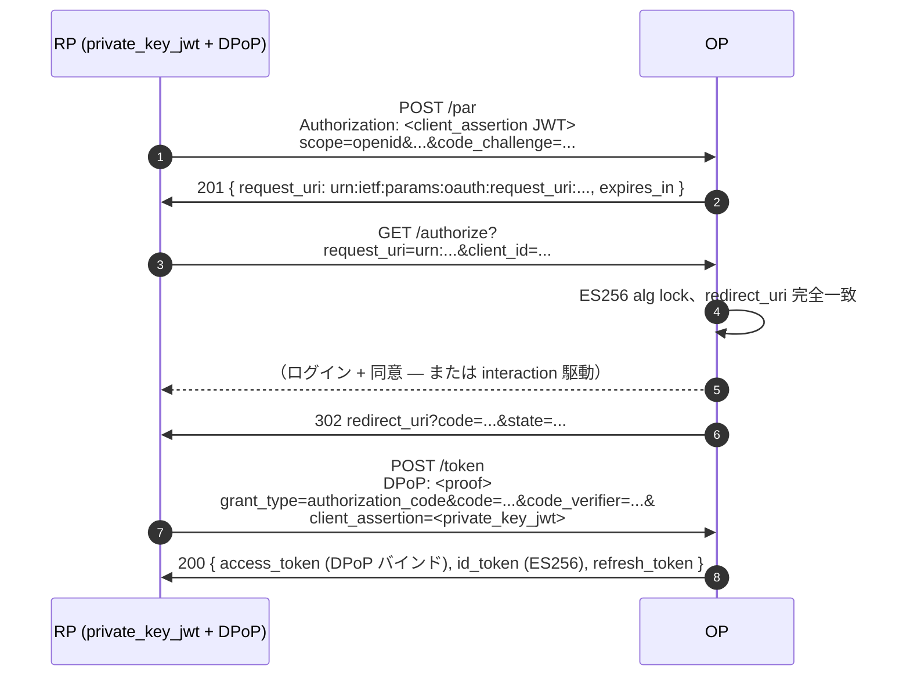

# ユースケース — FAPI 2.0 Baseline

## FAPI 2.0 とは

**FAPI**（"Financial-grade API"）は OpenID Foundation が策定する OAuth 2.0 + OIDC のプロファイルです。基盤となる仕様の **厳しいサブセット** を選び、攻撃者に長年悪用されてきた任意性を禁じます — 例えば `RS256` を弾いて `ES256` / `PS256` を必須化、PKCE をすべての認可で必須化、送信者制約付きトークン（DPoP **または** mTLS）を必須化、RP の `/authorize` 要求を生のクエリ文字列ではなく PAR + JAR で送らせる、などです。

このバーが要求される理由は、銀行・医療・行政の運用が「フラグを全部覚えていますか？」ではなく「チェックリストに対して監査可能か」を要求するからです。FAPI 2.0 は FAPI 1.0（こちらも依然現役）の後継。FAPI 2.0 Baseline はエントリーレベル、FAPI 2.0 Message Signing が JARM + DPoP nonce + RS 側の proof 署名を追加する上位層です。

本ライブラリは Baseline を **プロファイル 1 つの切り替え**（`op.WithProfile(profile.FAPI2Baseline)`）として公開し、必須フラグをまとめて立て、プロファイルを暗黙に違反するような構成では `op.New` 自体が起動を拒否します。

PAR / JAR / JARM / DPoP / mTLS / ES256 など各略号の解説は [FAPI 2.0 入門](/ja/concepts/fapi) にあります。本ページは構成例を扱います。

::: details このページで触れる仕様
- [FAPI 2.0 Baseline](https://openid.net/specs/fapi-2_0-baseline.html) — Final
- [RFC 9126](https://datatracker.ietf.org/doc/html/rfc9126) — Pushed Authorization Requests (PAR)
- [RFC 9101](https://datatracker.ietf.org/doc/html/rfc9101) — JWT-Secured Authorization Request (JAR)
- [RFC 7636](https://datatracker.ietf.org/doc/html/rfc7636) — PKCE
- [RFC 9449](https://datatracker.ietf.org/doc/html/rfc9449) — DPoP
- [RFC 8705](https://datatracker.ietf.org/doc/html/rfc8705) — Mutual-TLS Client Authentication
- [RFC 7518](https://datatracker.ietf.org/doc/html/rfc7518) — JOSE algorithms
:::

> **ソース:** [`examples/03-fapi2/main.go`](https://github.com/libraz/go-oidc-provider/tree/main/examples/03-fapi2)

## FAPI 2.0 Baseline が要求するもの

| 要件 | RFC | ライブラリの挙動 |
|---|---|---|
| Pushed Authorization Requests | RFC 9126 | プロファイルが `feature.PAR` を自動有効化。`/par` の `request_uri` が唯一の authorize 入口。 |
| Proof Key for Code Exchange | RFC 7636 | `code_challenge_method=S256` 必須、`plain` 拒否。 |
| 送信者制約付きトークン（DPoP **または** mTLS） | RFC 9449 / RFC 8705 | プロファイルが `RequiredAnyOf=[DPoP, MTLS]` を立て、どちらかが有効でなければ起動を拒否。 |
| ES256（または PS256）署名 | RFC 7518 | アルゴリズム allow-list が FAPI 公開面から `RS256` を除外、`none`/`HS*` はそもそも存在しない。 |
| `redirect_uri` 完全一致 | FAPI 2.0 §5.3 | ワイルドカード無し、バイト一致比較。 |
| `private_key_jwt` または mTLS クライアント認証 | FAPI 2.0 §3.1.3 | token endpoint auth-method リストを FAPI allow-list と交差。 |

## アーキテクチャ



## コード（[`examples/03-fapi2`](https://github.com/libraz/go-oidc-provider/tree/main/examples/03-fapi2) からの抜粋）

```go
import (
  "github.com/libraz/go-oidc-provider/op"
  "github.com/libraz/go-oidc-provider/op/profile"
  "github.com/libraz/go-oidc-provider/op/storeadapter/inmem"
)

const (
  demoIssuer      = "https://op.example.com"
  demoClientID    = "fapi2-example-client"
  demoRedirectURI = "https://rp.example.com/callback"
)

provider, err := op.New(
  op.WithIssuer(demoIssuer),
  op.WithStore(inmem.New()),
  op.WithKeyset(opKeys.Keyset()),
  op.WithCookieKey(opKeys.CookieKey),
  op.WithProfile(profile.FAPI2Baseline), // <--- 1 行で切り替え
  op.WithStaticClients(op.ClientSeed{
    ID:                      demoClientID,
    TokenEndpointAuthMethod: op.AuthPrivateKeyJWT,
    RedirectURIs:            []string{demoRedirectURI},
    GrantTypes:              []grant.Type{grant.AuthorizationCode, grant.RefreshToken},
    JWKs:                    clientJWKs, // 公開 JWK Set を JSON で
  }),
)
```

`WithProfile` 呼び出しは:

1. `feature.PAR`、`feature.JAR`、`feature.DPoP` を自動有効化。
2. `token_endpoint_auth_methods_supported` を FAPI 2.0 §3.1.3 allow-list（`private_key_jwt`、`tls_client_auth`、`self_signed_tls_client_auth`）と交差。
3. ID Token 署名 alg を `ES256`/`PS256` にロック、新規発行で `RS256` を拒否。
4. `redirect_uri` の完全一致を強制（どこにもワイルドカード無し）。

::: tip DPoP の代わりに mTLS
同じプロファイルは `RequiredAnyOf=[DPoP, MTLS]` のまま — DPoP の代わりに（または併用で）`feature.MTLS` を有効にし、TLS 終端 proxy 用に `op.WithMTLSProxy(...)` を設定してください。FAPI グレードの TLS ヘルパーは [`examples/50-fapi-tls-jwks`](https://github.com/libraz/go-oidc-provider/tree/main/examples/50-fapi-tls-jwks)。
:::

## サーフェス確認

```sh
curl -s http://localhost:8080/.well-known/openid-configuration | jq '{
  pushed_authorization_request_endpoint,
  request_parameter_supported,
  dpop_signing_alg_values_supported,
  token_endpoint_auth_methods_supported,
  id_token_signing_alg_values_supported
}'
```

期待値:

```json
{
  "pushed_authorization_request_endpoint": "http://localhost:8080/oidc/par",
  "request_parameter_supported": true,
  "dpop_signing_alg_values_supported": ["ES256", "EdDSA", "PS256"],
  "token_endpoint_auth_methods_supported": ["private_key_jwt"],
  "id_token_signing_alg_values_supported": ["ES256", "PS256"]
}
```

## 適合状況

OFCS の [`fapi2-security-profile-id2-test-plan`](/ja/compliance/ofcs) はこの実装を検査します。最新 baseline で 48 PASSED / 9 REVIEW（手動レビュー）/ 1 SKIPPED（追加のクライアント鍵が必要な RSA 鍵での負例）/ **0 FAILED**。

OFCS 全体像と REVIEW / SKIPPED 内訳は [OFCS 適合状況](/ja/compliance/ofcs) を参照。
