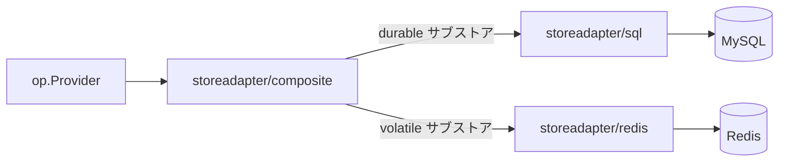

# ユースケース — Hot/Cold 分離（Redis 揮発）

## 「Hot / Cold」とは

OP が抱える状態は、性質が大きく異なる 2 種類に分かれます:

- **Cold (durable)** — 失うわけにはいかない長寿命の行: 登録クライアント、ユーザレコード、refresh token チェーン、永続セッション。
- **Hot (volatile)** — 高頻度で生成され短時間で陳腐化する行: PAR の `request_uri`（RFC 9126）、消費済み JTI replay セット（RFC 7519）、ログイン途中の interaction 状態。失っても再ログインで済むものです。

両方を同じバックエンドに乗せるのは無駄です — 永続ストアに hot 由来の QPS は必要ありませんし、揮発ストアに cold が要求する耐久性は必要ありません。composite アダプタは両者を分離します。

::: details このページで触れる仕様
- [RFC 9126](https://datatracker.ietf.org/doc/html/rfc9126) — Pushed Authorization Requests（PAR — `request_uri` は揮発状態）
- [RFC 7519](https://datatracker.ietf.org/doc/html/rfc7519) — JWT、`jti` を含む（replay セット状態）
- [RFC 9700](https://datatracker.ietf.org/doc/html/rfc9700) — OAuth 2.0 Security BCP, §4.14（refresh token rotation）
- [OpenID Connect RP-Initiated Logout 1.0](https://openid.net/specs/openid-connect-rpinitiated-1_0.html) — セッション状態
- [OpenID Connect Back-Channel Logout 1.0](https://openid.net/specs/openid-connect-backchannel-1_0.html) — ログアウト時の fan-out
:::

::: details 用語の補足
- **耐久性方針（durability posture）** — サブストアがプロセス再起動やレプリカフェイルオーバを跨いで *残らなければならない* かどうか。refresh token chain、登録クライアント、永続セッションは durable 側です。PAR の `request_uri`、JTI replay セット、進行中の interaction 状態は失っても差し支えありません。分離は美学ではなく実用 — 永続ストアに揮発 tier の QPS は必要ありませんし、揮発ストアに永続 tier の保証は必要ないからです。
- **トランザクションクラスタ** — アトミックに commit が必要なサブストアの集合（例: `auth_code` 発行と対応する refresh token chain）。バックエンドを跨いで分けると「片方は永続に書かれ、もう片方は揮発で消えた」中途半端な状態が生じうるため、composite コンストラクタはクラスタを分割する設定を拒否します。
- **`jti`** — JWT の一意識別子（RFC 7519）。OP は JWT を運ぶ各経路（request object、client assertion、DPoP proof）ごとに「消費済み JTI」セットを保持し、replay を防ぎます。各仕様の再利用許容窓に合わせて短寿命なので、揮発ストレージが自然な置き場になります。
:::

`op/storeadapter/composite` がスプリッタです。durable ストアと volatile ストアを受け取り、各サブストアを適切な側にルーティングします。トランザクションクラスタ（同時に commit する必要があるサブストア群）を割らない構成のみが許容されます。

> **ソース:**
> - [`examples/08-composite-hot-cold`](https://github.com/libraz/go-oidc-provider/tree/main/examples/08-composite-hot-cold) — SQLite durable + inmem volatile。`go run -tags example .` 1 行で起動可能。
> - [`examples/09-redis-volatile`](https://github.com/libraz/go-oidc-provider/tree/main/examples/09-redis-volatile) — MySQL durable + Redis volatile。`mysql:8.4` と `redis:7.4-alpine` に固定された docker-compose スタックとして同梱されており、アダプタの contract test と example が同じエンジンマトリクスを共有します。

## アーキテクチャ



composite ストアはトランザクションクラスタの不変条件を強制します。一緒にアトミックコミットが必要なサブストア（例: `AuthCodeStore` と `RefreshTokenStore`）は **同じバックエンドに置く必要があります**。composite コンストラクタは、このクラスタを分割する設定を拒否します。

## コード

```go
import (
  "github.com/libraz/go-oidc-provider/op"
  "github.com/libraz/go-oidc-provider/op/storeadapter/composite"
  "github.com/libraz/go-oidc-provider/op/storeadapter/sql"
  "github.com/libraz/go-oidc-provider/op/storeadapter/redis"
)

durable, err := oidcsql.New(db, oidcsql.MySQL())
if err != nil { /* ... */ }

volatile, err := oidcredis.New(context.Background(),
  oidcredis.WithDSN("rediss://redis:6380/0"), // デフォルトで TLS 必須
  oidcredis.WithRedisAuth(redisUsername, redisPassword),
)
if err != nil { /* ... */ }

// composite.New は関数オプションを取ります。WithDefault がすべての Kind を
// durable バックエンドに割り当て、With(kind, store) で個別の substore を
// 上書きします。composite.TxClusterKinds を別バックエンドに分割する構成は
// composite.New が拒否します。
combined, err := composite.New(
  composite.WithDefault(durable),
  composite.With(composite.Sessions, volatile),
  composite.With(composite.Interactions, volatile),
  composite.With(composite.ConsumedJTIs, volatile),
)
if err != nil { /* ... */ }

provider, err := op.New(
  op.WithIssuer("https://op.example.com"),
  op.WithStore(combined),
  op.WithKeyset(myKeyset),
  op.WithCookieKeys(myCookieKey),
  op.WithStaticClients(op.PublicClient{
    ID:           "demo-rp",
    RedirectURIs: []string{"https://rp.example.com/callback"},
    Scopes:       []string{"openid", "profile"},
  }),
)
```

::: info composite を介した静的クライアントのシード
`op.WithStaticClients` は `*composite.Store` を直接受け取れるので、組み込み側は composite で包む前に durable バックエンドへ直接シードする必要はありません。

composite は意図的に `store.ClientRegistry` を型アサーションでは満たさず（read-only にルートされた `Clients` バックエンドが暗黙のうちに registry に流用されるのを防ぐため）、代わりにオプショナルな `ClientRegistry()` アクセサを公開し、`op.WithStaticClients` が組み立て時にこれをプローブします。ルート先の `Clients` バックエンドが read-only の場合、プローブは `(nil, false)` を返し、`op.New` は read-only ストアを直接渡したときと同じ `store.ClientRegistry required` エラーで構成を拒否します。
:::

## Redis のセキュリティデフォルト

::: warning デフォルトで保護のない Redis を許さない
`redis.New` は TLS（`rediss://`）と AUTH 無しでは **起動を拒否** します。refresh token chain を平文で流す構成を出荷させないためです。例外口 `redis.WithDevModeAllowPlaintext(callback)` は `examples/` 実行とローカル開発のためだけにあります — 本番で使うのは「手で打ち込まないと出てこない」セキュリティ後退の選択肢です。
:::

## デフォルトの分離

| Substore | Tier |
|---|---|
| `ClientStore` | durable (SQL) |
| `UserStore` | durable (SQL) |
| `AuthCodeStore` | durable (SQL — 短寿命だが transactional cluster 内) |
| `RefreshTokenStore` | durable (SQL) |
| `AccessTokenRegistry` | durable (SQL — `RevocationStrategyJTIRegistry` を選んだときだけ書き込まれる) |
| `OpaqueAccessTokenStore` | durable (SQL — opaque AT 形式を有効にしたときだけ書き込まれる) |
| `GrantRevocationStore` | durable (SQL — 既定の grant-tombstone 失効戦略を支えるストア) |
| `SessionStore` | `composite.With(composite.Sessions, ...)` でどちらの tier にもルートできる。配置の宣言として `WithSessionDurabilityPosture`(既定 `SessionDurabilityVolatile`)を立てると、back-channel logout 監査が想定内 / 想定外のギャップを分類できる |
| `InteractionStore` | volatile (Redis) |
| `ConsumedJTIStore` | volatile (Redis) |
| `PARStore` | volatile (Redis) |

::: info 新しいサブストアが durable 側に残る理由
`OpaqueAccessTokenStore` と `GrantRevocationStore` はトランザクションクラスタの一部で、起点となる grant / refresh の書き込みと同時にコミットされる必要があります。Redis アダプタはどちらのアクセサからも `nil` を返すので、composite アダプタは両者を非トランザクションのバックエンドに振り分けることができません。

これらのサブストアが必要な組み込み側は durable 側に SQL を配置してください。既定の失効戦略(`RevocationStrategyGrantTombstone`)は `GrantRevocations()` が non-nil であることを `op.New` で強制するため、durable 側を空にしたい Redis 専用デプロイは `op.WithAccessTokenRevocationStrategy(op.RevocationStrategyNone)` を明示する必要があります(非 FAPI 限定 — FAPI プロファイルは `None` を拒否します)。
:::

::: details SessionStore がどちらにもなる理由
揮発セッションストア（メモリ圧で追い出される、複製保証無し）は、多くのデプロイで許容範囲です — 最悪ケースでもユーザの再認証で済むためです。一方で、再起動を跨いでログイン状態を保ちたい組み込み側もいます。ルーティング自体は組み込み側の選択で、`composite.With(composite.Sessions, durable_or_volatile_store)` で行います。`op.WithSessionDurabilityPosture(SessionDurabilityVolatile | SessionDurabilityDurable)` はライブラリ側で強制しない *宣言* で、値を back-channel logout の `bcl.no_sessions_for_subject` 監査イベントに伝播するだけです。これにより SOC ダッシュボードは「揮発配置における想定内のギャップ」と「永続配置における想定外のギャップ」を区別できます。
:::

## 観測性

揮発 tier のヒット率、キャッシュの追い出し、SQL プール統計は、それぞれのバックエンドがネイティブに提供するメトリクス（`redis_*` exporter、SQL プールメトリクス）で出すのが最適です — OP はそこに重複しません。OP は `op.WithPrometheus` に渡した registry に *業務系* カウンタ（トークン発行、refresh rotation、監査イベント）を発行します。
