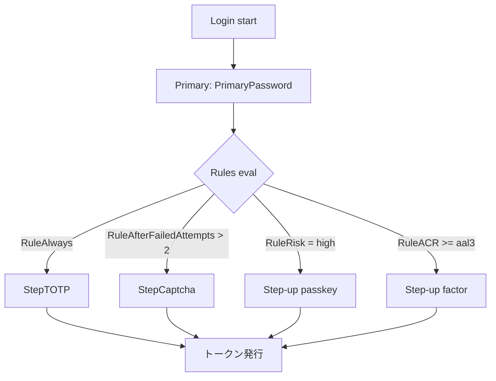

# ユースケース — MFA / step-up

ライブラリの認証層は 3 つのプリミティブの合成で構築されます:

- **`Step`** — 1 つの factor を検証する方法（password、TOTP、passkey、email-OTP …）。
- **`Rule`** — その factor がこの試行で **必要** かを判定。
- **`LoginFlow`** — `Primary` ステップと `Rules` の順序付きリスト。

各 step は対応する rule が yes と言ったときだけ走ります。「password 常時、TOTP 常時」がひとつのフロー、「password 常時、3 回失敗後 captcha、リスク高なら TOTP」が別のフロー。

::: details このページで触れる仕様
- [RFC 6238](https://datatracker.ietf.org/doc/html/rfc6238) — TOTP（時刻ベースワンタイムパスワード）
- [RFC 8176](https://datatracker.ietf.org/doc/html/rfc8176) — Authentication Method Reference Values（`amr`）
- [RFC 9470](https://datatracker.ietf.org/doc/html/rfc9470) — OAuth 2.0 Step-up Authentication Challenge
- [WebAuthn Level 3](https://www.w3.org/TR/webauthn-3/) — パスキー
- [NIST SP 800-63B](https://pages.nist.gov/800-63-3/sp800-63b.html) — Authenticator Assurance Levels（AAL）
- [OpenID Connect Core 1.0](https://openid.net/specs/openid-connect-core-1_0.html) — §2（`acr` / `amr` / `auth_time`）
:::

::: details 用語の補足
- **MFA**（Multi-Factor Authentication） — 複数の factor（知識・所持・生体）を立て続けに検証してからトークンを発行する仕組み。
- **Step-up** — RP が、より高い保証水準を必要とする操作のために `acr_values=aalN` を要求する仕組みです。現在のセッションがその水準に達していなければ、OP は追加の factor を実行して保証水準を引き上げたうえで `id_token` を新規発行します。RFC 9470 が定義しています。
- **AAL（Authenticator Assurance Level）** — NIST が定義する 3 段階の保証水準です。AAL1 ≒ パスワード、AAL2 ≒ パスワード + もう 1 因子、AAL3 ≒ ハードウェアにバインドされた所持証明。多くの OP / RP が `acr` のラベルとして使います。
- **`amr` claim** — RFC 8176 が標準値（`pwd`、`otp`、`mfa`、`hwk`、`face`、`fpt` …）を列挙しているので、RP は実際にどの factor が走ったかを監査できます。
:::

> **ソース:**
> - [`examples/20-mfa-totp`](https://github.com/libraz/go-oidc-provider/tree/main/examples/20-mfa-totp) — password + 常時 TOTP。
> - [`examples/21-risk-based-mfa`](https://github.com/libraz/go-oidc-provider/tree/main/examples/21-risk-based-mfa) — リスク駆動 step-up。
> - [`examples/22-login-captcha`](https://github.com/libraz/go-oidc-provider/tree/main/examples/22-login-captcha) — N 失敗後 captcha。
> - [`examples/23-step-up`](https://github.com/libraz/go-oidc-provider/tree/main/examples/23-step-up) — RFC 9470 ACR step-up。

## 構成



`LoginFlow` は `Primary` step と `Rules` リストを持つ struct。各 rule は `op.RuleAlways(step)`、`op.RuleAfterFailedAttempts(n, step)`、`op.RuleRisk(threshold, step)`、`op.RuleACR(acr, step)` 等のコンストラクタで作る `Rule` 値です。

## 常時 TOTP

```go
import "github.com/libraz/go-oidc-provider/op"

flow := op.LoginFlow{
  Primary: op.PrimaryPassword{Store: st.UserPasswords()},
  Rules: []op.Rule{
    op.RuleAlways(op.StepTOTP{
      Store:         st.TOTPs(),
      EncryptionKey: keys.TOTPKey,
    }),
  },
}

op.New(
  /* ... */
  op.WithLoginFlow(flow),
)
```

## N 回失敗後 captcha

```go
flow := op.LoginFlow{
  Primary: op.PrimaryPassword{Store: st.UserPasswords()},
  Rules: []op.Rule{
    op.RuleAfterFailedAttempts(3, op.StepCaptcha{Verifier: myCaptchaVerifier}),
  },
}

op.New(
  /* ... */
  op.WithLoginFlow(flow),
  op.WithCaptchaVerifier(myCaptchaVerifier), // hCaptcha / Turnstile 等
)
```

`LoginAttemptObserver`（`op.WithLoginAttemptObserver` で渡す）が identifier 毎に失敗回数をカウント。`RuleAfterFailedAttempts` がそのカウントを読みます。

## リスクベース step-up

```go
flow := op.LoginFlow{
  Primary: op.PrimaryPassword{Store: st.UserPasswords()},
  Rules: []op.Rule{
    op.RuleRisk(op.RiskScoreHigh, op.StepTOTP{Store: st.TOTPs(), EncryptionKey: keys.TOTPKey}),
  },
  Risk: myRiskAssessor, // LoginFlow の Risk フィールド
}

op.New(
  /* ... */
  op.WithLoginFlow(flow),
)
```

`RiskAssessor` は試行ごとに `RiskScore` を返します。ライブラリは 4 段階の列挙（`RiskScoreLow`、`RiskScoreMedium`、`RiskScoreHigh`、`RiskScoreCritical`）を公開しています。組み込み側の assessor が、リスク評価サービスの出力をこの列挙値に変換します。

## RFC 9470 ACR step-up

RP がより高い Authentication Context Class（`acr_values=aal3`）を要求すると、OP はセッション状態に関係なく step-up を実行します:

```go
flow := op.LoginFlow{
  Primary: op.PrimaryPassword{Store: st.UserPasswords()},
  Rules: []op.Rule{
    op.RuleACR("aal3", op.StepTOTP{Store: st.TOTPs(), EncryptionKey: keys.TOTPKey}),
  },
}

op.New(
  /* ... */
  op.WithLoginFlow(flow),
  op.WithACRPolicy(myACRPolicy), // op.ACRPolicy 実装
)
```

ユーザがセッション内で `aal2` で認証済の場合、RP の `acr_values=aal3` 要求は対話的 step-up を発火させます。OP は次の step を実行してセッションを `aal3` に引き上げてから RP に redirect で返します。

## 監査記録

各 step は `op.Audit*` カタログから構造化イベントを発行します — `op.AuditLoginSuccess` / `op.AuditLoginFailed`、`op.AuditMFARequired` / `op.AuditMFASuccess` / `op.AuditMFAFailed`、`op.AuditStepUpRequired` / `op.AuditStepUpSuccess` など。各イベントは次の属性を持ちます。

- `factor`（`pwd`、`otp`、`webauthn` …）
- `aal`（達成した AAL レベル）
- `acr`（ACR class 値）
- `amr`（RFC 8176 method references）

イベントは `op.WithAuditLogger`（`*slog.Logger`）経由で流れます。

## 同梱の step

ライブラリは一般的な factor 向けに、すぐ使える step を同梱しています:

| Step | 検証対象 | ストレージ interface |
|---|---|---|
| `op.PrimaryPassword` | ユーザ名 / email + パスワード | `store.UserPasswords()` |
| `op.PrimaryPasskey` | WebAuthn / passkey を primary factor として | `store.Passkeys()` |
| `op.StepTOTP` | RFC 6238 TOTP、AES-256-GCM 静止時暗号化 | `store.TOTPs()` |
| `op.StepEmailOTP` | メール配信 one-time code | `store.EmailOTPs()` |
| `op.StepRecoveryCode` | 単発 recovery code | `store.RecoveryCodes()` |
| `op.StepCaptcha` | hCaptcha / Turnstile / 自前 verifier | n/a |

各 step の **ストレージ** は組み込み側の責任です。ライブラリはユーザレコードもパスワードハッシュも所有しません。リファレンスの `inmem` アダプタは、例とテストには十分です。本番では、既存のユーザテーブルに合わせて `op/store/*` のサブストアを実装してください。

完全カスタムな factor は `op.ExternalStep` を実装し、一意な `KindLabel` で rule リストに追加します。これは `examples/2x-*` 全体で踏襲しているパターンです。
