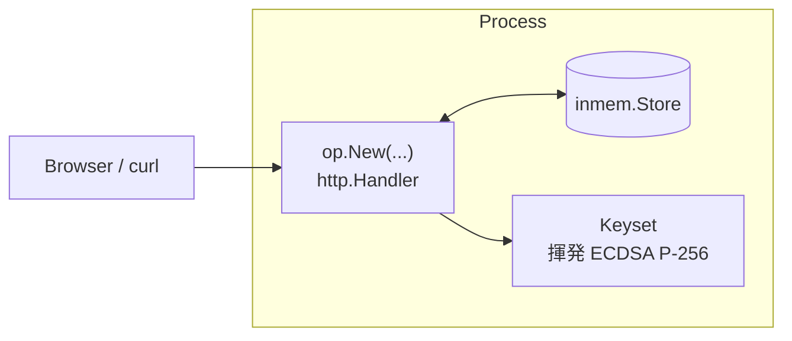

# ユースケース — 最小構成 OP

discovery、JWKS、基本フローを *確認するだけ* のために OP を立ち上げたい。クライアント登録もストレージ移行も FAPI もまだ。可能な限り少ない boilerplate で。

> **ソース:** [`examples/01-minimal/main.go`](https://github.com/libraz/go-oidc-provider/tree/main/examples/01-minimal)

## アーキテクチャ



プロセスは 1 つ、ストアは in-memory、鍵は起動時に生成します。

## コード

```go
package main

import (
  "log"
  "net/http"

  "github.com/libraz/go-oidc-provider/op"
  "github.com/libraz/go-oidc-provider/op/storeadapter/inmem"
)

func main() {
  keys := /* 例では devkeys.MustEphemeral("minimal-1") */

  provider, err := op.New(
    op.WithIssuer("https://op.example.com"),
    op.WithStore(inmem.New()),
    op.WithKeyset(keys.Keyset()),
    op.WithCookieKey(keys.CookieKey),
  )
  if err != nil {
    log.Fatalf("op.New: %v", err)
  }

  mux := http.NewServeMux()
  mux.Handle("/", provider)
  log.Fatal(http.ListenAndServe(":8080", mux))
}
```

## OP が公開するもの

デフォルトは `/oidc` 配下にマウント（`op.WithMountPrefix` で上書き可）:

| Path | 目的 |
|---|---|
| `/.well-known/openid-configuration` | Discovery（OIDC Discovery 1.0 §4 によりルート固定） |
| `/oidc/jwks` | ID Token / JWT access token 検証用の公開 JWKS |
| `/oidc/auth` | Authorization endpoint |
| `/oidc/token` | Token endpoint |
| `/oidc/userinfo` | UserInfo（RFC 6749 + OIDC Core §5.3） |
| `/oidc/end_session` | RP-Initiated Logout 1.0 |

オプションエンドポイント（`/par`、`/introspect`、`/revoke`、`/register`、`/interaction/*`、`/session/*`）は対応 feature が有効なときのみマウントされます。

## 本番運用に足りないもの

| ギャップ | 対処 |
|---|---|
| クライアント未登録 → authorize がすべて失敗 | `op.WithStaticClients(...)` または `op.WithDynamicRegistration(...)` を追加。 |
| authenticator 無し → ユーザがログインできない | `op.WithAuthenticators(myAuth)` とログインフローを追加。 |
| 揮発鍵 → 再起動で ID Token が検証不能 | vault / KMS / ファイルからロード。 |
| in-memory ストア → 再起動で状態消失 | `op/storeadapter/sql` または `op/storeadapter/composite` に切替。 |
| 平文 HTTP リスナ | TLS 終端 ingress の背後に置く。 |

[`examples/02-bundle`](https://github.com/libraz/go-oidc-provider/tree/main/examples/02-bundle) が「総合的な組み込み側」のリファレンスとしてこれらを埋めています。

## 動かす

```sh
git clone https://github.com/libraz/go-oidc-provider.git
cd go-oidc-provider
go run -tags example ./examples/01-minimal
# 別ターミナル:
curl -s http://localhost:8080/.well-known/openid-configuration | jq
```
