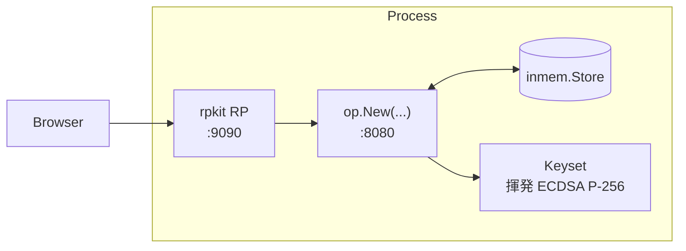

# ユースケース — 最小構成 OP

最小オプション数で Authorization Code + PKCE のラウンドトリップを最後まで動かしたい。同梱の例は OP と対になる RP を同一プロセスで起動するので、外部準備なしにブラウザでフロー全体を動かせます。

> **ソース:** [`examples/01-minimal/main.go`](https://github.com/libraz/go-oidc-provider/tree/main/examples/01-minimal)

## アーキテクチャ



プロセスは 1 つ、ストアは in-memory、鍵は起動時に生成します。例ではデモユーザ（`demo`/`demo`）1 件を seed し、`redirect_uri` を埋め込み RP に向けた public client を登録しています。

## コード（要点）

```go
package main

import (
  "log"
  "net/http"

  "github.com/libraz/go-oidc-provider/op"
  "github.com/libraz/go-oidc-provider/op/storeadapter/inmem"
)

func main() {
  keys := /* 例では devkeys.MustEphemeral("minimal-1") */
  st := inmem.New()
  // seedUser は op.HashPassword で "demo"/"demo" をハッシュし、
  // *store.User を st.UserPasswords() に PUT する（実装は example を参照）。

  // upstream の例は examples/internal/opkit の opkit.DefaultLoginFlow(st.UserPasswords())
  // を使っています。これは下と同じ値を構築する thin wrapper で、公開 API は下の
  // LoginFlow 構造体です。opkit を import するのは example のソースを読むときだけで、
  // 本番コードで使うものではありません。
  flow := op.LoginFlow{
    Primary: op.PrimaryPassword{Store: st.UserPasswords()},
  }

  provider, err := op.New(
    op.WithIssuer("http://127.0.0.1:8080"),
    op.WithStore(st),
    op.WithKeyset(keys.Keyset()),
    op.WithCookieKeys(keys.CookieKey),
    op.WithLoginFlow(flow),
    op.WithStaticClients(op.PublicClient{
      ID:           "demo-rp",
      RedirectURIs: []string{"http://127.0.0.1:9090/callback"},
      Scopes:       []string{"openid", "profile"},
    }),
  )
  if err != nil {
    log.Fatalf("op.New: %v", err)
  }

  mux := http.NewServeMux()
  mux.Handle("/", provider)
  log.Fatal(http.ListenAndServe(":8080", mux))
}
```

必須 4 オプション（`WithIssuer`、`WithStore`、`WithKeyset`、`WithCookieKeys`）だけでは `/oidc/.well-known/openid-configuration` と `/oidc/jwks` は応答しますが、ユーザに依存するエンドポイント（authorize / token / userinfo）は `WithLoginFlow` と `WithStaticClients` のペアが必要です。discovery のみの 4 オプション形は [`getting-started/minimal`](/ja/getting-started/minimal) を参照してください。

## OP が公開するもの

デフォルトは `/oidc` 配下にマウント（`op.WithMountPrefix` で上書き可）:

| Path | 目的 |
|---|---|
| `/.well-known/openid-configuration` | Discovery（OIDC Discovery 1.0 §4 によりルート固定） |
| `/oidc/jwks` | ID Token / JWT access token 検証用の公開 JWKS |
| `/oidc/auth` | Authorization endpoint |
| `/oidc/token` | Token endpoint |
| `/oidc/userinfo` | UserInfo（RFC 6749 + OIDC Core §5.3） |
| `/oidc/end_session` | RP-Initiated Logout 1.0 |

オプションエンドポイント（`/par`、`/introspect`、`/revoke`、`/register`、`/interaction/*`、`/session/*`）は対応 feature が有効なときのみマウントされます。

## 本番運用に足りないもの

| ギャップ | 対処 |
|---|---|
| デモユーザ 1 件をハードコード | 自前の管理面でユーザを登録し、`store.User` を PUT する。 |
| 揮発鍵 → 再起動で ID Token が検証不能 | vault / KMS / ファイルからロード。 |
| in-memory ストア → 再起動で状態消失 | `op/storeadapter/sql` または `op/storeadapter/composite` に切替。 |
| 平文 HTTP リスナ（`http://127.0.0.1`） | TLS 終端 ingress の背後に置き、issuer も `https://` に切り替える。 |
| 単一要素（パスワードのみ） | `RuleAlways(StepTOTP{...})` を追加 — [MFA / step-up](/ja/use-cases/mfa-step-up) を参照。 |
| `examples/internal/rpkit` のデモ RP | 本番 RP は `golang.org/x/oauth2` + `github.com/coreos/go-oidc/v3` を直接使う。 |

[`examples/02-bundle`](https://github.com/libraz/go-oidc-provider/tree/main/examples/02-bundle) が「総合的な組み込み側」のリファレンスとしてこれらを埋めています。

## 動かす

```sh
git clone https://github.com/libraz/go-oidc-provider.git
cd go-oidc-provider
go run -tags example ./examples/01-minimal
# 別ターミナル:
curl -s http://localhost:8080/.well-known/openid-configuration | jq
```
