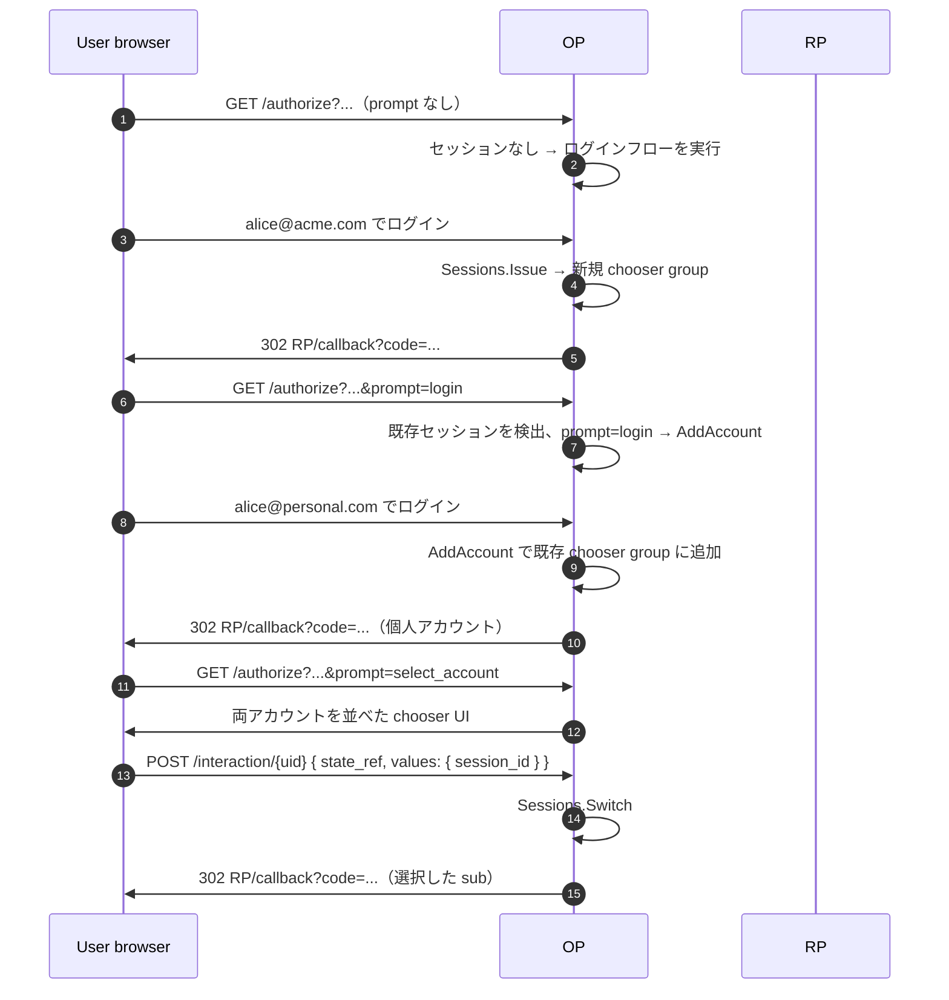

# ユースケース — マルチアカウントチューザ

## `prompt=select_account` とは

OIDC Core 1.0 §3.1.2.1 では、RP が `/authorize` に `prompt` 要求パラメータを乗せられます。本ページに関係するのは次の 3 値:

| `prompt=` | OP に依頼する内容 |
|---|---|
| `none` | UI を一切出さない — 既存セッションを返すか失敗するか |
| `login` | 既存セッションがあっても再ログインを強制 |
| `select_account` | アカウント選択 UI を表示 — ユーザが続行するアカウントを選ぶ |

`select_account` は、大手 SaaS の「アカウント切り替え」ボタンが裏で発火する仕様です。1 ブラウザで同じ OP に複数アカウント（仕事 + 個人、alice + bob 等）にサインイン中の状態に対して、OP が一覧を出してユーザに選ばせる。

本ライブラリではこれをセッションマネージャの **chooser group**（同一ブラウザで同時に有効なセッション群）として実装し、追加・切替・全ログアウトの API を提供します。

::: details このページで触れる仕様
- [OpenID Connect Core 1.0](https://openid.net/specs/openid-connect-core-1_0.html) — §3.1.2.1（`prompt` パラメータ）、§3.1.2.4（同意との相互作用）
- [OpenID Connect Back-Channel Logout 1.0](https://openid.net/specs/openid-connect-backchannel-1_0.html) — 「全員ログアウト」発火時の fan-out
:::

::: details 用語の補足
- **`prompt` パラメータ** — RP が `/authorize` に乗せて、OP に UI の出し方を指示するヒントです。`none`（UI を出さず、既存セッションを返すか失敗）、`login`（再ログイン強制）、`consent`（同意プロンプト強制）、`select_account`（アカウント選択 UI）の 4 種があり、空白区切りで複数指定できます。
- **Chooser group** — 同一ブラウザで同時にサインイン中のセッション群。大手 SaaS では「アカウント切り替え」メニューとして表面化します。OP がサーバ側で group を保持し、cookie はブラウザを単一セッションではなく group に紐づけます。
- **`sub`（subject）** — OP-RP ペアごとにスコープされる、ユーザの安定不透明識別子です。chooser でアカウントを切り替えると、次の `id_token` に乗る `sub` が変わります — 同じブラウザ、別の identity ということになります。
:::

> **ソース:** [`examples/13-multi-account`](https://github.com/libraz/go-oidc-provider/tree/main/examples/13-multi-account) は JSON driver で chooser を扱う例、[`examples/12-custom-chooser-ui`](https://github.com/libraz/go-oidc-provider/tree/main/examples/12-custom-chooser-ui) は HTML template 差し替え経路の例です。

## 動作

## 実装

`prompt=select_account` 用の interaction はビルトイン。アクティブな chooser group の全アカウントを並べた `interaction.ChooserPromptData` エンベロープを返します。同梱 HTML ドライバではビルトインテンプレートが一覧を描画し、ユーザは `SessionID` を POST で送り返します。サーバー描画の流れを保ちつつ template だけ持ちたい場合は、`op.WithChooserUI(op.ChooserUI{Template: tmpl})` を渡します。

JSON ドライバ(`op.WithInteractionDriver(interaction.JSONDriver{})`)では、SPA 側が同じエンベロープを JSON として受け取り、`SessionID` を POST で送り返します。`op.WithSPAUI` を使う場合、`WithChooserUI` も同時指定されていても chooser surface は JSON state envelope 経由で SPA が所有します。このとき chooser template は無視され、無視されたことが分かるよう `op.New` が warning を出します。

セッションマネージャの公開 API:

| メソッド | タイミング |
|---|---|
| `Sessions.Issue(ctx, subject)` | 初回ログイン → 新 chooser group |
| `Sessions.AddAccount(ctx, group, subject)` | 同ブラウザで 2 人目 → 既存 group に追加 |
| `Sessions.Switch(ctx, group, sessionID)` | chooser でアカウントを選択 |
| `Sessions.LogoutAll(ctx, group)` | 全員ログアウト |

## 続きはこちら

- [カスタムアカウントチューザ UI](/ja/use-cases/custom-chooser-ui) — chooser をサーバー描画のまま保ち、アカウント選択 template だけ差し替える。
- [SPA / カスタム interaction](/ja/use-cases/spa-custom-interaction) — chooser を SPA から扱う。
- [Back-Channel Logout](/ja/use-cases/back-channel-logout) — 全員ログアウト時の fan-out。
