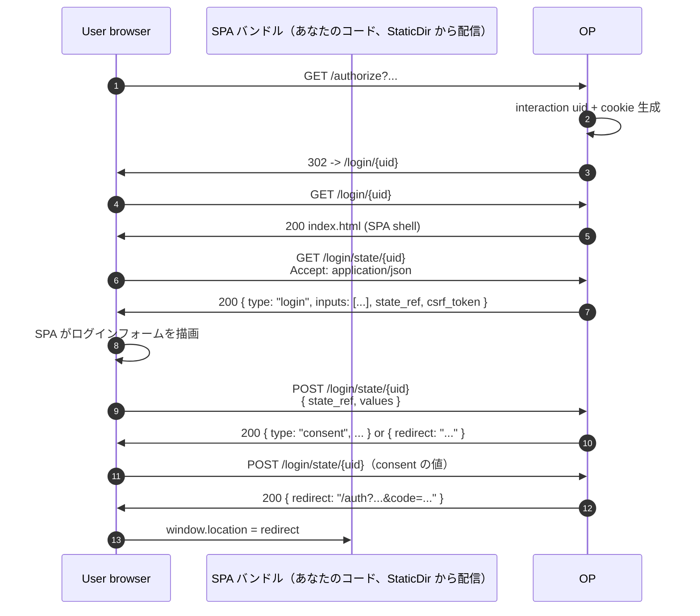

# ユースケース — SPA / カスタム interaction

## 「interaction」レイヤとは何か

RP の `/authorize` リダイレクトと、OP からのコード付きリダイレクトバックの間で、OP は **interaction**（ログイン / 任意の MFA ステップアップ / 任意の同意プロンプト / 任意のアカウント選択）を実行します。OIDC Core 1.0 §3.1 は通信路上のデータ（要求パラメータと最終応答）を規定しますが、**この中間ページをどう描画するか** には踏み込みません。各 OP がそれぞれ UX を選びます。

本ライブラリでは UX をプラガブルな `interaction.Driver` としてモデル化しています。デフォルト driver はサーバサイド HTML を描画。JSON driver は同じプロンプトを JSON で返す（SPA 側で描画）。独自 driver で任意のフロントエンドと会話することもできます。

::: details このページで触れる仕様
- [OpenID Connect Core 1.0](https://openid.net/specs/openid-connect-core-1_0.html) — §3.1（authorization endpoint）、§3.1.2.4（同意）
- [OpenID Connect RP-Initiated Logout 1.0](https://openid.net/specs/openid-connect-rpinitiated-1_0.html) — `/end_session`
- [RFC 7636](https://datatracker.ietf.org/doc/html/rfc7636) — PKCE（Proof Key for Code Exchange）
- [RFC 8252](https://datatracker.ietf.org/doc/html/rfc8252) — OAuth 2.0 for Native Apps, §8.1（ブラウザサイド public client）
- [RFC 6749](https://datatracker.ietf.org/doc/html/rfc6749) — §5.2（エラー応答 JSON エンベロープ）
:::

::: details 用語の補足
- **Interaction レイヤ** — RP の `/authorize` リダイレクトと OP からのコード付きリダイレクトバックの間に挟まる一連の処理（ログイン / 任意の MFA ステップアップ / 任意の同意 / 任意のアカウント選択）。ワイヤパラメータは仕様で定まっていますが、*この中間ページをどう描画するか* は定まっていません。各 OP が UX を選びます — ここがプラグインの差し込み口。
- **JSON driver** — プロンプトを HTML ではなく JSON で返す、ライブラリのプラガブル interaction バックエンド。ステートマシンは OP 側に残ります — SPA は `{ kind: "login" | "consent" | ... }` を fetch して回答を送り返し、OP が次を決めます。
- **CSP（Content Security Policy）** — ページが読み込んでよいリソース種別をブラウザに伝えるレスポンスヘッダ（`Content-Security-Policy: default-src 'none'; ...`）。OP のエラーページは `<script>`、inline イベントハンドラ、任意 URL スキームを禁じる厳格なポリシーで描画されるので、悪意ある `error_description` が XSS に化けることはありません。
:::

> **ソース:**
> - [`examples/04-custom-interaction`](https://github.com/libraz/go-oidc-provider/tree/main/examples/04-custom-interaction) — JSON driver への最小差し替え。
> - [`examples/10-react-login`](https://github.com/libraz/go-oidc-provider/tree/main/examples/10-react-login) — `op.WithSPAUI` 経由のフル SPA の組み立て。同梱バンドルはビルドステップ無しで動かすための素の HTML/CSS/JS ですが、シーム自体はフレームワーク非依存で、React / Vue / Svelte / Angular いずれも `StaticDir` 配下に置けば同様に動きます。

## アーキテクチャ

`WithSPAUI` を渡すと、`LoginMount`（example の場合 `/login`）配下に固定のルートツリーがマウントされます:

| Method | Path | 役割 |
|---|---|---|
| `GET` | `LoginMount/{uid}` | SPA shell — `StaticDir/index.html` を返す |
| `GET` | `LoginMount/state/{uid}` | 現在の prompt を JSON で返す |
| `POST` | `LoginMount/state/{uid}` | ユーザのフォーム送信を受ける |
| `DELETE` | `LoginMount/state/{uid}` | 進行中の interaction をキャンセル |
| `GET` | `LoginMount/assets/{path...}` | `StaticDir` 配下の静的アセット |

`/authorize` は（旧 `/oidc/interaction/{uid}` ではなく）`LoginMount/{uid}` へリダイレクトします。`/authorize` のリダイレクトから RP のコールバックに戻る `code` 付きリダイレクトまでの間は、すべて SPA 上で完結します。



ステートマシンは OP が所有します。SPA は次の prompt を fetch し、ユーザの回答を送り返し、OP が次に何を出すかを決めます。

## コード

### JSON driver への差し替え（最小変更）

```go
import "github.com/libraz/go-oidc-provider/op/interaction"

provider, err := op.New(
  /* 必須オプション */
  op.WithInteraction(interaction.JSONDriver{}),
)
```

これですべての interaction ページが JSON を返すようになり、SPA は prompt を fetch して回答を POST で送り返します。

### SPA の組み立て（フレームワーク非依存）

```go
import "github.com/libraz/go-oidc-provider/op"

provider, err := op.New(
  /* 必須オプション */
  op.WithSPAUI(op.SPAUI{
    LoginMount: "/login",       // SPA ログインエントリのパス（必須）
    StaticDir:  "./web/dist",   // ディスク上の SPA バンドル
  }),
  op.WithCORSOrigins("https://app.example.com"),
)

mux := http.NewServeMux()
mux.Handle("/", provider)       // OP が /login/{uid}・/login/state/{uid}・
                                // /login/assets/{path...} およびその他の
                                // プロトコル面を全部所有するので、外側で
                                // 振り分ける必要はありません。
```

`mux.Handle("/", provider)` 1 行で十分です。OP が `/login/{uid}` で SPA shell を、`/login/state/{uid}` で prompt JSON を、`StaticDir` 配下のファイルを `/login/assets/{path...}` で返します。フレームワークはスタックに合うものを選んでください — Go 側の書き方はどれでも同じです。

::: info マウントフィールドの状態（v0.x）
`SPAUI` は `LoginMount` / `ConsentMount` / `LogoutMount` / `StaticDir` を持ちますが、**現在自動マウントされているのは `LoginMount` と `StaticDir` だけ** です。同意も RP-Initiated Logout も同じ `LoginMount/state/{uid}` の JSON 面を流れ（SPA 側で `prompt.type` を見て分岐します）、`ConsentMount` / `LogoutMount` は構築時に検証はされるものの、専用ルートを持つ将来リリース向けの予約フィールドです — 現時点で値を入れても no-op になります。
:::

### フロントエンドスニペット

::: code-group

```jsx [React]
import { useEffect, useState } from "react";

// op/interaction の FieldKind iota:
//   0=text, 1=password, 2=otp, 3=email, 4=hidden。
const inputTypeFor = (kind) =>
  ({ 1: "password", 3: "email", 4: "hidden" })[kind] ?? "text";

export function Interaction({ uid }) {
  const stateURL = `/login/state/${uid}`;
  const [prompt, setPrompt] = useState(null);
  const [values, setValues] = useState({});

  useEffect(() => {
    fetch(stateURL, {
      headers: { Accept: "application/json" },
      credentials: "same-origin",
    })
      .then((r) => r.json())
      .then(setPrompt);
  }, [uid]);

  async function onSubmit(e) {
    e.preventDefault();
    const r = await fetch(stateURL, {
      method: "POST",
      headers: {
        "Content-Type": "application/json",
        "X-CSRF-Token": prompt.csrf_token ?? "",
        Accept: "application/json",
      },
      credentials: "same-origin",
      body: JSON.stringify({ state_ref: prompt.state_ref, values }),
    });
    const next = await r.json();
    if (next.type === "redirect" && next.location) {
      window.location.href = next.location;
    } else {
      setPrompt(next);
      setValues({});
    }
  }

  if (!prompt) return null;
  return (
    <form onSubmit={onSubmit}>
      {prompt.inputs?.map((f) => (
        <label key={f.Name}>
          <span>{f.Label || f.Name}</span>
          <input
            name={f.Name}
            type={inputTypeFor(f.Kind)}
            required={f.Required}
            onChange={(e) =>
              setValues((v) => ({ ...v, [f.Name]: e.target.value }))
            }
          />
        </label>
      ))}
      <button type="submit">Continue</button>
    </form>
  );
}
```

```vue [Vue 3]
<script setup>
import { ref, reactive, onMounted } from "vue";

const props = defineProps({ uid: String });
const stateURL = `/login/state/${props.uid}`;
const prompt = ref(null);
const values = reactive({});

// op/interaction の FieldKind iota:
//   0=text, 1=password, 2=otp, 3=email, 4=hidden。
const inputTypeFor = (kind) =>
  ({ 1: "password", 3: "email", 4: "hidden" })[kind] ?? "text";

onMounted(async () => {
  const r = await fetch(stateURL, {
    headers: { Accept: "application/json" },
    credentials: "same-origin",
  });
  prompt.value = await r.json();
});

async function onSubmit() {
  const r = await fetch(stateURL, {
    method: "POST",
    headers: {
      "Content-Type": "application/json",
      "X-CSRF-Token": prompt.value.csrf_token ?? "",
      Accept: "application/json",
    },
    credentials: "same-origin",
    body: JSON.stringify({
      state_ref: prompt.value.state_ref,
      values,
    }),
  });
  const next = await r.json();
  if (next.type === "redirect" && next.location) {
    window.location.href = next.location;
  } else {
    prompt.value = next;
    for (const k of Object.keys(values)) delete values[k];
  }
}
</script>

<template>
  <form v-if="prompt" @submit.prevent="onSubmit">
    <label v-for="f in prompt.inputs" :key="f.Name">
      <span>{{ f.Label || f.Name }}</span>
      <input
        :name="f.Name"
        :type="inputTypeFor(f.Kind)"
        :required="f.Required"
        v-model="values[f.Name]"
      />
    </label>
    <button type="submit">Continue</button>
  </form>
</template>
```

:::

どちらのタブも流れは同じです。`/login/state/{uid}` から prompt を GET → 宣言された `inputs` を描画 → `{state_ref, values}` を POST で送り返す。OP は次のプロンプトか、終端の `{type: "redirect", location: "..."}` エンベロープを返し、SPA は `window.location.href` でそこに飛びます。通信路上の形は `op/interaction` をそのまま反映:

- `Prompt` — `type` / `data` / `inputs` / `state_ref` / `csrf_token`（lower_snake_case の JSON タグ付き）。
- `FieldSpec` — JSON タグが無いため Go の field 名がそのまま出力されます（`Name` / `Kind` / `Label` / `Required` / `MaxLen` / `MinLen` / `Pattern`）。`Kind` は上記の整数 enum。
- 終端 redirect エンベロープ — `{"type":"redirect","location":"<URL>"}`。OP 側で orchestrator の終端 302 をこの形に書き換えて返します（クロスオリジン `fetch` は RP コールバックの redirect を辿れないため、SPA がドキュメントレベルで navigate できるように）。

契約はフレームワーク間で同一 — 違うのは描画イディオムだけです。

::: tip 同意ステップ
`prompt.type === "consent.scope"` のときは `inputs` が空で、scope カタログは `prompt.data.scopes` に入ります。SPA はそのリストを描画して（`s.required` のものはトグル不可で表示）、`{ approved_scopes: "openid profile" }`（空白区切りのサブセット）として送信します。`prompt.type` 分岐の実装例は [`examples/10-react-login`](https://github.com/libraz/go-oidc-provider/tree/main/examples/10-react-login) の `web/static/assets/main.js` を参照。
:::

::: info `X-CSRF-Token` を送る理由
OP がセッション開始時に `__Host-oidc_csrf` cookie を発行し、各プロンプトのエンベロープにその cookie 値を `csrf_token` として echo します。SPA の責務は、`prompt.csrf_token` を読んで送信時の `X-CSRF-Token` ヘッダーに乗せるだけ — OP がヘッダー値と cookie 値を照合します（double-submit cookie パターン）。SPA は token を生成・検証・保存しません。cookie は `HttpOnly` のままで構いません。
:::

## SPA-safe エラー描画

OP のエラーページは `data-*` 属性付きの安定アンカーを出力するので、SPA host は 1 回の `document.querySelector` で読めます:

```html
<div id="op-error"
     data-code="invalid_request_uri"
     data-description="request_uri has expired"
     data-state="abc">
  <h1>Authorization error</h1>
  ...
</div>
```

::: info CSP-safe な構造
エラーページは `default-src 'none'; style-src 'unsafe-inline'` で描画されます。`<script>` 無し、inline イベントハンドラ無し、inline 画像無し、`javascript:` URL 無し。`error_description` / `state` に攻撃的な値が乗っていても、反映前に HTML エスケープされます。
:::

OP は `Accept` ヘッダで形式をネゴシエーションします。
- `Accept: text/html`（ブラウザナビゲーション） → `data-*` 付き HTML ページ。
- `Accept: application/json`（XHR / fetch） → RFC 6749 §5.2 の JSON エンベロープ。
- ヘッダ未指定または `*/*` → JSON エンベロープ（XHR / curl 向けの安全なデフォルト）。

これにより、SPA の `fetch()` 呼び出しには引き続き JSON が返り、URL を直接踏んでしまったユーザには、SPA がロードした時点で拾える機械可読属性付きのエラーページが届きます。

## CORS

SPA が OP と異なる origin で配信される場合は明示許可:

```go
op.WithCORSOrigins(
  "https://app.example.com",
  "https://staging-app.example.com",
)
```

ライブラリは登録済み `redirect_uri` の origin を per-RP で自動 allowlist もします（static クライアント設定なら CORS 設定の重複不要）。詳細は [SPA 向け CORS](/ja/use-cases/cors-spa)。

## フル SPA 化せず、カスタム同意 UI だけ差し替えたい

ブランド付きコピーとプライバシーリンク程度のカスタム同意ページだけが欲しい場合は、`op.WithConsentUI(...)` でそのテンプレートだけを差し替えられます。詳細は [`examples/11-custom-consent-ui`](https://github.com/libraz/go-oidc-provider/tree/main/examples/11-custom-consent-ui) を参照。
