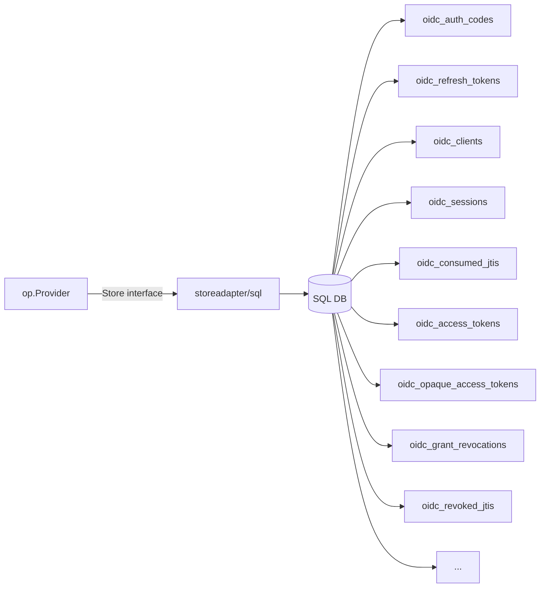

# ユースケース — 永続化（SQL）

## OP は何を保存するのか、どこに保存するかが効くのか

OP が保持する行のうち、OAuth / OIDC 仕様が **再起動越しに保持** することを要求するもの:

- **リフレッシュトークンチェーン**（RFC 6749 §6, RFC 9700 §4.14）— 失えば全ユーザのセッションが切れる。
- **登録クライアント**（DCR が ON なら OIDC Dynamic Client Registration 1.0 / RFC 7591、OFF なら静的シード）— 失えば全 RP が動かなくなる。
- **セッション**（OIDC RP-Initiated Logout 1.0 / Back-Channel Logout 1.0）— ログアウトの fan-out に必要。
- **同意グラント**（OIDC Core 1.0 §3.1.2.4）— 失えば再起動のたびに全ユーザに再同意を強いることになる。
- **監査 / introspection / revocation の shadow 行** — [Tokens](/ja/concepts/tokens) で説明したアクセストークン registry。

デフォルトの `inmem` ストアは再起動で全てを失う点で、テスト・デモには十分ですが本番には不向きです。ライブラリは [`op/storeadapter/sql`](https://github.com/libraz/go-oidc-provider/tree/main/op/storeadapter/sql) を同梱しており、`database/sql` アダプタで **SQLite / MySQL 8.0+ / PostgreSQL 14+** を対象にします。

> **ソース:**
> - [`examples/06-sql-store`](https://github.com/libraz/go-oidc-provider/tree/main/examples/06-sql-store) — SQLite クイックスタート（CGO 不要）。
> - [`examples/07-mysql-store`](https://github.com/libraz/go-oidc-provider/tree/main/examples/07-mysql-store) — 本番形プールを持つ MySQL。OP と in-process RP を組み合わせ、docker-compose スタックとして同梱。

## なぜサブモジュール

SQL アダプタは **別 Go モジュール** として公開されているので、driver 依存（SQL driver、migration ライブラリ）はオプトインするまで `go.sum` に混入しません:

```sh
go get github.com/libraz/go-oidc-provider/op/storeadapter/sql@latest
```

Redis アダプタも同様です。

## アーキテクチャ



各サブストア（`AuthCodeStore`、`RefreshTokenStore`、`ClientStore`、`SessionStore` など）がテーブルにマップされます。

::: info 新しいサブストア
SQL アダプタは以下のテーブルを同梱します:

- **`oidc_opaque_access_tokens`** — opaque アクセストークンサブストアの裏側。`op.WithAccessTokenFormat(op.AccessTokenFormatOpaque)` または `op.WithAccessTokenFormatPerAudience(...)` を有効にしたときだけ書き込まれます。
- **`oidc_grant_revocations`** + **`oidc_revoked_jtis`** — 既定の `RevocationStrategyGrantTombstone` を支えるテーブル。

どちらもトランザクションクラスタの一部で、起点となる grant / refresh の書き込みと同時にコミットされます — カスケードが途中で切れて「失効した grant の隣に、まだ引き換え可能なトークンが残る」状況にはなりません。

同梱アダプタを使わずカスタムの `Store` 実装をシップする場合は、`OpaqueAccessTokens()` と `GrantRevocations()` の実装が **必須** です。`OpaqueAccessTokens()` は `WithAccessTokenFormat(op.AccessTokenFormatOpaque)` も `WithAccessTokenFormatPerAudience` も opaque audience を指さない限り `nil` を返してかまいません。`GrantRevocations()` を `nil` にできるのは、`op.WithAccessTokenRevocationStrategy(op.RevocationStrategyNone)` を明示している場合だけです(非 FAPI デプロイ専用) — 既定の `RevocationStrategyGrantTombstone` は構築時にこのサブストアを必須とします。それ以外は `op.New` が構成エラーを返します。
:::

## コード

```go
import (
  databasesql "database/sql"
  _ "modernc.org/sqlite" // または MySQL / Postgres driver

  "github.com/libraz/go-oidc-provider/op"
  oidcsql "github.com/libraz/go-oidc-provider/op/storeadapter/sql"
)

db, err := databasesql.Open("sqlite", "file:op.db?_journal=WAL&_busy_timeout=5000")
if err != nil { /* ... */ }

storage, err := oidcsql.New(db, oidcsql.SQLite()) // または oidcsql.MySQL() / oidcsql.Postgres()
if err != nil { /* ... */ }

if err := storage.Migrate(context.Background()); err != nil {
  /* ... */
}

provider, err := op.New(
  op.WithIssuer("https://op.example.com"),
  op.WithStore(storage),
  op.WithKeyset(myKeyset),
  op.WithCookieKeys(myCookieKey),
)
```

::: tip マイグレーション
`*sql.Store.Migrate(ctx)` がアクティブな dialect 用の同梱スキーマを適用します。最初のリクエストが届く前のデプロイ時に実行してください。`Schema()` は同じ DDL を文字列で返すので、自前の migration ツールに渡すこともできます。スキーマファイルは [`op/storeadapter/sql/schema/`](https://github.com/libraz/go-oidc-provider/tree/main/op/storeadapter/sql/schema) に embed されています。
:::

## MySQL プールサイズ

[`examples/07-mysql-store`](https://github.com/libraz/go-oidc-provider/tree/main/examples/07-mysql-store) は本番形の DSN を示します:

```go
db, err := stdsql.Open("mysql",
  "oidc:secret@tcp(mysql:3306)/op?parseTime=true&charset=utf8mb4&collation=utf8mb4_0900_ai_ci")
db.SetMaxOpenConns(64)
db.SetMaxIdleConns(8)
db.SetConnMaxLifetime(30 * time.Minute)
```

`charset=utf8mb4` は必須です — 4 バイト UTF-8（絵文字、CJK 拡張）を claim 値で切り詰めずに往復させるためです。

## ユーザ名 + password による認証情報

SQL アダプタは `store.UserPasswordStore`（inmem リファレンスアダプタと同じインターフェース）を実装するので、ビルトインの [`op.PrimaryPassword`](/ja/use-cases/mfa-step-up) Step を SQL バックエンドに対してそのまま組み込めます。glue コードは不要です:

```go
flow := op.LoginFlow{
  Primary: op.PrimaryPassword{Store: storage.UserPasswords()},
}

provider, err := op.New(
  /* ... */
  op.WithLoginFlow(flow),
)
```

スキーマは `oidc_users` に 2 つのカラムを追加します。ユーザ名検索用の一意インデックス（`FindByUsername` が利用）と、PHC 形式のハッシュを保持する `password_hash` カラム（`ReadPasswordHash` が読み出す）です。

ハッシュ符号化は組み込み側の責務です — 補助の writer `*sql.Store.PutUserWithPassword(ctx, user, username, hash)` は `op.HashPassword`（argon2id、ライブラリ既定値）が返したハッシュを受け取り、`PutUser` と同じ upsert を経由します:

```go
hash, _ := op.HashPassword("demo")
_ = storage.PutUserWithPassword(ctx, &store.User{
  Subject: "demo-user",
  Claims:  map[string]any{"name": "Demo User"},
}, "demo", hash)
```

ユーザ名を空文字、ハッシュを `nil` にして渡すと認証情報を消去できます — passkey 専用に移行したユーザを扱うときに便利です。

`ReadPasswordHash` は subject が未知の場合と、行は存在するが password を持たない場合の両方で `store.ErrNotFound` を返すので、`LoginFlow` 側はどちらの場合も user enumeration 攻撃に対して安全な応答を返せます。

## Contract test ハーネス

`inmem` を検査する同じ contract test suite (`op/store/contract`) が、SQL アダプタに対しても `go test -tags=testcontainers` で testcontainers-go 経由の実 MySQL / Postgres を起動して実行されます。「SQL アダプタは `Store` interface を実装する」というライブラリの主張は、モックではなく実エンジンに対して検証されたものです。

固定しているイメージ(`mysql:8.4`、`postgres:16-alpine`)は、`examples/07-mysql-store` および `examples/09-redis-volatile` の docker-compose スタックが使うエンジンマトリクスと揃えてあるので、アダプタレベルと example レベルの統合検証で同じ組み合わせを共有できます。

## いつ Redis を載せるか

Hot データ（interaction、消費済み JTI）は生成と陳腐化のサイクルが速く、永続 DB に載せるとテーブルが肥大化します。次ページの [Hot / Cold + Redis](/ja/use-cases/hot-cold-redis) で、永続サブストアを SQL に保ったまま揮発サブストアを Redis にルーティングする方法を示します。
