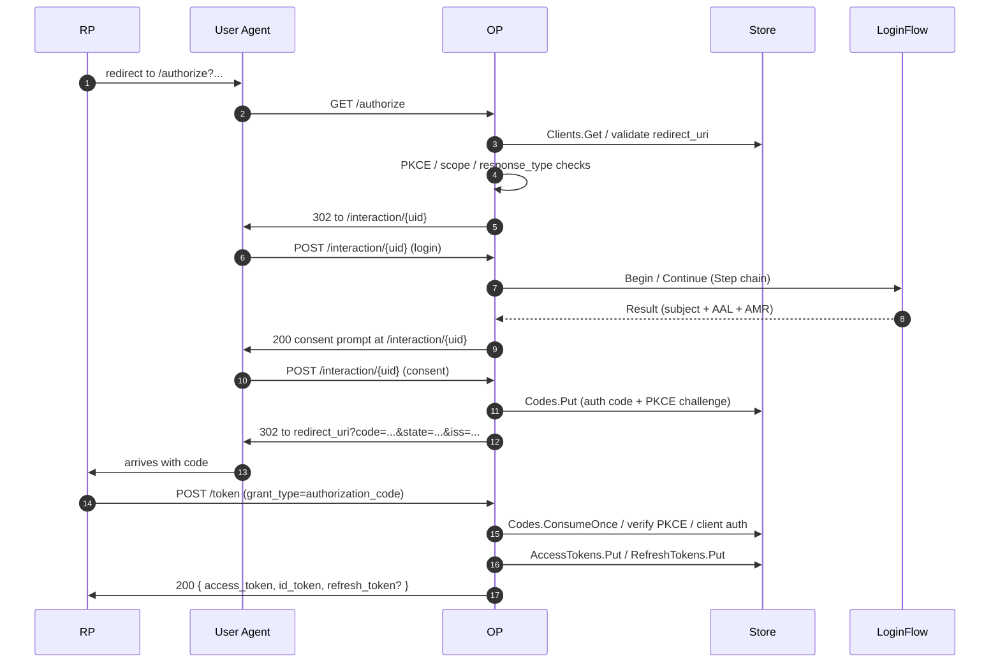

# Architecture overview

`op.New(...)` returns an `http.Handler` backed by an `http.ServeMux`. This page walks through what happens between request arrival and response — the packages involved, the order of validation, and the storage seams the embedder controls.

## Package layout

```
op/                         ← public API surface (this is what you import)
op/profile/                 ← FAPI 2.0 / future profiles
op/feature/                 ← PAR / DPoP / mTLS / introspect / revoke / DCR / JAR
op/grant/                   ← authorization_code, refresh_token, client_credentials
op/store/                   ← Store interface (substores) + contract test suite
op/storeadapter/{inmem,sql,redis,composite}
op/interaction/             ← HTML / JSON driver seam for login UI

internal/                   ← cannot be imported externally (Go visibility)
  authn/                    ← LoginFlow orchestrator, Authenticator runtime
  authorize, parendpoint, tokenendpoint, userinfo,
  introspectendpoint, revokeendpoint, registrationendpoint,
  endsession, backchannel
  jose, jwks, keys          ← signing / verification / key set
  jar, dpop, mtls, pkce, sessions
  cookie, csrf, cors, httpx, redact, log, metrics
  discovery, scoperegistry, timex, i18n
```

The boundary is enforced structurally: external code cannot reach into `internal/`. Every embedder-controlled seam (option, store interface, authenticator, audit subscriber) is in `op/` or one of its subpackages.

## Handler graph

`op.New` constructs a `*http.ServeMux` and mounts handlers on the configured paths (defaults shown):

```mermaid
%%{init: {"theme":"base","themeVariables":{"primaryColor":"#374151","primaryTextColor":"#fff","lineColor":"#888"}}}%%
flowchart TB
  H[http.Handler returned by op.New]
  H --> Disc[/.well-known/openid-configuration<br/>discovery]
  H --> JWKS[/jwks<br/>internal/jwks]
  H --> AZ[/authorize<br/>internal/authorize]
  H --> PAR[/par<br/>internal/parendpoint]
  H --> TK[/token<br/>internal/tokenendpoint]
  H --> UI[/userinfo<br/>internal/userinfo]
  H --> RV[/revoke<br/>internal/revokeendpoint]
  H --> IN[/introspect<br/>internal/introspectendpoint]
  H --> ES[/end_session<br/>internal/endsession]
  H --> RG[/register<br/>internal/registrationendpoint]
  H --> IX[/interaction/...<br/>HTML or React UI driver]
  style H fill:#0c5460,color:#fff
  style Disc fill:#1f2937,color:#fff
  style JWKS fill:#1f2937,color:#fff
  style AZ fill:#1f2937,color:#fff
  style PAR fill:#1f2937,color:#fff
  style TK fill:#1f2937,color:#fff
  style UI fill:#1f2937,color:#fff
  style RV fill:#1f2937,color:#fff
  style IN fill:#1f2937,color:#fff
  style ES fill:#1f2937,color:#fff
  style RG fill:#1f2937,color:#fff
  style IX fill:#1f2937,color:#fff
```

Endpoints gated by features (`PAR`, `Introspect`, `Revoke`, `DynamicRegistration`, `BackChannelLogout`) are mounted only when the corresponding `feature.*` is enabled or the corresponding option (`WithDynamicRegistration`) is supplied. The discovery document only advertises endpoints that are actually mounted.

## Cross-cutting middleware

Every handler is wrapped by:

| Layer | Source | Role |
|---|---|---|
| **CORS** | `internal/cors` | public CORS for discovery and `/jwks`; strict allowlist for `/userinfo`, `/token`, interaction/session JSON surfaces, and mounted protocol endpoints such as `/par`, `/revoke`, `/introspect`, `/register`, `/bc-authorize`, `/device_authorization`, and `/end_session` |
| **Trusted proxy** | `internal/httpx` | resolves real client IP from `X-Forwarded-*` / `Forwarded` based on `WithTrustedProxies` |
| **Cookie** | `internal/cookie` | `__Host-` prefix, AES-256-GCM, `SameSite=Lax` for session, `Strict` where compatible |
| **CSRF** | `internal/csrf` | double-submit + Origin / Referer check on the consent / logout POST |

These are not optional — they apply structurally regardless of which options the embedder set.

## Authorize → token lifecycle

The most-trodden path. Roughly:



`/par` and `/end_session` follow the same general shape; the sequence-diagram is the canonical happy path.

## LoginFlow internals

`WithLoginFlow(LoginFlow{...})` is compiled at construction time into an internal pipeline:

```
LoginFlow {Primary, Rules[], Decider, Risk}
    │
    ▼ (compile)
internal/authn/CompiledLoginFlow
    ├── Primary  → Authenticator (resolves Step descriptor → runtime impl)
    ├── Rules[]  → ordered (When, Then) pairs
    ├── Decider  → optional short-circuit
    └── Risk     → invoked once per evaluation pass
```

For each authorize request:

1. `Primary.Begin` produces an `interaction.Step` (Prompt or Result).
2. UI driver (HTML or React) renders the prompt; the user submits.
3. `Primary.Continue` advances to a `Result` carrying the bound `Identity`.
4. Orchestrator builds a `LoginContext` (subject, scopes, completed steps, risk score, ACR values).
5. `Decider` runs (if non-nil); a non-`Pass` decision short-circuits.
6. Otherwise `Rules` evaluate in order; the first matching rule whose `Step.Kind()` is not in `CompletedSteps` fires.
7. Loop until no rule fires; the session is then issued.

See [Use case: Custom authenticator](/use-cases/custom-authenticator) for how to plug your own factor in via `ExternalStep`.

## Storage seams

The library never reads or writes the embedder's `users` table directly. It talks to the `op.Store` interface which is the union of small substores:

| Substore | What lives there | Adapter notes |
|---|---|---|
| `Clients` | OAuth client registry | typically durable |
| `Users` | subjects + claims | embedder-implemented; commonly maps to existing users table |
| `AuthorizationCodes` | one-shot codes (PKCE challenge, scope) | durable |
| `RefreshTokens` | refresh chains, rotation history | durable |
| `AccessTokens` | JWT id-side / opaque tokens | durable |
| `OpaqueAccessTokens` | opaque AT lookup | durable |
| `Grants` | consented scopes per (user, client) | durable |
| `GrantRevocations` | tombstones for revoked grants | durable |
| `Sessions` | browser session records | volatile-eligible |
| `Interactions` | per-attempt interaction state | volatile-eligible |
| `ConsumedJTIs` | JAR / DPoP `jti` replay set | volatile-eligible |
| `PARs` | pushed authorization requests | volatile-eligible |
| `IATs` / `RATs` | DCR Initial / Registration Access Tokens | durable |
| `EmailOTPs`, `TOTPs`, `Passkeys`, `Recovery` | per-user MFA factor records | durable |

Volatile-eligible substores can live in a Redis tier behind the [`composite`](/use-cases/hot-cold-redis) adapter. The composite store enforces a single durable backend at construction time so a transactional cluster cannot split across two stores.

See [Architecture: storage tiering](/use-cases/hot-cold-redis) for production placement guidance.

## Discovery document assembly

The discovery handler at `/.well-known/openid-configuration` builds its document from the OP's effective configuration. Every advertised field is the authoritative answer for what the OP will actually do — there is no drift between discovery and behaviour because:

- **`response_types_supported`** is computed from `WithGrants` + the FAPI profile.
- **`token_endpoint_auth_methods_supported`** is intersected with the FAPI allow-list when `WithProfile(profile.FAPI2Baseline)` / `FAPI2MessageSigning` is active.
- **`scopes_supported`** is the union of built-in scopes and `WithScope` registrations.
- **`ui_locales_supported`** is auto-derived from the runtime locale resolver (seed bundles plus `WithLocale` additions) unless `WithDiscoveryMetadata(...).UILocalesSupported` supplies an explicit non-empty override.
- **`code_challenge_methods_supported`** is always `["S256"]` — `plain` is structurally absent.
- **`request_object_signing_alg_values_supported`** is the JOSE allow-list (`RS256`, `PS256`, `ES256`, `EdDSA`).
- **`dpop_signing_alg_values_supported`** is narrower (`ES256`, `EdDSA`, `PS256`) — see [FAQ § DPoP discovery](/faq#dpop-sender-constraint).

## Where to read next

- **[Options reference](/reference/options)** — every `op.With*` in one table, with cross-links into the handler graph above.
- **[Audit event catalog](/reference/audit-events)** — what fires from each handler at each stage.
- **[Custom authenticator](/use-cases/custom-authenticator)** — how the orchestrator's pipeline calls into your code.
- **[Hot/cold storage](/use-cases/hot-cold-redis)** — how the substore tiering interacts with the volatile / durable boundary above.
