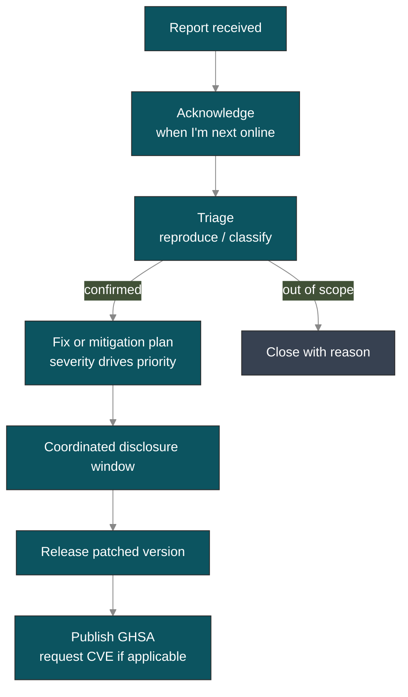

# Vulnerability disclosure & CVE

::: warning Personal-project security operations
go-oidc-provider is maintained by a single developer outside of work
hours. Vulnerability handling is **best-effort**: a real human reads
every report, but turnaround depends on availability — expect days,
sometimes weeks, with no SLA. If your deployment needs a contractual
response window, this is not the right project for that role; please
escalate the requirement before adopting.
:::

## Reporting a vulnerability

**Do not open a public GitHub issue** for a suspected security flaw.

Use one of:

1. **GitHub Security Advisories** — [open a private report](https://github.com/libraz/go-oidc-provider/security/advisories/new) (preferred; triage is faster).
2. **Email** the maintainer at <SvgEmail />.

Please include whatever you have:

- A description of the issue and its impact.
- Steps to reproduce or a minimal proof of concept.
- Affected versions, if known.
- Your assessment of severity (CVSS welcome but not required).

If a detail is missing it's fine — partial reports are still useful, and follow-up questions are normal.

The formal version of this policy is
[`SECURITY.md`](https://github.com/libraz/go-oidc-provider/blob/main/SECURITY.md)
in the source repository; this page is the same intent in friendlier prose.

## What to expect

The rough flow once a report lands:



Realistic timing: acknowledgement usually takes a few days; severe issues
get worked on right away, lower-severity ones may wait until I have a
weekend free. If a week goes by without a reply, please ping again — it's
not rudeness, just a missed notification or a busy stretch.

`SECURITY.md` lists 3 business days for acknowledgement and 14 days for a
fix plan as aspirational targets; treat them as what I aim for, not as a
contract.

## Supported versions

| Version | Supported |
|---------|-----------|
| `v0.x` (pre-v1.0) | latest minor only |
| `v1.x` | latest minor + previous minor (planned, post-v1.0) |

::: tip Pre-v1.0 cadence
While the project is pre-v1.0, the public Go API may change in any
minor release. Pin to a tag in your `go.mod` and read the
[CHANGELOG](https://github.com/libraz/go-oidc-provider/blob/main/CHANGELOG.md)
on each bump. Security fixes go to the latest minor only; if you stay on
an older one you'll need to upgrade to pick the fix up. Backports are
not planned during the pre-v1.0 window — there's just one of me.
:::

## Disclosure flow

The project follows **coordinated disclosure** — nothing about that is
adversarial:

1. Reporter and maintainer agree on a target patch date that fits both
   schedules.
2. A fix is developed in a private branch or GitHub Security Advisory
   draft.
3. The fix lands in `main` and a release tag is cut.
4. The advisory is published. CVE assignment is requested from GitHub's
   CNA when the issue meets the criteria; defence-in-depth hardening with
   no exploit path tends to ship as a GHSA without a CVE.
5. Subscribers of the GitHub repository (Watch → Releases / Security
   advisories) receive a notification.

## Current advisory state

::: details Status as of this page revision
**No public CVE has been assigned to date.** No security report
meeting the criteria for a CVE has been received against the pre-v1.0
line. This is a literal status — there is nothing to publish — not a
claim of audited safety. See the
[Security posture](/security/posture) page for the honest framing
around what the project's defences cover and don't cover.

GitHub Security Advisories are the canonical source of truth and
will appear on the
[advisories page](https://github.com/libraz/go-oidc-provider/security/advisories)
as soon as one is filed.
:::

## Adjacent supply-chain hygiene

Even when the OP itself is sound, dependencies can carry known issues.
Before you adopt and at every dependency bump:

```sh
# In your own consuming module
go install golang.org/x/vuln/cmd/govulncheck@latest
govulncheck ./...
```

Inside this module, the same tool runs in CI via
[`scripts/govulncheck.sh`](https://github.com/libraz/go-oidc-provider/blob/main/scripts/govulncheck.sh).
The dependency manifest is intentionally narrow — see
[`THIRD_PARTY.md`](https://github.com/libraz/go-oidc-provider/blob/main/THIRD_PARTY.md)
for the full list. AGPL / GPL / SSPL / BUSL / Elastic-licensed
dependencies are forbidden by repository policy, which keeps the
license-compatibility surface small.

## What's worth reporting

In scope (please report):

- Bypass of any `op.WithProfile(profile.FAPI2*)` security gate
  (PAR, JAR, DPoP, JARM, alg list, redirect_uri exact match).
- Algorithm confusion paths (any way to make the verifier accept
  `none`, `HS*`, or an alg outside the codebase allow-list).
- Token forgery, ID-token signature bypass, or `iss` mix-up paths.
- PKCE / nonce / state replay paths beyond what the relevant RFC
  permits.
- Refresh-token reuse without chain revocation.
- CSRF on consent / logout / interaction POSTs.
- Cookie-handling regressions (loss of `__Host-`, `Secure`,
  AES-256-GCM AEAD).
- Back-channel logout SSRF (private-network address bypassing the
  RFC 1918 deny-list).
- Information disclosure beyond the error catalog
  (`internal/redact`).
- Injection attacks against any storage adapter shipped under
  `op/storeadapter/`.

Out of scope (documented behaviour, see <a class="doc-ref" href="/security/design-judgments">Design judgments</a>):

- Front-Channel Logout / Session Management features being absent.
- Loopback redirect-URI relaxation when the operator opts in.
- Refresh-token issuance without `offline_access`.
- The `cmd/op-demo` binary being weakly configured — it is a
  conformance harness, not a production OP.

## Hall of fame

When the first valid security report lands, this section will list the
reporter (with their permission). For now it's empty — not a claim that
the library is exhaustively secure, just that nothing has been reported
yet. See the posture page for the honest picture of what's defended.

## Read next

- **[Security posture](/security/posture)** — what's structurally
  defended, what tooling backs it, what's deliberately not in scope.
- **[Design judgments](/security/design-judgments)** — the explicit
  reading of conflicting RFCs.
- **[OFCS conformance](/compliance/ofcs)** — what conformance proves
  and what it doesn't.
