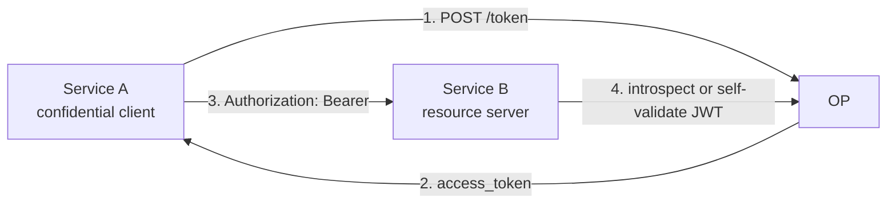

# Use case — Service-to-service (`client_credentials`)

## What is the `client_credentials` grant?

OAuth 2.0 has four "grant types" — different ways for a client to obtain an access token. Three involve a human (`authorization_code`, `device_code`, the deprecated `password`); one does not.

**`client_credentials`** (RFC 6749 §4.4) is for the no-human case: service A holds a registered `client_id` + credential and exchanges them directly at `/token` for an access token. The token represents **the service itself**, not an end user — so there is no `id_token`, no `refresh_token` (re-issue is cheap), no consent prompt.

This is the right grant for cron jobs, webhooks, microservice ↔ microservice calls, and anything else where there's no browser and no end user.

::: details Specs referenced on this page
- [RFC 6749](https://datatracker.ietf.org/doc/html/rfc6749) — OAuth 2.0 Authorization Framework, §4.4 (`client_credentials`)
- [RFC 7523](https://datatracker.ietf.org/doc/html/rfc7523) — JWT Profile for OAuth 2.0 Client Authentication (`private_key_jwt`)
- [RFC 8705](https://datatracker.ietf.org/doc/html/rfc8705) — OAuth 2.0 Mutual-TLS Client Authentication
- [RFC 8707](https://datatracker.ietf.org/doc/html/rfc8707) — Resource Indicators for OAuth 2.0 (pin which RS the token is for)
- [RFC 9068](https://datatracker.ietf.org/doc/html/rfc9068) — JWT Profile for OAuth 2.0 Access Tokens
- [RFC 7662](https://datatracker.ietf.org/doc/html/rfc7662) — OAuth 2.0 Token Introspection
:::

::: details Vocabulary refresher
- **Confidential vs public client** — A *confidential* client (a backend service) holds a real authentication credential (a secret, a private key, an mTLS cert). A *public* client (a browser SPA, a mobile app) cannot keep a secret and authenticates only by `client_id`. `client_credentials` is for confidential clients only — without a credential, "the client itself" has no authenticated identity.
- **`private_key_jwt`** — Instead of sending a shared secret in the request, the client signs a short-lived JWT assertion with its private key and posts it as `client_assertion`. The OP verifies it against the client's pre-registered public JWKS. No secret ever crosses the wire.
- **Bearer token** — An access token whose presentation alone proves authorisation (RFC 6750). Anyone holding the token can use it. For higher assurance, see [Sender constraint](/concepts/sender-constraint) (DPoP / mTLS bind the token to a key).
:::

> **Source:** [`examples/05-client-credentials`](https://github.com/libraz/go-oidc-provider/tree/main/examples/05-client-credentials)

## Architecture



No `/authorize`, no consent, no `id_token`, no refresh token.

## Code

```go
import (
  "github.com/libraz/go-oidc-provider/op"
  "github.com/libraz/go-oidc-provider/op/grant"
  "github.com/libraz/go-oidc-provider/op/storeadapter/inmem"
)

provider, err := op.New(
  op.WithIssuer("https://op.example.com"),
  op.WithStore(inmem.New()),
  op.WithKeyset(myKeyset),
  op.WithCookieKey(myCookieKey),

  op.WithGrants(
    grant.AuthorizationCode, // for human users
    grant.RefreshToken,
    grant.ClientCredentials, // <-- enable service-to-service
  ),

  op.WithStaticClients(op.ConfidentialClient{
    ID:         "service-a",
    Secret:     serviceASecret,            // plaintext; the seed hashes it via op.HashClientSecret
    AuthMethod: op.AuthClientSecretBasic,
    GrantTypes: []string{"client_credentials"},
    Scopes:     []string{"read:things", "write:things"},
    Resources:  []string{"https://api.b.example.com"}, // RFC 8707 audience pin
  }),
)
```

## Calling the token endpoint

```sh
curl -s -u service-a:<secret> \
  -d 'grant_type=client_credentials&scope=read:things' \
  https://op.example.com/oidc/token
# {
#   "access_token": "...",
#   "token_type": "Bearer",
#   "expires_in": 300,
#   "scope": "read:things"
# }
```

::: tip Confidential clients only
`client_credentials` is restricted to clients with a real authentication credential (`client_secret_basic`, `client_secret_post`, `private_key_jwt`, `tls_client_auth`, `self_signed_tls_client_auth`). A public client (`token_endpoint_auth_method=none`) can't use it.
:::

## Production-grade: `private_key_jwt` instead of basic

For higher-assurance deployments, use `private_key_jwt` (RFC 7523):

```go
op.WithStaticClients(op.PrivateKeyJWTClient{
  ID:         "service-a",
  JWKS:       serviceAPublicJWKs, // public JWK Set as JSON bytes
  GrantTypes: []string{"client_credentials"},
})
```

The `PrivateKeyJWTClient` seed sets `token_endpoint_auth_method=private_key_jwt` automatically — there is no separate `AuthMethod` field to configure on this typed seed.

Now Service A signs a JWT assertion with its private key for each token request:

```sh
curl -s -d 'grant_type=client_credentials' \
  -d 'client_assertion_type=urn:ietf:params:oauth:client-assertion-type:jwt-bearer' \
  -d "client_assertion=$JWT_ASSERTION" \
  -d 'scope=read:things' \
  https://op.example.com/oidc/token
```

::: details FAPI 2.0 client_credentials
With `op.WithProfile(profile.FAPI2Baseline)`, `client_secret_basic` is filtered out. `private_key_jwt` or mTLS becomes the only acceptable authentication. Stack `feature.DPoP` to additionally bind the issued access token to a client-held key.
:::

## Validating on the resource server

Two paths:

1. **Self-validate JWT** (RFC 9068) if you configured JWT access tokens. Service B fetches `/jwks` once, caches it, and verifies signatures locally.
2. **Introspect** (RFC 7662) if access tokens are opaque. Service B posts the token to `/introspect` and reads `active`, `scope`, `client_id`, etc. from the JSON response.

```sh
curl -s -u service-b:<secret> \
  -d "token=$ACCESS_TOKEN" \
  https://op.example.com/oidc/introspect
```

::: warning Introspect requires its own client
The introspection endpoint authenticates the **caller** (Service B, the resource server). Register Service B as a confidential client too, so it can call `/introspect`. See [`examples/05-client-credentials`](https://github.com/libraz/go-oidc-provider/tree/main/examples/05-client-credentials) for the full wiring.
:::
