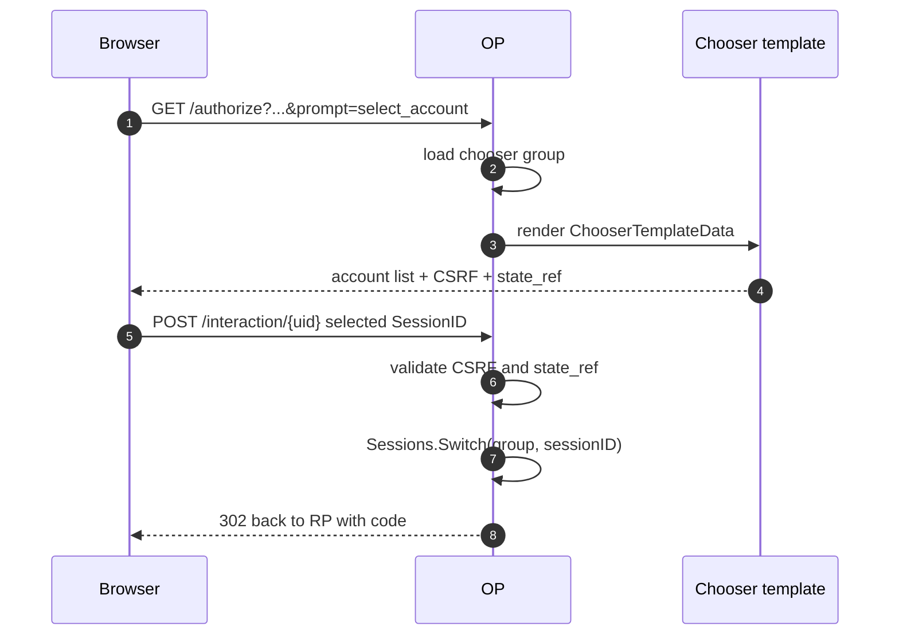

# Use case — Custom chooser UI

`prompt=select_account` has two separable concerns:

- the **session semantics**: the browser has a chooser group with more than one active account, and the selected session determines the next `sub`
- the **rendering surface**: the page that lists those accounts and POSTs the selected `SessionID`

[Multi-account chooser](/use-cases/multi-account) covers the first concern. This page covers the second: use `op.WithChooserUI` when you want a branded server-rendered account picker but still want the OP to own state, CSRF, and the final `Sessions.Switch`.

> **Source:** [`examples/12-custom-chooser-ui`](https://github.com/libraz/go-oidc-provider/tree/main/examples/12-custom-chooser-ui) demonstrates `op.WithChooserUI` with the default HTML interaction driver. Compare [`examples/13-multi-account`](https://github.com/libraz/go-oidc-provider/tree/main/examples/13-multi-account) for the JSON-driver / SPA path.

## When to use it

| Need | Use |
|---|---|
| Keep the bundled chooser | no option; the default HTML driver renders it |
| Change chooser HTML / copy / layout while staying server-rendered | `op.WithChooserUI(op.ChooserUI{Template: tmpl})` |
| Render the chooser inside a SPA | `op.WithSPAUI` or `interaction.JSONDriver` |
| Change how accounts are grouped or switched | session-store / authenticator logic, not the template |

`WithChooserUI` is intentionally narrow. It swaps the template only; it does not let the template choose arbitrary subjects, mint sessions, or bypass the OP's state machine.

## Template contract

The template receives `interaction.ChooserTemplateData`. The important fields are:

| Field | Purpose |
|---|---|
| `Accounts` | active sessions in the chooser group, including `SessionID`, subject, display label, and auth time |
| `StateRef` | opaque interaction state reference that must be echoed back |
| `CSRFToken` | token the OP validates on POST |
| `SessionIDField` | form field name expected by the OP for the chosen account |
| `SubmitMethod` | normally `POST` |
| `SubmitAction` | interaction endpoint URL |
| `AddAccountURL` | URL that starts a `prompt=login` path to add another account |

Minimal shape:

```go
tmpl := template.Must(template.New("chooser").Parse(`
{{range .Accounts}}
  <form method="{{$.SubmitMethod}}" action="{{$.SubmitAction}}">
    <input type="hidden" name="state_ref" value="{{$.StateRef}}">
    <input type="hidden" name="csrf_token" value="{{$.CSRFToken}}">
    <input type="hidden" name="{{$.SessionIDField}}" value="{{.SessionID}}">
    <button type="submit">Continue as {{.DisplayName}}</button>
  </form>
{{end}}
<a href="{{.AddAccountURL}}">Sign in to another account</a>
`))

provider, err := op.New(
  /* required options */
  op.WithInteractionDriver(interaction.HTMLDriver{}),
  op.WithChooserUI(op.ChooserUI{Template: tmpl}),
)
```

The field names are part of the OP contract. Keep `state_ref`, `csrf_token`, and the dynamic `SessionIDField` in the submitted form.

## Flow



The template never performs the switch. It only returns the selected session identifier to the OP.

## SPA interaction precedence

`op.WithSPAUI` makes the SPA own the chooser surface through the JSON state envelope. If both `WithSPAUI` and `WithChooserUI` are configured, the SPA path wins and the chooser template is ignored with a startup warning. Use one ownership mode per deployment:

| UI owner | Option |
|---|---|
| OP server-rendered HTML | `op.WithChooserUI` |
| SPA shell mounted by the OP | `op.WithSPAUI` |
| Your own router serves the SPA | `op.WithInteractionDriver(interaction.JSONDriver{})` |

## Production notes

- Parse templates once at startup; do not parse per request.
- Keep CSP strict. The template data can include RP-provided labels such as client display names, so rely on `html/template` escaping and avoid inline scripts.
- Treat `SessionID` as an opaque value. The OP checks that it belongs to the active chooser group.
- The "add account" link should follow the provided `AddAccountURL` so the next login joins the existing chooser group.

## Read next

- [Multi-account chooser](/use-cases/multi-account) — chooser group semantics and `Sessions.Switch`.
- [SPA / custom interaction](/use-cases/spa-custom-interaction) — JSON-driver ownership of the same prompt.
- [Custom consent UI](/use-cases/custom-consent-ui) — the equivalent server-rendered template seam for consent.
