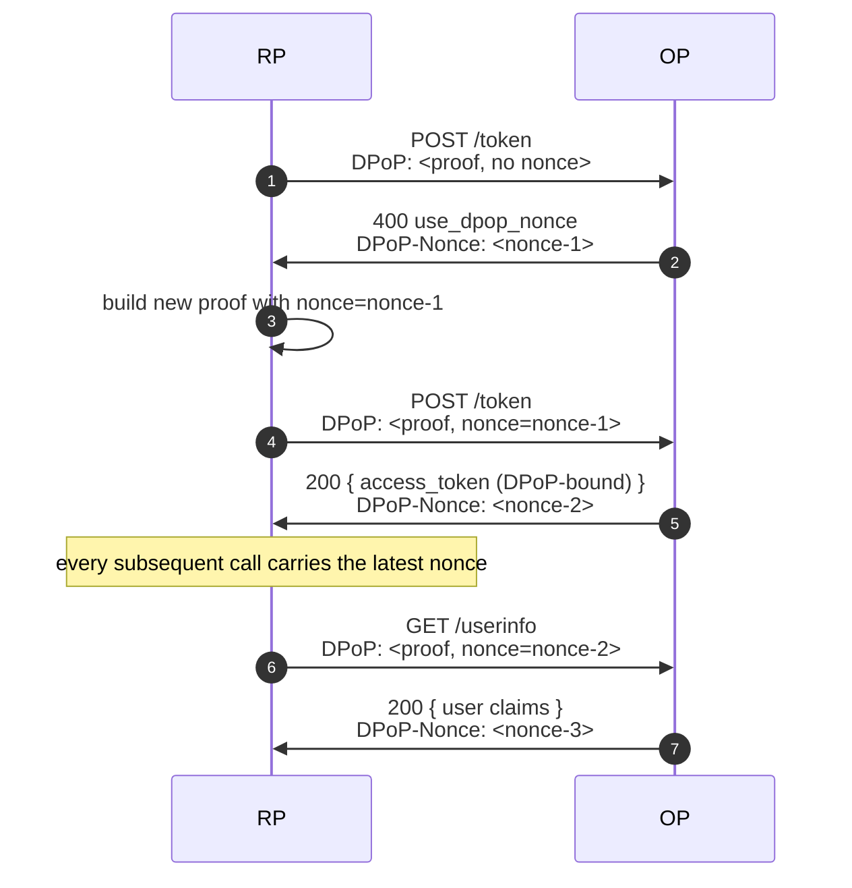

# Use case — DPoP nonce flow

## What is DPoP, and what is the "nonce"?

**DPoP** ("Demonstrating Proof of Possession", RFC 9449) binds an
access token to a key the client owns. On every API call the client
attaches a `DPoP:` header carrying a fresh JWT signed with that key,
proving "I'm still the same client that minted this token". A leaked
DPoP-bound token is useless to an attacker who doesn't have the key.

The **nonce** is an extra hardening step from RFC 9449 §8 / §9. Without
it, a client can prepare DPoP proofs ahead of time and hold them; an
attacker with brief access to the client could exfiltrate a stash and
replay them later. The nonce closes that gap: the OP issues a
fresh server-side nonce that **must** appear in the next DPoP proof.
Pre-computed proofs immediately become invalid.

::: details Specs referenced on this page
- [RFC 9449](https://datatracker.ietf.org/doc/html/rfc9449) — DPoP, §8 (server-provided nonce), §9 (resource-server-provided nonce)
- [FAPI 2.0 Baseline](https://openid.net/specs/fapi-2_0-baseline.html) — nonce permitted
- [FAPI 2.0 Message Signing](https://openid.net/specs/fapi-2_0-message-signing.html) — nonce required
:::

::: details Quick refresher
- **DPoP proof** — a small JWT the client signs per-request to prove
  it still holds the private key the access token is bound to. See
  [Sender constraint](/concepts/sender-constraint) for the basics.
- **Pre-computed proof attack** — an adversary that briefly accesses a
  client's machine could exfiltrate a stash of valid proofs and replay
  them later. Without a nonce, those proofs stay valid for as long as
  their `iat` window allows.
:::

In short, the nonce flow blocks two classes of attack:

- **Pre-computed proofs** — an attacker that captured a proof can't
  replay it because they don't know the next nonce.
- **Stage-and-fire** — long-lived proofs prepared offline expire when
  the OP rotates its nonce.

> **Source:** [`examples/51-dpop-nonce`](https://github.com/libraz/go-oidc-provider/tree/main/examples/51-dpop-nonce)

## The flow



## Wiring

The library ships an in-memory reference source. Single-process; not
HA-safe, but fine for development and small-scale deployments:

```go
import "github.com/libraz/go-oidc-provider/op"

src, err := op.NewInMemoryDPoPNonceSource(ctx, 5*time.Minute)
if err != nil { /* ... */ }

op.New(
  /* required options */
  op.WithFeature(feature.DPoP),
  op.WithDPoPNonceSource(src),
)
```

The rotation interval (`5*time.Minute` above) is how often the
"current" nonce changes. Both current and previous values are
accepted, so a client racing through a rotation boundary doesn't
see a hard failure.

::: warning Multi-instance deployments
A process-local nonce source breaks across replicas — instance B has
no record of the nonce instance A issued. Production HA deployments
plug a shared store (Redis) behind a custom `DPoPNonceSource`. The
library deliberately doesn't ship a Redis nonce source: the option
matrix (TTL, rotation cadence, missed-rotation tolerance) is too
deployment-specific to standardise.
:::

## When the OP demands the nonce

| Endpoint | Nonce required? | Set by |
|---|---|---|
| `/token` | always when a `DPoPNonceSource` is configured | `op.WithDPoPNonceSource` |
| `/userinfo` | always when a `DPoPNonceSource` is configured | same |
| `/par` | accepted but not required | n/a |

FAPI 2.0 Message Signing forces the nonce on; FAPI 2.0 Baseline allows
it. The library mirrors the spec — flipping the profile flips the
default for you.

## Verifying

```sh
# First call without nonce
curl -i -X POST -H "DPoP: <proof-without-nonce>" \
  -d 'grant_type=authorization_code&code=...' \
  http://localhost:8080/oidc/token | head -20
# HTTP/1.1 400 Bad Request
# DPoP-Nonce: <fresh-nonce>
# {"error":"use_dpop_nonce", ...}
```

The `DPoP-Nonce` value goes into the next proof's `nonce` claim.

## Read next

- [Sender constraint](/concepts/sender-constraint) — why DPoP exists at all.
- [FAPI 2.0 Baseline](/use-cases/fapi2-baseline) — the profile that turns nonce on by default.
